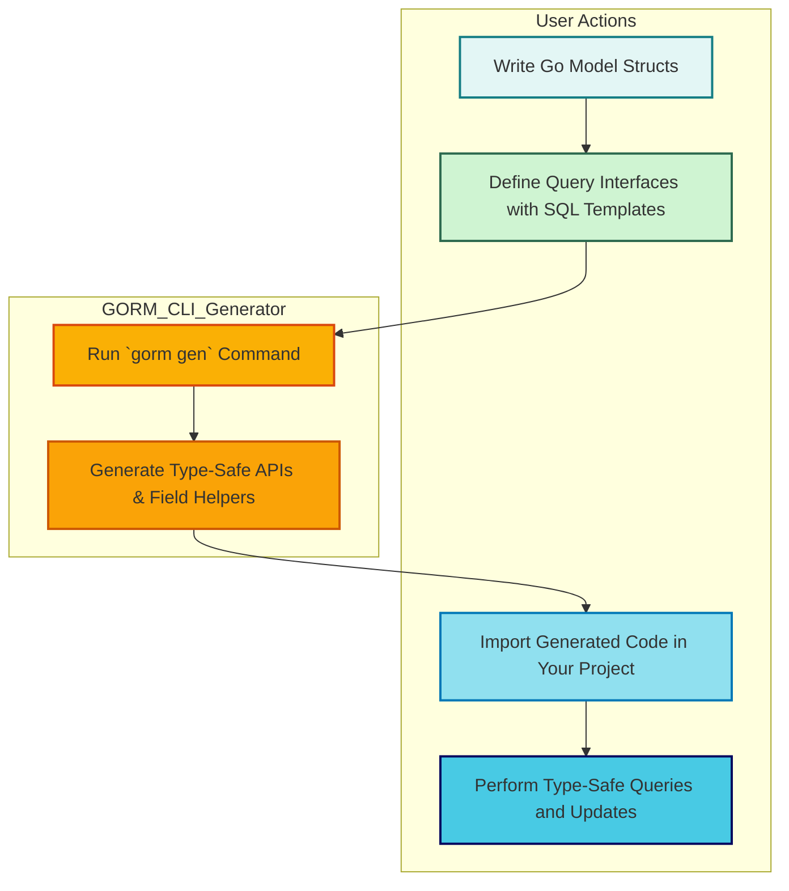

# Quickstart: Generating Type-Safe APIs

Welcome to the step-by-step quickstart guide for generating type-safe database APIs with **GORM CLI**. This guide will take you from defining your Go models and query interfaces, through running the code generator, to executing your first type-safe queries and updates against your database.

Harnessing GORM CLI's generation capabilities empowers you to write safer and more maintainable database access code, fully integrated with your existing Go ORM workflows.

---

## 1. What You Will Achieve

By following this workflow, you will:

- Define Go structs that represent your database models.
- Write query interfaces with embedded SQL templates to describe your database operations.
- Run GORM CLI’s `gen` command to generate type-safe query APIs and model-driven field helpers.
- Use the generated APIs to perform safe, compile-time checked queries and updates.

This process reduces boilerplate, catches errors early, and enables fluent query building.

---

## 2. Prerequisites

Before starting, ensure you have:

- Go 1.18 or later installed and your `GOPATH` and environment properly configured.
- Your Go project initialized with model definitions and properly structured packages.
- Installed GORM CLI via:

  ```bash
  go install gorm.io/cli/gorm@latest
  ```

- Basic understanding of GORM and Go generics.

If you haven’t defined models or query interfaces yet, refer to the [Initialize Your Project](https://your-docs-url/getting-started/first-steps/initialize-your-project) guide.

---

## 3. Step-by-Step Workflow

Follow these steps in order to generate and start using type-safe query APIs.

<Steps>

<Step title="Define Your Models">
Your models define the database tables and fields. Use Go structs with GORM annotations as usual.

Example:

```go
package models

import "gorm.io/gorm"

type User struct {
    gorm.Model
    Name string
    Age  int
}
```

Here, `User` models a table with auto-managed ID and timestamps.

**Expected Result:** Clean, idiomatic model structs that map to your DB schema.
</Step>

<Step title="Write Query Interfaces with SQL Templates">
In the same or a neighboring package, create Go interfaces describing your query operations. Document each method with SQL using GORM CLI's templating DSL.

Example:

```go
package examples

type Query[T any] interface {
  // SELECT * FROM @@table WHERE id=@id
  GetByID(id int) (T, error)

  // where("name=@name AND age=@age")
  FilterByNameAndAge(name string, age int)
}
```

- Use `@@table` to resolve to your model’s table name.
- Use `@param` syntax to bind method parameters safely.

**Expected Result:** Intuitive interfaces that clearly express the SQL queries to generate.
</Step>

<Step title="Run the Generator Command">
Execute the GORM CLI `gen` command to process your interface and model files and generate the code.

```bash
gorm gen -i ./examples -o ./generated
```

- `-i` flags the directory or file with your interfaces and models.
- `-o` specifies where to place generated files.

**Expected Result:** Generated Go code in `./generated` containing your type-safe query implementations and field helpers.

This includes your interfaces’ concrete implementations and helpers for your model fields.
</Step>

<Step title="Use Generated APIs in Your Code">
Import and use the generated packages to perform type-safe queries.

Example:

```go
import (
  "context"
  "your_project/generated"
  "gorm.io/gorm"
)

func ExampleUsage(db *gorm.DB) error {
  ctx := context.Background()

  // Fetch user by ID
  user, err := generated.Query[models.User](db).GetByID(ctx, 123)
  if err != nil {
    return err
  }

  // Filter users by name and age
  users, err := generated.Query[models.User](db).FilterByNameAndAge("jinzhu", 25).Find(ctx)
  if err != nil {
    return err
  }

  // Perform updates via generated Query interface
  err = generated.Query[models.User](db).UpdateUser(ctx, models.User{Name: "jinzhu", Age: 20}, 1)
  return err
}
```

**Expected Result:** Fluent, safe querying without manually crafted SQL strings or error-prone type assertions.
</Step>

</Steps>

---

## 4. Practical Tips and Best Practices

- **Keep Models and Interfaces Close:** Define model structs and query interfaces in the same package or adjacent directories to simplify generation.

- **Use Clear SQL Templates:** Explicitly use parameter binding with `@param` and templates like `{{where}}` for conditional clauses to enhance readability and safety.

- **Leverage Field Helpers:** Generated model field helpers enable expressive predicates like `generated.User.Age.Gt(18)` for concise conditions.

- **Modularize Configurations:** Use a package-level `genconfig.Config` struct to customize generation paths, type mappings, and inclusion/exclusion rules.

- **Test Early:** After generating, validate by running queries against a test database to catch issues early.

---

## 5. Common Pitfalls and Troubleshooting

<AccordionGroup title="Troubleshooting Generation Issues">
<Accordion title="Generator Does Not Find Interfaces or Models">
Check that your interfaces and model structs are public (exported) and correctly located under the input directory path passed with `-i`.

Ensure no naming patterns in `genconfig.Config` exclude your interfaces or structs unintentionally.
</Accordion>

<Accordion title="Generated Code Fails to Compile">
Verify your Go environment is at version 1.18+. Also, confirm that the generated code imports necessary packages and that your models’ types match expected signatures.

Use `goimports` formatting errors to spot missing imports.
</Accordion>

<Accordion title="Queries Return Errors or Unexpected Results">
Review your SQL templates for correct placeholders and logic.
Use the template DSL directives like `{{where}}` and `{{set}}` carefully to avoid malformed SQL.

Refer to [Template-Based SQL Queries](https://your-docs-url/guides/advanced-usage-patterns/template-queries) for examples.
</Accordion>

</AccordionGroup>

---

## 6. Your First Example in Action

To solidify this workflow, here’s a real-world snippet that runs the generated APIs:

```go
// Assume `db` is your *gorm.DB instance
ctx := context.Background()

// Fetch user with ID 42
user, err := generated.Query[models.User](db).GetByID(ctx, 42)
if err != nil {
  panic(err)
}

// Update user’s age with a generated method
err = generated.Query[models.User](db).UpdateInfo(ctx, models.User{Age: 30}, 42)
if err != nil {
  panic(err)
}

// Use field helpers in a query
users, err := gorm.G[models.User](db).
  Where(generated.User.Age.Gt(18)).
  Find(ctx)
if err != nil {
  panic(err)
}

fmt.Printf("Found %d adult users\n", len(users))
```

This demonstrates the smooth transition from generated code to your app logic.

---

## 7. Next Steps

- Explore [Using Generated Field Helpers](https://your-docs-url/guides/getting-started-workflows/using-field-helpers) to master query conditions and updates.
- Learn to customize generation with [Basic Configuration](https://your-docs-url/getting-started/configuration-troubleshooting/basic-configuration).
- Validate your generated code and setup using the [Validate Your Setup](https://your-docs-url/getting-started/first-steps/validate-your-setup) guide.
- Dive deeper into [Template-Based SQL Queries](https://your-docs-url/guides/advanced-usage-patterns/template-queries) for flexible query crafting.

---

## 8. Additional Resources

- [What is GORM CLI?](https://your-docs-url/overview/introduction-core-value/what-is-gorm-cli)
- [Value Proposition & Key Benefits](https://your-docs-url/overview/introduction-core-value/value-proposition-benefits)
- [Feature Summary](https://your-docs-url/overview/feature-quickstart/feature-summary)
- GitHub Repository: [https://github.com/go-gorm/cli](https://github.com/go-gorm/cli)

---

Enjoy building with confidence using GORM CLI’s generated, type-safe APIs!

---

# Diagram: Quickstart Workflow Overview


