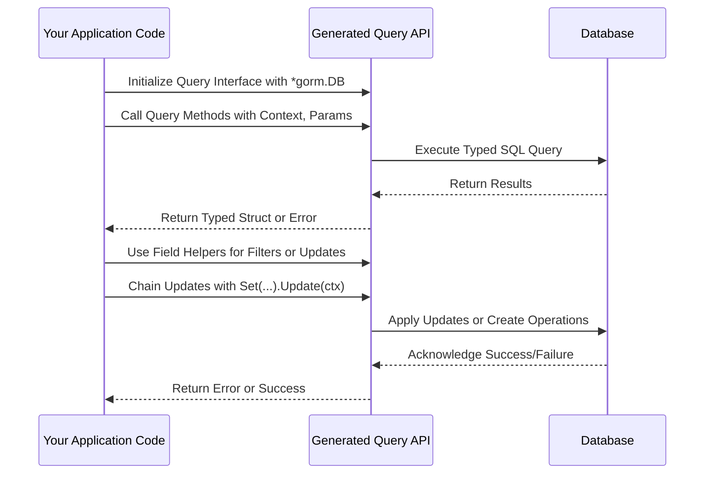

# Working with Generated APIs in Your Application

## Overview

### What This Guide Helps You Accomplish
This guide walks you through integrating the generated type-safe query and field helper APIs produced by GORM CLI directly into your Go applications. You will learn how to initialize and invoke the generated query interfaces, build expressive filter expressions, chain update operations fluently, and leverage association helpers with confidence.

### Prerequisites
- You have generated your query APIs and field helpers using GORM CLI (`gorm gen`) from your annotated Go interfaces and model structs.
- Familiarity with Go and GORM’s basic concepts.
- Proper import and setup of your generated package and GORM.

### Expected Outcome
By following this guide, you will be able to consume the generated APIs seamlessly in your codebase, performing safe reads, writes, condition building, and complex association management that are fully type-checked at compile time.

### Time Estimate
Around 15-30 minutes for initial integration and experimentation.

### Difficulty Level
Intermediate — requires basic knowledge of Go and GORM.

---

## Step-by-Step Integration and Usage

<Steps>
<Step title="Initialize Generated Query Interface">
Start by importing your generated package and create an instance of the query interface for your model by passing a `*gorm.DB` instance.

```go
userQuery := generated.Query[User](db)
```

This gives you access to all generated query methods for the `User` model, with full type safety.

<Check>
You should see no compilation errors and `userQuery` should offer methods defined in your query interface.
</Check>
</Step>

<Step title="Executing Simple Queries">
Use generated query methods to fetch data safely and concisely. For example, to get a user by ID:

```go
u, err := userQuery.GetByID(ctx, 123)
if err != nil {
    log.Fatal(err)
}
fmt.Println("User:", u)
```

Here, `GetByID` matches the SQL template annotated in your interface, binding parameters safely.

<Check>
The method returns a `User` struct and an error, ensuring compile-time safety.
</Check>
</Step>

<Step title="Building Filter Expressions with Field Helpers">
Directly use the generated field helpers to build `Where` filters or ordering expressions:

```go
users, err := gorm.G[User](db).Where(generated.User.Age.Gt(18)).Find(ctx)
```

Available predicates include `Eq()`, `Like()`, `Between()`, `IsNull()`, and more.

<Note>
Field helpers support all basic Go types and custom mappings if configured.
</Note>

<Check>
You should get all users older than 18.
</Check>
</Step>

<Step title="Using Fluent Updates and Sets">
Chain updates with expressive, fluent `Set` calls:

```go
err := gorm.G[User](db).
    Where(generated.User.Name.Eq("alice")).
    Set(
        generated.User.Name.Set("jinzhu"),
        generated.User.Age.Incr(1),
    ).
    Update(ctx)

if err != nil {
    log.Fatal(err)
}
```

You can set zero values or complex expressions safely.

<Check>
The user named 'alice' will be updated to 'jinzhu' and their age incremented.
</Check>
</Step>

<Step title="Performing Create with Set">
Use `Set` to specify fields and create new rows conveniently:

```go
err := gorm.G[User](db).
    Set(
        generated.User.Name.Set("bob"),
        generated.User.Age.Set(30),
    ).
    Create(ctx)

if err != nil {
    log.Fatal(err)
}
```

This creates a new `User` with the given properties.

<Check>
A new user record is inserted into the database.
</Check>
</Step>

<Step title="Managing Associations">
Use generated association helpers to create, update, unlink, or delete related records with type safety. For example, to create a user with a pet:

```go
err := gorm.G[User](db).
    Set(
        generated.User.Name.Set("alice"),
        generated.User.Pets.Create(generated.Pet.Name.Set("fido")),
    ).
    Create(ctx)

if err != nil {
    log.Fatal(err)
}
```

You can also unlink or delete associations with conditions:

```go
gorm.G[User](db).
    Where(generated.User.ID.Eq(1)).
    Set(generated.User.Pets.Where(generated.Pet.Name.Eq("fido")).Unlink()).
    Update(ctx)
```

<Note>
Association operations are aware of the specific relationship type (has one, many2many, belongs to) and adjust behavior accordingly.
</Note>

<Check>
Related records are created, updated, or unlinked as expected.
</Check>
</Step>

<Step title="Using Template-based Query Interfaces">
If you defined a query interface with SQL templates, call those generated methods as regular Go methods:

```go
user, err := generated.Query[User](db).GetByID(ctx, 123)
if err != nil {
    log.Fatal(err)
}

users, err := generated.Query[User](db).FilterByNameAndAge("jinzhu", 25).Find(ctx)
```

These methods bind your parameters safely to the SQL defined.

<Check>
The generated implementations execute the appropriate queries transparently.
</Check>
</Step>
</Steps>

---

## Practical Examples

### Example: Fetch Users Older Than 18

```go
users, err := gorm.G[User](db).
    Where(generated.User.Age.Gt(18)).
    Find(ctx)

if err != nil {
    log.Fatal(err)
}

for _, u := range users {
    fmt.Println(u.Name, u.Age)
}
```

### Example: Update a User’s Name and Increment Age

```go
err := gorm.G[User](db).
    Where(generated.User.ID.Eq(1)).
    Set(
        generated.User.Name.Set("newname"),
        generated.User.Age.Incr(1),
    ).
    Update(ctx)

if err != nil {
    log.Fatal(err)
}
```

### Example: Create User with Associated Pets

```go
err := gorm.G[User](db).
    Set(
        generated.User.Name.Set("bob"),
        generated.User.Pets.CreateInBatch([]models.Pet{{Name: "fido"}, {Name: "rex"}}),
    ).
    Create(ctx)

if err != nil {
    log.Fatal(err)
}
```

### Example: Use Template Query with Dynamic Filtering

```go
results, err := generated.Query[User](db).FilterWithColumn(ctx, "email", "alice@example.com")
if err != nil {
    log.Fatal(err)
}
fmt.Println(results)
```

---

## Troubleshooting & Tips

<AccordionGroup title="Common Issues When Using Generated APIs">
<Accordion title="Compile Errors: Missing Methods or Types">
Ensure you've correctly generated your code after modifying interfaces or models. Run `gorm gen` targeting the updated files. Also, check that your imports reference the generated package properly.
</Accordion>

<Accordion title="Runtime Errors: Query Failures or Incorrect Bindings">
Validate your SQL template syntax in query interfaces. Confirm that placeholders map correctly to method parameters, and all required fields are passed.
</Accordion>

<Accordion title="Association Operations Not Working as Expected">
Double-check the association types in your model definitions and ensure you use the correct API (`Create`, `Unlink`, `Delete`, etc.) matching those relationships.
</Accordion>
</AccordionGroup>

<Tip>
Use `Find(ctx)` or `Take(ctx)` methods seamlessly with your generated query interfaces and field helpers for powerful idiomatic querying.
</Tip>

<Tip>
Leverage field helper methods like `Incr()`, `SetExpr()`, and complex filter expressions for efficient updates.
</Tip>

<Warning>
Avoid modifying generated code directly — always update source interfaces/models and regenerate to keep code consistent.
</Warning>

---

## Next Steps & Related Content

- Explore the [Field Helpers: Filtering, Updates, and Expressions](../field-helpers-basics) guide to deepen your understanding of predicates and updates.
- Learn advanced query customization with the [SQL Template DSL](../template-sql-dsl) guide.
- Manage complex data relationships by reading [Managing Associations: Best Practices & Scenarios](../associations-in-depth).
- If you are new to code generation, revisit [Your First Code Generation](../first-generation) for foundational steps.

---

## Additional References
- GORM CLI GitHub: [https://github.com/go-gorm/cli](https://github.com/go-gorm/cli)
- Example Usage in `examples/query.go` and `examples/models/user.go`
- Generated Code Patterns in `examples/output`


---

## Summary Diagram: Typical User Workflow for Using Generated APIs




---

Thank you for using GORM CLI. With these generated APIs, your Go code gains powerful, type-safe, and maintainable data access patterns.

