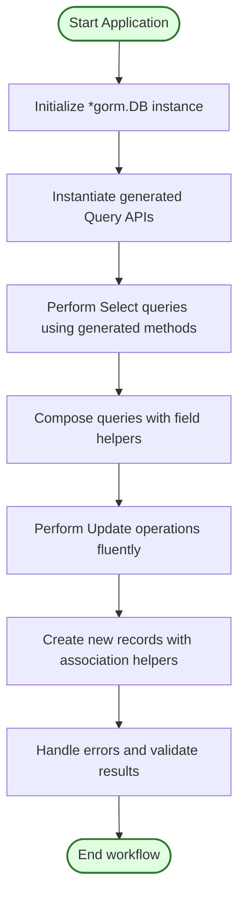

# Using the Generated APIs in Your Application

This guide demonstrates how to seamlessly integrate the GORM CLI generated query APIs and model-driven field helpers into your application code. You will learn how to perform common database operations such as selects, inserts, updates, and how to fluently compose queries. Emphasis is placed on leveraging compile-time safety and fluent interfaces, enabling you to write robust and maintainable Go code with GORM.

---

## 1. Overview

### What You Will Achieve
- Use generated type-safe query interfaces to perform select, insert, and update operations.
- Harness model-driven field helpers for building expressions, filters, and updates.
- Compose complex and readable queries fluently.
- Maximize safety and discoverability with compiler-verified APIs.

### Prerequisites
- You have run the GORM CLI generator successfully on your Go interfaces and model structs.
- Basic familiarity with GORM and Go generics.
- Access to the generated package with your query APIs and field helpers.

### Expected Outcome
By completing this guide, you will be able to confidently write application code that interacts with your database using the generated APIs, reducing runtime SQL errors and accelerating development.

---

## 2. Using Generated Query APIs

### Instantiate the Generated Query Interface
To start using the generated query APIs, import your generated package and call the generated interface constructor passing a `*gorm.DB` instance.

```go
// Assume generated is your generated package and models your data models
query := generated.Query[models.User](db)
```

This sets up a type-safe interface bound to the `User` model.

### Executing Simple Select Queries
Use the generated methods corresponding to your SQL templated interface.

```go
ctx := context.Background()

// Get by ID
user, err := query.GetByID(ctx, 123)
if err != nil {
    // Handle error
}

// Filter by name and age (returns a query builder)
builder := query.FilterByNameAndAge("jinzhu", 25)
users, err := builder.Find(ctx)
if err != nil {
    // Handle error
}
```

### Updating Records
Generated APIs support update operations with compile-time-safe parameters.

```go
// Update a user by ID
err := query.UpdateUser(ctx, models.User{Name: "jinzhu", Age: 20}, 1)
if err != nil {
    // Handle error
}
```

### Fluent Query Composition
You can build complex queries by chaining methods returned by generated APIs.

```go
// Chain filters
users, err := query.FilterWithTime(startTime, endTime).Where(generated.User.Status.Eq("active")).Find(ctx)
```

---

## 3. Leveraging Model-Driven Field Helpers

The generator produces field helpers for every field and association in your models, enabling you to write expressive predicates and updates.

### Building Predicates
Field helpers provide type-safe methods to build SQL expressions.

```go
// Import generated and your model package
// Build expression "age > 18"
expr := generated.User.Age.Gt(18)

// Use with GORM’s Where
users := []models.User{}
err := gorm.G[models.User](db).Where(expr).Find(ctx, &users)
```

### Update Helpers
Compose updates with zero-value support and expressions.

```go
gorm.G[models.User](db).
  Where(generated.User.Name.Eq("alice")).
  Set(
    generated.User.Name.Set("jinzhu"),
    generated.User.IsAdult.Set(false),
    generated.User.Age.Incr(1),
  ).
  Update(ctx)
```

### Create New Records with Associations
Use the `Set(...)` API together with association helpers to create records and link related entities.

```go
gorm.G[models.User](db).
  Set(
    generated.User.Name.Set("alice"),
    generated.User.Pets.Create(generated.Pet.Name.Set("fido")),
  ).
  Create(ctx)
```

---

## 4. Best Practices

1. **Always check errors.** Database operations return errors which should be handled to avoid unexpected panics.
2. **Use context.Context** to control query lifetimes and cancellation.
3. **Prefer generated APIs over raw SQL** for safer, more maintainable code.
4. **Leverage field helpers for dynamic query building** to make code more readable and type-safe.
5. **Compose filters fluently** with chained method calls provided by generated query interfaces.
6. **Use association helpers** for creating, updating, unlinking, or deleting related rows to maintain referential integrity.

---

## 5. Practical Example

```go
package main

import (
  "context"
  "fmt"
  "gorm.io/cli/gorm/examples/generated" // Replace with your actual generated package
  "gorm.io/cli/gorm/examples/models"
  "gorm.io/gorm"
  "gorm.io/driver/sqlite"
)

func main() {
  ctx := context.Background()

  db, err := gorm.Open(sqlite.Open(":memory:"), &gorm.Config{})
  if err != nil {
    panic(err)
  }

  query := generated.Query[models.User](db)

  // Insert a new user
  err = gorm.G[models.User](db).
    Set(
      generated.User.Name.Set("alice"),
      generated.User.Age.Set(30),
    ).
    Create(ctx)
  if err != nil {
    panic(err)
  }

  // Query user by ID
  user, err := query.GetByID(ctx, 1)
  if err != nil {
    panic(err)
  }
  fmt.Printf("User: %+v\n", user)

  // Update user's age
  err = gorm.G[models.User](db).
    Where(generated.User.Name.Eq("alice")).
    Set(generated.User.Age.Set(31)).
    Update(ctx)
  if err != nil {
    panic(err)
  }
}
```

---

## 6. Troubleshooting

### Errors using Generated APIs
- **Compilation errors** often indicate misaligned method signatures between your interfaces and the generated code. Make sure you regenerate code after changing interfaces or models.
- **Runtime errors in queries** might stem from incorrect field helper usage or missing context. Always verify `ctx` is passed.

### Missing Methods or Fields
- Check your configuration files (`genconfig.Config`) for any include/exclude filters that might skip parts of your code generation.

### Unexpected SQL
- Review your SQL templates in interface comments for correctness.
- Use the SQL template DSL syntax ([see Feature Highlights](#)) to adjust queries.

### Common pitfalls
- Forgetting to call `Find(ctx)` or `Take(ctx)` after using a builder method.
- Misusing field helper types (e.g., using string predicates on numeric fields).

<Note>
If you face an issue not covered here, consult the [Troubleshooting & Validation](https://your-docs.io/getting_started/troubleshooting_and_faq) documentation for system setup and validation tips.
</Note>

---

## 7. Next Steps & Related Content

- **Customize Queries:** Learn to extend or customize SQL queries with the [SQL Template DSL guide](../advanced-patterns-customization/sql-template-dsl).
- **Working with Associations:** Deepen your understanding of association operations in [Working with Associations](../advanced-patterns-customization/working-with-associations).
- **Custom Field Helpers:** Create specialized field helpers for custom types, e.g. JSON columns, in [Custom Field Helpers](../advanced-patterns-customization/custom-field-helpers).
- **Code Generation Configuration:** Manage overrides and filters with [Configuring Generation](../advanced-patterns-customization/configuring-codegen).

---

## 8. Summary Diagram of User Flow



---

For more detailed onboarding, consult the [Your First Code Generation guide](../getting-started-workflows/your-first-codegen).

---

# Additional Resources
- [GORM CLI Feature Highlights](../../overview/introduction-and-value/feature-highlights)
- [Core Concepts & Terminology](../../overview/architecture-and-concepts/core-concepts-terminology)
- [Generating Code](../../getting_started/first_code_generation/generating_code)
- [Minimal Configuration](../../getting_started/first_code_generation/minimal_configuration)

---

This concludes the practical guide on using the generated APIs in your application with GORM CLI.