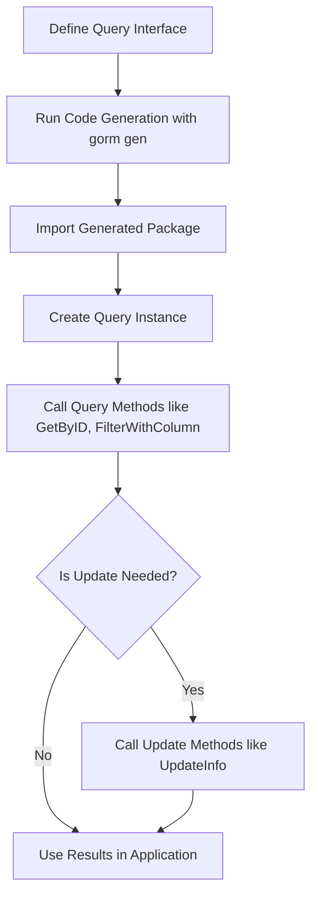

# Using Type-Safe Query APIs

Harness the power of GORM CLI’s generated type-safe query APIs to perform database reads and writes effortlessly. This guide walks you through understanding the generated fluent interfaces from your Go query definitions, using the APIs for common CRUD patterns, and realizing the safety and clarity benefits in your codebase.

---

## Workflow Overview

### Task Description
This guide helps you leverage GORM CLI-generated query APIs for performing safe, intuitive database operations such as fetching, filtering, and updating records using your annotated Go interfaces.

### Prerequisites
- You have Go 1.18+ installed.
- Your project includes GORM and GORM CLI.
- You have written query interfaces annotated with SQL templates.
- Code generation via `gorm gen` has been executed and the generated code is accessible.
- You have basic familiarity with GORM querying patterns.

### Expected Outcome
By following this guide, you will confidently use the generated type-safe query APIs to:
- Execute parameterized SELECT queries safely.
- Compose dynamic, reusable filters.
- Perform updates with conditional SQL.
- Understand the mapping from your interface definitions to fluent API code.

### Time Estimate
10–20 minutes for a developer familiar with Go and GORM to start utilizing generated query APIs.

### Difficulty Level
Beginner to Intermediate

---

## Step-by-Step Instructions

### 1. Understand Your Generated Query Interface

Your Go interface methods annotated with SQL templates (e.g., `// SELECT * FROM @@table WHERE id=@id`) produce concrete generic implementations. For example:

```go
// User query interface snippet
// SELECT * FROM @@table WHERE id=@id
GetByID(id int) (T, error)
```

Will result in generated code like:

```go
type _QueryInterface[T any] interface {
  gorm.Interface[T]
  GetByID(ctx context.Context, id int) (T, error)
}
```

The generator adds a `context.Context` parameter automatically, ensuring context-aware database operations.

<Note>
The returned interface embeds `gorm.Interface[T]` giving you access to fluent methods like `Where()`, `Set()`, and more.
</Note>

### 2. Initialize the Query API

Create an instance of your query interface by passing a `*gorm.DB` object:

```go
query := generated.Query[User](db)
```

This instance provides all the methods you’ve defined in your interface, implemented with safe SQL binding and fluent chaining.

### 3. Perform Simple Reads

Call methods like `GetByID` to retrieve records:

```go
user, err := query.GetByID(ctx, 123)
if err != nil {
    // handle error
}
fmt.Println(user.Name)
```

The generated SQL binds the `id` parameter securely and returns the typed struct.

### 4. Use Dynamic Filters

You can filter records by passing parameters or structs:

```go
filteredUser, err := query.FilterWithColumn(ctx, "role", "admin")
```

Or use complex filtering with slices and conditional logic:

```go
filters := []models.User{
  {Name: "alice", Age: 30, Role: "admin"},
  {Name: "bob", Age: 25, Role: "user"},
}
users, err := query.Filter(ctx, filters)
```

This maps to SQL with `OR` clauses combining your filters safely.

### 5. Compose Fluent Queries

Some generated methods return the interface for chaining, e.g.:

```go
filteredQuery := query.FilterByNameAndAge(ctx, "alice", 30)
users, err := filteredQuery.Find(ctx)
```

Use this pattern to build reusable, composable queries reflecting your business logic.

### 6. Perform Updates

Update methods with SQL templates including dynamic `SET` clauses:

```go
err := query.UpdateInfo(ctx, models.User{Name: "alice", Age: 31}, 123)
if err != nil {
    // handle error
}
```

The generated code builds SQL `UPDATE` statements with conditional sets, updating only the fields provided.

### 7. Verify Execution

Always check errors from query or update calls. Use logs or debugging tools to confirm SQL is generated as expected.

<Check>
Enable GORM logging for debugging:

```go
db, err := gorm.Open(sqlite.Open("test.db"), &gorm.Config{
  Logger: logger.Default.LogMode(logger.Info),
})
```
</Check>

---

## Examples & Code Samples

### Defining a Query Interface with Comments

```go
// Query interface with template-annotated methods
package examples

type Query[T any] interface {
  // SELECT * FROM @@table WHERE id=@id
  GetByID(id int) (T, error)

  // SELECT * FROM @@table WHERE @@column=@value
  FilterWithColumn(column string, value string) (T, error)

  // UPDATE @@table
  // {{set}}
  //   {{if user.Name != ""}} name=@user.Name, {{end}}
  //   {{if user.Age > 0}} age=@user.Age, {{end}}
  // {{end}}
  // WHERE id=@id
  UpdateInfo(user User, id int) error
}
```

### Using a Generated Query

```go
query := generated.Query[models.User](db)

// Fetch by ID
user, err := query.GetByID(ctx, 42)
if err != nil {
    log.Fatalf("Failed to get user: %v", err)
}
fmt.Println(user.Name)

// Filter with dynamic column
adminUser, err := query.FilterWithColumn(ctx, "role", "admin")

// Conditional update
err = query.UpdateInfo(ctx, models.User{Name: "Alice", Age: 28}, int(user.ID))
```

### Composing Complex Filters

```go
filters := []models.User{{Name: "alice", Age: 28, Role: "admin"}}
users, err := query.Filter(ctx, filters)
```

---

## Troubleshooting & Tips

### Common Issues
- **Method Not Found:** Ensure your interface methods are properly annotated with SQL templates, and you have run code generation.
- **Context Parameter Missing:** The generator automatically injects `context.Context` if omitted; use context in your call accordingly.
- **Unexpected SQL Errors:** Confirm your SQL templates are valid and that parameters match the placeholders.
- **Empty Results:** Verify your filter conditions and seeded database state.

### Best Practices
- Always use context-aware method calls to support cancellation and deadlines.
- Define clear, minimal interfaces reflecting your most common query patterns.
- Use conditional template directives (`{{if}}...{{end}}`) to write flexible SQL.
- Combine generated query APIs with GORM’s native fluent methods when needed.

### Performance Considerations
- Avoid overly complex dynamic filters in one method—split complex queries into several interface methods.
- Use pagination or limit clauses in your interface templates for large data sets.

### Alternative Approaches
- For simple queries, consider using `gorm.G[Model]` field helpers directly.
- For batch operations or complex updates, custom code beyond generated interfaces may be necessary.

---

## Next Steps & Related Content

- Explore the **[Field Helpers for Filters and Updates](https://example.com/guides/getting-started-workflows/field-helper-basics)** guide to learn building filters and update assignments.
- Read **[Template-Based SQL Queries](https://example.com/guides/advanced-usage-patterns/template-sql-queries)** to master the template DSL.
- Learn about **[Working with Associations](https://example.com/guides/advanced-usage-patterns/working-with-associations)** to handle related data.
- For initial setup steps, review **[Quick Setup & First Generation](https://example.com/guides/getting-started-workflows/quick-setup)**.
- Consult **[Troubleshooting & Common Issues](https://example.com/getting-started/essentials/troubleshooting)** if you encounter problems.

---

## Summary Diagram: Query API Usage Flow



---

For full examples, see generated code files such as `examples/output/query.go` showing concrete implementations matching your interfaces.

---

# Callout Summary
<Tip>
Type-safe query APIs generated by GORM CLI transform your interface definitions into fluent, context-aware database access layers — dramatically reducing runtime errors.
</Tip>

<Info>
Use `context.Context` parameters in all query and update methods to ensure robust, cancellable database operations.
</Info>

<Warning>
Avoid modifying generated code. Instead, update your interfaces or models and regenerate.
</Warning>
