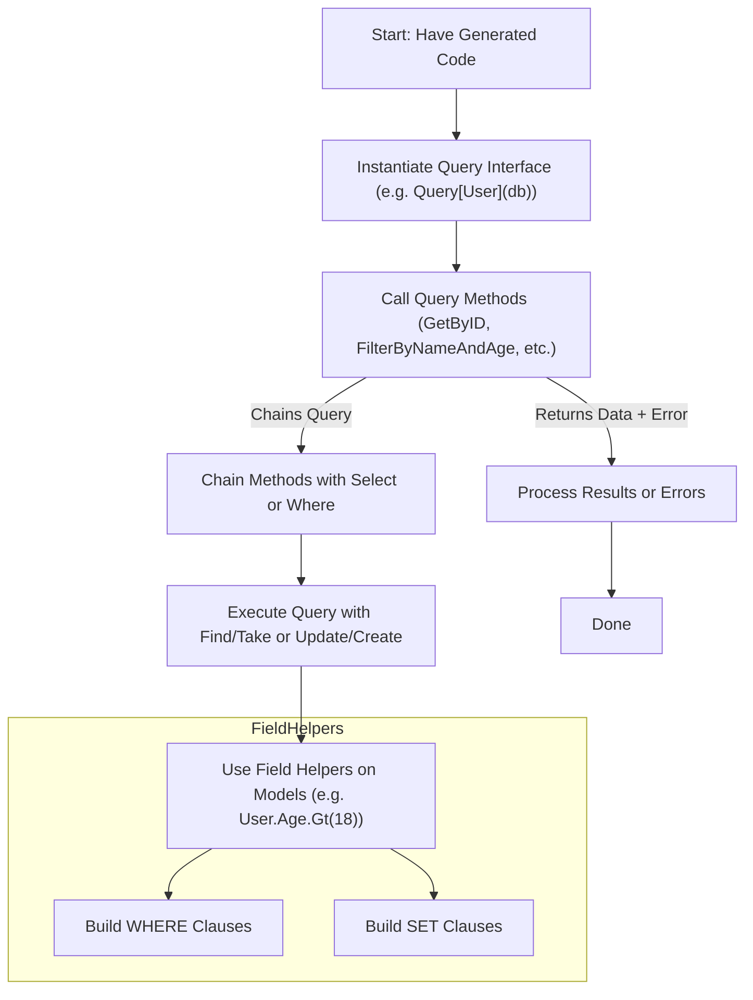

# Exploring Your Generated API

Discover how to efficiently use the query APIs and field helpers generated by GORM CLI in your Go projects. This guide focuses on understanding the structure of generated code, the purpose of key helpers, and how to seamlessly integrate the generated APIs with your existing GORM workflows.

---

## 1. What This Guide Helps You Accomplish

- Understand the layout and role of the **generated query interface implementations**.
- Learn how **field helpers** provide type-safe predicates and setters for model columns.
- See how to use generated query methods alongside common GORM patterns.
- Get practical examples to apply generated APIs immediately.

## 2. Prerequisites

Before you start, you should have:

- Successfully run GORM CLI to generate the query interface and field helpers.
- Defined your query interfaces with SQL templates and your model structs in Go.
- Familiarity with basic GORM concepts and context usage.
- Your Go project set up to import and use the generated package.

## 3. Expected Outcome

After following this guide, you will be able to:

- Instantiate and invoke **type-safe query interface methods**.
- Use strongly typed **field helper predicates and setters** for filtering and updating.
- Combine generated APIs fluidly with existing GORM workflows.
- Confidently read and extend generated code when needed.

## 4. Time Estimate

Approximately 15-30 minutes depending on your familiarity with Go and GORM.

---

# Understanding Your Generated Query API

## How the Query Interface is Structured

Your query interface, such as `Query[T any]`, is generated as:

- An interface (e.g., `QueryInterface[T]`) that extends `gorm.Interface[T]` and declares your query methods.
- A struct (e.g., `QueryImpl[T]`) implementing the interface, embedding a generic `gorm.Interface[T]`.

The generated methods implement your SQL template logic and return typed results or chain for further queries.


### Instantiating the Query Interface

```go
import "generated"

// Create a typed query API instance for User:
q := generated.Query[User](db)
```

You can now call your interface methods with this instance, e.g., `q.GetByID(ctx, 123)`.


## Generated Query Methods: What Do They Do?

Each method you declare in your query interface with SQL templates generates a typed implementation.

- Methods returning data accept parameters, execute the generated SQL with type safety, and return results with errors.
- Methods with filters or updates utilize the SQL templating to build safe queries.

Example from your interface:

```go
// SQL template comment:
// SELECT * FROM @@table WHERE id=@id AND name = "@name"
GetByID(id int) (T, error)
```

Generated code runs a `SELECT` with `id` bound to `@id` and returns a typed result.


## How the SQL Template DSL Works in Generated Methods

Your SQL template directives like `@@table`, `@param`, `{{if}}`, and `{{where}}` are parsed and compiled into Go code building query strings and parameters.

This provides:

- Safe and automatic binding of parameters.
- Conditional fragments that generate efficient SQL only when inputs mandate.
- Dynamic SQL composition respecting your query logic.


# Working with Field Helpers

Field helpers are generated for your model structs, creating fluent, strongly typed API components representing columns.

## What Are Field Helpers?

Generated as variables per struct (e.g., `User`), field helpers expose each column as:

- Predicate helpers (e.g., `generated.User.Age.Gt(18)`) - construct `age > 18` conditions.
- Setter helpers (e.g., `generated.User.Name.Set("Alice")`) - build value setting expressions.
- Association helpers for related models.


## Using Predicates for Filtering

You can build type-safe filters easily:

```go
// Find all users older than 21:
users, err := gorm.G[User](db).Where(generated.User.Age.Gt(21)).Find(ctx)
```

These helpers mirror common SQL conditions: `Eq()`, `Ne()`, `Gt()`, `Between()`, `Like()`, and others.


## Using Setters for CREATE and UPDATE

Field helpers enable constructing the Set clause fluently:

```go
// Create new user:
err := gorm.G[User](db).
  Set(
    generated.User.Name.Set("Alice"),
    generated.User.Age.Set(30),
  ).
  Create(ctx)

// Update existing user's age:
err := gorm.G[User](db).
  Where(generated.User.ID.Eq(1)).
  Set(generated.User.Age.Set(31)).
  Update(ctx)
```


# Integrating Query APIs with Existing GORM Workflows

Your generated query interfaces and field helpers integrate naturally with GORM operations.

## Calling Query Methods

```go
// Fetch user by ID via generated Query API:
user, err := generated.Query[User](db).GetByID(ctx, 123)
if err != nil {
    // handle error
}
// use user
```

These methods execute the underlying SQL template-generated queries safely.

## Combining Field Helpers with GORM Queries

You can combine predicate helpers and GORM's fluent API to customize filters and updates:

```go
// Find all active users older than 18
users, err := gorm.G[User](db).
  Where(generated.User.Age.Gt(18), generated.User.Role.Eq("active")).
  Find(ctx)

// Batch update
err := gorm.G[User](db).
  Where(generated.User.Status.Eq("pending")).
  Set(generated.User.Status.Set("active")).
  Update(ctx)
```


## Handling Associations via Helpers (Brief Overview)

Association helpers exist on generated structs for relations:

- Create linked records
- Update/filter associated records
- Unlink or delete associations

See dedicated guides for detailed scenarios, but in brief:

```go
// Create user with pets
err := gorm.G[User](db).
  Set(
    generated.User.Name.Set("Bob"),
    generated.User.Pets.Create(generated.Pet.Name.Set("Fido")),
  ).
  Create(ctx)
```


# Practical Examples

### Example 1: Query by ID

```go
ctx := context.Background()
user, err := generated.Query[User](db).GetByID(ctx, 42)
if err != nil {
    // handle error
}
fmt.Println(user.Name)
```

### Example 2: Filter Users by Name and Age

```go
users, err := generated.Query[User](db).FilterByNameAndAge("Alice", 30).Find(ctx)
if err != nil {
    // handle error
}
```

### Example 3: Update User Info

```go
err := generated.Query[User](db).UpdateInfo(ctx, User{Name: "Alice", Age: 31}, 42)
if err != nil {
    // handle error
}
```

### Example 4: Compose Query with Field Helpers

```go
users, err := gorm.G[User](db).
  Where(
    generated.User.Age.Gt(18),
    generated.User.Name.Like("%smith%"),
  ).
  Find(ctx)
```


# Tips and Best Practices

- **Use Generated Query Interfaces for Complex Queries:** Prefer generated interfaces for queries that require precise SQL control.
- **Combine Field Helpers for Dynamic Filtering:** Leverage the fluent API of field helpers for building up filters incrementally.
- **Always Provide Context:** The generated methods accept `context.Context` as first parameter; pass your request or operation context.
- **Check Errors on All Calls:** Generated methods follow idiomatic Go error handling—always check returned errors.
- **Leverage Generated Associations:** For relational data, use association helpers to maintain data integrity.


# Common Issues & Troubleshooting

<AccordionGroup title="Troubleshooting Generated API Usage">
<Accordion title="Method Not Found or Signature Mismatch">
Verify that your interface methods return the proper types; the generator requires either `(T, error)` or similar.

Check your SQL template comments carefully and that the input interface matches expected patterns.
</Accordion>
<Accordion title="Field Helper Not Recognized in Code">
Ensure you have imported the generated package and used the correct struct helper variables, e.g., `generated.User.Name`.

If you added new fields, make sure you regenerated the code.
</Accordion>
<Accordion title="SQL Execution Errors at Runtime">
Review the generated SQL and parameter bindings by enabling GORM debug logs.

Check your SQL template syntax and placeholders for correctness.
</Accordion>
<Accordion title="Context Parameter Issues">
If your method calls lack `context.Context`, the generator inserts it automatically.

Ensure your calls provide a valid context value.
</Accordion>
</AccordionGroup>


# Next Steps & Related Content

- Explore [Writing Type-Safe Queries from Interfaces](/guides/core-workflows/writing-type-safe-queries) to refine your SQL templates.
- Learn to [Use Field Helpers for Filters & Updates](/guides/core-workflows/using-field-helpers) in depth.
- Read about [Managing Associations with Helpers](/guides/core-workflows/association-operations) for relational data.
- Customize your generation via the [Customizing Generation Config](/guides/advanced-usage-patterns/customizing-generation-config) guide.

Refer to the [Installation & First Generation](/guides/getting-started/installation-quickstart) for initial setup details.


---

# Summary Diagram: Workflow of Using Your Generated Query API



This diagram visualizes the typical usage flow.

---

# Additional Resources

For detailed examples, see the `examples/query.go` and `examples/models/user.go` files in the generated outputs.

Explore the [README.md](https://github.com/go-gorm/cli/blob/main/README.md) for comprehensive feature explanations and code snippets.

You may also inspect the internals of code generation in the `internal/gen` package if you want deep insights, but not required for daily usage.

---

# Helpful References

- [Basic Configuration Setup](../../getting-started/first-steps/basic-configuration)
- [Generating Your First Code](../../getting-started/first-steps/generating-code)
- [Using the Generated APIs](../../getting-started/first-steps/using-generated-apis)
- [Writing Type-Safe Queries](../core-workflows/writing-type-safe-queries)
- [Using Field Helpers](../core-workflows/using-field-helpers)
- [Association Operations](../core-workflows/association-operations)
- [Customizing Generation Config](../advanced-usage-patterns/customizing-generation-config)


<Check>
Explore your generated code with confidence—your tailor-made, type-safe APIs accelerate development with compile-time guarantees and fluent operations.
</Check>
