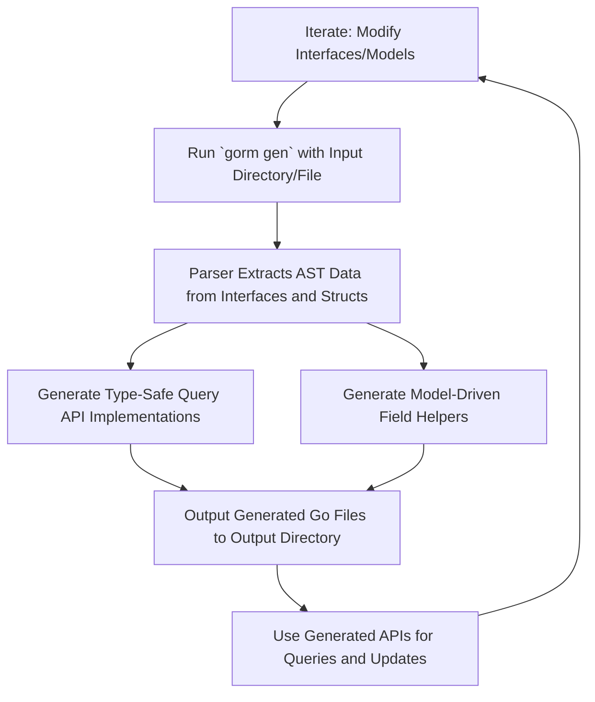

# Your First Code Generation

## Workflow Overview

### Task Description
This guide leads you through writing your first query interface and model struct, invoking the GORM CLI code generator (`gorm gen`), and understanding the structure and usage of the generated code. You'll learn how to rapidly iterate by modifying your interfaces and models, running the generator, and using the resulting type-safe, fluent APIs.

### Prerequisites
- Have Go installed (Go 1.18+ for generics support).
- GORM CLI installed (`go install gorm.io/cli/gorm@latest`).
- An existing Go project setup with GORM (see the Getting Started section).
- Basic familiarity with Go interfaces, structs, and comments.

### Expected Outcome
- Understanding how to define query interfaces with SQL templates.
- Creation of Go model structs representing your database entities.
- Successful code generation producing type-safe query APIs and field helpers.
- Ability to locate and use generated code confidently in your project.

### Time Estimate
Approximately 20–30 minutes.

### Difficulty Level
Beginner to Intermediate (no prior experience with GORM CLI required).

---

## Step-by-Step Instructions

<Steps>
<Step title="Step 1: Write Your Query Interface">
Start by creating a Go interface that describes the queries you want to perform. Use method comments to embed SQL templates or DSL annotations.

Example:

```go
// In examples/query.go
package examples

type Query[T any] interface {
  // SELECT * FROM @@table WHERE id=@id
  GetByID(id int) (T, error)

  // where("name=@name AND age=@age")
  FilterByNameAndAge(name string, age int)
}
```

Ensure your SQL uses template directives (e.g., `@@table`, `@param`) as your queries will be parsed and generated based on these.

> This approach lets you design custom, type-safe methods aligned to your specific data access patterns.
</Step>

<Step title="Step 2: Define Your Model Structs">
Define structs representing your database tables. These structs should use typical Go struct conventions and optionally include GORM tags.

Example:

```go
// In examples/models/user.go
package models

type User struct {
  ID   uint
  Name string
  Age  int
}
```

Model structs fuel the generation of field helpers. These helpers provide fluent predicates, setters, and association operations tailored to your data.
</Step>

<Step title="Step 3: Run the Generator">
Invoke the GORM CLI generator with the `gen` command, specifying the package or file containing your interfaces and models.

```bash
gorm gen -i ./examples -o ./generated
```

- `-i` points to your interface/model directory or Go file.
- `-o` specifies the output directory for the generated code.

Expected output:
- GORM CLI processes your file(s), producing concrete implementations of your query interfaces and field helpers.
- Output files maintain your package structure, allowing seamless import.

> Running this command after each interface/model change creates a rapid feedback loop.
</Step>

<Step title="Step 4: Understand the Generated Code Structure">
After generation, inspect the output directory. You'll find generated Go files representing:

- **Query Interface Implementations:** Concrete structs implement your interfaces, wrapping type-safe query builder code.
- **Field Helper Variables:** Strongly typed helper variables per model field (e.g., `User.Name.Eq("alice")`).

Typical generated elements include:

```go
func Query[T any](db *gorm.DB, opts ...clause.Expression) _QueryInterface[T] {
    return _QueryImpl[T]{Interface: gorm.G[T](db, opts...)}
}

var User = struct {
    ID   field.Number[uint]
    Name field.String
    Age  field.Number[int]
}{
    ID: User.ID.WithColumn("id"),
    Name: User.Name.WithColumn("name"),
    Age: User.Age.WithColumn("age"),
}
```

This structure allows you to leverage fluent, discoverable APIs for both queries and updates.
</Step>

<Step title="Step 5: Use Your Generated APIs in Code">
Import the generated package into your application and use the provided query interface and field helpers.

Example:

```go
import (
    "context"
    "gorm.io/gorm"
    "your_project/generated"
)

func GetUser(db *gorm.DB, ctx context.Context, id int) (models.User, error) {
    return generated.Query[models.User](db).GetByID(ctx, id)
}

func FindUsersByNameAndAge(db *gorm.DB, ctx context.Context, name string, age int) ([]models.User, error) {
    query := generated.Query[models.User](db).FilterByNameAndAge(name, age)
    return query.Find(ctx)
}
```

This usage ensures type safety and cleaner code over hand-written SQL strings.
</Step>

<Step title="Step 6: Iterate and Extend">
Continue refining your query interface methods and model structs, then rerun the generator to update generated code.

Each cycle is fast and reliable:
- Modify interfaces/models
- Run `gorm gen`
- Use updated APIs

This loop improves productivity and code quality.
</Step>
</Steps>

---

## Examples & Code Samples

### Example Query Interface

```go
// examples/query.go
package examples

type Query[T any] interface {
  // SELECT * FROM @@table WHERE id=@id
  GetByID(id int) (T, error)

  // SELECT * FROM @@table WHERE @@column=@value
  FilterWithColumn(column string, value string) (T, error)

  // where("name=@name AND age=@age")
  FilterByNameAndAge(name string, age int)
}
```

### Example Model Struct

```go
// examples/models/user.go
package models

type User struct {
  ID   uint
  Name string
  Age  int
}
```

### Running Code Generation

```bash
gorm gen -i ./examples -o ./generated
```

### Using Generated API

```go
user, err := generated.Query[models.User](db).GetByID(ctx, 123)
if err != nil {
  // handle error
}

filteredUsers, err := generated.Query[models.User](db).FilterByNameAndAge("alice", 30).Find(ctx)
```

---

## Troubleshooting & Tips

### Common Issues

- **Input Path Not Found:** Double-check the `-i` parameter points to existing Go files/directories.
- **No Generated Files:** Confirm interfaces and models contain valid methods and structs.
- **SQL Template Errors:** Ensure SQL template comments follow required format and placeholders are correctly named.
- **Output Path Conflicts:** Verify write permissions to the `-o` directory.

### Best Practices

- **Keep Interfaces and Models Close:** Co-locating them improves maintainability and intuitive generation.
- **Use Template DSL Directives:** Use `@@table`, `@param`, `{{where}}` and other directives for dynamic, safe SQL.
- **Run Generator Often:** Integrate generation in your development workflow for quick feedback.
- **Leverage Configuration:** For advanced use, customize generation paths and mapping via `genconfig.Config`.

### Performance Considerations

- The generator processes files incrementally but can be slow on very large projects.
- Use interface and struct includes/excludes to reduce scope and speed generation.

---

## Next Steps & Related Content

- **Writing Interfaces & Models:** Deepen your understanding of query interface design and model definition ([link](../getting-started/first-run-generation/configuration-basics)).
- **Customizing Code Generation:** Learn how to tailor output paths, field mappings, and filtering ([link](../getting-started/configuration-validation/customizing-generation)).
- **Using Generated APIs:** Explore how to apply the fluent query and update APIs in your application ([link](../getting-started/first-run-generation/first-usage)).
- **Troubleshooting:** Address common pitfalls during generation and runtime ([link](../getting-started/configuration-validation/troubleshooting)).

---

## Summary Diagram: Your First Code Generation Workflow



---

This clear loop promotes rapid development and type-safe code in your GORM projects.

---

## Additional Tips

<Tip>
When naming your interface methods, keep them descriptive and concise, reflecting the intent of the underlying query. This ensures your generated API is discoverable and self-documenting.
</Tip>

<Note>
If your query methods do not explicitly include `context.Context` in parameters, GORM CLI automatically injects it in generated implementations for consistency with idiomatic Go.
</Note>

<Warning>
Avoid naming conflicts between your model fields and interface method parameters to prevent ambiguous generated code.
</Warning>

<Info>
Remember that comments above interface methods are parsed as SQL templates, so maintain a clean, comment-based SQL format to ensure correct generation.
</Info>

---

Your journey to leveraging GORM CLI's full potential begins with mastering this first code generation workflow. Happy coding!
