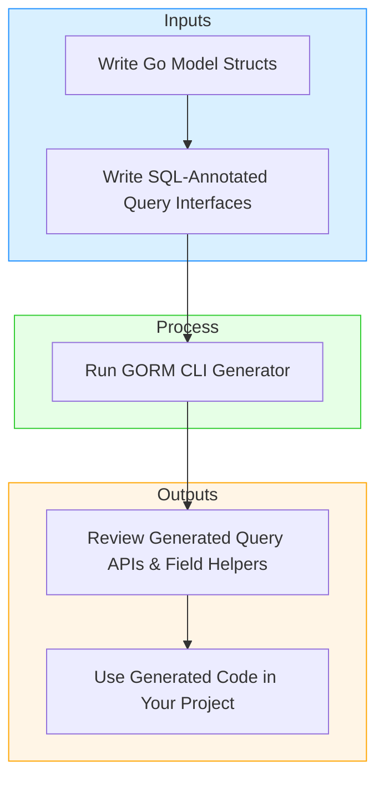

# Generating Queries and Field Helpers with GORM CLI

Welcome to the essential guide for crafting your model structs and query interfaces, then generating type-safe query APIs and model-driven field helpers using GORM CLI. This guide focuses tightly on using your Go data models and interface annotations as inputs to the CLI generator, highlighting typical workflows, best practices, and what to expect as output.

---

## 1. Workflow Overview

### What This Guide Helps You Accomplish
Learn to write Go structs that represent your database models and query interfaces annotated with embedded SQL templates to generate robust, type-safe data access code. This guide shows how these inputs feed into GORM CLI's generator to produce query APIs and field helpers that integrate seamlessly with GORM.

### Prerequisites
- Go 1.18 or higher installed on your system.
- Familiarity with basic Go syntax, structs, interfaces, and tags.
- Models representing database tables defined in your Go code.
- Basic understanding of SQL syntax and querying.
- GORM CLI installed (see installation guide).

### Expected Outcome
- Generated Go code consisting of:
  - **Interface-driven type-safe query APIs** derived from your SQL-annotated Go interfaces.
  - **Model-driven field helpers** for filters, updates, and managing associations, generated from your model structs.
- Ready-to-use fluent and compile-safe API to query and manipulate your database with GORM.

### Time Estimate
Approximately 15-30 minutes to write basic models, query interfaces, and generate first code.

### Difficulty Level
Beginner to Intermediate Go developer with basic GORM knowledge.

---

## 2. Step-by-Step Instructions

<Steps>
<Step title="Define Model Structs">
Write your model structs following Go conventions. Exported fields will be recognized by the code generator.

```go
// A typical user model
type User struct {
  ID        uint
  Name      string
  Email     string
  Age       int
  Status    string
  CreatedAt time.Time
}
```

Consider using GORM tags if you need specific DB column names or behavior.

**Expected Result:** Your struct represents the database schema, with properly named fields.

</Step>

<Step title="Create a Query Interface with SQL Templates">
Create an interface with methods annotated by SQL templates in Go comments.

```go
// Query interface example
// Note: SQL templates are provided in comments.
type Query[T any] interface {
  // SELECT * FROM @@table WHERE id=@id
  GetByID(id int) (T, error)

  // where("name=@name AND age=@age")
  FilterByNameAndAge(name string, age int)
}
```

Use placeholders like `@@table` for the table name, `@param` for method parameter usage, and DSL directives for conditional SQL.

**Expected Result:** A valid interface describing your queries declaratively.

</Step>

<Step title="Run the GORM CLI Generator">
Run the CLI providing the input directory or file containing your models and interfaces.

```bash
gorm gen -i ./examples -o ./generated
```

- `-i` specifies input path to Go source files with models and query interfaces.
- `-o` sets the output path for generated code.

The generator parses your interfaces, applies SQL template rendering, and inspects models to create field helpers.

**Expected Result:** Generated Go files appear in the output directory.

</Step>

<Step title="Use the Generated Code in Your Project">
Import the generated package and start using the type-safe queries and field helpers.

```go
// Query by ID
user, err := generated.Query[User](db).GetByID(ctx, 123)

// Use field helpers for predicates
users, err := gorm.G[User](db).
  Where(generated.User.Age.Gt(18)).
  Find(ctx)
```

This approach offers compile-time safety and fluent chaining supported by your models and query methods.

**Expected Result:** Seamless database querying with code completion and no raw SQL in your application.

</Step>
</Steps>

---

## 3. Typical Input and Output

### Example Model Struct
```go
package models

import "time"

type User struct {
  ID        uint
  Name      string
  Email     string
  Age       int
  Status    string
  CreatedAt time.Time
}
```

### Example Query Interface with SQL Templates
```go
package examples

type Query[T any] interface {
  // SELECT * FROM @@table WHERE id=@id
  GetByID(id int) (T, error)

  // where("name=@name AND age=@age")
  FilterByNameAndAge(name string, age int)
}
```

### Generated Output Snippet (Simplified)
```go
var User = struct {
  ID    field.Number[uint]
  Name  field.String
  Age   field.Number[int]
}{
  ID:   field.Number[uint]{}.WithColumn("id"),
  Name: field.String{}.WithColumn("name"),
  Age:  field.Number[int]{}.WithColumn("age"),
}

func Query[T any](db *gorm.DB) QueryInterface[T] {
  return QueryImpl[T]{Interface: gorm.G[T](db)}
}

func (e QueryImpl[T]) GetByID(ctx context.Context, id int) (T, error) {
  var sb strings.Builder
  params := make([]any, 0, 1)

  sb.WriteString("SELECT * FROM ? WHERE id=?")
  params = append(params, clause.Table{Name: clause.CurrentTable}, id)

  var result T
  err := e.Raw(sb.String(), params...).Scan(ctx, &result)
  return result, err
}
```

---

## 4. Understanding Field Helper Generation

### What Are Field Helpers?
Field helpers are generated types and variables derived from your model struct fields that enable strong typing for query predicates, update setters, and association management.

### Supported Field Types
- Primitive fields: `int`, `string`, `bool`, `float`, `time.Time`, `[]byte`.
- Custom types implementing Go `sql.Scanner` and `driver.Valuer` interfaces.
- Named types like `sql.NullTime` can be mapped via configuration for special handling.

### How Are Association Helpers Created?
Associations declared as structs or slices in your model (e.g., `HasOne`, `HasMany`) result in specialized helpers to create, update, unlink, or delete related records with compile-time safety.

### Usage Example
```go
// Filter users with age greater than 18
users, err := gorm.G[User](db).
  Where(generated.User.Age.Gt(18)).
  Find(ctx)

// Create a user and associate pets
gorm.G[User](db).
  Set(
    generated.User.Name.Set("alice"),
    generated.User.Pets.Create(generated.Pet.Name.Set("fido")),
  ).
  Create(ctx)
```

---

## 5. Writing SQL Templates in Query Interfaces

GORM CLI supports advanced SQL templating inside interface method comment blocks to customize query behavior dynamically:

| Directive   | Description                            | Example
| ----------- | ------------------------------------ | -----------------------------
| `@@table`   | Inserts model’s actual table name    | `SELECT * FROM @@table WHERE id=@id`
| `@@column`  | Inserts a dynamic column name        | `WHERE @@column=@value`
| `@param`    | Binds Go method parameter            | `WHERE name=@user.Name`
| `{{where}}` | Defines conditional WHERE clause     | `{{where}} age>18 {{end}}`
| `{{set}}`   | Defines conditional SET clause (UPDATE) | `{{set}} name=@name {{end}}`
| `{{if}}`    | Conditional SQL fragment              | `{{if age>0}} AND age=@age {{end}}`
| `{{for}}`   | Iterates over collection parameter   | `{{for _, tag := range tags}} ... {{end}}`

### Example
```go
// UPDATE @@table
// {{set}}
//   {{if user.Name != ""}} name=@user.Name, {{end}}
//   {{if user.Age > 0}} age=@user.Age, {{end}}
// {{end}}
// WHERE id=@id
UpdateInfo(user models.User, id int) error
```

---

## 6. Configuration for Customized Generation

Though no configuration is mandatory, you can use a package-level `genconfig.Config` for overrides:

- Change output directory
- Map custom Go types to specialized field helpers
- Whitelist or blacklist specific structs or interfaces

Example:
```go
var _ = genconfig.Config{
  OutPath: "examples/output",
  FieldTypeMap: map[any]any{
    sql.NullTime{}: field.Time{},
  },
  IncludeInterfaces: []any{"Query*"},
}
```

---

## 7. Troubleshooting Common Issues

<AccordionGroup title="Common Troubleshooting Tips">
<Accordion title="Generation Produces No Output">
- Verify the path provided to `-i` flag is correct and contains interfaces.
- Confirm interface method comments include valid SQL templates.
- Check `genconfig.Config` does not exclude your interfaces or structs by mistake.
</Accordion>

<Accordion title="Compilation Errors After Generation">
- Make sure Go 1.18+ is installed since GORM CLI generates generic code.
- Check that the generated code is properly imported in your project.
- Verify field helper types match your struct field types or mapping in config.
</Accordion>

<Accordion title="SQL Template Parse Errors">
- Inspect comments syntax in your query interface for valid templating.
- Confirm all placeholders like `@@table`, `@param` are correctly used.
- Ensure all `{{if}}`, `{{for}}`, `{{end}}` directives are balanced.
</Accordion>
</AccordionGroup>

---

## 8. Best Practices and Tips

- Keep queries focused and named clearly in interfaces.
- Use template DSL to handle conditional queries and dynamic filters.
- Utilize field helpers for safer, expressive filtering and updating.
- Apply configuration to customize generation to your project’s conventions.
- Regularly validate generated code with tests or compilation.

### Example Tip
```go
// Use field helper for zero-values safely
gorm.G[User](db).
  Set(
    generated.User.Age.Set(0),
    generated.User.Name.Set("jinzhu"),
  ).
  Update(ctx)
```

---

## 9. Next Steps & Related Documentation

- Explore [Writing Models & Query Interfaces](../getting-started/first-code-gen/writing-models-interfaces) for deeper modeling guidance.
- Learn [Running the Generator](../getting-started/first-code-gen/running-generator) to understand CLI usage.
- Try [Using Generated APIs](../getting-started/first-code-gen/first-use) to integrate generated code.
- Review [Template DSL Guide](../guides/advanced-usage/template-dsl-guide) for advanced SQL template usage.
- See [Managing Associations](../guides/advanced-usage/advanced-associations) for manipulating related data.

---

## Visual Workflow



---

This guide has walked you through generation of queries and field helpers using your models and interfaces, empowering you to use GORM CLI with confidence and precision.

Happy coding!
