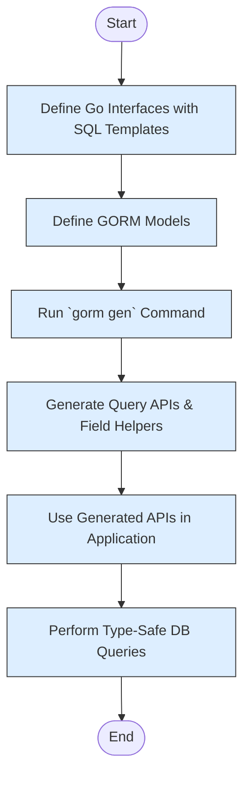

# Your First Query with GORM CLI

Welcome to your hands-on guide for running your first type-safe query using GORM CLI. This page walks you through interacting with your generated query APIs—enabling you to fetch, filter, and manipulate data with confidence and compile-time safety.

---

## 1. Getting Started: What You Will Accomplish

### Task Description
This guide helps you execute your first query using the code generated by GORM CLI. Starting from a working Go project with your models and query interfaces defined and generated code available, you will learn how to import, call, and handle queries using the generated type-safe APIs.

### Prerequisites
- You have your Go project prepared with models and query interfaces defined.
- You have run `gorm gen` to generate the query and field helper code.
- Your Go environment is set up with GORM and the generated packages accessible.
- Basic understanding of Go and GORM queries.

### Expected Outcome
By the end, you'll be able to:
- Use the generated query interface methods.
- Compose filter predicates using generated field helpers.
- Run queries that are fully type-safe and checked at compile time.
- Understand typical patterns for working with generated APIs.

### Time Estimate
Approximately 10–15 minutes to set up and run your first query.

### Difficulty Level
Beginner (familiarity with Go and GORM recommended).

---

## 2. Step-by-Step Guide to Your First Query

<Steps>
<Step title="Import Generated Packages">
Import your generated code package(s) to bring the query interfaces and field helpers into scope.

```go
import (
  "context"
  "fmt"
  "gorm.io/gorm"

  "yourproject/generated" // Replace with your actual generated package path
  "yourproject/models"    // Your model package
)
```

Confirm your generated package path matches the output directory you set with the `-o` flag in the generator.
</Step>

<Step title="Obtain a GORM DB Instance">
Make sure you have a `*gorm.DB` instance connected to your database.

```go
db, err := gorm.Open(...)
if err != nil {
    panic("failed to connect database")
}
```

This `db` is the starting point to invoke generated query APIs.
</Step>

<Step title="Create a Typed Query Interface Instance">
Use the generated query function to create a type-safe interface for your model.

Example using a "User" model:

```go
ctx := context.Background()
query := generated.Query[models.User](db)
```

This returns an object with your declared query methods and built-in GORM interface for advanced chaining.
</Step>

<Step title="Run a Simple Query Method">
Call one of your interface’s generated methods.

For example, to get a user by ID:

```go
user, err := query.GetByID(ctx, 123)
if err != nil {
    fmt.Println("Error fetching user:", err)
    return
}
fmt.Printf("User: %+v\n", user)
```

This runs the type-safe SQL generated from your interface method’s SQL template.
</Step>

<Step title="Using Field Helpers to Build Complex Filters">
You can also use generated field helpers alongside GORM’s fluent API.

Example: Find all users older than 18

```go
users := []models.User{}
err := gorm.G[models.User](db).
    Where(generated.User.Age.Gt(18)).
    Find(ctx, &users)

if err != nil {
    fmt.Println("Error fetching users:", err)
    return
}

for _, u := range users {
    fmt.Printf("User: %+v\n", u)
}
```

Field helpers like `generated.User.Age.Gt()` provide compile-time safety and help ensure correct SQL predicates.
</Step>

<Step title="Explore Generated Methods and Helpers">
Once comfortable, explore your generated package:
- Check other interface methods like `FilterByNameAndAge` or `FilterWithTime`.
- Use field and association helpers to construct rich queries.

Every generated method corresponds to a SQL template linked to your interfaces.
</Step>
</Steps>

---

## 3. Example: Full Code Snippet

```go
package main

import (
	"context"
	"fmt"

	"gorm.io/driver/sqlite"
	"gorm.io/gorm"

	"yourproject/generated"
	"yourproject/models"
)

func main() {
	db, err := gorm.Open(sqlite.Open("test.db"), &gorm.Config{})
	if err != nil {
		panic("failed to connect database")
	}

	ctx := context.Background()
	query := generated.Query[models.User](db)

	// Get user by id
	user, err := query.GetByID(ctx, 1)
	if err != nil {
		fmt.Println("Error fetching user:", err)
		return
	}
	fmt.Printf("User fetched: %+v\n", user)

	// Find users older than 18
	var users []models.User
	err = gorm.G[models.User](db).
		Where(generated.User.Age.Gt(18)).
		Find(ctx, &users)

	if err != nil {
		fmt.Println("Error finding users:", err)
		return
	}

	for _, u := range users {
		fmt.Printf("User: %+v\n", u)
	}
}
```

Replace `yourproject/generated` and `yourproject/models` with your actual import paths.

---

## 4. Troubleshooting & Tips

<AccordionGroup title="Common Issues and Solutions">
<Accordion title="The generated package cannot be found">
Verify that you set the output directory correctly when running the generator (`gorm gen -o ./generated`). Also, check your Go module path and import statement to ensure they match.
</Accordion>
<Accordion title="Methods are missing from the generated interfaces">
Confirm your interface methods have correct SQL templates in their GoDoc comments. Ensure the files with interfaces are included when running the generator and that no exclude patterns in config remove them.
</Accordion>
<Accordion title="Compile errors related to field helpers">
Ensure your model fields use supported types or map custom types with `genconfig.FieldTypeMap`. Also, verify your Go version meets the requirement (1.18+).
</Accordion>
<Accordion title="Query method returns unexpected results or errors">
Check your SQL template syntax for correctness. Use logging in GORM to see the generated SQL. Also, verify your database schema matches your model structures.
</Accordion>
</AccordionGroup>

<Tip>
Always run the generator again when you update interfaces or models to keep generated code current.
</Tip>

---

## 5. Next Steps & Further Learning

- Explore [Use the Generated APIs](https://yourdocs/using-generated-code) to deepen your knowledge on calling advanced queries and updates.
- Review [Quickstart & Main Workflow](https://yourdocs/quickstart-and-primary-workflow) for end-to-end understanding.
- Learn about [Field Helpers and Associations](https://yourdocs/field-helpers-basics) for more expressive conditions.
- Experiment with [Template-Driven Queries](https://yourdocs/template-based-queries) for custom SQL templates.

This foundational experience sets you up for productive, type-safe database interactions using GORM CLI.

---

For a broader context, consider the following diagrams on your project code generation flow:



Feel empowered to build your GORM-powered applications with confidence and safety.

---