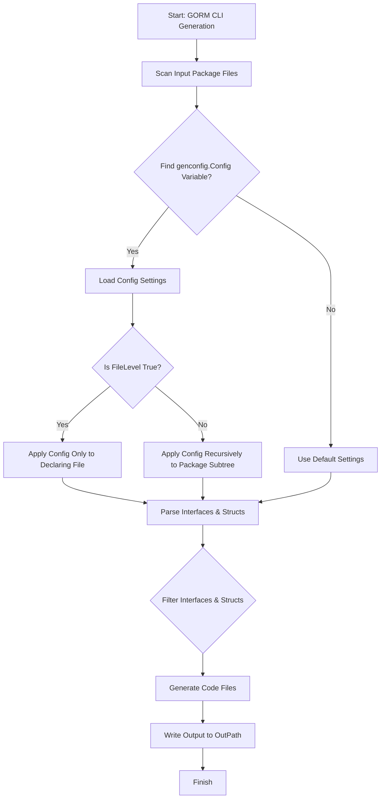

# Essential Configuration: Tweaking Code Generation

Unlock full control over the generated code in your Go project using GORM CLI's powerful `genconfig.Config`. This guide walks you through how to customize output paths, tailor field mappings, and selectively include or exclude interfaces and structs to perfectly fit your application's needs.

---

## 1. Introduction: What This Page Helps You Achieve

When generating type-safe query APIs and field helpers with GORM CLI, the output can be finely controlled and customized on a per-package basis. This avoids one-size-fits-all defaults and lets you adapt code generation for complex projects, different folder layouts, or specialized business logic.

By declaring a `genconfig.Config` variable in your source package, you instruct the generator to:

- Redirect generated files to custom directories
- Override field helper mappings for specific Go types or struct tags
- Include or exclude particular interfaces and struct types from generation
- Apply configuration either globally (package level) or specifically to individual files (file level)

This page focuses exclusively on how to use and implement this essential configuration.

---

## 2. Prerequisites

Before proceeding, ensure you have:

- Installed GORM CLI (Go 1.18+ required)
- Created your query interfaces and model structs
- Completed at least one successful generation run with default settings

If you haven't done this yet, visit the [Basic Configuration](https://gorm.io/cli/gorm/getting-started/initial-configuration-and-first-use/basic-configuration) guide for a walk-through.

---

## 3. How `genconfig.Config` Works

GORM CLI automatically detects a package-level variable of type `genconfig.Config` in the package it is scanning for generation. This variable acts like a manifest with configurable toggles:

- **OutPath**: Customize the output directory for all files generated from this package
- **FieldTypeMap**: Map specific Go types to custom field helper wrappers
- **FieldNameMap**: Target struct fields with specific `gen` tags for customized helper generation
- **Include/Exclude Interfaces and Structs**: Narrow generation scope using whitelists or blacklists with pattern matching or type literals
- **FileLevel**: Choose between package-wide or file-scoped config application

The generator merges and applies all relevant configs depending on directory structure.

---

## 4. Practical Tweaking with `genconfig.Config`

### Step 1: Declare a Package-Level Variable

Place a `var _ = genconfig.Config{ ... }` declaration in a Go source file within the target package.

```go
package yourpackage

import (
    "database/sql"
    "gorm.io/cli/gorm/field"
    "gorm.io/cli/gorm/genconfig"
)

var _ = genconfig.Config{
    OutPath: "generated/yourpackage",
    FieldTypeMap: map[any]any{
        sql.NullTime{}: field.Time{},
    },
    FieldNameMap: map[string]any{
        "json": JSON{},
    },
    IncludeInterfaces: []any{"Query*"},
    ExcludeInterfaces: []any{"*Deprecated*"},
    IncludeStructs: []any{"User", "*DTO"},
    ExcludeStructs: []any{"Legacy*"},
    FileLevel: false, // apply to entire package
}
```

### Step 2: Customize Output Paths

Control where generated files land for this package's interfaces and structs. This helps separate generated code by feature or layer.

```go
OutPath: "generated/custompath",
```

If `FileLevel` is `true`, the config applies only to the file where it was declared; otherwise, it applies recursively to the entire directory subtree, overriding CLI flags.

### Step 3: Map Field Types to Helpers

Use `FieldTypeMap` to assign custom field helper types for specific Go field types.

For example, map `sql.NullTime` fields to the `field.Time{}` helper:

```go
FieldTypeMap: map[any]any{
    sql.NullTime{}: field.Time{},
},
```

This ensures that any model field of type `sql.NullTime` generates the appropriate fluent query helpers.

### Step 4: Map Field Names via Tags

Sometimes a struct field has a tag indicating it needs special handling, such as JSON parsing. `FieldNameMap` associates strings (corresponding to `gen:"tagname"`) with field helper types.

```go
FieldNameMap: map[string]any{
    "json": JSON{},
},
```

Declare the tag in your model struct:

```go
type User struct {
    Profile string `gen:"json"`
}
```

This tells the generator to use your custom JSON helper for this field.

### Step 5: Whitelist or Blacklist Interfaces and Structs

Refine which interfaces and structs generate code using the following filters:

| Field               | Purpose                                          | Value Types                      |
|---------------------|-------------------------------------------------|---------------------------------|
| IncludeInterfaces    | Only generate these interfaces (whitelist)      | Patterns ("Query*"), type literals |
| ExcludeInterfaces    | Skip these interfaces (blacklist)                | Patterns, type literals          |
| IncludeStructs       | Only generate these structs (whitelist)          | Patterns ("User*"), type literals |
| ExcludeStructs       | Skip these structs (blacklist)                    | Patterns, type literals          |

Examples:

```go
IncludeInterfaces: []any{"Query*", models.Query(nil)},
ExcludeInterfaces: []any{"*Deprecated*"},
IncludeStructs: []any{"User", "Account*", models.User{}},
ExcludeStructs: []any{"*DTO"},
```

> Rules:
> - If an include list is non-empty, it takes precedence.
> - Exclude lists are ignored if include lists are set.

### Step 6: (Optional) Use `FileLevel` Control

Set `FileLevel: true` in your config to restrict this configuration to only the Go file containing the declaration. This enables different config behaviors for multiple files in the same package.


---

## 5. Real-World Examples

### Example A: Restrict Generation to Specific Interfaces and Customize Path

```go
package pattern

import "gorm.io/cli/gorm/genconfig"

// Only generate interfaces starting with "Query" in this package
var _ = genconfig.Config{
	IncludeInterfaces: []any{"Query*"},
	OutPath: "generated/pattern",
}
```

### Example B: Exclude Certain Structs in a Subdirectory

```go
package twolevel

import (
	s "gorm.io/cli/gorm/examples/filters/twolevel/nested"
	"gorm.io/cli/gorm/genconfig"
)

// Exclude nested.I2 and nested.S2, plus local I3 and S3
var _ = genconfig.Config{
	ExcludeInterfaces: []any{s.I2[any](nil), I3[any](nil)},
	ExcludeStructs:    []any{s.S2{}, S3{}},
}
```

---

## 6. Common Pitfalls & Troubleshooting

### Pitfall: Config Not Applied as Expected
- Verify the config variable is declared at package level (not inside a function).
- Check your file and directory structure; config applies recursively unless `FileLevel` is true.
- Confirm interface and struct names/patterns exactly match those in your code including package paths.

### Pitfall: Custom Field Helpers Not Recognized
- Confirm you use typed instances (like `field.Time{}` or custom helper struct) as map values.
- Remember `FieldNameMap` has higher priority than `FieldTypeMap`.
- Restart your generation after changing config to refresh cached results.

### Troubleshooting Steps
- Run generation with verbose output to check applied configs.
- Simplify include/exclude patterns to isolate filtering issues.
- Review generated files' paths to confirm `OutPath` override.

---

## 7. Best Practices

- Use `Include*` and `Exclude*` filters to keep code generation focused and faster.
- Prefer precise type literals (e.g., `models.User{}`) over loosely matched patterns when possible.
- Maintain separate config files for sub-packages or different features using `FileLevel: true`.
- Map special field types and tags early to avoid manual helper adjustments later.

---

## 8. Next Steps & Related Content

- **Try it now:** Add a sample `genconfig.Config` to your project and run generation.
- Explore [Basic Configuration](https://gorm.io/cli/gorm/getting-started/initial-configuration-and-first-use/basic-configuration) for foundational setup.
- Learn how to write custom [Field Helpers](https://gorm.io/cli/gorm/guides/advanced-integration/custom-helper-json) for advanced type support.
- Deepen understanding of how [Interface-Driven Query APIs](https://gorm.io/cli/gorm/guides/query-and-model-helpers/interface-driven-queries) interact with generated code.

---

## 9. Summary Diagram: Config Application Flow



---