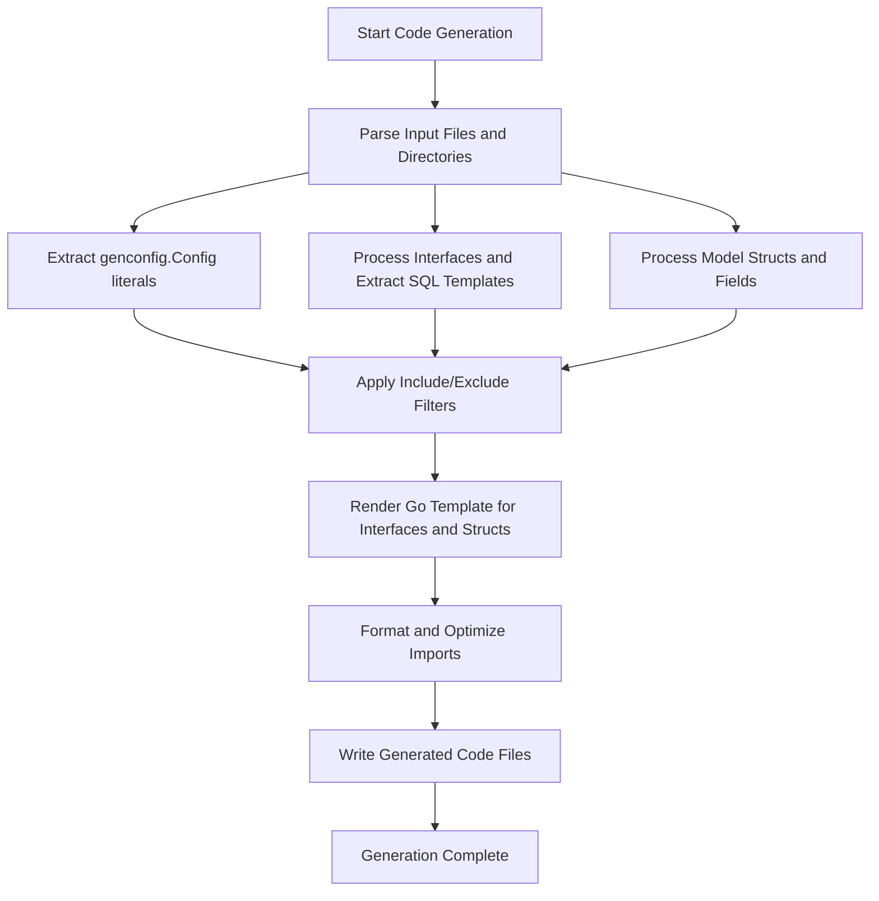

# How Code Generation Works

GORM CLI empowers Go developers by generating two essential code layers that streamline database operations with GORM: **type-safe query APIs** from interfaces annotated with raw SQL templates, and **field helpers** derived from model structs. This page demystifies how these layers are created, how they interrelate, and how you can leverage or extend this process to build robust, fluent, and maintainable data access layers in your projects.

---

## Overview of Generation Workflow

The generation workflow in GORM CLI has **two complementary streams**:

1. **Query API Generation** — from Go interfaces with embedded SQL template comments, producing strongly typed, concrete query implementations.
2. **Field Helper Generation** — from model structs, producing typed field helpers for filters, updates, and associations.

Both streams run together and culminate in generated code that empowers developers with compile-time validation, IDE auto-completion, and error reduction.

<Callout>
🛠️ If you want to jump into how to *configure* the generation process for your needs (e.g., to include/exclude interfaces or map Go types), see [Configuring Code Generation: genconfig.Config](guides/customization-advanced/generator-configuration).
</Callout>

---

## 1. Query API Generation from Interfaces

### User Intent

You want to write expressive, type-safe database query APIs that:
- Use concise Go interfaces annotated with SQL templates.
- Bind Go method parameters safely to SQL queries.
- Automate implementation generation to avoid boilerplate.

### How It Works

- You define **generic interfaces** with methods whose comments contain SQL templates using the CLI-supported DSL.
- GORM CLI parses these Go interfaces and reads the method-level SQL templates.
- The generator constructs concrete implementations that use the GORM DSL (`gorm.DB`) under the hood to execute these queries, safely substituting parameters.

Example:
```go
// Query interface with embedded SQL template
// SELECT * FROM @@table WHERE id=@id
GetByID(id int) (T, error)
```

- The generator parses this and generates an implementation with a method that:
  - Automatically injects `context.Context` if missing.
  - Executes a raw SQL query with parameter binding.
  - Scans the results into the generic type `T`.

### Benefits

- Ensures your SQL and Go types stay synchronized.
- Avoids runtime SQL injection risks by using explicit parameter binding.
- Provides a fluent, discoverable API with complete type checks at compile time.

---

## 2. Field Helper Generation from Model Structs

### User Intent

You want strongly typed field helpers for:
- Building queries via filters.
- Creating and updating model instances.
- Managing associations like has-many, belongs-to, and many-to-many.

### How It Works

- GORM CLI scans your model structs’ AST 
- It extracts field metadata, including:
  - Field names and database column names
  - Go types (including pointers, slices for associations)
  - Tags that hint for special handling (e.g., `gen:"json"`)
- It generates field helpers like `field.String`, `field.Number[int]`, `field.Struct[T]`, or `field.Slice[T]` that expose
  methods for filtering, updating, linking associations, and more.

Example:
```go
var User = struct {
  Name field.String
  Age  field.Number[int]
}{
  Name: field.String{}.WithColumn("name"),
  Age:  field.Number[int]{}.WithColumn("age"),
}
```

Then you can use:
```go
db.Where(generated.User.Name.Eq("alice")).Find(ctx)
```

### Notes on Field Conversion

- Field types automatically map to typed helpers, e.g., Go `string` → `field.String`.
- Custom mapping is possible via `genconfig.Config` for both field names and types.
- Associations (e.g., `[]*Pet` or `Company`) generate specialized helpers with methods for CRUD operations on relations.

---

## 3. How Configuration Shapes Generation

### per-Package Configuration with `genconfig.Config`

- Define a package-level variable of type `genconfig.Config` in your source Go files.
- Customize output paths, type mappings, inclusion/exclusion filters, and interface/struct whitelisting.

Example:
```go
var _ = genconfig.Config{
  OutPath: "examples/output",
  FieldTypeMap: map[any]any{
      sql.NullTime{}: field.Time{},
  },
  FieldNameMap: map[string]any{"date": field.Time{}},
  IncludeInterfaces: []any{"Query*"},
}
```

- Generator applies configurations hierarchically based on file and package level scopes.
- Whitelists take precedence over blacklists.

### Inclusion and Exclusion

- Filter interfaces or structs by shell-style patterns or explicit type literals.
- Use IncludeInterfaces, ExcludeInterfaces, IncludeStructs, ExcludeStructs accordingly.

### File-Level vs Package-Level

- `FileLevel` determines whether Config applies only to the source file or the whole package/directory.

---

## 4. Code Generation Mechanics

### Parsing Source Files

- GORM CLI parses Go source files in the specified input path.
- Extracts interfaces, structs, imports, and config literals.

### AST Traversal

- Walks through the AST to capture types, fields, methods, and doc comments.
- Parses method comments to extract SQL templates with placeholders.
- Processes embedded anonymous fields to flatten structs.

### Template Rendering

- Uses pre-defined Go text templates to generate concrete Go code files.
- Applies configured field mappings and filters during render.

### Output

- Generated code is written to the specified `OutPath`, preserving directory structure if needed.
- Files are formatted and imports optimized with `golang.org/x/tools/imports`.

---

## 5. Verifying and Extending Generation

### Validation

- Generated code passes Go syntax parsing before writing.
- Unit tests verify generated output matches golden files.

### Extensibility

- Define custom field helpers (e.g. JSON field mapping).
- Customize `genconfig.Config` for complex needs.
- Extend SQL templates with supported DSL directives.

---

## Practical Example

Imagine you have a `User` model and an interface defining queries like `GetByID` and `FilterByNameAndAge`. You place them in the same package and optionally define a `genconfig.Config` to tune output and field mappings. Running `gorm gen -i ./path/to/package -o ./generated` invokes the generator that:

- Parses your interfaces and models.
- Applies filters.
- Generates type-safe APIs with SQL methods and field helpers.

Now, you can use:

```go
u, err := generated.Query[User](db).GetByID(ctx, 123)
users, err := gorm.G[User](db).Where(generated.User.Name.Like("%Alice%"), generated.User.Age.Between(18, 65)).Find(ctx)
```

with full IDE support and reduced runtime errors.

---

## Troubleshooting Common Issues

<AccordionGroup title="Troubleshooting Code Generation">
<Accordion title="Empty Generation Outputs">
Ensure your interfaces and structs are not filtered out by Include/Exclude configurations or filters. Verify `genconfig.Config` settings in your packages.
</Accordion>
<Accordion title="Invalid Generated Go Code">
Check your SQL template syntax in comments. The generator expects valid syntax for placeholders and DSL directives.
Ensure method return values conform to expected patterns (error type presence).
</Accordion>
<Accordion title="Unexpected Interface or Struct Omission">
Review included/excluded filters in your config. Remember that whitelisting takes precedence and exclusion is applied only when whitelist is empty.
</Accordion>
</AccordionGroup>

<Tip>
Regularly run `go build` and `go test` on generated code directories to catch issues early.
</Tip>

---

## Next Steps & Related Content

- Explore [Using Generated APIs](getting-started/onboarding-core/using-generated-apis) to see how to consume the generated query APIs and helpers.
- Visit [Configuring Code Generation: genconfig.Config](guides/customization-advanced/generator-configuration) for advanced customization.
- Learn about [Template-Based Queries](guides/core-usage-patterns/template-based-queries) for writing complex SQL templates.

---

## Diagram: Generation Process Flow



---

## Summary
This documentation provides a comprehensive understanding of GORM CLI's dual code generation workflow. It explains how interfaces with SQL templates become type-safe query APIs, how model structs generate field helpers for query building and associations, and how configuration controls this process. Practical insights into how the generator parses, filters, and outputs code equip you to effectively use or customize this powerful tool.
