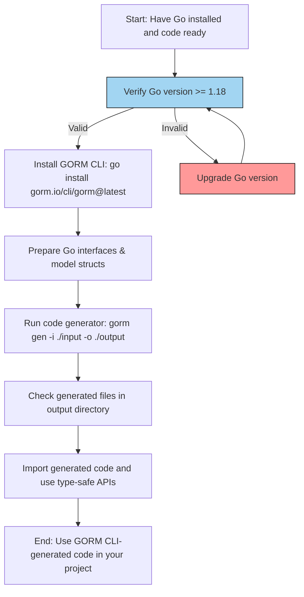

# Install and Set Up GORM CLI

Welcome to your first step to harnessing the power of the GORM CLI! This guide walks you through installing the GORM CLI tool, understanding the basic requirements, and performing your initial code generation using your Go models and interfaces.

---

## 1. Workflow Overview

### What You'll Accomplish
This guide helps you:

- Install the GORM CLI command-line tool correctly
- Verify system prerequisites
- Run your very first code generation from your Go interfaces and model structs

### Prerequisites

Before you start, ensure the following:

- You have Go 1.18 or later installed and properly configured in your environment.
- Your Go project contains at least one Go file defining interfaces with embedded raw SQL templates and model struct definitions.
- Familiarity with basic Go project structure and using CLI tools.

### What to Expect
By completing this guide, you will have:

- Installed the `gorm` CLI tool globally
- Understood command options like input path and output directory
- Generated type-safe query interfaces and model-driven field helpers
- Observed output files that you can start using immediately

### Estimated Time
Expect this process to take approximately 10-15 minutes depending on setup and environment.

### Skill Level
Beginner to Intermediate — no deep knowledge of GORM internals is needed.

---

## 2. Step-by-Step Instructions

### Step 1: Confirm System Requirements

GORM CLI requires Go version 1.18 or greater.

1. Open a terminal.
2. Run:
    ```bash
    go version
    ```
3. Verify the displayed version is 1.18 or higher.

If your Go version is older, please visit [Go's official website](https://golang.org/dl/) to upgrade.


### Step 2: Install GORM CLI

1. Run the following command to install the latest GORM CLI:

    ```bash
    go install gorm.io/cli/gorm@latest
    ```

2. This command installs the `gorm` binary into your Go bin directory (e.g., `$GOPATH/bin`). Make sure this directory is in your system PATH.

3. Verify installation by running:

    ```bash
    gorm --help
    ```

    You should see the CLI usage instructions.

### Step 3: Prepare Your Input Go Files

GORM CLI requires Go source files with:

- Interfaces containing SQL templates in method comments
- Structs defining your database models

Example interface and struct:

```go
// Query interface with raw SQL template
// SELECT * FROM @@table WHERE id=@id
GetByID(id int) (T, error)

// Model struct
 type User struct {
   ID   uint
   Name string
   Age  int
 }
```

Place your models and interfaces in a directory, e.g., `./examples`.


### Step 4: Run the GORM Code Generator

Run the code generation command:

```bash
gorm gen -i ./examples -o ./generated
```

- `-i` specifies the input directory or Go file containing your interfaces and models.
- `-o` specifies the output directory for generated code; defaults to `./g` if omitted.

### Step 5: Verify Generation Output

- The CLI will print messages indicating files generated and their paths.
- In `./generated` you will find generated packages with type-safe query API implementations and field helpers.

### Step 6: Integrate and Use the Generated Code

Import generated code in your project. Use the generated query interfaces and field helpers directly for database operations.

Example usage:

```go
u, err := generated.Query[User](db).GetByID(ctx, 123)
```

Your first generated method call is now type-safe and backed by your SQL templates.

---

## 3. Examples & Configuration

### Minimal Config Example (Optional)

You can control output path and field mappings by declaring a package‑level configuration.

```go
var _ = genconfig.Config{
  OutPath: "examples/output",
  FieldNameMap: map[string]any{
    "json": JSON{}, // Custom JSON helper mapping
  },
}
```

Place this in your Go package where interfaces/models live to customize generation behavior.

---

## 4. Troubleshooting & Tips

### Common Issues

- **`gorm` command not found:** Ensure `$GOPATH/bin` is in your PATH after installing.

- **Go version lower than 1.18:** Upgrade Go to meet the minimum requirement.

- **No generated files:** Verify input path includes Go files with interfaces and structs.

- **Permission errors writing output:** Ensure you have write permissions for the output directory.

- **Template parsing errors:** Check your SQL templates for correct syntax and parameter placeholders.

### Best Practices

- Always keep your interfaces and models in logically grouped directories.
- Use the `genconfig.Config` for advanced control to exclude/include specific interfaces or structs.
- Generate into a dedicated directory to avoid clashing with source files.

---

## 5. Next Steps & Related Documentation

- Proceed to **[Generate Type-Safe Query APIs](/guides/getting-started/generate-type-safe-apis)** to learn how to write more advanced queries.
- Explore **[Building Model-Driven Field Helpers](/guides/getting-started/model-driven-field-helpers)** for efficient update and filter operations.
- For troubleshooting common issues, see **[Common Setup and Generation Issues](/getting-started/troubleshooting-help/common-issues)**.
- Consider reading about **[Configuring Code Generation](/getting-started/configuration-quickstart/configuring-generation)** to tailor generator output.

---

## Summary Diagram of Installation and Generation Workflow



---