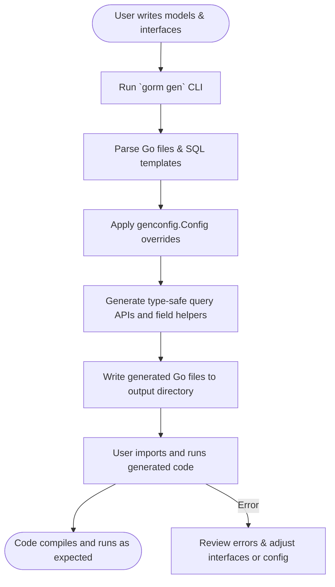

# Installation and First Code Generation

## 1. Introduction
This guide walks you through installing the GORM CLI tool, setting up your Go environment accordingly, and generating your first type-safe query interfaces and model-based field helpers. You'll learn to install the CLI, prepare your initial query interfaces and models, run the generator, and verify that the generated code is working.

> By following this documentation, you will transform handwritten SQL embedded in Go interfaces and model structs into compile-time safe, fluent, and easy-to-use GORM APIs.

---

## 2. Prerequisites
Before you start, ensure your environment is properly configured:

- **Go version**: You must have Go 1.18 or higher installed to support generics.
- **Go Modules**: Your project should be initialized as a Go module (`go mod init`).
- **GORM dependency**: Your Go project needs the `gorm.io/gorm` package installed.
- Access to a terminal or command line interface for installing and running the tool.

<Tip>
Use `go version` to verify your Go installation.
If you have an older version than 1.18, upgrade your Go toolchain.
</Tip>

---

## 3. Installing GORM CLI

### 3.1 Installation Command
Run the following command to install the CLI globally:

```bash
 go install gorm.io/cli/gorm@latest
```

This downloads the latest GORM CLI binary and installs it into your `$GOPATH/bin` or `$GOBIN` directory.

### 3.2 Configuring Your PATH
Make sure your Go bin directory is included in your system's PATH so you can run `gorm` directly from the terminal.

For example, on Unix-like systems (bash/zsh), add to your `.bashrc` or `.zshrc`:

```bash
export PATH="$PATH:$(go env GOPATH)/bin"
```

Reload your shell or terminal session, then verify the installation:

```bash
gorm --help
```

You should see the CLI usage information.

<Warning>
If the command is not found, double-check your PATH configuration and Go installation.
</Warning>

---

## 4. Preparing Your First Code Generation

### 4.1 Define Models
Create Go structs representing your database models.

Example (`examples/models/user.go`):

```go
package models

type User struct {
  ID     uint
  Name   string
  Age    int
  Role   string
  IsAdult bool
}
```

### 4.2 Define Query Interfaces with SQL Template Comments
Define Go interfaces that describe query operations with embedded SQL templates in method comments.

Example (`examples/query.go`):

```go
package examples

type Query[T any] interface {
  // SELECT * FROM @@table WHERE id=@id
  GetByID(id int) (T, error)

  // SELECT * FROM @@table WHERE @@column=@value
  FilterWithColumn(column string, value string) (T, error)

  // SELECT * FROM @@table
  // {{where}}
  //   {{if user.ID > 0}} WHERE id=@user.ID {{else if user.Name != ""}} WHERE name=@user.Name {{end}}
  // {{end}}
  QueryWith(user User) (T, error)
}
```

> Use GORM CLI's template DSL directives (`@@table`, `@param`, `{{if}}`, `{{where}}`, `{{set}}`, etc.) to declare dynamic, type-safe SQL.

---

## 5. Running the GORM CLI Code Generator

### 5.1 Basic Generation Command
From your project root or where your Go modules reside, run:

```bash
gorm gen -i ./examples -o ./generated
```

- `-i` or `--input` points to the directory or specific Go file containing your interfaces and models.
- `-o` or `--output` specifies where the generated code will be saved. Defaults to `./g` if omitted.

### 5.2 How Generation Works
- The generator parses your Go interfaces with SQL templates.
- It inspects all model structs for field helpers.
- Applies any `genconfig.Config` present for customization.
- Generates type-safe query APIs and fluent field helper code files, mirroring your package structure.

### 5.3 Output Verification
On success, the CLI outputs generation info:

```
Generating file generated/examples/query.go from ./examples/query.go...
Generating file generated/examples/models_helper.go from ./examples/models/user.go...
```

Check the `generated` directory for your new source files.

<Check>
If you see errors, validate input paths and that your interfaces/methods use supported DSL syntax.
</Check>

---

## 6. Using and Verifying Generated Code

### 6.1 Import Generated Packages
Include the generated package in your Go application:

```go
import generated "your-module/generated/examples"
```

### 6.2 Instantiate Generated Query APIs
Use generic type-safe APIs, passing the gorm.DB instance.

Example:

```go
user, err := generated.Query[models.User](db).GetByID(ctx, 123)
if err != nil {
  panic(err)
}

fmt.Println("User name:", user.Name)
```

### 6.3 Use Generated Field Helpers
Access generated field helpers for filters, updates, and associations.

Example filtering all users with age greater than 18:

```go
users, err := gorm.G[models.User](db).Where(generated.User.Age.Gt(18)).Find(ctx)
```

### 6.4 Run Tests/Examples
Run the example tests to validate end-to-end correctness:

```bash
cd examples
go test -v
```

---

## 7. Best Practices and Tips

- **Define Models and Interfaces Together**: Keep your models and query interfaces in the same package or directory to simplify generation.
- **Use genconfig.Config for Customization**: Override defaults by defining a `genconfig.Config` variable with output paths and field mappings.
- **Keep SQL Templates Simple and Clear**: Use the GORM CLI SQL DSL idioms (`@@table`, `@param`, `{{where}}`, etc.) for maintainability.
- **Regenerate After Model or Interface Changes**: Always re-run `gorm gen` after modifying your models or query interfaces.

<Tip>
You can use the `-o` flag to organize generated code in a clean, separate folder.
</Tip>

---

## 8. Troubleshooting Common Issues

<AccordionGroup title="Common Issues & Fixes">
<Accordion title="Go Version or Module Issues">
- Ensure Go 1.18+ is installed.
- Verify your project is using Go modules (`go.mod` present).
- Run `go mod tidy` to resolve dependencies.
</Accordion>

<Accordion title="Input or Output Path Problems">
- Double-check your `-i/--input` path points to valid Go source files.
- Check write permissions for the output directory `-o`.
- If generation skips files, verify interface and struct visibility (exported names).
</Accordion>

<Accordion title="SQL Template Validation">
- Ensure your interface methods have correctly structured SQL comments.
- Avoid unsupported method signatures; return types must end with `error`.
- Refer to syntax samples under Section 4.2.
</Accordion>

<Accordion title="Generated Code Doesn’t Compile or Work">
- Confirm all dependencies are imported.
- Check that your `gorm.DB` is correctly initialized and passed.
- Look for conflicts in existing code or naming collisions.
</Accordion>
</AccordionGroup>

---

## 9. Next Steps

- Explore [Using Generated APIs in Your Application](/guides/getting-started/using-generated-apis) to learn how to write queries and updates with generated code.
- Review [Customizing Generation with genconfig.Config](/guides/customization-integration/genconfig-config-guide) for finer control.
- Consult [Troubleshooting Common Issues](/getting-started/first-generation/troubleshooting-common-issues) if you encounter errors.


---

## Appendix: Quick Command Reference

```bash
# Install CLI
go install gorm.io/cli/gorm@latest

# Generate code from interfaces and models
gorm gen -i ./examples -o ./generated

# Run example tests
cd examples
go test -v
```

---

## Diagram: GORM CLI First Code Generation Workflow



---

## References
- [Defining Models & Query Interfaces](/getting-started/first-generation/define-models-interfaces)
- [Run the Code Generator](/getting-started/first-generation/run-code-generator)
- [Validate Generated APIs](/getting-started/first-generation/validate-generated-apis)
- [Troubleshooting Common Issues](/getting-started/first-generation/troubleshooting-common-issues)
- [Customizing genconfig.Config](/guides/customization-integration/genconfig-config-guide)


---

*This guide helps you quickly get started with generating your first type-safe GORM APIs from Go code, setting a solid foundation for safe, efficient database operations.*