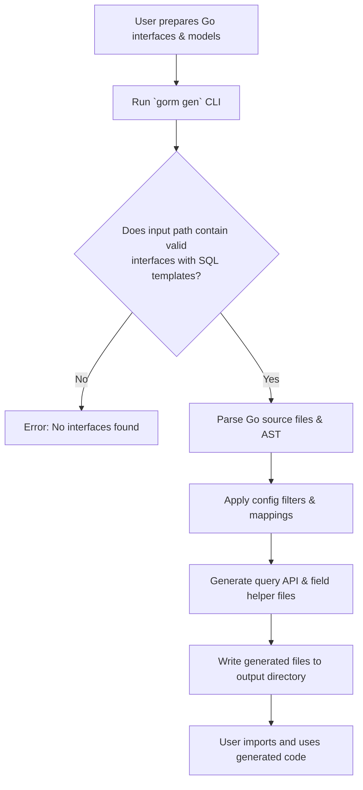

# Installation & First Generation

This guide takes you through installing the GORM CLI tool, preparing your Go project with minimal interface and model definitions, and running your first code generation. You will learn how to set up initial project structure, define the minimal input required by the generator, invoke the CLI, and verify that generation succeeds with usable output.

---

## 1. Workflow Overview

### What You Will Accomplish
- Install the GORM CLI tool
- Prepare your project with essential Go interfaces and model structs
- Execute your first code generation with the CLI
- Understand the initial generated project structure and key files

### Prerequisites
- Go 1.18 or later installed on your system
- Basic familiarity with Go modules and project layout
- An existing or new Go project containing your data model structs
- Familiarity with defining Go interfaces and struct types

### Expected Outcome
- GORM CLI installed and available as `gorm` command
- A minimal interface file with SQL template annotations for query methods
- Generated Go code comprising query API implementations and field helpers
- Output placed in a configured directory maintaining relative package structure

### Time Estimate
Approximately 15-30 minutes depending on setup and familiarity

### Difficulty Level
Beginner to Intermediate with Go tooling and code generation

---

## 2. Step-by-Step Instructions

### Step 1: Install the GORM CLI Tool

1. Ensure Go 1.18+ is installed by running:

   ```bash
   go version
   ```

2. Install the GORM CLI with:

   ```bash
   go install gorm.io/cli/gorm@latest
   ```

3. Confirm installation by checking the version or help:

   ```bash
   gorm --help
   ```

<Tip>
Using `go install` places the `gorm` binary in your `$GOPATH/bin` or `$HOME/go/bin` folder. Make sure this path is included in your system's `PATH` environment variable to run the command globally.
</Tip>

### Step 2: Prepare Your Project

1. Organize your Go model structs and interface definitions in a package or directory.

2. Define at least one Go interface with methods annotated by SQL templates in comments. For example:

   ```go
   package examples

   type Query[T any] interface {
     // SELECT * FROM @@table WHERE id=@id
     GetByID(id int) (T, error)
   }

   type User struct {
     ID   int
     Name string
     Age  int
   }
   ```

3. Optionally declare a configuration (`genconfig.Config`) in the package to customize generator behavior (output path, included structs/interfaces, field mappings).

   For initial use, this is not required.

### Step 3: Run the Code Generation CLI

1. Navigate to your project root containing the interface file(s).

2. Run the `gorm gen` command specifying the input directory and output path.

   Example:

   ```bash
   gorm gen -i ./examples -o ./generated
   ```

   - `-i, --input` points to the directory or a Go file containing your query interfaces and models
   - `-o, --output` is the directory path where generated code will be placed (default is `./g`)

3. The CLI parses your Go interfaces, extracts methods with SQL annotations, inspects your model structs, and generates type-safe query APIs and field helpers.

4. By default, the generated code reflects your original package structure under the output folder.

### Step 4: Inspect and Verify Generated Files

1. In the output directory (`./generated` above), you will see generated Go files per package.

2. Files include:
   - Query interface implementations suffixed with `Impl` types
   - Field helper variables providing strongly-typed predicates for model fields

3. Use your IDE’s Go tooling to confirm no errors, and explore the generated interfaces which wrap your SQL annotations into ready-to-use methods.

### Step 5: Integrate and Build

1. Import the generated package in your Go project.

2. Use generated APIs to perform queries or updates, benefiting from type-safety and templated SQL.

3. For example:

   ```go
   // Using generated API
   q := generated.Query[User](db)
   user, err := q.GetByID(ctx, 123)
   ```

4. Build and run your application as usual.

---

## 3. Practical Examples

### Minimal Interface Definition

```go
// file: examples/query.go

package examples

type Query[T any] interface {
  // SELECT * FROM @@table WHERE id=@id
  GetByID(id int) (T, error)
}
```

### Corresponding Model Struct

```go
// file: examples/models/user.go

package models

type User struct {
  ID   int
  Name string
  Age  int
}
```

### CLI Generation Command

```bash
gorm gen -i ./examples -o ./generated
```

### Usage of Generated API

```go
import (
  "context"
  "gorm.io/gorm"
  "myproject/generated"
  "myproject/examples/models"
)

func fetchUser(db *gorm.DB, ctx context.Context, userID int) (*models.User, error) {
  return generated.Query[models.User](db).GetByID(ctx, userID)
}
```

---

## 4. Troubleshooting & Best Practices

### Common Issues

- **Command not found after install:** Ensure your Go bin directory is in your `PATH`.
- **No generated files:** Confirm the input path `-i` points to Go files containing interfaces with SQL annotations.
- **Errors about missing return values in interface methods:** Each method with SQL must return `error` as the last value.
- **Conflicting or missing imports:** Ensure your Go files import necessary packages referenced by models or interface types.

### Tips for Success

- Keep your interface methods documented with clear SQL template comments.
- Use `@@table` and `@param` placeholders correctly.
- Start with minimal interface and models, add complexity gradually.
- Use configuration (`genconfig.Config`) to control inclusion/exclusion and output layout.
- Run `gorm gen` frequently during development to sync generated code.

### Performance Considerations

- Generation time scales with number and complexity of interfaces and models.
- Keep interfaces focused and modular for faster incremental generation.

### Alternative Workflows

- Use single-file interface declarations for small projects.
- Organize interfaces and models in packages matching your domain logic.

---

## 5. Next Steps & Related Documentation

- Continue to [Writing Type-Safe Queries from Interfaces](/guides/core-workflows/writing-type-safe-queries) for advanced SQL template usage.
- Learn how to use [Field Helpers for Filters & Updates](/guides/core-workflows/using-field-helpers) to maximize generated field APIs.
- Explore [Managing Associations with Helpers](/guides/core-workflows/association-operations) for relational data support.
- Visit [Customizing Generation via Config](/guides/advanced-usage-patterns/customizing-generation-config) to fine-tune outputs.
- Review [Installation Guide](/getting-started/welcome-and-installation/installation) and [Prerequisites & System Requirements](/getting-started/welcome-and-installation/prerequisites) to confirm your environment.

---

## Appendix: CLI Command Flags

| Flag      | Shorthand | Description                                   | Default       |
|-----------|-----------|-----------------------------------------------|---------------|
| `--input` | `-i`      | Path to Go file or directory with interfaces  | *Required*    |
| `--output`| `-o`      | Directory to write generated code             | `./g`         |

Example usage:

```bash
gorm gen -i ./examples/query.go -o ./generated
```

---

## Visual Summary of Generation Workflow



---

<Check>
Following this guide guarantees a smooth first experience installing GORM CLI, preparing your project, and generating usable code quickly.
</Check>


<Source url="https://github.com/go-gorm/cli" branch="main" paths={[{"path": "internal/gen/gen.go", "range": "8-52"},{"path": "internal/gen/generator.go", "range": "50-212"}]} />

---

