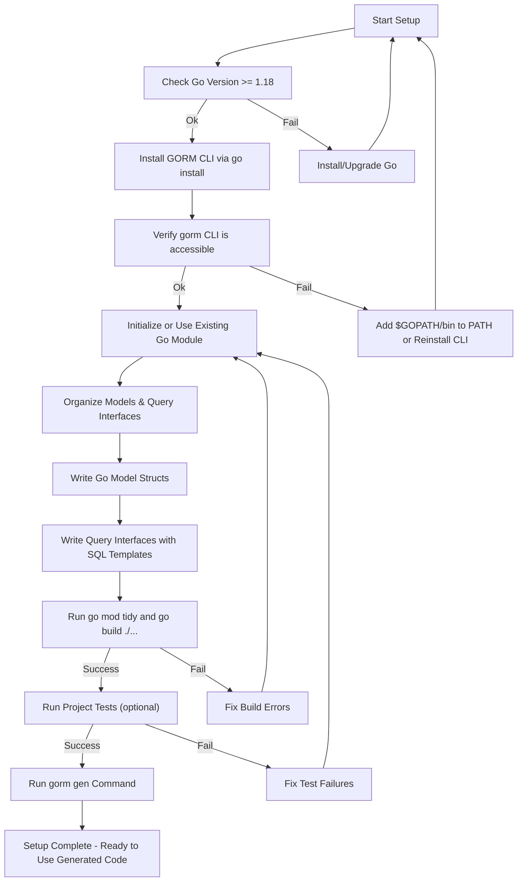

# Installation & Project Setup

This guide walks you through installing GORM CLI, configuring your Go environment, and preparing a project structure conducive to generating type-safe, fluent query APIs and field helpers using GORM CLI. Whether you are starting a new project or integrating into an existing Go module, this page ensures that you're set up correctly to leverage the full power of GORM CLI.

---

## 1. Installation Requirements & Environment Preparation

Before installing GORM CLI, ensure your environment meets the following prerequisites:

- **Go version**: 1.18 or higher is required to support generics used by GORM CLI.
- **Go environment variables**: `GOPATH` and `PATH` should be configured correctly so Go binaries are accessible from the command line.

<Check>
Confirm your Go version by running:
```bash
go version
```
You should see output similar to:
```
go version go1.18 linux/amd64
```
If not, update your Go installation before proceeding.
</Check>

---

## 2. Installing GORM CLI

Install the latest GORM CLI binary using the `go install` command:

```bash
go install gorm.io/cli/gorm@latest
```

This downloads and installs the CLI tool into your Go binary directory.

### Verify Installation

After installation, verify that `gorm` is accessible:

```bash
gorm version
```

You should see the current CLI version printed.

If you encounter any `command not found` errors, ensure your `$GOPATH/bin` is in your system's `PATH`.

---

## 3. Setting Up Your Go Project for GORM CLI

GORM CLI generates code from your Go source files reflecting your models and query interfaces. Setting up your project properly ensures smooth generation and integration.

### 3.1 Initialize or Use an Existing Go Module

If you don’t have a Go module yet, create one at your project root:

```bash
go mod init your/module/path
```

Then install GORM and GORM CLI dependencies:

```bash
go get gorm.io/gorm
go get gorm.io/cli/gorm
```

This sets up module dependencies correctly.

### 3.2 Organize Source Code

Create directories to store your model definitions and query interface code. For example:

```
/project-root
  /models
    user.go
    account.go
  /queries
    user_query.go
```

Define your GORM model structs inside `models` with standard Go syntax.

Define your query interfaces with embedded SQL templates inside `queries` or alongside models.

### 3.3 Write Compliant Model Structs

Your structs must follow Go conventions with exported fields to be detected by GORM CLI generators.

Example model:

```go
package models

type User struct {
    ID        uint
    Name      string
    Age       int
    Role      string
    IsAdult   bool
}
```

### 3.4 Define Query Interfaces with Embedded SQL Templates

Create interfaces that describe queries with SQL in method comments, like:

```go
package queries

type UserQuery[T any] interface {
  // SELECT * FROM @@table WHERE id=@id
  GetByID(id int) (T, error)

  // WHERE name=@name AND age=@age
  FilterByNameAndAge(name string, age int) Query[T]
}
```

This approach enables GORM CLI to create type-safe, ready-to-use implementations.

---

## 4. Running Sanity Checks

After you organize your sources, it's important to test that your setup is valid before generating code.

### 4.1 Verify Go Module and Imports

Run:

```bash
go mod tidy
```

Check for errors and ensure your project builds:

```bash
go build ./...
```

Fix any compilation issues before proceeding.

### 4.2 Run Tests (Optional but Recommended)

If your project contains tests, run them to verify no failures:

```bash
bash scripts/test_all.sh
```

This script runs tests in the root and example modules to validate correctness.

---

## 5. Integrating GORM CLI Code Generation Into Your Workflow

Once your environment and project are prepared, you can integrate generation steps using the CLI's `gen` command.

Example command:

```bash
gorm gen -i ./queries -o ./generated
```

- `-i` specifies the input directory containing your query interfaces.
- `-o` specifies the output directory for generated code.

You can automate this step in your build pipeline or IDE.

---

## 6. Best Practices & Tips

- Use a **consistent directory structure** for models and queries to simplify generator configuration.
- **Keep your query interface comments up to date**, as they drive the SQL templates for generation.
- Use environment variables like `DEBUG=true` in tests to enable verbose SQL logging and troubleshooting.
- Validate your Go project compiles and tests pass before running code generation.
- For customizing generation, declare a package-level `genconfig.Config` variable in your packages.

---

## 7. Troubleshooting Common Setup Issues

<AccordionGroup title="Common Setup Issues">
<Accordion title="Go Module Not Initialized or Misconfigured">
Ensure you have run `go mod init` and your `go.mod` file exists. Run `go mod tidy` to fix dependencies.
</Accordion>
<Accordion title="GORM CLI Not Found After Installation">
Verify that your `$GOPATH/bin` is in your system `PATH`. Reinstall using `go install gorm.io/cli/gorm@latest` if needed.
</Accordion>
<Accordion title="Build Errors Due to Missing Dependencies">
Run `go mod tidy` and `go get gorm.io/gorm` to resolve missing dependencies.
</Accordion>
<Accordion title="Templates Not Being Parsed in Query Interfaces">
Ensure SQL templates are correctly formatted in interface method comments with proper placeholder syntax.
</Accordion>
</AccordionGroup>

---

## 8. Next Steps & Resources

- Proceed with [Generating Your First Code](/guides/getting-started/first-generation) after setup.
- Explore [Using the Generated APIs](/guides/getting-started/using-generated-apis) to integrate generated code.
- Customize your generation with [Basic Generator Configuration](/getting-started/troubleshooting-configuration/basic-configuration).
- Review [Troubleshooting Common Issues](/guides/real-world-patterns/troubleshooting-common-issues) for detailed problem-solving.

Refer back to system requirements and CLI installation basics as needed.

---

## Summary Diagram of Setup Workflow



---

By following the steps outlined here, you will have a fully prepared environment and project setup, enabling seamless use of GORM CLI’s powerful code generation capabilities.

---

<Info>
For complete onboarding, continue with guides on [Generating Your First Code](/guides/getting-started/first-generation) and [Using the Generated APIs](/guides/getting-started/using-generated-apis).
</Info>
