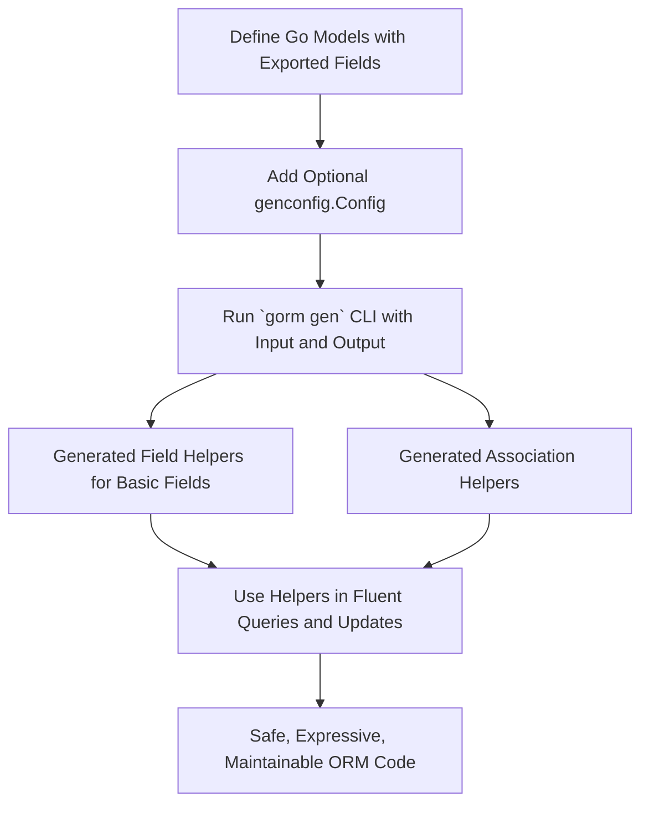

# Building Model-Driven Field Helpers

This guide helps you generate and use strongly-typed field helpers based on your Go model structs. These helpers enable expressive, compile-safe operations for filtering, updating, ordering, and managing associations in GORM queries. By following this workflow, you gain precise control and discoverability when interacting with your database through generated, type-safe code.

---

## 1. Workflow Overview

### Task Description
Generate model-driven field helpers that provide strongly-typed predicates, setters, and association operations derived directly from your Go structs. This empowers you to write fluent, safe, and maintainable database queries and updates.

### Prerequisites
- Go 1.18+ with generics support installed
- GORM installed and configured in your project
- Defined Go model structs representing your database schema
- The GORM CLI tool installed (`gorm.io/cli/gorm`)
- Your project organized so the generator can scan the model definitions

### Expected Outcome
You will produce a generated Go file containing field helpers for each model struct. These helpers include:
- Typed fields for filtering and ordering (e.g., `generated.User.Name.Eq('alice')`)
- Setters for updates and creations (e.g., `generated.User.Age.Set(30)`)
- Association helpers to create, update, unlink, or delete related records safely

### Time Estimate
Approximately 10-30 minutes, depending on existing project setup and model complexity.

### Difficulty Level
Intermediate — requires familiarity with Go, GORM, and basic CLI usage.

---

## 2. Step-by-Step Instructions

<Steps>
<Step title="Step 1: Define Your Model Structs">
Ensure your Go models are properly defined with exported fields. Each field represents a column in your database.

```go
// models/user.go
package models

type User struct {
    ID        uint
    Name      string
    Age       int
    Role      string
    IsAdult   bool
    Score     sql.NullInt64
    CreatedAt time.Time
    // Associations
    Pets      []Pet
    Account   Account
}
```

**Expected Result:** Your models accurately reflect your database schema.
</Step>

<Step title="Step 2: (Optional) Configure Generation with genconfig.Config">
Create a package-level `genconfig.Config` variable to customize code generation.

You can specify:
- Output path override
- Field type and name mappings (e.g., mapping `sql.NullTime` to `field.Time`)
- Inclusion or exclusion filters for interfaces and structs

Example:

```go
package examples

import (
    "database/sql"
    "gorm.io/cli/gorm/genconfig"
    "gorm.io/cli/gorm/field"
)

var _ = genconfig.Config{
    OutPath: "examples/output",
    FieldTypeMap: map[any]any{
        sql.NullTime{}: field.Time{},
    },
    FieldNameMap: map[string]any{
        "json": JSON{}, // Custom JSON helper
    },
}
```

**Expected Result:** Customized generation settings are recognized by the CLI.
</Step>

<Step title="Step 3: Run the GORM CLI Generator">
Use the `gorm gen` command to generate your field helpers.

```bash
gorm gen -i ./path/to/your/models -o ./generated
```

- `-i`: Input path to your Go files
- `-o`: Output directory for generated code (optional)

**Expected Result:** The generator scans your models and creates strongly-typed field helpers.
</Step>

<Step title="Step 4: Import and Use Generated Field Helpers in Your Code">
Import the generated package and use the field helpers for fluent querying.

Example filtering users older than 18 and active:

```go
import generated "path/to/generated"

users, err := gorm.G[models.User](db).
    Where(
        generated.User.Age.Gt(18),
        generated.User.Role.Eq("active"),
    ).
    Find(ctx)
```

Example updating a user's role:

```go
rows, err := gorm.G[models.User](db).
    Where(generated.User.Name.Eq("bob")).
    Set(generated.User.Role.Set("active")).
    Update(ctx)
```

**Expected Result:** Queries and updates are type-safe and expressive using generated helpers.
</Step>

<Step title="Step 5: Work With Association Helpers">
Use the generated association helpers for linked records.

Examples:

- Create and associate a new Pet when creating a User:

```go
gorm.G[models.User](db).
  Set(
    generated.User.Name.Set("alice"),
    generated.User.Pets.Create(generated.Pet.Name.Set("fido")),
  ).
  Create(ctx)
```

- Unlink a Pet from a User:

```go
gorm.G[models.User](db).
  Where(generated.User.ID.Eq(1)).
  Set(generated.User.Pets.Unlink()).
  Update(ctx)
```

**Expected Result:** Association operations safely manage related data with compile-time checks.
</Step>
</Steps>

---

## 3. Examples & Code Samples

### Basic Field Helpers

```go
// Predicates
generated.User.ID.Eq(1)              // id = 1
generated.User.Name.Like("%jinzhu%") // name LIKE '%jinzhu%'
generated.User.Age.Between(18, 65)    // age BETWEEN 18 AND 65

// Updates
gorm.G[User](db).
  Set(
    generated.User.Name.Set("jinzhu"),
    generated.User.Age.Incr(1),
  ).
  Update(ctx)
```

### Association Helpers

```go
// Create with association
gorm.G[User](db).
  Set(
    generated.User.Name.Set("alice"),
    generated.User.Pets.Create(generated.Pet.Name.Set("fido")),
  ).
  Create(ctx)

// Update linked pet
gorm.G[User](db).
  Where(generated.User.ID.Eq(1)).
  Set(
    generated.User.Pets.Where(generated.Pet.Name.Eq("fido")).
      Update(generated.Pet.Name.Set("rex")),
  ).
  Update(ctx)

// Delete associated pets
gorm.G[User](db).
  Where(generated.User.ID.Eq(1)).
  Set(generated.User.Pets.Delete()).
  Update(ctx)
```

### Custom JSON Field Helper

If configured, you can use custom helpers for JSON fields:

```go
// JSON equals
gorm.G[models.User](db).
  Where(generated.User.Profile.Equal("$.vip", true)).
  Take(ctx)
```

This generates database-specific JSON operations under the hood.

---

## 4. Troubleshooting & Tips

<AccordionGroup title="Common Issues">
<Accordion title="Generated Code Not Found or Empty">
- Ensure your model files are in the input path provided to `gorm gen -i`.
- Confirm that your structs are exported (start with uppercase).
- Check that any package-level `genconfig.Config` is correctly declared.
- Verify your Go module setup and directory permissions.
</Accordion>
<Accordion title="Field Helpers Missing for Certain Fields">
- Confirm whether those fields have non-exported names or unsupported types.
- Use `FieldTypeMap` in `genconfig.Config` to map custom Go types to supported helper types.
- For fields with `gen` tags, use `FieldNameMap` to specify custom helpers.
</Accordion>
<Accordion title="Association Helpers Not Generated">
- Verify your model associations use recognized GORM patterns (`has many`, `belongs to`, etc.).
- Associations must be exported fields with pointer/slice types.
- Check that your models and associations compile correctly before generation.
</Accordion>
</AccordionGroup>

<Tip>
When updating with zero values (e.g., empty strings, false booleans), always use the generated `Set()` methods to explicitly set those values; otherwise, they may be ignored by GORM's default behavior.
</Tip>

<Tip>
Use the generated helpers for predicate chaining instead of raw strings to enjoy compile-time safety and IDE autocomplete. This reduces runtime errors and helps maintainable queries.
</Tip>

---

## 5. Next Steps & Related Content

- **Generating Type-Safe Query APIs:** Learn to define query interfaces with SQL templates to generate type-safe query methods ([See guide](https://docs.example.com/guides/getting-started/generate-type-safe-apis)).
- **Managing Associations:** Discover detailed use cases for creating, linking, updating, and unlinking associations using generated helpers ([See guide](https://docs.example.com/guides/real-world-usage-patterns/working-with-associations)).
- **Customizing Generation:** Explore `genconfig.Config` deeper to tailor output paths, field mappings, and selective generation ([See guide](https://docs.example.com/guides/advanced-customization/generation-config)).
- **Troubleshooting Help:** If you face setup or generation difficulties, review the common issues and fixes ([See guide](https://docs.example.com/getting-started/troubleshooting-help/common-issues)).

---

# Summary Diagram

