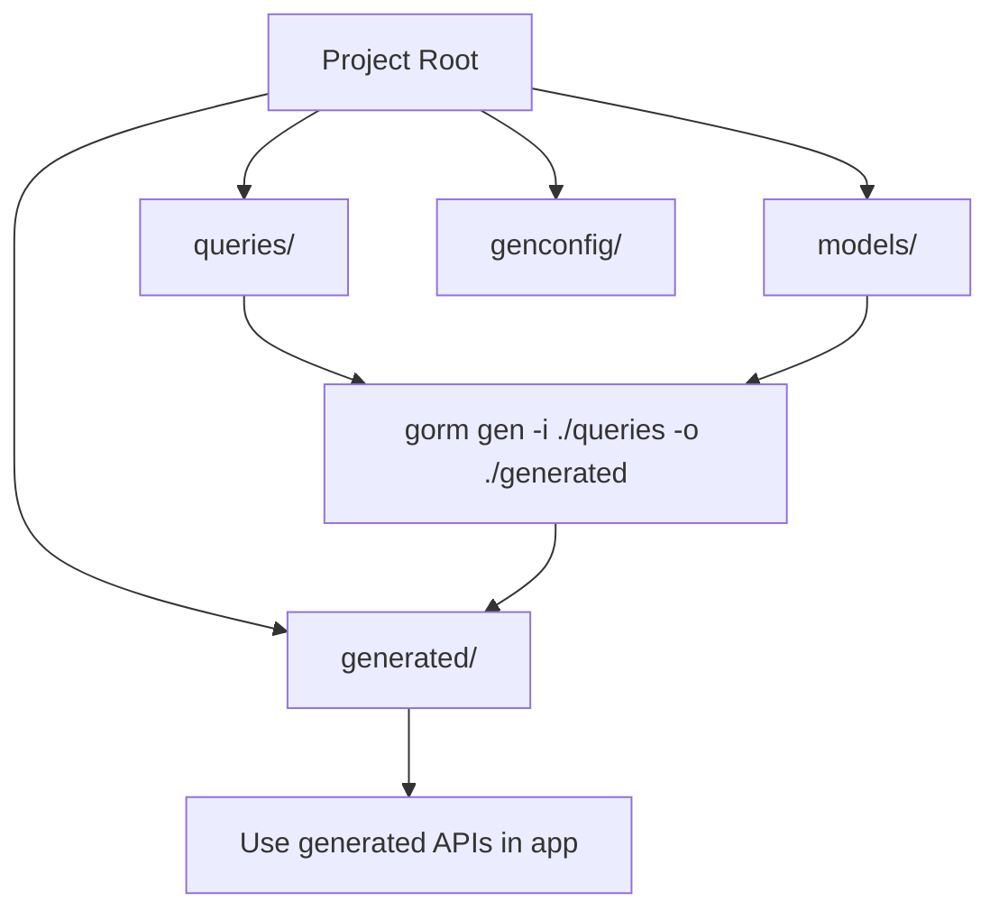

# Recommended Project Structure and Workflow

Efficient project organization is key to maintaining clarity, scalability, and ease of generation when working with GORM CLI for Go projects. This guide explains best practices for structuring your models, query interface files, configuration, and the output from the generator, ensuring your codebase remains maintainable and intuitive as it grows.

---

## Workflow Overview

### What This Guide Helps You Accomplish
This guide helps you set up a clean and maintainable directory layout for your GORM CLI project. You'll learn how to organize:
- Your Go model structs
- Query interfaces with embedded SQL templates
- Optional generation configuration via `genconfig.Config`
- Generated output code

The goal is to enable seamless code generation, easy browsing, and logical separation between source definitions and generated artifacts.

### Prerequisites
- Familiarity with Go module and package basics
- A Go project using GORM
- Models and interface definitions prepared with embedded SQL templates
- GORM CLI tool installed and working

### Expected Outcome
Following this guide, you will have an organized project structure that:
- Clearly separates source files and generated code
- Uses configuration files to customize generation where needed
- Supports scalable code generation for growing projects

### Time Commitment
5-15 minutes for initial setup.

### Difficulty Level
Beginner to Intermediate.

---

## Recommended Project Layout

Keep your project organized with clear separation between **source** and **generated** code, and logically group models and query interface files.

### Suggested Directory Tree

```plaintext
/myproject
├── models              # Your domain model structs
│   ├── user.go
│   └── pet.go
├── queries             # Query interfaces with SQL templates
│   ├── user_query.go
│   └── pet_query.go
├── genconfig           # Optional configuration packages
│   ├── config.go
│   └── filters.go
├── generated           # Generated code output
│   ├── user_gen.go
│   └── pet_gen.go
├── main.go             # Your application entry point
└── go.mod
```

### Explanation

- **models/**: Contains your model struct definitions. These are your domain data types that GORM will map to database tables.

- **queries/**: Holds your interface definitions with embedded SQL templates as comments. These interfaces drive the generation of type-safe query APIs.

- **genconfig/**: Contains optional `genconfig.Config` files to customize generation behavior per package or directory (e.g., output paths, field mappings, excludes).

- **generated/**: This is the default or configured output directory for generated code. It is separate from your source code to avoid confusion and manual edits.

- **main.go**: The entry point of your app, where you may invoke the generator during development or run your service.

---

## How the Generator Fits In

Use the `gorm gen` command from your project root or relevant directory:

```bash
gorm gen -i ./queries -o ./generated
```

- `-i` points to the input directory containing your query interfaces.
- `-o` defines the output folder for the generated Go files.

The generator will parse the interfaces, apply optional `genconfig.Config` customization, and produce type-safe query APIs and field/method helpers.

---

## Configuration Best Practices

### Where to Place `genconfig.Config`

- Place configuration variables at the package level inside the `genconfig` package or relevant packages where models or queries reside.
- Example: `genconfig.Config` declaration in `genconfig/config.go` or in the package containing your queries/models.

### What to Configure

- **OutPath**: Override default generated code output paths. For example, keeping generated code under `./generated`.
- **FileLevel**: Control whether configuration applies per file or by package subtree.
- **Include/Exclude Filters**: Limit generation to specific interfaces/structs by name patterns or Go type literals.
- **FieldTypeMap/FieldNameMap**: Customize how fields are mapped to generated helpers.

### Example Config

```go
package genconfig

import "gorm.io/cli/gorm/genconfig"

var _ = genconfig.Config{
    OutPath: "generated",
    FileLevel: false,
    IncludeInterfaces: []any{"Query*"},
    ExcludeInterfaces: []any{"*Deprecated*"},
    FieldNameMap: map[string]any{
        "json": JSON{}, // Example of custom JSON field helper
    },
}
```

---

## Key Workflow Steps

### 1. Define Your Models

Create Go structs in `models/`. Include any necessary struct tags for GORM or generation.

```go
package models

type User struct {
    ID   uint
    Name string
    Age  int
}
```

### 2. Define Query Interfaces

In the `queries/` directory, write interface(s) with SQL templates in comments.

```go
package queries

type UserQuery[T any] interface {
    // SELECT * FROM @@table WHERE id=@id
    GetByID(id int) (T, error)

    // where("name=@name AND age>@age")
    FilterByNameAndAge(name string, age int)
}
```

### 3. (Optional) Add Configuration

Add or customize a `genconfig.Config` package-level variable as needed to control output path, filters, or custom mappings.

### 4. Run the Generator

Execute the generator from your project root or relevant directory:

```bash
gorm gen -i ./queries -o ./generated
```

This creates generated query APIs and field helpers mirroring your interfaces and model fields.

### 5. Use Generated Code

Import your generated packages and use the fluent, type-safe APIs.

```go
import "myproject/generated"

user, err := generated.UserQuery[models.User](db).GetByID(ctx, 123)
```

---

## Common Patterns and Tips

- **Keep queries and models closely related but in separate folders.** This separation helps scale your project and makes it easier to find code.
- **Use package-level `genconfig.Config` files for overrides and custom field mapping.** They can control granular config like which interfaces to generate.
- **Maintain the `generated/` folder as a clean output directory.** Do not edit generated files manually.
- **Check generated output often during development to ensure generation behaves as expected.**
- **Use filters in `genconfig.Config` to exclude deprecated or experimental interfaces from generation.**

---

## Troubleshooting

<AccordionGroup title="Troubleshooting Common Issues">
<Accordion title="Generated files not appearing in output directory">
Ensure that the output directory specified with `-o` exists or is writable. The generator creates missing directories but permission issues can block it. Check your `genconfig.Config` overrides for `OutPath` that may send output elsewhere.
</Accordion>
<Accordion title="Some interfaces or structs are not generated">
Verify your include/exclude filters in `genconfig.Config`. Filters override generation scope. Empty include filters exclude everything except what matches.
</Accordion>
<Accordion title="Generation fails with parse errors on interfaces">
Check that your interface method signatures comply with expected constraints:
- Must return error as the last or only return value
- No more than two return values
- SQL templates must be valid and parsable
</Accordion>
<Accordion title="Unexpected import or package path issues in generated code">
Ensure your Go packages have proper `package` declarations and `go.mod` is set up correctly. Avoid circular imports in source that affect generation.
</Accordion>
</AccordionGroup>

---

## Summary

This guide presented the recommended practices for organizing your project when using GORM CLI. By separating models, queries, and generated code into clearly defined directories, and optionally adding configuration where needed, your codebase will remain clean, scalable, and easy to maintain.

Remember to run the generator from the directory containing your interfaces using the `-i` flag and direct output to a dedicated folder for generated code using the `-o` flag or config overrides. Regularly verify your generated code aligns with expectations to maintain smooth workflows.

---

## Next Steps and Related Content

- **[Generating Your First Query API & Field Helpers](https://gorm.io/cli/guides/getting-started/first-generation)** — Learn how to write your first interfaces and generate their APIs.
- **[Configuration and Customization](https://gorm.io/cli/getting-started/first-run/configuration-setup)** — Explore more configuration options for tailoring generation.
- **[Handling Associations](https://gorm.io/cli/guides/core-workflows/working-with-associations)** — Advance your generated code by mastering association helpers.
- **[Quick Start Guide](https://gorm.io/cli/getting-started/first-run/quickstart-sample)** — For a full end-to-end quick start including this structure.


---

## Visualizing the Workflow



This diagram shows how your source models and query interfaces flow through the generator to produce generated code consumable by your app.


---

## Example

Here is a minimal concrete example of the project structure and relevant files:

```plaintext
/myproject
├── models
│   └── user.go
├── queries
│   └── user_query.go
├── genconfig
│   └── config.go
├── generated
│   └── user_gen.go
└── main.go
```

`models/user.go`:

```go
package models

type User struct {
    ID   uint
    Name string
    Age  int
}
```

`queries/user_query.go`:

```go
package queries

type UserQuery[T any] interface {
    // SELECT * FROM @@table WHERE id=@id
    GetByID(id int) (T, error)
}
```

`genconfig/config.go`:

```go
package genconfig

import "gorm.io/cli/gorm/genconfig"

var _ = genconfig.Config{
    OutPath: "generated",
    IncludeInterfaces: []any{"UserQuery*"},
}
```

Run the generator:

```bash
gorm gen -i ./queries -o ./generated
```

The generated API will appear in `generated/user_gen.go`, ready for use.


<Tip>
Organizing your project thoughtfully saves time troubleshooting and lets you focus on building features with confidence using GORM CLI’s powerful generated APIs.
</Tip>

---

For more examples and advanced usage, review the [examples directory in the GORM CLI repository](https://github.com/go-gorm/cli/tree/main/examples).

---

# End of Guide
