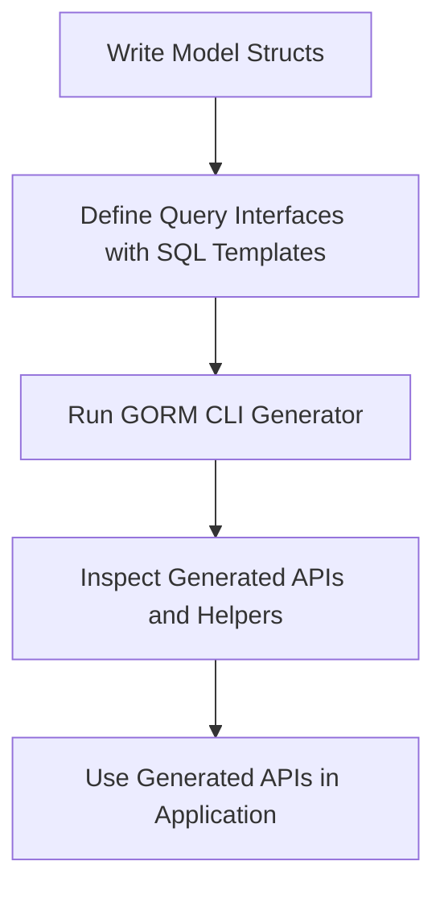

# Quickstart: Generate Type-Safe APIs

A practical walkthrough guiding you through creating query interfaces and model structs, running the GORM CLI code generator, and using the generated type-safe query and field helper APIs within your Go project.

---

## 1. Introduction

GORM CLI streamlines database interactions by generating type-safe, fluent query APIs and field helpers based on your Go interfaces with SQL templates and your model structs. This guide helps you quickly go from writing your initial interfaces and models to running the generator and accessing the generated code seamlessly.

## 2. Prerequisites

Before starting this quickstart, ensure you have:

- Go 1.18 or later installed (required for generics).
- A Go project with GORM integrated (`gorm.io/gorm`).
- GORM CLI installed (`go install gorm.io/cli/gorm@latest`).
- Basic familiarity with defining Go structs and interfaces.

## 3. Workflow Overview

- **Task**: Define query interfaces with raw SQL annotations and models, generate type-safe APIs, and invoke those APIs in your code.
- **Time Estimate**: About 15 minutes to complete the entire flow.
- **Difficulty Level**: Beginner to intermediate.
- **Expected Outcome**: You will have compiled, type-safe query interfaces and field helpers generated, ready to use in your Go application.

---

## 4. Step-by-Step Instructions

### Step 1: Define Your Model Struct(s)

Create Go structs that represent your database models. For example, define a `User` struct:

```go
// examples/models/user.go
package models

import "gorm.io/gorm"

// User defines the user model
// Fields map to database columns
type User struct {
    gorm.Model
    Name string
    Age  int
}
```

### Step 2: Create Query Interface with SQL Templates

Define an interface with method signatures for your queries, annotating them with SQL templates in comments.

```go
// examples/query.go
package examples

import "gorm.io/cli/gorm/examples/models"

// Query defines type-safe query methods for generic type T
// SQL templates use placeholders like @@table and @param
// Example methods:
type Query[T any] interface {
  // SELECT * FROM @@table WHERE id=@id
  GetByID(id int) (T, error)

  // Dynamic filter by column and value
  // SELECT * FROM @@table WHERE @@column=@value
  FilterWithColumn(column string, value string) (T, error)

  // Filtering by multiple users example
  Filter(users []models.User) ([]T, error)

  // More methods with conditions and updates
}
```

**Tips:**
- Use `@@table` to refer to the model's table.
- Use `@param` to bind Go method parameters.
- Use the provided SQL DSL for conditional queries.

### Step 3: Run the Code Generator

With your model and query interface ready, generate the APIs by running the GORM CLI generator.

```bash
# Run from your project root, specifying input interface and output directory
gorm gen -i ./examples -o ./examples/generated
```

- `-i` points to your interface file or directory containing interfaces.
- `-o` specifies where the generated Go files will be placed.

### Step 4: Inspect the Generated Code

Look in `./examples/generated` for generated query and field helper files. They provide:

- Fluent, type-safe query methods on `generated.Query[User](db)`.
- Field helpers for filters, predicates, updates on `generated.User`.

### Step 5: Use the Generated APIs in Your Application

Invoke generated methods in your application with full type-safety and IDE completion.

```go
package main

import (
  "context"
  "fmt"
  "gorm.io/gorm"
  "examples/generated"
  "examples/models"
)

func main() {
  ctx := context.Background()
  db := setupDB() // your initialized *gorm.DB

  // Query by ID
  user, err := generated.Query[models.User](db).GetByID(ctx, 123)
  if err != nil {
    panic(err)
  }
  fmt.Println("User:", user)

  // Filter with dynamic column
  u, err := generated.Query[models.User](db).FilterWithColumn(ctx, "name", "jinzhu")

  // Use field helper predicates in more advanced queries
  users, err := gorm.G[models.User](db).
    Where(generated.User.Age.Gt(18)).
    Find(ctx)

  fmt.Println(users)
}
```

---

## 5. Examples

### Simple Query Interface

```go
// Query interface with SQL annotation
// SELECT * FROM @@table WHERE id=@id
GetByID(id int) (T, error)
```

### Generated Usage Example

```go
u, err := generated.Query[User](db).GetByID(ctx, 123)
```

### Model-Driven Field Helper Example

```go
// Filter users older than 18
users, err := gorm.G[User](db).Where(generated.User.Age.Gt(18)).Find(ctx)
```

---

## 6. Best Practices & Tips

- Place your query interfaces and model structs close in the same package for easier generation.
- Use descriptive SQL templates with `%` and `AND`/`OR` conditions effectively.
- Run the generator often during development to keep APIs in sync.
- Customize generation with `genconfig.Config` if you have advanced needs.

## 7. Troubleshooting Common Issues

- **No code generated:** Ensure the input path is correct and contains interfaces with SQL annotations.
- **Build errors in generated code:** Check your Go code syntax and Go version compatibility.
- **Generation not picking interfaces:** Use `IncludeInterfaces` in `genconfig.Config` to specify patterns.

---

## 8. Next Steps

- Learn about [Using the Generated APIs in Your Project](/guides/getting-started/using-generated-apis) for advanced usage patterns.
- Explore [Mastering the SQL Template DSL](/guides/advanced-usage-patterns/template-dsl-and-sql-templates) to write powerful SQL templates.
- Configure custom field helpers like JSON types in [Custom Field Helpers](/guides/advanced-usage-patterns/custom-field-helpers).

---

## 9. Additional Resources

For more detailed information on the full GORM CLI workflow, configuration options, and troubleshooting tips, consult the following documentation:

- [Running Code Generation CLI Commands](/getting-started/project-configuration-run/generation-cli-commands)
- [Validating Generated Code](/getting-started/project-configuration-run/validating-generated-code)
- [Common Errors & Solutions](/getting-started/troubleshooting-faq/common-errors-solutions)

View the full example source code for practical reference:

- Query interface: [`examples/query.go`](https://github.com/go-gorm/cli/blob/main/examples/query.go)
- Model structs: [`examples/models/user.go`](https://github.com/go-gorm/cli/blob/main/examples/models/user.go)

---

<AccordionGroup title="Quickstart Workflow Diagram">
<Accordion title="GORM CLI Quickstart Flow">

</Accordion>
</AccordionGroup>


---

<Note>
This guide focuses on getting you started with your first generation of type-safe APIs using GORM CLI. It does not cover advanced configuration or complex association helpers, which you can explore further in the Guides section.
</Note>
