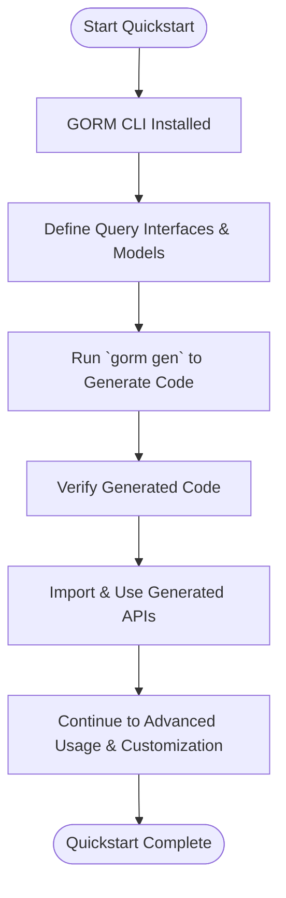

# Quickstart: Generate Type-Safe APIs

## Workflow Overview

### Task Description
This guide leads you through the essential journey of generating and using type-safe, fluent query APIs with GORM CLI. Starting from installation confirmation, it walks you through defining query interfaces and models, running the code generator, and ultimately using the generated APIs to perform database operations with compile-time safety.

### Prerequisites
- GORM CLI installed and available in your system PATH (Go 1.18+ required).
- A Go project setup with your query interfaces (annotated with SQL templates) and GORM model structs.
- Basic familiarity with Go generics and GORM ORM.

### Expected Outcome
By completing this guide, you will have:
- Generated Go code that provides type-safe query interfaces and model-based field helpers.
- Integrated these generated APIs in your code to build fluent, boilerplate-free queries.
- Gained confidence in harnessing GORM CLI’s core value: generating safe, maintainable database access code instantly.

### Time Estimate
Approximately 15–30 minutes depending on environment setup and familiarity with Go and GORM.

### Difficulty Level
Beginner to Intermediate: No prior GORM CLI experience required but basic Go and ORM knowledge needed.

---

## Step-by-Step Instructions

### Step 1: Confirm GORM CLI Installation

- Run the following to ensure GORM CLI is installed:

  ```bash
  gorm --version
  gorm --help
  ```

- Successful output confirms you can proceed. If not, see the [Installation Guide](/getting-started/setup-basics/installation).

<Check>
Ensure your Go version is 1.18 or higher, as GORM CLI requires generics support.
</Check>

---

### Step 2: Define Your Query Interfaces and Models

Establish annotated query interfaces and define your GORM model structs in your project package or directory.

- **Write Query Interfaces:** Use Go interfaces with methods commented with SQL templates leveraging GORM CLI’s DSL.

```go
// examples/query.go
package examples

type Query[T any] interface {
  // SELECT * FROM @@table WHERE id=@id
  GetByID(id int) (T, error)

  // where("name=@name AND age=@age")
  FilterByNameAndAge(name string, age int)
}
```

- **Define Models:** Create your Go structs representing database tables.

```go
// examples/models/user.go
package models

type User struct {
  ID   uint
  Name string
  Age  int
}
```

<Tip>
Organize interfaces and models cohesively—preferably in the same package—to simplify generation.
</Tip>

---

### Step 3: Run the Code Generator

Use the GORM CLI to generate typesafe query APIs and model helpers.

```bash
gorm gen -i ./examples -o ./generated
```

Parameters:
- `-i`: Path to your Go interface file or package directory containing SQL templates.
- `-o`: Output directory to place generated code. Default is `./g` if omitted.

Expected Behavior:
- CLI scans interfaces and models in the input path.
- Generates corresponding query API implementations and field helpers.
- Outputs generated `.go` files under the specified output directory.

<Check>
If you encounter errors at this stage, verify interface syntax, input path accuracy, and ensure Go code compiles without errors.
</Check>

---

### Step 4: Import and Use Generated APIs

In your application code, import the generated package and use the fluent, type-safe interfaces.

Example usages:

```go
import (
  "context"
  "gorm.io/gorm"
  "yourmodule/generated"
  "yourmodule/examples/models"
)

func exampleUsage(db *gorm.DB, ctx context.Context) error {
  // Fetch a user by ID with type safety
  user, err := generated.Query[models.User](db).GetByID(ctx, 123)
  if err != nil {
    return err
  }

  // Filter users by name and age using generated API
  users, err := generated.Query[models.User](db).FilterByNameAndAge("alice", 30).Find(ctx)
  return err
}
```

This illustrates how the generated `Query` interface provides methods with safely bound parameters and fluent chaining.

---

### Step 5: Explore and Extend

- Experiment with advanced SQL template features (conditional clauses, iteration) for flexible queries.
- Utilize generated model field helpers for filters, updates, and association operations.
- Customize generation with `genconfig.Config` to tailor output.

---

## Practical Examples

### Example: Annotated Interface Method with Conditional SQL

```go
// QueryWith dynamic filtering
// SELECT * FROM @@table
// {{where}}
//   {{if user.Name != ""}} name=@user.Name {{end}}
//   {{if user.Age > 0}} AND age=@user.Age {{end}}
// {{end}}
QueryWith(user models.User) (T, error)
```

Generated implementation will safely handle parameter binding and conditionally include WHERE clauses based on input struct fields.

### Example: Using Generated Field Helpers in GORM Queries

```go
users, err := gorm.G[models.User](db).
  Where(generated.User.Age.Gt(18)).
  Find(ctx)
```

Here `generated.User.Age.Gt(18)` is a generated predicate representing `age > 18` used fluently with GORM.

---

## Troubleshooting & Tips

<AccordionGroup title="Common Issues and Resolutions">
<Accordion title="Code Generation Fails with Missing Interfaces or Models">
Verify that your input directory or file correctly contains your query interfaces with SQL template comments and GORM model structs. The generator requires correct syntax and no compile errors.
</Accordion>
<Accordion title="Generated Code Does Not Compile">
Ensure your Go environment is clean and all dependencies are installed. Check for naming collisions or missing packages in your project.
</Accordion>
<Accordion title="Methods Not Found or Unexpected Signature in Generated Code">
Confirm that your interface methods have properly formatted SQL template annotations and well-defined parameters for resolving bindings.
</Accordion>
<Accordion title="Database Queries Fail at Runtime Despite Generation Success">
Usage errors often stem from misunderstandings of generated field helpers or API contracts. Confirm correct context propagation and query construction.
</Accordion>
</AccordionGroup>

<Tip>
Always generate your code afresh after changing interfaces or models to keep the generated artifacts in sync.
</Tip>

<Tip>
Use SQL template DSL features like `{{where}}`, `{{set}}`, and `{{if}}` to write concise, reusable query templates.
</Tip>

---

## Next Steps & Related Content

- Proceed to [Setting Up Your Project](/getting-started/first-codegen/project-setup) for organizing interfaces and models at scale.
- Explore [Generating Code with GORM CLI](/getting-started/first-codegen/generating-code) for detailed CLI usage.
- Learn [Using Your Generated APIs](/getting-started/first-codegen/using-generated) for practical application.
- Troubleshoot common issues in [Basic Troubleshooting](/getting-started/first-codegen/basic-troubleshooting).
- Deepen your understanding by visiting [Core Concepts & Terminology](/overview/intro-value-core/core-concepts-terminology) and [Feature Highlights](/overview/architecture-workflow-integration/quick-feature-overview).

---

## Diagram: Overview of Quickstart Workflow



---

## Summary
This quickstart guide empowers you to generate and integrate type-safe query APIs using GORM CLI. It emphasizes a hands-on approach to start with minimal setup and scale toward fluent, maintainable database access code.

---

# Appendix: Reference Code Snippet for Interface

```go
package examples

// Query[T any] is an example query interface with SQL template annotations
// generating type-safe methods for GORM CLI.
type Query[T any] interface {
  // SELECT * FROM @@table WHERE id=@id
  GetByID(id int) (T, error)

  // where("name=@name AND age=@age")
  FilterByNameAndAge(name string, age int)
}
```


---

# Additional Resources
- [Official GORM CLI GitHub](https://github.com/go-gorm/cli)
- [Getting Started Guide: Prerequisites & Installation](/getting-started/setup-basics/installation)
- [Code Generation Examples and Templates](/getting-started/first-codegen/generating-code)


---

# Contact and Feedback
For questions or feedback on the Quickstart workflow, please open an issue on the project repository or consult the community forums.


