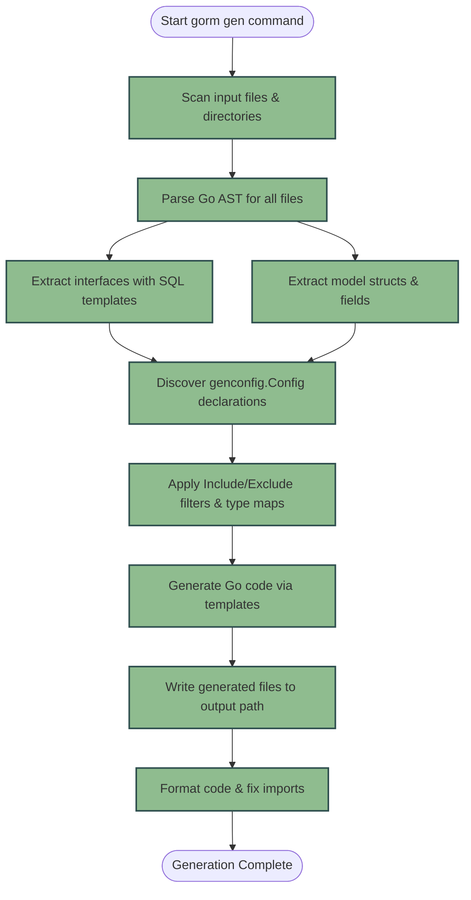

# How Code Generation Works

Understanding how GORM CLI generates your type-safe query APIs and model-driven field helpers brings clarity, empowers effective troubleshooting, and opens doors for advanced customization. This guide walks you through the core mechanics of the generation process: how your source Go files are scanned and interpreted, how the CLI identifies interfaces and models, and how it produces the generated code that integrates seamlessly with your GORM projects.

---

## Workflow Overview

### What This Page Helps You Achieve
This guide explains the behind-the-scenes workflow of GORM CLI's code generator, focusing exclusively on the generation lifecycle for your Go interface and model files. By following this, you'll understand how your raw Go code transforms into ready-to-use, type-safe query APIs and field helpers.

### Prerequisites
- Basic familiarity with Go interfaces and structs
- Knowledge of writing query interfaces with SQL template annotations
- Understanding of project file structure containing models and query interfaces
- GORM CLI installed and basic usage experience (see [Installing GORM CLI](/getting-started/setup-basics/installation))

### Expected Outcome 
After reading this guide, you will:
- Grasp how GORM CLI parses your Go source files
- Know how interfaces and structs are processed into templates
- Understand the generation lifecycle including configuration application and output writing
- Be better equipped to debug generation issues or tweak generation behavior using configs

### Time Estimate
~10-15 minutes reading plus practical review of your project source files with code generation runs

### Difficulty Level
Intermediate – it’s intended for users who want more than just usage instructions and want insight into the generation internals

---

## Step-by-Step Generation Process

### 1. Input Processing: Scanning Your Go Source Files

- When you run the generation command (`gorm gen -i ./path/to/interfaces -o ./generated`), the CLI begins by scanning the provided input path (file or directory).
- It uses Go's standard parser to read each `.go` file, including all package-level declarations, imports, comments, and code structures.
- Files recognized as previously generated (to avoid recursion) are skipped automatically.
 
**Expected Result:** The CLI holds an abstract syntax tree (AST) representation of each source file, preserving interface definitions, models, comments, and code metadata.

---

### 2. Parsing Interfaces and Structs

- The generator walks the AST to identify all **interfaces** and **structs**.
- For interfaces:
  - It extracts methods along with their associated SQL template comments.
  - Each method’s parameters and return types are parsed and verified for correctness (e.g., maximum two return values, last must be error).
- For structs:
  - All exported fields are extracted, including their Go types, DB column mappings, and tags such as `gen` annotations.
  - Embedded structs (anonymous fields) are recursively parsed and flattened.

> Tip: The SQL templates in the interface method comments are parsed to extract directives like `@@table`, `@param`, and conditional `{{where}}` blocks, forming the basis of generated query code.

**Expected Result:** In-memory representations of interfaces (with method SQL data and param types) and structs (with all fields and types) ready for templating and generation.

---

### 3. Configuration Discovery and Application

- GORM CLI supports optional generation configuration through `genconfig.Config` declarations within the package.
- During parsing, the generator identifies any package-level `genconfig.Config` literals.
- Configurations may specify:
  - Output directory overrides
  - Interface and struct include/exclude filters
  - Custom field-type mappings and name mappings for field helpers
  - File-level scoping for config application
- Multiple configs can apply if nested based on directory hierarchy.
- The generator merges these configs and applies filters to determine exactly which interfaces and structs to generate for.

**Expected Result:** The set of interfaces and structs to generate is filtered and customized according to your configs.

---

### 4. Generating Go Code via Templates

- GORM CLI employs Go `text/template` files embedded in the generator source (`internal/gen/template.go`).
- For each interface:
  - It produces a type-safe Go interface and a concrete implementation.
  - Methods are created based on SQL templates, converting placeholders and DSL into executable code.
- For each struct:
  - It produces a `var` struct instance containing strong-typed field helpers.
  - Fields are mapped based on their Go types or configured custom types.

- The SQL template DSL is transformed into raw SQL fragments, combined with context-aware method signatures.

**Expected Result:** For each source file, a corresponding generated Go source file is rendered with all query API code and field helpers.

---

### 5. Writing Output Files and Formatting

- The generator writes the generated code to the designated output directory, preserving relative subdirectory structure.
- It automatically formats code using `golang.org/x/tools/imports` to maintain idiomatic imports and styling.
- If directories do not exist, they are created with appropriate permissions.
- During output, the CLI logs file generation for visibility.

**Expected Result:** Your `-o` output folder contains clean, formatted Go files ready to be imported into your projects.

---

## Diagram: Code Generation Lifecycle

---

## Practical Tips & Best Practices

- **Keep interfaces and models in same or logically related packages:** This simplifies config discovery and generation.
- **Leverage SQL templates fully:** Use directives like `{{where}}` and `@@table` to write flexible queries.
- **Use `genconfig.Config` to focus generation:** If your project has many interfaces or large models, exclude unused ones to speed up generation.
- **Take advantage of custom field mappings:** Map special types like JSON serialization helpers for better query APIs.
- **Run generation frequently:** Changes in interfaces/models require re-generation to update APIs.

---

## Troubleshooting Common Generation Issues

<AccordionGroup title="Troubleshooting Code Generation">
<Accordion title="No generated code appears or output files are empty">
Ensure your input path (`-i`) points to the files containing interfaces and models, not just empty directories. Verify your `genconfig.Config` filters do not exclude all interfaces or structs unintentionally.
</Accordion>
<Accordion title="Parser errors or panic during generation">
Check your source files for invalid Go syntax or malformed interface method signatures. Each generated method requires 1 or 2 return values, with the last one always an `error`.
</Accordion>
<Accordion title="Configuration changes not applying">
Confirm `genconfig.Config` is declared at the package level (i.e., outside any function). Check that `FileLevel` flag is set properly to influence config scope.
</Accordion>
<Accordion title="Field helper types don't match expectations">
Use `FieldTypeMap` and `FieldNameMap` in config to explicitly map Go types and field tags to the desired custom helpers.
</Accordion>
</AccordionGroup>

---

## Next Steps & Related Reading

- Explore [Setting Up Your Project](/getting-started/first-codegen/project-setup) to organize your code for generation.
- Follow [Generating Code with GORM CLI](/getting-started/first-codegen/generating-code) for concrete commands and examples.
- Learn to use the generated APIs in [Using Your Generated APIs](/getting-started/first-codegen/using-generated).
- Advance your SQL skills with [Mastering the SQL Template DSL](/guides/advanced/sql-template-dsl).
- Customize generation further with [Customizing Code Generation](/guides/advanced/customizing-generation).

---

By understanding the generation internals, you unlock the full power of GORM CLI: writing expressive, type-safe database code with confidence and efficiency.