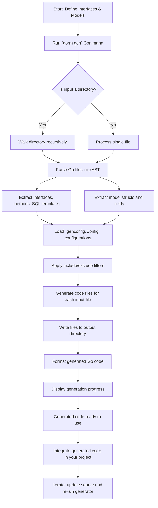

# Understanding the Code Generation Workflow

This guide walks you through the precise lifecycle of GORM CLI's code generation process—from your initial interface and model definitions all the way through executing the `gorm gen` command, to integrating and iterating with the generated code in your project. You will learn exactly where generated files are placed, how filtering and configuration influence generation, and the recommended flow to keep your codebase in sync.

---

## 1. Workflow Overview

### Purpose
This page explains how GORM CLI transforms your Go source code containing interfaces annotated with SQL templates and model structs into fully generated, type-safe query APIs and field helpers. It clarifies each phase of the workflow to help you confidently operate the `gorm gen` command and manage generated artifacts.

### Prerequisites
- You have Go models and query interfaces defined in your project.
- GORM CLI is installed and available (`go install gorm.io/cli/gorm@latest`).
- Your development environment meets Go 1.18+ generics support.
- Familiarity with defining SQL templates inside Go interfaces (see examples in other guides).

### Expected Outcome
By following this workflow, you will:
- Understand how GORM CLI scans and processes your source files.
- Successfully generate query APIs and field helpers.
- Know how and where generated files are created and updated.
- Apply configuration to control what and how code is generated.

### Time Estimate
Following this guide and generating your first code takes about 10–20 minutes depending on familiarity.

### Difficulty Level
Beginner to intermediate.

---

## 2. Code Generation Lifecycle: Step-by-Step

### Step 1: Define Interfaces with SQL Templates and Models

Start by declaring your Go interfaces that include SQL templates in method comments, along with your data models as structs.

**Example:**
```go
// Query interface with SQL annotations
type Query[T any] interface {
  // SELECT * FROM @@table WHERE id=@id
  GetByID(id int) (T, error)
}

// User model struct
type User struct {
  ID   uint
  Name string
  Age  int
}
```

### Step 2: Prepare Your Project Structure

- Organize your interfaces and models in appropriate package directories.
- Optionally declare a package-level `genconfig.Config` variable to specify output paths, filters, or field helper mappings.

**Example config in a package:**
```go
var _ = genconfig.Config{
  OutPath: "generated",
  IncludeInterfaces: []any{"Query*"},
  FieldTypeMap: map[any]any{
    sql.NullTime{}: field.Time{},
  },
}
```

### Step 3: Run the `gorm gen` Command

Execute the code generator specifying the input path of your interfaces/models and the output directory.

```bash
gorm gen -i ./examples -o ./generated
```

- `-i` points to the directory/file containing your interfaces and models.
- `-o` specifies where generated files should be saved (defaults to `./g`).

### Step 4: Internal Processing Details

When running, GORM CLI:
- Recursively scans the input directory or processes the specified file.
- Parses Go files’ AST, extracting interface definitions, their method SQL annotations, and struct model fields.
- Reads any package-level `genconfig.Config` to apply output paths, include/exclude filters, and field helper mappings.
- Filters interfaces and structs based on the configuration.
- Merges configuration hierarchically when multiple `Config`s exist in subdirectories.

### Step 5: Code Generation and Output Placement

- Generates one output file per input Go source file, mirroring directory structure relative to output root.
- Combines interface-driven query APIs with model-driven field helpers in these generated files.
- Formats the code automatically for idiomatic Go style.
- Prints progress messages indicating output file paths.

**Example:**
- Input: `examples/query.go`
- Output: `generated/examples/query.go`

### Step 6: Use and Iterate

- Import and use the generated package in your Go application.
- Generated query APIs provide type-safe methods matching your interfaces.
- Field helpers provide fluent predicates for filters, updates, and associations.
- Update your interface or models; re-run the generator to sync changes.
- Configuration changes can refine generated code without manual edits.

---

## 3. Practical Tips & Best Practices

- **Maintain Clean Separation:** Keep query interfaces and models logically organized in your source tree to aid scanning and generation.
- **Use Configuration Creatively:** Employ `genconfig.Config` to limit generation to selected interfaces/structs or customize field helper types.
- **Run Generator Frequently:** Treat generation as a regular build step to keep your generated code current.
- **Review Generated Code:** Generated files are safe to read but do not edit manually — all changes must come from sources.

---

## 4. Common Troubleshooting

<AccordionGroup title="Troubleshooting the Code Generation Workflow">
<Accordion title="No Output Files Generated">
Make sure:
- Your interfaces contain properly annotated SQL templates.
- The input path (`-i`) is correct and points to existing `.go` files.
- No configuration filters (`IncludeInterfaces`, `ExcludeStructs`, etc.) unintentionally exclude your interfaces or models.
</Accordion>
<Accordion title="Generated Files Are Not Updated">
- Confirm you run `gorm gen` after changing interfaces or models.
- Check file system permissions on the output directory.
- Verify output path is correctly set or defaulted.
</Accordion>
<Accordion title="Configuration Not Applied as Expected">
- Verify that `genconfig.Config` variables are declared in the correct packages.
- Ensure no typos or incorrect types in filter lists.
- Remember `FileLevel` flag determines if configuration is package-wide or file-level.
</Accordion>
</AccordionGroup>

---

## 5. Diagram of the Workflow



---

## 6. Additional Resources & Next Steps

- [Your First Code Generation](https://docs.gorm.io/guides/getting-started/your-first-generation) — hands-on example to generate your first code
- [Using the Generated APIs in Your Project](https://docs.gorm.io/guides/getting-started/using-generated-apis) — learn to work with generated query APIs and field helpers
- [Advanced Configuration](https://docs.gorm.io/guides/first-run-configuration/advanced-configuration) — customize output and generation details
- [System Architecture Overview](https://docs.gorm.io/overview/system-architecture-concepts/architecture-overview) — deeper insight into the overall code flow
- Official GitHub repo: [https://github.com/go-gorm/cli](https://github.com/go-gorm/cli)

<Check>
Always keep your source interfaces and models under version control. Generated code should never be manually modified but fully reproducible from your inputs.
</Check>

---

### Summary
Understanding and mastering this workflow unlocks the full power of GORM CLI by converting your abstract query definitions and model structures into efficient, type-safe, maintainable Go code.

