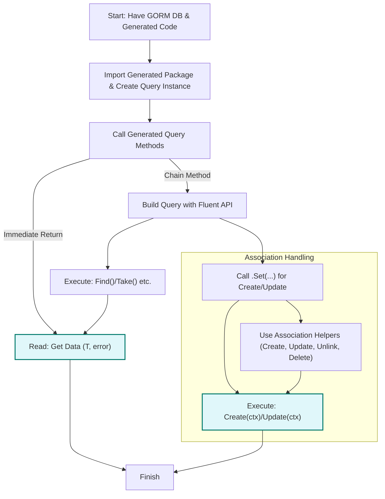

# Using the Generated APIs in Your Project

## Workflow Overview

### Task Description
This guide provides practical, step-by-step instructions to help you consume the generated query methods and field helpers produced by GORM CLI in your application code. It focuses on how to execute type-safe queries, leverage fluent field helper APIs for building predicates and updates, and understand typical read/write operation patterns.

### Prerequisites
- You have successfully generated code using the GORM CLI generator from your Go interfaces and models.
- You have a functioning GORM `*gorm.DB` instance in your application.
- Basic familiarity with GORM and Go generics.

### Expected Outcome
By following this guide, you will:
- Run generated type-safe query methods that are fully integrated with GORM.
- Use fluent APIs from generated field helpers to express SQL filters and updates concisely and safely.
- Understand how to compose read and write operations using generated APIs, including association handling.

### Time Estimate
15–30 minutes for initial familiarization, depending on your project and experience with GORM.

### Difficulty Level
Beginner to Intermediate — assumes familiarity with Go and basic database operations.

---

## Step-by-Step Instructions

### 1. Import and Prepare Your Generated Package

After running the generation command, import the generated package (default or your configured output path) and have your GORM DB instance ready.

```go
import (
  "context"
  "gorm.io/gorm"
  "your_project/generated" // adjust import path
)

// db is your *gorm.DB instance
ctx := context.Background()
```

---

### 2. Using Generated Query Interfaces

The generator creates interface types and concrete implementations wrapping your GORM DB, exposing your SQL template-based query methods.

#### Example Usage of Query Methods

Assuming you have a model `User` and generated query `Query[User]`:

```go
// Retrieve a single user by ID
user, err := generated.Query[User](db).GetByID(ctx, 123)
if err != nil {
  // handle error
}

// Retrieve users filtered by name and age using fluent helper
users, err := generated.Query[User](db).
  FilterByNameAndAge("alice", 30).
  Find(ctx)
if err != nil {
  // handle error
}
```

##### Explanation:
- Generated methods correspond to your SQL-annotated interface methods.
- Methods that return `T, error` execute SQL immediately.
- Methods that return an interface allow chaining further operations like `.Find(ctx)`.

---

### 3. Using Field Helpers for Fluent, Type-safe Queries and Updates

Field helpers provide a fluent, readable API to build predicates and setters with compile-time safety.

##### Example: Building Queries with Predicates

```go
users, err := gorm.G[User](db).
  Where(generated.User.Age.Gt(18)).          // age > 18
  Where(generated.User.Name.Like("%jinzhu%")) // name LIKE '%jinzhu%'
  .Find(ctx)
```

##### Example: Creating New Records with Setters

```go
err := gorm.G[User](db).
  Set(
    generated.User.Name.Set("alice"),
    generated.User.Age.Set(25),
    generated.User.IsAdult.Set(true),
  ).
  Create(ctx)
if err != nil {
  // handle error
}
```

##### Example: Updating Records with Increment and Expressions

```go
err := gorm.G[User](db).
  Where(generated.User.ID.Eq(1)).
  Set(
    generated.User.Age.Incr(1),
    generated.User.Score.SetExpr(
      clause.Expr{SQL: "GREATEST(?, ?)", Vars: []any{clause.Column{Name: "score"}, 10}},
    ),
  ).
  Update(ctx)
if err != nil {
  // handle error
}
```

---

### 4. Handling Associations Using Generated Helpers

Association helpers enable strong typing and composable operations to create, update, unlink, or delete related records.

##### Example: Create and Link Associations in a Single Operation

```go
err := gorm.G[User](db).
  Set(
    generated.User.Name.Set("alice"),
    // Create one pet and associate it
    generated.User.Pets.Create(generated.Pet.Name.Set("fido")),
  ).
  Create(ctx)
```

##### Example: Update Associated Records with Condition

```go
err := gorm.G[User](db).
  Where(generated.User.ID.Eq(1)).
  Set(
    generated.User.Pets.
      Where(generated.Pet.Name.Eq("fido")).
      Update(generated.Pet.Name.Set("rex")),
  ).
  Update(ctx)
```

##### Example: Unlink or Delete Associations (Soft/FK or M2M)

```go
// Unlink pets from user (clears foreign key)
err := gorm.G[User](db).
  Where(generated.User.ID.Eq(1)).
  Set(generated.User.Pets.Unlink()).
  Update(ctx)

// Delete pets from user (removes rows or join rows)
err := gorm.G[User](db).
  Where(generated.User.ID.Eq(1)).
  Set(generated.User.Pets.Delete()).
  Update(ctx)
```

Note: Unlink and Delete support optional `.Where()` filters before execution.

---

### 5. Executing Read and Write Operations

- **Read operations** are executed by calling `.Find(ctx)`, `.Take(ctx)`, or similar GORM methods on the chained builder returned by query interface or field helper predicates.
- **Write operations** (Create, Update) are performed by calling `.Create(ctx)` or `.Update(ctx)` after `.Set()` to apply setters.

---

### 6. Understanding Method Signatures & Context Injection

- Generated methods automatically include a `context.Context` parameter if one is absent from the interface.
- Methods returning the actual model type plus an `error` run the query immediately.
- Methods returning interface chains allow fluent API extension and query refinement.

---

## Examples & Code Samples

### Example Interface and Generated Usage

Interface snippet:
```go
// SELECT * FROM @@table WHERE id=@id
GetByID(id int) (T, error)

// SELECT * FROM @@table WHERE @@column=@value
FilterWithColumn(column string, value string) (T, error)
```

Generated usage:
```go
u, err := generated.Query[User](db).GetByID(ctx, 100)
users, err := generated.Query[User](db).FilterWithColumn(ctx, "name", "alice")
```

### Complex Filtering with Fluent Helpers

Build dynamic conditions with field helpers:
```go
result, err := gorm.G[User](db).
  Where(generated.User.Name.Eq("alice"),
        generated.User.Age.Between(20, 30)).
  Find(ctx)
```

### Conditional Update with Associations

```go
err := gorm.G[User](db).
  Where(generated.User.ID.Eq(5)).
  Set(
    generated.User.Age.Set(28),
    generated.User.Pets.Where(generated.Pet.Name.Eq("buddy")).
      Update(generated.Pet.Name.Set("buddy_updated")),
  ).
  Update(ctx)
```

---

## Troubleshooting & Tips

<AccordionGroup title="Troubleshooting Generated API Usage">
<Accordion title="Method Not Found After Generation">
Ensure your interface methods have proper SQL template comments and that the generation was successful without errors. Regenerate if needed.
</Accordion>
<Accordion title="Unexpected SQL Query Results">
Verify method SQL templates for correct binding to parameters. Check the placeholders (`@@table`, `@param`) and conditional blocks.
</Accordion>
<Accordion title="Context Parameter Missing or Wrong">
All generated methods include `context.Context`. Ensure you supply a valid context when calling the methods.
</Accordion>
<Accordion title="Association Operations Not Working as Expected">
Double-check association helpers usage to confirm correct unlinking, deletion, or batch creation patterns according to your association type: belongs-to, has-many, or many-to-many.
</Accordion>
</AccordionGroup>

<Tip>
For best results, organize your model structs and query interface in the same package or directory to simplify code generation and imports.
</Tip>

<Tip>
Use generated field helpers rather than raw strings or manual SQL to benefit from compile-time safety and clear intent.
</Tip>

---

## Next Steps & Related Content

- After mastering generated API usage, explore [Advanced Field Helpers and Predicate Patterns](./advanced-field-helpers) to unlock complex query construction.
- Learn detailed association usage in [Associations: Patterns and Best Practices](./associations-in-practice).
- To customize code output, see [Customizing Generation: Configs and Field Mapping](./customizing-generation-with-config).
- Deep dive into the SQL template DSL in [Mastering the SQL Template DSL](./template-sql-dsl).

For general onboarding, refer to [Your First Code Generation](./your-first-generation) to understand how to create your first generation project.

---

## Summary Diagram: Typical Generated API Use Flow



---