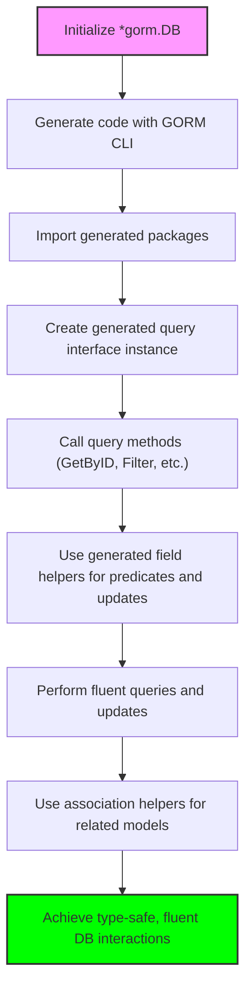

# Working with Generated APIs

Explore how to use the generated queries and field helpers in practical application scenarios. This page demonstrates common query patterns and update operations, showing how compile-time safety and fluent APIs simplify database interactions.

---

## Overview

When you generate code using GORM CLI, you receive two powerful components:

- **Generated Query Interfaces**: Type-safe methods for your SQL templates, enabling easy querying using plain Go method calls.
- **Generated Field Helpers**: Strongly typed helpers for predicates and updates, giving you compile-time safety and fluent usage for fields and associations.

This page guides you through how to effectively use these generated APIs to interact with your database, focusing on common query patterns and update workflows.

---

## Prerequisites

Before diving into using the generated APIs, ensure you have the following:

- Successfully generated code for your models and query interfaces using GORM CLI.
- Imported the generated package(s) into your Go project.
- A valid `*gorm.DB` instance connected to your database.

If you have not yet generated code, refer to the [Running the Generator](https://docs.gorm.io/getting-started/first-code-gen/running-generator) guide.

---

## Typical Usage Scenarios

### 1. Executing Basic Queries

The core use of generated query interfaces is to run familiar SQL queries through Go methods with full type safety.

#### Example: Fetch By ID

```go
// Assume generated package is imported as 'generated'
ctx := context.Background()
userQuery := generated.Query[models.User](db)
user, err := userQuery.GetByID(ctx, 123)
if err != nil {
  // handle error
}
fmt.Println("User: ", user)
```

**What happens here?**
- `generated.Query[models.User](db)` returns a typed query interface implementation.
- Calling `GetByID(ctx, 123)` runs the SQL template defined on your interface and returns a `User` struct with the matching ID.


### 2. Using Field Helpers for Predicate Building

Field helpers provide methods like `.Eq()`, `.Like()`, `.Between()`, etc., to create SQL conditions concisely and safely.

#### Example: Query Users by Name and Age

```go
users, err := gorm.G[models.User](db).
  Where(generated.User.Name.Like("%jinzhu%"),
        generated.User.Age.Between(18, 30)).
  Find(ctx)

if err != nil {
  // handle error
}
```

- `generated.User.Name.Like("%jinzhu%")` creates the SQL condition `name LIKE '%jinzhu%'`.
- `generated.User.Age.Between(18, 30)` creates an age condition.
- Combined by GORM's `Where` for fluent querying.

---

### 3. Performing Updates with Fluent Setters

You can update records with fluent and strongly typed `Set` calls on fields and associations, leveraging the generated field helpers.

#### Example: Update User's Name and Age

```go
err := gorm.G[models.User](db).
  Where(generated.User.ID.Eq(1)).
  Set(
    generated.User.Name.Set("jinzhu"),
    generated.User.Age.Set(25),
  ).
  Update(ctx)

if err != nil {
  // handle error
}
```

Advantages:
- Compile-time checks prevent invalid column names.
- Zero values are handled explicitly to avoid accidental column omissions.

### 4. Managing Associations

Generated APIs expose association helpers as `field.Struct[T]` or `field.Slice[T]`.

You can perform various operations:
- **Create**: Insert and link related models.
- **CreateInBatch**: Batch insert associated records.
- **Update**: Update child or linked records with conditions.
- **Unlink**: Break associations without deleting.
- **Delete**: Remove associated records.

#### Example: Create User with Pets

```go
gorm.G[models.User](db).
  Set(
    generated.User.Name.Set("alice"),
    generated.User.Pets.Create(generated.Pet.Name.Set("fido")),
  ).
  Create(ctx)
```

---

## Step-by-Step: Query and Update Flow

<Steps>
<Step title="Initialize Generated Query Interface">
Create the query interface instance for your model using the generated constructor.

```go
userQuery := generated.Query[models.User](db)
```

This instance provides all your typed query methods.
</Step>

<Step title="Call Query Methods">
Use the interface's methods to run queries defined in your SQL template interface.

For example:
```go
user, err := userQuery.GetByID(ctx, 123)
```
After successful execution, `user` contains the returned data.
</Step>

<Step title="Build Predicates Using Field Helpers">
Use field helpers like `generated.User.ID.Eq(123)` to create SQL clauses safely and readably.
```
gorm.G[models.User](db).
  Where(generated.User.Name.Like("%jinzhu%"), generated.User.Age.Between(18, 30))
```
</Step>

<Step title="Perform Updates Using Set">
Call `Set()` with field helpers to update columns or associations.

Example:
```go
gorm.G[models.User](db).
  Where(generated.User.ID.Eq(1)).
  Set(generated.User.Name.Set("newname"), generated.User.Age.Set(21)).
  Update(ctx)
```
</Step>

<Step title="Manage Associations">
Operate on related records using association helpers.

Example:
```go
gorm.G[models.User](db).
  Set(generated.User.Pets.Create(generated.Pet.Name.Set("buddy"))).
  Update(ctx)
```
</Step>
</Steps>

---

## Practical Examples

### Example 1: Filtering Users by Dynamic Column

Imagine you want to filter users by any column dynamically.

```go
user, err := generated.Query[models.User](db).FilterWithColumn(ctx, "email", "user@example.com")
if err != nil {
  // handle error
}
```

The `FilterWithColumn` method uses dynamic column binding powered by SQL template DSL, making flexible queries easy.

### Example 2: Conditional Updates

Update a user only if they have provided a non-empty name.

```go
err := generated.Query[models.User](db).UpdateInfo(ctx, models.User{Name: "jinzhu", Age: 0}, 1)
```

The update SQL template uses conditional clauses to skip empty fields.

### Example 3: Query with Time Range

Fetch records created within a specific timespan.

```go
start := time.Date(2023, 1, 1, 0, 0, 0, 0, time.UTC)
end := time.Now()
users, err := generated.Query[models.User](db).FilterWithTime(ctx, start, end)
```

This method leverages the conditional `{{if}}` directives for dynamic filtering.

---

## Tips and Best Practices

- **Use the Context Argument**: Pass `ctx` consistently to support cancellations and deadlines.
- **Prefer Field Helpers Over Raw SQL Strings**: Avoid SQL injection and typos.
- **Combine Conditions Fluently**: Multiple conditions via `Where` are automatically combined with `AND`.
- **Handle Zero-Value Fields Explicitly in Updates**: Use `.Set()` for zero values like `false`, `0`, or empty strings.
- **Review Template SQL Comments**: When writing your interfaces, ensure your SQL templates align with method signatures.

---

## Troubleshooting Common Issues

<AccordionGroup title="Troubleshooting Generated API Usage">
<Accordion title="Method Not Found on Generated Query Interface">
Ensure your interface methods are valid, returning the required values and have properly annotated SQL templates as per the [Writing Models & Interfaces](https://docs.gorm.io/getting-started/first-code-gen/writing-models-interfaces) guide.
</Accordion>
<Accordion title="Field Helper Methods Missing">
Check that your models are properly defined and that the generator ran successfully without errors. Confirm your field tags or type mappings do not exclude fields from generation.
</Accordion>
<Accordion title="Database Errors When Using Generated API">
Ensure your DB connection is valid. Review the SQL generated by enabling GORM logging. Misused predicates or updates may cause invalid SQL.
</Accordion>
<Accordion title="Update Not Changing Expected Columns">
Verify you are using the `.Set()` helpers correctly with fields you intend to update. Zero-value omissions happen if `.Set()` is not explicitly used.
</Accordion>
</AccordionGroup>

---

## Next Steps

- Explore [Writing Templated Queries](https://docs.gorm.io/guides/advanced-usage/template-dsl-guide) to author richer query interfaces.
- Learn about [Managing Associations](https://docs.gorm.io/guides/advanced-usage/advanced-associations) for more on association operations.
- Review [First Use of Generated Code](https://docs.gorm.io/getting-started/first-code-gen/first-use) for comprehensive onboarding.
- Consult [Troubleshooting Common Issues](https://docs.gorm.io/getting-started/troubleshooting-validation/troubleshooting) if you encounter problems.


---

## Visual Overview of Using Generated APIs



---