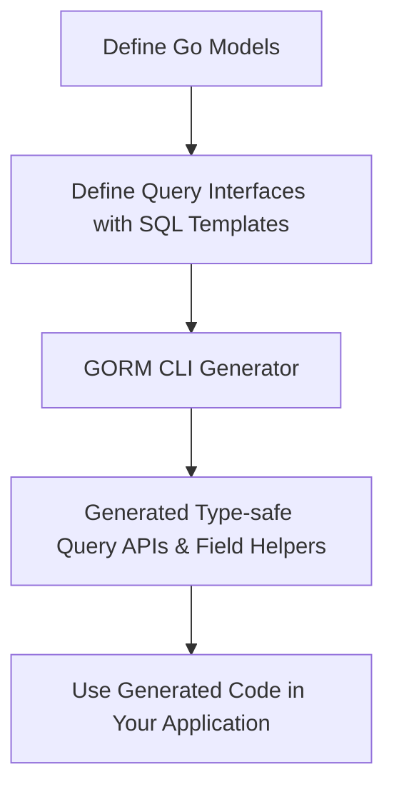

# Your First Code Generation with GORM CLI

Welcome to your step-by-step guide for generating your first type-safe query APIs and field helpers using **GORM CLI**. This walkthrough will take you from zero setup through defining your data models and query interfaces, generating code, and integrating it seamlessly into your Go project.

---

## 1. Workflow Overview

### What This Guide Will Help You Accomplish
You will learn how to:
- Set up the basic GORM CLI code generation environment
- Define Go models and raw SQL query interfaces annotated with SQL templates
- Run the GORM CLI generator to produce type-safe query APIs and field helpers
- Use the generated code in your Go application to perform database operations safely

### Prerequisites
- Have Go 1.18 or higher installed and configured
- Installed GORM CLI (`gorm.io/cli/gorm`)
- Basic familiarity with Go modules and GORM
- Your project has Go structs defining your database models

### Expected Outcome
By completing this guide, you’ll have:
- A working generation setup producing fluent, type-safe database query APIs
- A good understanding of the flow from model/interface definition to generated code usage
- Confidence running the generator and troubleshooting common issues

### Time Estimate
15-30 minutes depending on familiarity with Go and GORM

### Difficulty Level
Beginner to Intermediate

---

## 2. Step-by-Step Instructions

### Step 1: Define Your Data Models

Start by creating Go struct models representing your database tables.
Models should align with GORM conventions for ORM mapping.

#### Example: `models/user.go`
```go
package models

import "gorm.io/gorm"

// User represents the users table in the database
// Define fields with types reflecting your schema
// GORM's Model includes ID, CreatedAt, UpdatedAt, DeletedAt
// Add your custom fields below

type User struct {
  gorm.Model
  Name string
  Age  int
}
```

- Use exported struct fields for each column
- Include GORM base model if convenient

### Step 2: Define Your Query Interface with SQL Templates

Create an interface annotated with SQL template comments to express queries you want generated as type-safe methods.

#### Example: `queries/user_query.go`
```go
package queries

import "gorm.io/cli/gorm/examples/models"

type UserQuery[T any] interface {
  // SELECT * FROM @@table WHERE id=@id
  GetByID(id int) (T, error)

  // SELECT * FROM @@table WHERE name LIKE @pattern
  SearchByName(pattern string) ([]T, error)

  // UPDATE @@table
  // {{set}}
  //   {{if user.Name != ""}} name=@user.Name, {{end}}
  //   {{if user.Age > 0}} age=@user.Age {{end}}
  // {{end}}
  // WHERE id=@id
  UpdateUser(user models.User, id int) error
}
```

- `@@table` resolves to the table mapped from the model
- `@param` binds Go method params to SQL parameters
- Template directives like `{{set}}` support conditional and dynamic SQL

### Step 3: Run the GORM CLI Generator

Use the CLI command `gorm gen` to process your interface and model files and output generated code.

```bash
gorm gen -i ./queries -o ./generated
```

- `-i` points to the directory or file containing your query interfaces
- `-o` sets the target output directory for generated code
- The CLI scans for interfaces/models and emits strongly typed code ready to use

### Step 4: Confirm Generated Files

After generation you should see your output directory populated:
- An interface implementation with methods
- Field helpers struct for query-building

Example file locations:
```shell
generated/userquery.go
generated/user.go
```

### Step 5: Use the Generated APIs in Your Project

Import your generated code and start calling precise, compile-safe query methods.

```go
package main

import (
  "context"
  "fmt"
  "gorm.io/gorm"
  "your_project/generated"
  "your_project/models"
)

func main() {
  db := connectDB() // your GORM db connection setup
  ctx := context.Background()

  // Use generated query interface
  q := generated.UserQuery[models.User](db)

  user, err := q.GetByID(ctx, 123)
  if err != nil {
    panic(err)
  }
  fmt.Println("User found:", user)

  err = q.UpdateUser(ctx, models.User{Name: "Alice", Age: 30}, 123)
  if err != nil {
    panic(err)
  }
  fmt.Println("User updated successfully")
}
```

---

## 3. Practical Example: End-to-End

Here’s a minimal combined example for clarity.

- File: `models/user.go`
```go
package models

import "gorm.io/gorm"

type User struct {
  gorm.Model
  Name string
  Age  int
}
```

- File: `queries/user_query.go`
```go
package queries

import "your_project/models"

type UserQuery[T any] interface {
  // SELECT * FROM @@table WHERE id=@id
  GetByID(id int) (T, error)
}
```

- Run generation:
```bash
gorm gen -i ./queries -o ./generated
```

- Sample usage:
```go
user, err := generated.UserQuery[models.User](db).GetByID(ctx, 1)
```

This generated method runs the SQL `SELECT * FROM users WHERE id=?` with type safety and you get strongly typed results.

---

## 4. Tips, Best Practices & Troubleshooting

### Tips
- Place models and query interfaces close logically (same package or directory) for easier management.
- Name your interfaces clearly (e.g., `UserQuery`) to reflect their domain.
- Use templating directives like `{{where}}` and `{{set}}` to build dynamic queries safely.
- Take advantage of GORM CLI’s auto-context injection if you omit `context.Context` in your interface methods.
- Use field helpers (auto-generated from models) for composable and type-safe conditions.

### Common Troubleshooting

<Accordion title="Command Not Found or Installation Issues">
- Verify Go version is 1.18 or newer.
- Run `go install gorm.io/cli/gorm@latest`.
- Confirm binary is on your system PATH.
</Accordion>

<Accordion title="No Generated Files or Empty Output">
- Check your interface file path and `-i` flag points correctly.
- Ensure interfaces have SQL template comments.
- Confirm models and interfaces are exported and in the scanned directory.
</Accordion>

<Accordion title="Generation Fails with Parsing Errors">
- Look at errors carefully — syntax in SQL comments must be valid template DSL.
- Avoid unsupported SQL constructs or typos in `@param` placeholders.
- Confirm all return parameters satisfy generator expectations (e.g., error as last return value).
</Accordion>

---

## 5. Next Steps & Further Resources

- Explore **Basic Configuration** to customize file output paths and package layouts.
- Move to **Advanced Configuration** for field mapping and inclusion/exclusion filters.
- Use the **Quickstart Example** guide for a fully working end-to-end walkthrough.
- Consult **Using Generated APIs In Your Project** for leveraging advanced features and idiomatic usage.

---

## Summary
You’ve now gained the essential steps to define models and interfaces, generate type-safe code, and integrate it into your app with GORM CLI. Your journey from initial schema representation to executable, safe queries begins here.

Happy coding!

---

## References
- [GORM CLI Overview & Feature Highlights](../../overview/getting-started-core/overview-feature-quicklook)
- [Basic Configuration](../../getting-started/first-run-configuration/basic-configuration)
- [Advanced Generation Settings](../../getting-started/first-run-configuration/advanced-configuration)
- [SQL Template DSL](../../guides/real-world-examples/template-sql-dsl)
- [Troubleshooting Installation](../../getting-started/setup-installation/troubleshooting)

---

## Generated Code Flow Diagram



---

<Check>
Recommend running `gorm gen -h` for command options.
Check your Go environment and version.
Keep models and queries consistent with database schema.
</Check>
