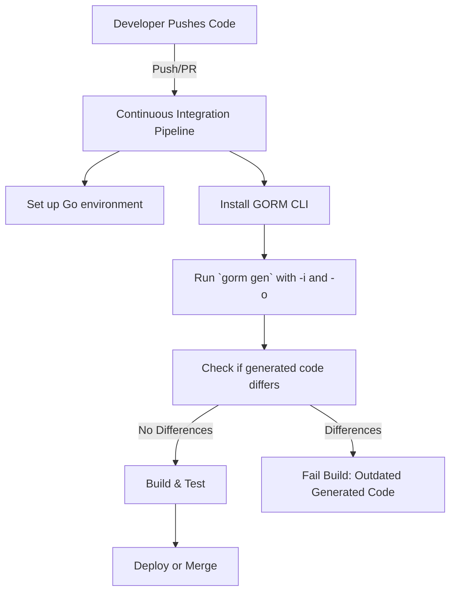

# Automating Code Generation with CI

Ensure your GORM CLI generated query APIs and field helpers remain current and consistent by integrating the code generation step directly into your continuous integration (CI) pipelines. This guide walks you through setting up an automated workflow that runs the `gorm gen` command, keeping your generated code in sync with your changing models and query interfaces without manual intervention.

---

## Why Automate GORM CLI Code Generation?

As your project evolves, model structs and raw SQL query interfaces will change, making manual code generation error-prone and tedious. Automating this process in CI provides:

- **Consistency:** Prevents stale or out-of-date generated code from slipping into your repository.
- **Reliability:** Ensures your builds always include the latest type-safe query code.
- **Efficiency:** Saves developer time by eliminating manual generation steps.

By embedding GORM CLI generation into your pipeline, you catch generation issues early and maintain smooth developer workflows.

---

## Prerequisites

Before automating:

- Your project should have proper Go module setup and import paths.
- `gorm gen` must run successfully locally with your current interfaces and models.
- Ensure `gorm` CLI is installed and accessible in the pipeline's environment.
- Ideally, your model and query interface files are organized consistently following [Project Setup & Structure](../getting-started/first-steps-with-gorm-cli/project-setup).

---

## Setting Up CI Automation Workflow

### 1. Install GORM CLI in Your CI Environment

Add a setup step to your CI configuration that installs the latest GORM CLI tool:

```bash
go install gorm.io/cli/gorm@latest

# Confirm installation
gorm --version
```

Most CI platforms (GitHub Actions, GitLab CI, CircleCI, etc.) allow specifying environment setup commands.

### 2. Run Code Generation on Each Build or Pull Request

Invoke the `gorm gen` command automatically to generate or update code:

```bash
gorm gen -i ./path/to/your/interfaces -o ./path/to/generated/code
```

- Adjust `-i` to point to your Go interface files location.
- Set `-o` to your desired output directory for generated code.

### 3. Commit or Validate Generated Code (Optional)

You have two common approaches:

- **Commit Generated Files:** Commit updates back to the repository automatically. Useful for projects where generated code is checked in.
- **Validate Generated Files:** Run generation and check for diffs to ensure generated code stays up-to-date. Fail the build if changes are detected, enforcing regeneration before merging.

### Example validation step (GitHub Actions snippet):

```yaml
- name: Install GORM CLI
  run: go install gorm.io/cli/gorm@latest

- name: Generate GORM CLI code
  run: |
    gorm gen -i ./internal/queries -o ./internal/generated

- name: Check for uncommitted changes
  run: |
    git diff --exit-code ./internal/generated
```

Failing the build when `git diff` detects changes ensures developers regenerate code locally before pushing.

---

## Example: GitHub Actions Workflow

```yaml
name: GORM CLI Code Generation

on:
  push:
    branches: [main]
  pull_request:
    branches: [main]

jobs:
  generate-code:
    runs-on: ubuntu-latest

    steps:
      - uses: actions/checkout@v3

      - name: Set up Go 1.20
        uses: actions/setup-go@v4
        with:
          go-version: 1.20

      - name: Install GORM CLI
        run: go install gorm.io/cli/gorm@latest

      - name: Run GORM CLI Code Generation
        run: gorm gen -i ./internal/queries -o ./internal/generated

      - name: Validate Generated Code
        run: |
          if [ -n "$(git status --porcelain ./internal/generated)" ]; then
            echo "Generated code is out of date. Please run 'gorm gen' locally.";
            git --no-pager diff ./internal/generated;
            exit 1;
          fi
```

With this configuration, any changes to interfaces or models that cause generated code to differ will be flagged immediately during PR validation or pushes to the main branch.

---

## Best Practices

- **Version Pinning:** Pin the GORM CLI version in your CI environment to ensure reproducible builds.
- **Separate Generation and Commit:** Consider separating generation from commit to avoid committing generated code accidentally during development iterations.
- **Use Explicit Inputs/Outputs:** Always specify `-i` and `-o` options in your CI scripts, avoiding default paths.
- **Clean Environment:** Run `go mod tidy` and build checks along with generation for holistic validation.
- **Generate Early:** Run code generation early in your pipeline to catch issues early.

---

## Troubleshooting

**Problem:** Code generation fails in CI but works locally.

- Check if your Go version in CI meets the Go 1.18+ requirement.
- Verify GOPATH and PATH environment variables include Go binaries.
- Confirm import paths and file permissions in your CI context.

**Problem:** CI build fails due to uncommitted generated code.

- Ensure developers run `gorm gen` locally before pushing changes.
- Consider automating pre-commit git hooks.

**Problem:** Generated code outputs to unexpected directories.

- Verify `genconfig.Config` settings for `OutPath` in your source packages.
- Explicitly set the `-o` flag in CI command.

---

## Next Steps

- Integrate automated testing with the generated code by adding `go test` steps in your CI pipeline.
- Explore [Testing and Validating Generated Code](../guides/integration-and-best-practices/testing-and-validating-generated-code) to ensure runtime correctness.
- Customize generation behavior for your CI by applying [Customizing Code Generation](../guides/advanced-patterns/customizing-generation-output).

---

## Summary Diagram



---