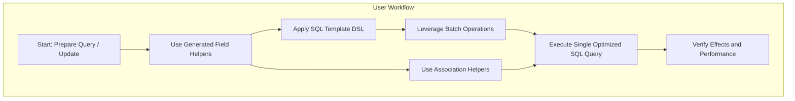

# Optimizing Performance and Usage Patterns

Optimize your GORM CLI-generated code to write efficient queries and minimize runtime overhead. This guide provides actionable strategies to leverage batch operations, efficiently use generated field helpers, and avoid common performance pitfalls in GORM-based Go projects.

---

## 1. Understanding Performance Goals

Before optimizing, it's crucial to focus your efforts on key performance outcomes:

- **Minimize database round-trips** by batching operations where possible.
- **Leverage generated field helpers** to build precise queries without unnecessary complexity.
- **Avoid large unbounded queries** that can exhaust resources.
- **Use association helpers smartly** to reduce extra SELECTs or redundant updates.

This approach ensures your application scales efficiently while keeping your code maintainable and type-safe.

---

## 2. Best Practices for Efficient Queries

### 2.1 Use Batch Operations for Multiple Rows

**Why:** Batch operations reduce multiple queries into a single one, dramatically improving throughput.

**How:**
- Use batch methods like `CreateInBatch` for inserting multiple related records.
- Apply batch updates when modifying multiple rows by using query filters combined with `Set` and `Update` operations.

```go
// Create multiple languages for a user in one batch
err := gorm.G[User](db).
  Where(generated.User.ID.Eq(1)).
  Set(generated.User.Languages.CreateInBatch([]models.Language{{Code: "EN"}, {Code: "FR"}})).
  Update(ctx)
```

**Result:** Single database query creates or updates all records.

### 2.2 Filter with Strongly Typed Field Helpers

Use the generated field helpers for predicates and updates. They ensure SQL is precise and safe.

```go
// Query users older than 18 with role active
users, err := gorm.G[User](db).
  Where(generated.User.Age.Gt(18), generated.User.Role.Eq("active")).
  Find(ctx)
```

Avoid raw SQL strings in filters and rely on these helpers to benefit from compile-time safety and optimized parameter binding.

### 2.3 Combine Conditions with Template Queries for Complex Filtering

When you have many conditional filters, write flexible template methods:

```go
// In your Query interface:
// SELECT * FROM @@table
// {{where}}
//   {{if !start.IsZero()}} created_at > @start {{end}}
//   {{if !end.IsZero()}} AND created_at < @end {{end}}
// {{end}}
FilterWithTime(start, end time.Time) ([]T, error)

// Usage
results, err := generated.Query[User](db).FilterWithTime(ctx, startTime, endTime)
```

This generates dynamic WHERE clauses avoiding unnecessary SQL parts and improving performance.

### 2.4 Limit Retrieved Columns When Appropriate

If you do not need all columns, customize queries to select only required fields using generated helpers or SQL templates, reducing data transfer size and parsing overhead.

---

## 3. Efficient Handling of Associations

### 3.1 Use Association Helpers to Avoid Extra Queries

Generated association helpers (`Create`, `Update`, `Unlink`, `Delete`) let you update linked data atomically with parent operations. This avoids additional code and reduces database calls.

```go
// Create a user and a pet in one request
err := gorm.G[User](db).
  Set(
    generated.User.Name.Set("alice"),
    generated.User.Pets.Create(generated.Pet.Name.Set("fido")),
  ).
  Create(ctx)
```

### 3.2 Apply Conditions When Unlinking or Deleting

Be precise when unlinking or deleting associations to avoid wide-impact accidental operations.

```go
// Unlink only pets named fido from user 1
err := gorm.G[User](db).
  Where(generated.User.ID.Eq(1)).
  Set(generated.User.Pets.Where(generated.Pet.Name.Eq("fido")).Unlink()).
  Update(ctx)
```

### 3.3 Batch Link Associations Where Possible

For has-many and many-to-many relations, prefer batch association creation instead of iterative inserts.

```go
gorm.G[User](db).
  Where(generated.User.ID.Eq(1)).
  Set(generated.User.Languages.CreateInBatch([]models.Language{{Code: "EN"}, {Code: "FR"}})).
  Update(ctx)
```

This minimizes the number of SQL statements sent.

---

## 4. Avoiding Common Performance Pitfalls

<Warning>
**Unbounded Queries:** Avoid queries without filters that return large data sets, which can exhaust memory and degrade performance.

**Inefficient Loops:** Don’t run queries or updates inside loops; use batch operations instead.

**Redundant Association Loads:** Only preload or join associations when necessary.
</Warning>

<Check>
Confirm your filters always narrow down result sets appropriately, especially when working with generated APIs.
</Check>

---

## 5. Advanced Techniques and Tips

### 5.1 Use SQL Templates for Dynamic Queries

Harness the power of SQL template DSL to craft queries that adapt efficiently to input.

**Example:** Dynamic filtering across multiple users

```go
// In Query interface
// SELECT * FROM @@table
// {{where}}
//   {{for _, user := range users}}
//     {{if user.Name != "" && user.Age > 0}}
//       (name = @user.Name AND age=@user.Age AND role LIKE concat("%",@user.Role,"%")) OR
//     {{end}}
//   {{end}}
// {{end}}
Filter(users []models.User) ([]T, error)
```

Batch complex filters are compiled into a single efficient SQL statement.

### 5.2 Conditional Updates with `{{set}}`

Perform updates only on fields that have meaningful changes extracted at runtime, avoiding unnecessary writes.

---

## 6. Workflow Diagram



---

## 7. Troubleshooting & Tips

### Common Issues

- **Unexpected large result sets:** Rethink filters or add limits.
- **Slow batch updates:** Check indexes on filtering columns.
- **Association operations not applying:** Confirm you are using `Set(...).Update(ctx)` or `Create(ctx)` correctly.

### Practical Tips

- Always test with realistic datasets to observe actual performance.
- Use the `Validate Your Setup` guide to ensure correctness before optimization.

### Performance Considerations

- Index your database columns that appear frequently in filter predicates generated by your code.
- Monitor generated SQL queries (use SQL logs) to ensure expected SQL is executed.

---

## 8. Next Steps

- Explore **Customizing Generation with Configurations** to tune helpers for your domain.
- Dive into **Template-Based SQL Queries** to increase SQL logic flexibility.
- Review **Using Generated Field Helpers** for idiomatic usage patterns.

---

## References

- [Initialize Your Project Guide](/getting-started/first-steps/initialize-your-project)
- [Generate Type-Safe Code](/getting-started/first-steps/generate-code)
- [Validate Your Setup](/getting-started/first-steps/validate-your-setup)
- [Using Generated Field Helpers](/guides/getting-started-workflows/using-field-helpers)
- [Managing Associations and Relationships](/guides/advanced-usage-patterns/working-with-associations)
- [Template-Based SQL Queries](/guides/advanced-usage-patterns/template-queries)
- [Customizing Generation](/guides/advanced-usage-patterns/customizing-generation)
- [Troubleshooting Common Issues](/getting-started/configuration-troubleshooting/troubleshooting-common-issues)


---

<Tip>
Optimizing your use of generated code in GORM CLI is a journey. Start simple by batching your writes and using strongly typed field helpers consistently. Then, progressively apply SQL templates and association helpers to unlock more advanced efficiencies.
</Tip>

<Note>
Always profile your application and database queries to verify the real impact of your optimizations.
</Note>
