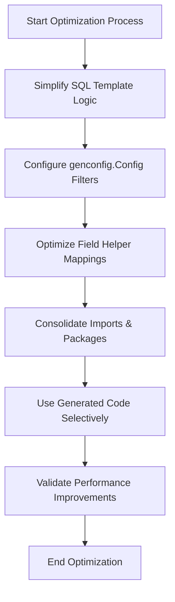

# Performance Optimization Tips

Optimize the performance of generated queries and the overall codebase in your GORM CLI-powered project by applying practical strategies focused on template design, selective code generation, and field helper usage. This guide presents precise, actionable recommendations aimed at reducing overhead when working with large, complex models and query interfaces.

---

## 1. Workflow Overview

### Task Description
Learn how to optimize the SQL templates and generation configuration to produce performant generated code, minimizing unnecessary query complexity and compilation overhead.

### Prerequisites
- Familiarity with writing SQL templates in GORM CLI query interfaces.
- Basic understanding of `genconfig.Config` for filtering generation.
- An existing GORM CLI project with working generated APIs.

### Expected Outcome
- Streamlined generated code that compiles efficiently.
- Queries that execute with minimal runtime overhead.
- Reduced code size by generating only needed interfaces and structs.

### Time Estimate
15 to 30 minutes to apply optimization techniques and verify improvements.

### Difficulty Level
Intermediate

---

## 2. Step-by-Step Optimization Instructions

### Step 1: Simplify SQL Templates for Efficiency

- Avoid overly complex `{{if}}`, `{{for}}`, and nested directives in your query method comments. Keep conditional logic straightforward to reduce generated branching code.
- Use SQL parameters (`@param`) effectively to filter data on the database side, preventing loading unnecessary rows.
- Prefer `where` and `set` blocks to encapsulate dynamic conditions, enabling clean SQL with minimal string manipulation.

**Expected Result:**
A concise and maintainable SQL template that generates clean and efficient Go code.

### Step 2: Use Selective Code Generation via Filtering

- Define package-level `genconfig.Config` with `IncludeInterfaces`, `ExcludeInterfaces`, `IncludeStructs`, or `ExcludeStructs` to generate only the required code.

```go
var _ = genconfig.Config{
  IncludeInterfaces: []any{"Query*"},          // Generate only interfaces that start with "Query"
  ExcludeInterfaces: []any{"*Deprecated*"},   // Skip deprecated interfaces
  IncludeStructs: []any{"User", "Order"},   // Limit struct generation to essential models
}
```

- Set `FileLevel` to `true` when you want configuration scoped to only specific files for finer control.

**Expected Result:**
Code generation time and output file size reduce, improving compile time and focusing build on crucial components.

### Step 3: Optimize Field Helper Use

- Map common Go types and tags to efficient field helper types using `FieldTypeMap` and `FieldNameMap`. This avoids generating redundant or overly generic field helpers.

```go
FieldTypeMap: map[any]any{
  sql.NullTime{}: field.Time{},  // Use efficient time helper for nullable timestamps
},
FieldNameMap: map[string]any{
  "json": JSON{},               // Custom JSON field helper for specific tagged fields
},
```

- Exclude fields not needed in helper generation by removing them from your model or by excluding structs.

**Expected Result:**
Clearer, more focused field helpers reducing runtime overhead in query building.

### Step 4: Minimize Generated Imports and Packages

- Ensure your codebase uses consistent package paths to allow the generator to merge and deduplicate imports.
- Avoid duplicated or unnecessary imports by organizing your code and generation inputs.

**Expected Result:**
Generated files with clean imports and fewer dependencies, minimizing compile time and binary size.

### Step 5: Use Code Generation Output Strategically

- Integrate generated code selectively into your project, importing only the packages with the interfaces and helpers you actively use.
- Avoid importing all generated packages in upstream modules if only a subset is needed.

**Expected Result:**
Faster build times and leaner runtime inclusion, reducing memory usage.

---

## 3. Examples & Patterns for Optimization

### Example: Simple SQL Template Over Complex Conditions

```go
// Instead of deeply nested if-else
// Select users with optional name and age filters
FilterUsers(name string, age int) ([]User, error) {
  // SELECT * FROM @@table
  // {{where}}
  //   {{if name != ""}} name=@name {{end}}
  //   {{if age > 0}} AND age=@age {{end}}
  // {{end}}
}
```

This direct approach reduces generated code branches.

### Example: Filtering Interfaces with `genconfig.Config`

```go
var _ = genconfig.Config{
  IncludeInterfaces: []any{"Query*"},     // Only generate Query interfaces
  ExcludeStructs:   []any{"*DTO", "Tmp*"}, // Skip temporary or DTO structs
}
```

Concentrating generation increases build speed and keeps the codebase focused.

---

## 4. Troubleshooting & Best Practices

### Common Issues

- **Excessive Generated Code Size:** Check your `genconfig.Config` filters; remove unnecessary interface or struct generation.
- **Slow Compilation:** Large generated files or many small files can slow compiler; consolidate via filters and output paths.
- **Complex SQL Template Bugs:** Simplify logic in templates; test stepwise to isolate problematic conditions.

### Best Practices

- Write and test SQL templates independently before generation.
- Clearly specify inclusion/exclusion in `genconfig.Config` early in your project.
- Maintain clean package structure to leverage import merging.
- Use type and name mapping to avoid redundant helpers.

### Performance Considerations

- Generating fewer interfaces reduces the runtime API surface, lowering memory footprint.
- Efficient SQL templates reduce query parsing and evaluation overhead at runtime.
- Streamlined imports minimize contention in the Go build process.

### Alternative Approaches

- Consider splitting large domains into separate packages with dedicated generation configs.
- Use batch operations for associations where possible to reduce query count and increase throughput.

---

## 5. Next Steps & Related Content

- **Deepen Query API Skills:** See [Building Template-based Query APIs](/guides/essential-workflows/template-based-query-apis) to write optimized, type-safe queries.
- **Master Field Helpers:** Visit [Generating Field Helpers from Models](/guides/essential-workflows/model-driven-field-helpers) for customizing efficient helpers.
- **Advanced Configurations:** Explore [Configuring Code Generation](/guides/real-world-patterns/guide-configurations) for fine-grained control over generation.
- **Integration Guidance:** Review [Integrating with GORM Ecosystem](/guides/integration-and-best-practices/seamless-gorm-integration) for combining generated code with ORM features.

---

Optimize GORM CLI generation for better build times and runtime efficiency by applying these practical strategies and refining your project's template and config setup.


---

## Visual Workflow Summary



---

# Tips
<Tip>
Always profile your Go build and runtime performance when applying optimizations - measure before and after to confirm effectiveness.
</Tip>

# Notes
<Note>
Generation filtering with `Include*` takes precedence over `Exclude*`; use carefully to avoid missing required code.
</Note>

# Warnings
<Warning>
Overuse of complex template directives can greatly increase generated code complexity and slow down compile and run times.
Keep templates clean and to the point.
</Warning>

# Check
<Check>
Test generated queries thoroughly after optimization to avoid accidental logic regressions.
</Check>

---

## References
- [GORM CLI Overview & Installation](https://gorm.io/docs/cli.html)
- [Model-Driven Field Helpers Guide](/guides/essential-workflows/model-driven-field-helpers)
- [Template-Based Query APIs Guide](/guides/essential-workflows/template-based-query-apis)
- [Configuring Code Generation](/guides/real-world-patterns/guide-configurations)
- [Seamless GORM Integration Guide](/guides/integration-and-best-practices/seamless-gorm-integration)


