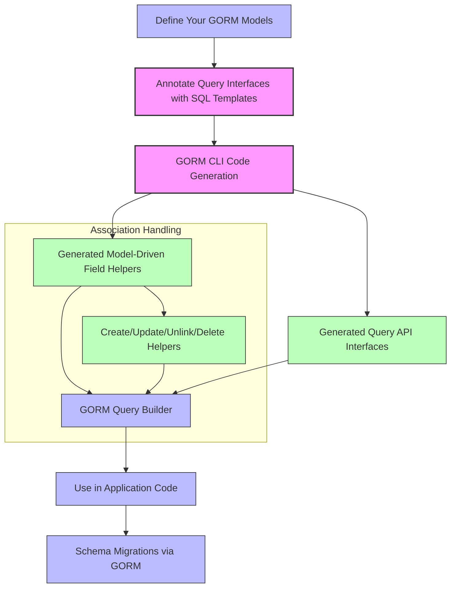

# Integrating with GORM Ecosystem

This guide shows you how to seamlessly leverage the generated code from GORM CLI alongside GORM’s powerful ORM features. It demonstrates practical patterns for composing queries, performing updates, managing schema migrations, and improving testability, all with a unified, type-safe, and maintainable approach that scales with your Go projects.

---

## 1. Why Integrate Generated Code with GORM?

GORM CLI generates type-safe query interfaces and model-driven field helpers for your database interactions. However, to build maintainable, scalable applications, you want to combine this generated code tightly with GORM’s ORM capabilities:

- Take advantage of GORM’s rich ORM features such as associations, transactions, and migrations.
- Use generated field helpers and query APIs for compile-time safety.
- Achieve readable, maintainable, and fluent code by harmonizing both.

---

## 2. Prerequisites

- You have generated code using GORM CLI based on your project’s models and query interfaces.
- Familiarity with basic GORM usage including `*gorm.DB`, struct-based models, and association handling.
- Access to a configured `*gorm.DB` instance.

---

## 3. Outcome

By following this guide, you will:
- Use generated field helpers to write clear and type-safe queries.
- Perform CRUD operations integrating both generated code and GORM’s ORM.
- Handle associations (has one, has many, belongs to, many2many) using generated helpers.
- Manage migrations and schema updates leveraging your models.
- Write more testable and maintainable data layers.

---

## 4. Time Estimate

20–30 minutes to grasp integration concepts and apply examples.

---

## 5. Integration Patterns & Workflows

<Steps>
<Step title="Using Generated Field Helpers with GORM Queries">
Combine GORM’s query builder with strongly typed filters and setters.

```go
// Find users older than 18
users, err := gorm.G[models.User](db).
   Where(generated.User.Age.Gt(18)).
   Find(ctx)
```

**Outcome:** You get fully typed, fluent query building with the safety of field helpers.

**Tip:** Use predicates like `Eq`, `Like`, `Between` from generated fields for filters.
</Step>

<Step title="Performing Create and Update with Associations">
Utilize the generated `Set(...)` method to create or update parent models and their associations in one fluent call.

```go
err := gorm.G[models.User](db).
  Set(
    generated.User.Name.Set("alice"),
    generated.User.Pets.Create(generated.Pet.Name.Set("fido")),
  ).
  Create(ctx)
```

This creates a new user and a linked pet, ensuring referential consistency.

**Update existing associations:**

```go
err := gorm.G[models.User](db).
  Where(generated.User.ID.Eq(1)).
  Set(
    generated.User.Pets.Where(generated.Pet.Name.Eq("fido")).Update(generated.Pet.Name.Set("rex")),
  ).
  Update(ctx)
```

**Unlink or delete associations carefully**
- Unlinking clears foreign keys without deleting records.
- Deleting removes associated rows or join table entries.

```go
gorm.G[models.User](db).
  Where(generated.User.ID.Eq(1)).
  Set(
    generated.User.Pets.Unlink(),
    // or
    generated.User.Pets.Delete(),
  ).
  Update(ctx)
```
</Step>

<Step title="Handling Many-to-Many Relationships">
Use `CreateInBatch()` to link multiple related records efficiently:

```go
err := gorm.G[models.User](db).
  Where(generated.User.ID.Eq(1)).
  Set(
    generated.User.Languages.CreateInBatch([]models.Language{{Code: "EN"}, {Code: "FR"}}),
  ).
  Update(ctx)
```

This creates join rows linking the user with the specified languages.
</Step>

<Step title="Using Template-Based Query APIs With GORM ORM">
Generated query interfaces from your SQL template methods wrap `*gorm.DB` instances, enabling complex query construction and raw SQL execution safely.

```go
user, err := generated.Query[models.User](db).GetByID(ctx, 123)
```

This pattern returns typed results using your interface-defined queries while retaining flexibility.
</Step>

<Step title="Schema Migrations and Model Updates">
Manage your schema changes using GORM’s migration APIs coupled with your defined models:

```go
// Auto migrate models
err := db.AutoMigrate(&models.User{}, &models.Account{}, &models.Pet{}, &models.Toy{}, &models.Company{}, &models.Language{})
```

Generated field helpers and interfaces do not change migration behavior, but your models must stay in sync to guarantee safety.
</Step>
</Steps>

---

## 6. Practical Tips & Best Practices

- **Consistent Model Definitions:** Always keep your GORM model structs and generated code synchronized to prevent mismatches.

- **Use Generated Fields Everywhere:** Prefer generated field helpers for building predicates and setters—it improves compile-time safety and readability.

- **Manage Associations Explicitly:** Use the generated association helpers (`Create`, `Update`, `Unlink`, `Delete`) to clearly express intent; avoid ad hoc foreign key updates.

- **Batch Operations:** Efficiently process many-to-many joins or bulk association changes using `CreateInBatch` to reduce database round trips.

- **Leverage Context:** Ensure you pass `context.Context` in GORM calls for cancellation, tracing, and timeouts.

- **Gradual Integration:** You can progressively adopt generated APIs alongside existing GORM code—no need to refactor everything at once.

- **Handle Nullable Fields Carefully:** Use generated `field.Field[T]` types like `sql.NullInt64` wrapped helpers for fields that can be null in the database.

- **Testing:** Use the generated query interfaces and field helpers in your tests for concise, expressive assertions and mocks.

---

## 7. Common Pitfalls & Troubleshooting

<AccordionGroup title="Troubleshooting Common Issues">
<Accordion title="Association Updates Not Reflecting">
Ensure the `Where()` and `Set()` calls correctly target the intended records. Use generated fields for filters to avoid typos.
</Accordion>
<Accordion title="Unintended Deletions During Association Operations">
Understand the semantic differences between `Unlink()` (foreign key clearing) and `Delete()` (row deletion). Choose carefully based on desired side-effects.
</Accordion>
<Accordion title="Null or Zero Values in Updates Are Ignored">
Use the generated setters explicitly, including zero and null values, to forcibly set fields:

```go
generated.User.Age.Set(0) // sets age to zero
```
</Accordion>
<Accordion title="Complex Template Queries Fail to Compile or Execute">
Check your SQL template syntax carefully — ensure parameters and conditional blocks match your interface method signatures. Refer to the Template-Based Query APIs guide for examples.
</Accordion>
</AccordionGroup>

---

## 8. Next Steps & Related Content

- Explore the [Working with Associations](https://your-docs/guides/real-world-patterns/working-with-associations) guide for deep insights on managing complex relations.
- Learn about [Advanced Field Helper Configuration](https://your-docs/guides/real-world-patterns/advanced-field-config) to customize your generated helpers.
- Review [Template-Based Query APIs](https://your-docs/guides/essential-workflows/template-based-query-apis) for mastering SQL templated interfaces.
- Consult [Performance Optimization Tips](https://your-docs/guides/integration-and-best-practices/performance-tuning) to scale your application's data access layer.

---

## 9. Visualizing Integration Flow



This flow shows how your model definitions and annotated query interfaces feed into the GORM CLI generator to produce code that integrates seamlessly with GORM ORM features.

---

For detailed examples of generated models and usage patterns, see the `examples/models/user.go` and `examples/query.go` files in your generated output.


---

<Check>
Incorporate these integration practices to maximize maintainability and scalability of your GORM-powered applications using generated code.
</Check>
