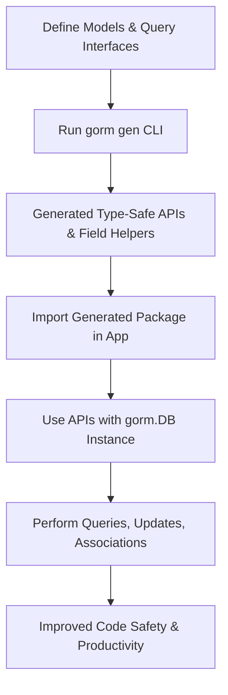

# Seamless Integration with GORM

This guide provides practical, step-by-step instructions on integrating the code generated by GORM CLI with the `gorm.io/gorm` package. It covers best practices for setting up your project to leverage the generated type-safe query APIs and model-driven field helpers effectively in day-to-day development.

---

## 1. Integration Workflow Overview

### What You Will Accomplish
- Learn how to position your models and query interfaces in your project
- Run the GORM CLI generator to produce type-safe query APIs and field helpers
- Use the generated code seamlessly with the `gorm.io/gorm` DB instance
- Explore examples showcasing common read and write operations

### Prerequisites
- Go 1.18 or later installed
- A Go project using the `gorm.io/gorm` package already initialized
- GORM CLI installed via:

  ```bash
  go install gorm.io/cli/gorm@latest
  ```

- Defined model structs and query interfaces with SQL templates

### Expected Outcome
By completing this guide, you will be able to generate and use type-safe, fluent APIs that integrate tightly with your existing `gorm.DB` instances, improving code reliability and developer productivity.

### Time Estimate
Approximately 20–30 minutes, depending on your project complexity and familiarity with GORM.

### Difficulty Level
Intermediate (requires basic knowledge of GORM and Go interfaces)

---

## 2. Step-by-Step Integration Instructions

<Steps>
<Step title="Define Your Models and Query Interfaces">
Start by placing your Go model structs and query interfaces in your project source tree. The query interfaces should include SQL templates in the method comments to instruct GORM CLI on code generation.

Example models and query interface:

```go
// models/user.go
package models

import ("gorm.io/gorm")

type User struct {
    gorm.Model
    Name string
    Age  int
}
```

```go
// queries/user_query.go
package queries

// Query[T any] interface with SQL template annotations
//
type Query[T any] interface {
  // SELECT * FROM @@table WHERE id=@id
  GetByID(id int) (T, error)

  // Additional queries can be defined here
}
```

Make sure your interfaces and structs are in the same or adjacent package for ease of generation.
</Step>

<Step title="Run the GORM CLI Generator">
Invoke the CLI generator with your interface package folder as input and specify the output directory.

Example command:

```bash
gorm gen -i ./queries -o ./generated
```

Details:
- `-i` flag points to the folder containing your query interfaces
- `-o` flag specifies where generated code should be placed

The generator will produce code implementing your interfaces with type-safe methods bound to your models.
</Step>

<Step title="Import Generated Package in Your Application">
In your application code, import the package where the generated files reside.

Example:

```go
import (
    "context"
    "your_module/generated"
    "gorm.io/gorm"
)
```

The generated package provides query structs and model field helpers for use with your GORM database instance.
</Step>

<Step title="Use Generated APIs with Your gorm.DB Instance">
Use the generated query constructors to create query instances that wrap your `gorm.DB`. These constructors accept your `*gorm.DB` and optional clause expressions.

Example:

```go
func GetUserByID(ctx context.Context, db *gorm.DB, id int) (*models.User, error) {
    user, err := generated.Query[models.User](db).GetByID(ctx, id)
    return &user, err
}
```

This approach applies to all generated methods from your interfaces, providing fluent, type-safe call patterns.
</Step>

<Step title="Perform Common Operations Using Field Helpers">
The generated code also exposes model-driven field helpers to construct queries conveniently and safely.

Example predicates and updates:

```go
// Find users above age 18
users, err := gorm.G[models.User](db).
  Where(generated.User.Age.Gt(18)).
  Find(ctx)

// Increment Age by 1 where name matches
err = gorm.G[models.User](db).
  Where(generated.User.Name.Eq("alice")).
  Set(generated.User.Age.Incr(1)).
  Update(ctx)
```

These helpers streamline writing queries and updates with compile-time safety.
</Step>

<Step title="Manage Associations Seamlessly">
Generated association helpers simplify handling related objects such as has-many, belongs-to, and many-to-many relationships.

Example creating user with associated pets:

```go
gorm.G[models.User](db).
  Set(
    generated.User.Name.Set("alice"),
    generated.User.Pets.Create(generated.Pet.Name.Set("fido")),
  ).
  Create(ctx)
```

The `.Set()` chaining syntax improves clarity and correctness in working with associations.
</Step>
</Steps>

---

## 3. Practical Integration Examples

### Example: Querying by ID
```go
user, err := generated.Query[models.User](db).GetByID(ctx, 123)
if err != nil {
    // Handle error
}
fmt.Println("User name:", user.Name)
```

### Example: Filtering Users by Age
```go
users, err := gorm.G[models.User](db).
  Where(generated.User.Age.Gt(18)).
  Find(ctx)
```

### Example: Updating User's Name
```go
err := gorm.G[models.User](db).
  Where(generated.User.ID.Eq(1)).
  Set(generated.User.Name.Set("jinzhu"))
  .Update(ctx)
```

### Example: Creating User with Languages (many2many)
```go
gorm.G[models.User](db).
  Set(
    generated.User.Name.Set("polyglot"),
    generated.User.Languages.CreateInBatch([]models.Language{{Code: "EN"}, {Code: "FR"}}),
  ).
  Create(ctx)
```

---

## 4. Troubleshooting & Best Practices

<AccordionGroup title="Common Issues and Remedies">
<Accordion title="Error: Generated Code Not Found or Import Fails">
Ensure the output directory from `gorm gen` is correctly added as a module/package in your project. Use consistent module paths and rebuild your module dependencies.
</Accordion>
<Accordion title="Methods Returning Unexpected Types or Errors">
Verify your query interface method signatures follow the expected pattern: maximum two return values (data and error) with the error as the final return value. Check SQL templates in comments for correctness.
</Accordion>
<Accordion title="Association Operations Do Not Behave as Expected">
Remember unlinking vs deleting semantic:
- `Unlink()` clears foreign keys or join rows without deleting actual data.
- `Delete()` removes rows or join rows.
Use `.Where()` filters carefully when targeting associated records.
</Accordion>
</AccordionGroup>

<Tip>
Always pass a valid `context.Context` (`ctx`) from your function callers for cancellation and timeout handling with all generated API methods.
</Tip>

<Tip>
Use field helper setters like `.Set()`, `.Incr()`, or `.SetExpr()` to specify update values explicitly.
</Tip>

<Tip>
For custom type mapping or JSON field helpers, leverage `genconfig.Config` as shown in advanced configuration guides.
</Tip>

---

## 5. Next Steps & Related Content

- **Explore Advanced Association Handling:** See the [Working with Associations](/guides/advanced-patterns/working-with-associations) guide for detailed association CRUD operations.
- **Master Template-Based Queries:** Enhance your query interfaces with conditional and dynamic SQL by reading [Template-Based Query Generation](/guides/advanced-patterns/template-based-sql).
- **Customize Code Generation:** Tailor generation behavior using `genconfig.Config` in [Configuring Generation](/guides/advanced-patterns/configuring-generation).
- **API Usage Reference:** Use [Using the Generated APIs](/guides/core-workflows/using-generated-apis) for detailed usage patterns and examples.

---

## Visual Integration Flow



---

With these instructions and examples, you are fully equipped to integrate GORM CLI-generated code seamlessly into your GORM-based Go projects, delivering robust, type-safe database operations with ease.

---

For detailed reference on defining models, query interfaces, configuration, and examples, see the related documentation linked above.
