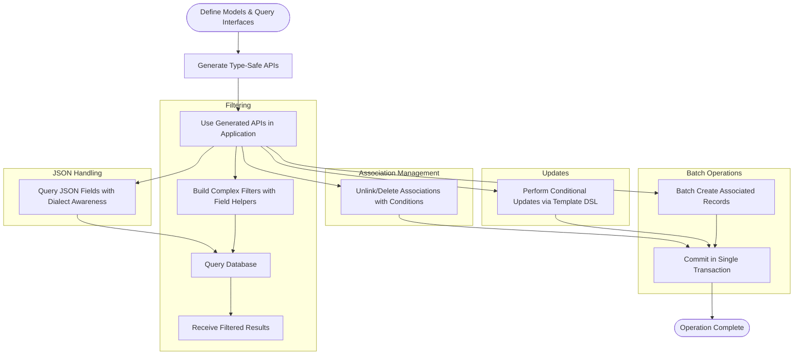

# Real-World Scenarios and Patterns

Explore practical, scenario-driven examples that illustrate how GORM CLI empowers you to implement complex, real-world database operations with type-safe, fluent APIs. This guide dives into filtering techniques, batch operations, JSON field handling, and edge-case query construction — all showcasing how GORM CLI’s generated code simplifies your Go application's data layer.

---

## 1. Workflow Overview

### Task Description
This guide helps you translate common and advanced database interaction scenarios into type-safe GORM CLI queries and updates, minimizing boilerplate and maximizing safety.

### Prerequisites
- Familiarity with Go and GORM
- A GORM CLI-generated codebase with your models and query interfaces defined and generated
- A working GORM DB connection integrated with the generated APIs

### Expected Outcome
By following the examples, you will gain confidence in handling:
- Building dynamic, multi-condition filters
- Performing batch operations on associations
- Updating records with conditional logic
- Leveraging custom JSON field operations
- Managing edge cases such as conditional WHERE/SET clauses

### Time Estimate
20–30 minutes to fully understand and try the examples with your code.

### Difficulty Level
Intermediate — requires understanding of Go generics, SQL templating via GORM CLI, and GORM query patterns.

---

## 2. Practical Scenario Examples

### 2.1 Filtering with Dynamic Conditions

Filter a list of users based on multiple dynamically constructed predicates using the generated model field helpers.

```go
users, err := gorm.G[User](db).
    Where(
        generated.User.Name.Like("%smith%"),
        generated.User.Age.Between(30, 50),
        generated.User.Role.Eq("admin"),
    ).
    Find(ctx)
if err != nil {
    // handle error
}
```

This translates to a SQL query selecting users named like 'smith' between ages 30 and 50 with role 'admin'.

---

### 2.2 Batch Operations on Associations

Efficiently create and link multiple associated records in batch during a single parent record creation.

```go
err := gorm.G[User](db).
    Set(
        generated.User.Name.Set("batch_creator"),
        // Batch create and link pets
        generated.User.Pets.CreateInBatch([]Pet{
            {Name: "Fido"},
            {Name: "Rex"},
        }),
    ).
    Create(ctx)
if err != nil {
    // handle error
}
```

This batch inserts pets 'Fido' and 'Rex' and associates them with the new user.

---

### 2.3 Conditional Updates with Template DSL Logic

Use generated query interface methods that incorporate conditional SET clauses within SQL templates.

```go
// Example: Update user's name and age, setting is_adult accordingly
err := generated.Query[User](db).
    UpdateInfo(ctx, User{Name: "new_name", Age: 25}, existingUserID)
if err != nil {
    // handle error
}
```

The UpdateInfo interface method uses the template DSL:

```sql
UPDATE @@table
{{set}}
  {{if user.Name != ""}} name=@user.Name, {{end}}
  {{if user.Age > 0}} age=@user.Age, {{end}}
  {{if user.Age >= 18}} is_adult=1 {{else}} is_adult=0 {{end}}
{{end}}
WHERE id=@id
```

Ensuring only non-empty fields update and is_adult is computed accordingly.

---

### 2.4 Handling Complex Filter Lists

Filter records matching multiple user-specified filters combined with OR conditions.

```go
filters := []User{
    {Name: "alice", Age: 20, Role: "active"},
    {Name: "dan", Age: 40, Role: "pending"},
}
results, err := generated.Query[User](db).Filter(ctx, filters)
if err != nil {
    // handle error
}
```

This generates a query matching any user in the filter list with conditions on name, age, and role.

---

### 2.5 Time Range Filtering

Fetch records filtered by a time range dynamically.

```go
start, _ := time.Parse(time.RFC3339, "2024-01-01T00:00:00Z")
end := time.Now()
users, err := generated.Query[User](db).FilterWithTime(ctx, start, end)
if err != nil {
    // handle error
}
```

The generated method uses conditional WHERE for start and end times.

---

### 2.6 JSON Field Querying Across Databases

Use the provided JSON field helper for dialect-aware querying of JSON columns.

```go
got, err := gorm.G[User](db).
    Where(generated.User.Profile.Equal("$.vip", true)).
    Take(ctx)
if err != nil {
    // handle error
}
```

This generates SQL that adapts to MySQL, SQLite, or PostgreSQL JSON querying syntax transparently.

---

### 2.7 Managing Unlink and Delete Operations on Associations

Carefully unlink or delete associated records based on conditions.

```go
// Unlink pets named 'fido' from user
err := gorm.G[User](db).
  Where(generated.User.ID.Eq(1)).
  Set(
    generated.User.Pets.Where(generated.Pet.Name.Eq("fido")).Unlink(),
  ).
  Update(ctx)

// Delete pets with name 'old'
err = gorm.G[User](db).
  Where(generated.User.ID.Eq(1)).
  Set(
    generated.User.Pets.Where(generated.Pet.Name.Eq("old")).Delete(),
  ).
  Update(ctx)
```

Unlink clears association FK without deleting data; Delete removes associated rows safely.

---

## 3. Troubleshooting & Tips

### Common Pitfalls
- **Empty Filters:** Some SQL templates only apply filters if conditions are met. Passing empty strings or zero values may result in queries returning all records.
- **Batch Creation Associations:** Ensure your models and associations are properly configured in GORM, and generated helpers reflect the relationship type.
- **JSON Queries:** JSON helpers require dialect awareness; confirm your DB dialect is supported to avoid syntax errors.
- **Unlink vs Delete Semantics:** Understand your association type to use Unlink (clears FK) or Delete (removes rows) correctly.

### Best Practices
- Use **generated model field helpers** to express filters, avoiding hand-written SQL strings.
- Leverage **template DSL** in interface comments to build expressive, reusable SQL methods.
- Perform **batch operations** when linking multiple associations to improve performance.
- Use **conditional SQL** (`{{if}}`, `{{where}}`, `{{set}}`) for dynamic query generation.
- Integrate **JSON field helpers** for complex data stored as JSON.

### Performance Considerations
- Batch operations reduce roundtrips; always prefer `CreateInBatch` over multiple individual creates.
- Avoid overly broad filters; use precise predicates to leverage DB indexes effectively.
- Cache generated code artifacts to avoid repeated generation overhead.

### Alternative Approaches
- If your filters become very complex, consider splitting queries or writing custom SQL templates for optimized paths.
- Use direct GORM methods in combination with generated predicates for on-the-fly ad-hoc queries.

---

## 4. Next Steps & Related Content

- **Using the Generated APIs:** Learn practical ways to consume query interfaces and field helpers for CRUD [Using the Generated APIs](/guides/core-workflows/using-generated-apis).
- **Working with Associations:** Deep dive into managing relationships with generated helpers [Working with Associations](/guides/advanced-patterns/working-with-associations).
- **Template-Based Query Generation:** Master the SQL template DSL for custom and dynamic queries [Template-Based Query Generation](/guides/advanced-patterns/template-based-sql).
- **Configuration & Extensibility:** Customize the generator for your project's needs [Configuring Generation](/overview/features-and-workflows/configuring-generation).

---

## 5. Illustrative Mermaid Diagram of Scenario Flow



---

This diagram illustrates the flow from defining your data models and query interfaces, generating code, through applying various practical operations using the generated APIs.

---

For in-depth explanations and comprehensive examples, refer to the related guides linked in the Next Steps section. This will help you elevate your GORM CLI usage for real-world, production-grade Go applications.
