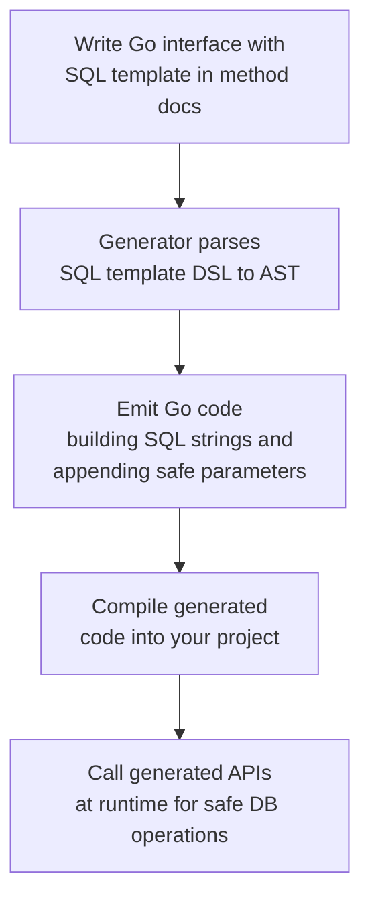

# SQL Template DSL in Practice

Harness the power of GORM CLI’s SQL Template DSL to write dynamic, safe, and maintainable SQL directly inside your Go interfaces. This guide guides you step-by-step on leveraging the template directives to craft conditional, parameterized SQL queries that integrate seamlessly into automatically generated, type-safe query APIs.

---

## 1. Understanding the Template DSL Workflow

### What This Guide Helps You Achieve
Learn how to write SQL statement templates using the specialized DSL that enables:

- **Safe parameter binding:** Ensuring SQL parameters are injected securely and correctly.
- **Dynamic conditional clauses:** Building WHERE, SET, and other SQL fragments with conditional logic.
- **Iteration over collections:** Generating SQL for slices or arrays dynamically.

### Required Knowledge
- Familiarity with Go interfaces.
- Experience writing basic SQL queries.
- Basic understanding of GORM and how it interacts with your models.

### Expected Outcome
By completing this guide, you will craft Go interface methods annotated with SQL templates that generate safe, flexible query code, reducing manual SQL concatenation and risk.

---

## 2. Core Template Directives Explained

In your Go interfaces, use specially formatted comments above methods containing SQL templates. Below are the key directives for dynamic SQL generation:

| Directive   | Purpose                        | Example                                   |
| ----------- | ------------------------------ | ----------------------------------------- |
| `@@table`   | Resolves to the model’s table name | `SELECT * FROM @@table WHERE id=@id`      |
| `@@column`  | Dynamic column name binding    | `WHERE @@column=@value`                    |
| `@param`    | Binds Go method parameter      | `WHERE name=@user.Name`                    |
| `{{where}}` | Conditional WHERE clause block | `{{where}} age > 18 {{end}}`               |
| `{{set}}`   | Conditional SET clause block   | `{{set}} name=@name {{end}}`               |
| `{{if}}`    | Conditional logic inside blocks| `{{if age > 0}} AND age=@age {{end}}`      |
| `{{for}}`   | Iteration over collections     | `{{for _, t := range tags}} tags LIKE concat('%',@t,'%') OR {{end}}` |

---

## 3. Writing Template-Annotated Interface Methods

Create interface methods with Go syntax, but annotate them with comment blocks containing your SQL templates using the DSL syntax.

### Example Interface with Template DSL
```go
// Query[T any] defines dynamic SQL queries with templates.
type Query[T any] interface {
  // Select a row by ID with a literal SQL template.
  //
  // SELECT * FROM @@table WHERE id=@id
  GetByID(id int) (T, error)

  // Filter by dynamic column name and value.
  //
  // SELECT * FROM @@table WHERE @@column=@value
  FilterWithColumn(column string, value string) (T, error)

  // Select with conditional filtering.
  //
  // SELECT * FROM @@table
  // {{where}}
  //   {{if user.ID > 0}}
  //     WHERE id=@user.ID
  //   {{else if user.Name != ""}}
  //     WHERE name=@user.Name
  //   {{end}}
  // {{end}}
  QueryWith(user models.User) (T, error)

  // Update a user with dynamic SET clauses.
  //
  // UPDATE @@table
  // {{set}}
  //   {{if user.Name != ""}} name=@user.Name, {{end}}
  //   {{if user.Age > 0}} age=@user.Age, {{end}}
  //   {{if user.Age >= 18}} is_adult=1 {{else}} is_adult=0 {{end}}
  // {{end}}
  // WHERE id=@id
  UpdateInfo(user models.User, id int) error
}
```

> Each annotation block starts with `//` followed by SQL text incorporating DSL directives.

### Key Points
- Naming parameters to match function parameters (e.g., `@id`, `@user.Name`) ensures correct binding.
- Use `@@table` to refer dynamically to the model’s underlying table.
- Wrap conditional SQL fragments inside `{{where}}` and `{{set}}` blocks to omit when conditions do not apply.

---

## 4. Detailed Directive Usage & Patterns

### 4.1 Safe Parameter Binding

All placeholders starting with `@` are automatically parameterized to avoid SQL injection.

```sql
SELECT * FROM @@table WHERE id=@id AND name=@name
```

This compiles into a query with safe argument substitutions.

### 4.2 Conditional WHERE Clauses

Use `{{where}}` to wrap optional WHERE filters that only emit if conditions are met.

```sql
SELECT * FROM @@table
{{where}}
  {{if name != ""}} name=@name {{end}}
  {{if age > 0}} AND age=@age {{end}}
{{end}}
```

- Empty or false conditions skip those SQL fragments entirely.
- Automatic trimming of extra `AND`/`OR` ensures valid SQL.

### 4.3 Conditional SET Clauses for UPDATE

Building dynamic UPDATE statements:

```sql
UPDATE @@table
{{set}}
  {{if user.Name != ""}} name=@user.Name, {{end}}
  {{if user.Age > 0}} age=@user.Age {{end}}
{{end}}
WHERE id=@id
```

- Trailing commas are trimmed automatically.

### 4.4 Iterating Over Collections

Generate repeated conditions or value lists dynamically:

```sql
SELECT * FROM @@table
{{where}}
  {{for _, tag := range tags}}
    {{if tag != ""}} tags LIKE concat('%',@tag,'%') OR {{end}}
  {{end}}
{{end}}
```

- Efficiently create OR clauses or IN-lists dynamically in SQL.

### 4.5 If/Else If/Else Logic

Support multi-branch logic inside templates:

```sql
{{if condition1}}
  filter1
{{else if condition2}}
  filter2
{{else}}
  defaultFilter
{{end}}
```

This controls emitted SQL fragments precisely based on runtime state.

---

## 5. Real-World Example: Search Users

```go
// SearchUsers queries users with optional name and age filters.
//
// SELECT * FROM @@table
// {{where}}
//   {{if user.Name != ""}} name=@user.Name {{end}}
//   {{if user.Age > 0}} AND age=@user.Age {{end}}
// {{end}}
SearchUsers(user models.User) ([]T, error)
```

### Usage
```go
users, err := generated.Query[User](db).SearchUsers(ctx, models.User{Name: "jinzhu", Age: 25})
```

- If only Name is provided, SQL adds `WHERE name=?`.
- If Age is zero, age filter is omitted.

---

## 6. Using Generated APIs from Templates

After running `gorm gen`, interface methods become strongly typed functions emitting compiled SQL with parameter bindings:

```go
// Raw: SELECT * FROM users WHERE id=123
user, err := generated.Query[User](db).GetByID(ctx, 123) 

// With dynamic filter
users, err := generated.Query[User](db).FilterByNameAndAge(ctx, "jinzhu", 25).Find(ctx)

// Update with conditional SET clause
err := generated.Query[User](db).UpdateInfo(ctx, User{Name: "jinzhu", Age: 20}, 1)
```

This saves manual SQL writing and ensures compile-time safety.

---

## 7. Best Practices & Tips

- **Use descriptive parameter names** matching your method signatures exactly.
- Always use `{{where}}` and `{{set}}` blocks for optional clauses to avoid malformed SQL.
- Trim escaping `\@` when you want to emit a literal '@' in the SQL, not a placeholder.
- Use `@@table` and `@@column` for automatic table and column name resolutions.
- Leverage iteration (`{{for}}`) for generating complex list or OR conditions compactly.
- Validate SQL templates incrementally by generating and reviewing the produced Go code.

---

## 8. Common Pitfalls & Troubleshooting

<AccordionGroup title="Troubleshooting SQL Template DSL">  
<Accordion title="SQL Generates Syntax Errors or Unexpected Queries">  
- Verify correct use of `{{where}}` and `{{set}}` for conditional blocks.
- Ensure no unclosed `{{end}}` tags.
- Trimming logic handles commas and AND/OR automatically, so avoid manual trailing commas.
- Use `\@` to emit literal '@' if needed.
</Accordion>  
<Accordion title="Parameters Not Binding or Mismatched">  
- Confirm parameter names in SQL comments match Go method parameters exactly, including nested fields (e.g., `@user.Name`).
- Remember unannotated parameters are injected as `context.Context` by default.
</Accordion>  
<Accordion title="Runtime Errors on Generated Code">  
- Check that your interface method signatures return error type as last return value.
- Consult generated code and logs when generator panics parsing templates.
</Accordion></AccordionGroup>

---

## 9. How GORM CLI Parses and Generates from Templates

Behind the scenes, GORM CLI’s generator parses these annotations into an AST with nodes for text, conditionals, loops, and parameter placeholders. It then emits Go code that builds SQL strings dynamically and safely appends parameters.

### Simplified Flow


This pipeline ensures your SQL logic stays in Go interfaces, cleanly separated from handwritten queries.

---

## 10. Next Steps & Related Content

- **Try it out:** Write your first query interface with templates following this guide.
- **Field Helpers:** Explore the [Model-driven Field Helpers](https://your-doc-link/guides/getting-started/field-helpers-basics) for filters and updates.
- **Associations:** Learn how to handle related records with association helpers.
- **Customization:** Configure generation behavior with a `genconfig.Config` for advanced control.
- **Troubleshooting:** Consult the [Troubleshooting & Common Issues](https://your-doc-link/getting-started/first-generation/troubleshooting) guide if you encounter problems.

---

For comprehensive examples, see the [official examples/query.go file](https://github.com/go-gorm/cli/blob/main/examples/query.go).

---

### Code Examples from Provided Query Interface

```go
// Interface with annotated SQL templates
// FilterByNameAndAge composes a WHERE clause with fixed parameters.
// where("name=@name AND age=@age")
FilterByNameAndAge(name string, age int)

// Example SQL:
// SELECT * FROM @@table WHERE name=@name AND age=@age

// Filtering with time range using conditional WHERE
//
// SELECT * FROM @@table
// {{where}}
//   {{if !start.IsZero()}}
//     created_at > @start
//   {{end}}
//   {{if !end.IsZero()}}
//     AND created_at < @end
//   {{end}}
// {{end}}
FilterWithTime(start, end time.Time) ([]T, error)
```

---

### Summary
You now have a practical workflow to write dynamic, type-safe SQL using GORM CLI’s template DSL directly inside your Go interface comments. This modern approach enhances maintainability, performance, and security by moving SQL construction into a declarative, composable form.
