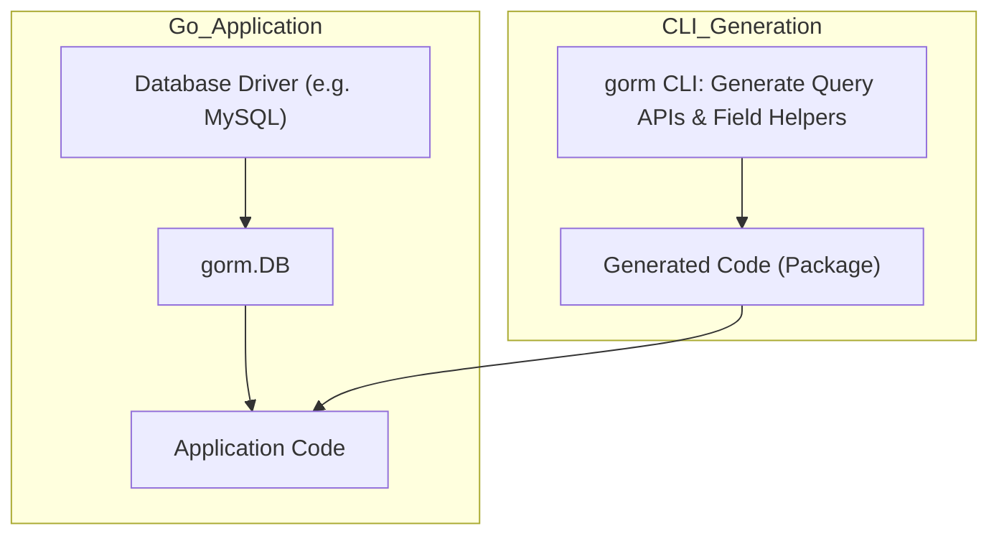

# Seamless Integration with GORM and Real Applications

This guide details the essential workflow to integrate APIs generated by GORM CLI with GORM itself and incorporate them smoothly into your larger Go applications. You will learn how to initialize GORM and connect it to database adapters, wire generated APIs into your project, and troubleshoot common pitfalls to ensure reliable upgrades and stable integration.

---

## Workflow Overview

### What You Will Achieve
By following this guide, you will set up the environment and code structure to use GORM CLI-generated query APIs and model-driven field helpers alongside native GORM functionality. Your Go application will benefit from type-safe, templated queries and model helpers while retaining full flexibility with GORM's powerful ORM features.

### Prerequisites
- Go 1.18 or higher installed
- GORM CLI installed (`go install gorm.io/cli/gorm@latest`)
- GORM (v1.23+) and a compatible database driver (e.g., MySQL, SQLite) imported in your project
- Basic familiarity with Go modules and GORM ORM usage
- Generated code from your query interfaces and models via GORM CLI in place

### Expected Outcome
- A working Go app where you can call generated query interfaces and use field helpers
- Established database connections with adapted drivers and GORM configuration
- Clear understanding of how your generated code fits into standard Go + GORM applications

### Time Estimate
15-30 minutes to integrate and verify basic functionality

### Difficulty Level
Intermediate (basic Go and GORM knowledge required)

---

## Step-by-Step Integration Instructions

### 1. Initialize Your Database Connection with GORM

Start by creating and configuring your GORM DB instance with the appropriate driver.

```go
import (
	"gorm.io/driver/mysql" // or other drivers like sqlite, postgres
	"gorm.io/gorm"
)

func setupDB() (*gorm.DB, error) {
	dsn := "user:password@tcp(127.0.0.1:3306)/dbname?parseTime=true&charset=utf8mb4&loc=Local"
	db, err := gorm.Open(mysql.Open(dsn), &gorm.Config{})
	return db, err
}
```

> **Tip:** Use environment variables to manage sensitive DSNs and connection parameters securely.


### 2. Import Generated Query APIs and Field Helpers

The code output by GORM CLI typically resides in a generated package, for example `generated` or similar based on your configuration.

```go
import (
	"context"
	"your_project/generated"
	"gorm.io/gorm"
)

func useGeneratedQueries(db *gorm.DB) error {
	ctx := context.Background()
	// Example: Invoke generated query method
	userQuery := generated.Query[models.User](db)
	user, err := userQuery.GetByID(ctx, 123)
	if err != nil {
		return err
	}
	fmt.Println("User fetched:", user.Name)
	return nil
}
```

> **Best Practice:** Pass `context.Context` to all generated query methods to allow better control of request lifecycles.


### 3. Leverage Model-Driven Field Helpers with GORM Queries

Combine generated field helpers with native GORM methods for building expressive queries.

```go
import "your_project/generated"

func fetchAdultUsers(db *gorm.DB, ctx context.Context) ([]models.User, error) {
	var users []models.User
	err := gorm.G[models.User](db).
		Where(generated.User.IsAdult.Eq(true)).
		Find(ctx, &users)
	return users, err
}
```


### 4. Wiring Generated APIs in Larger Applications

- Organize your code so that generated packages are imported by application or service layers
- Initialize DB connections once and pass the `*gorm.DB` instance throughout your app
- Use generated queries as your primary data access API to ensure type safety and templated SQL benefits


### 5. Common Gotchas & How to Avoid Them

- **Missing Context in Method Calls**: Always supply `context.Context` when calling generated methods; the generator auto-injects it if missing from your interface but your app code must provide it explicitly.

- **Incorrect DB Initialization**: Use the correct dialect and DSN format for your database adapter to avoid connection failures.

- **Directory Mismatches in Generation**: Ensure that the `-o` (output) path in `gorm gen` matches your project's import path structure to prevent import errors.

- **Overlapping Model Definitions**: Your models used in the generation step and in your application must align to avoid type conflicts.

- **Upgrading GORM or GORM CLI**: Refer to release notes and migrate your generated code when upgrading to newer versions to accommodate breaking changes or improvements.


---

## Examples

### Example: Main Application Entry using GORM and Generated Code

```go
package main

import (
	"context"
	"fmt"
	"log"

	"your_project/generated"
	"your_project/models"
	"gorm.io/driver/mysql"
	"gorm.io/gorm"
)

func main() {
	dsn := "user:pass@tcp(localhost:3306)/mydb?parseTime=true&charset=utf8mb4&loc=Local"
	db, err := gorm.Open(mysql.Open(dsn), &gorm.Config{})
	if err != nil {
		log.Fatalf("failed to connect database: %v", err)
	}

	ctx := context.Background()

	// Use generated query API
	query := generated.Query[models.User](db)
	user, err := query.GetByID(ctx, 1)
	if err != nil {
		log.Fatalf("failed to get user: %v", err)
	}

	fmt.Printf("Fetched User: %s (Age: %d)\n", user.Name, user.Age)
}
```


### Example: Updating a User via Generated Methods and GORM

```go
func updateUserAge(db *gorm.DB, ctx context.Context, id uint, newAge int) error {
	query := generated.Query[models.User](db)
	// Build an update object
	userUpdate := models.User{Age: newAge}
	return query.UpdateInfo(ctx, userUpdate, int(id))
}
```

---

## Troubleshooting & Tips

<AccordionGroup title="Common Integration Challenges">
<Accordion title="Connection Errors">
- Verify your DSN string and database server are correct.
- Check firewall and network accessibility.
- Enable debug logging in GORM with `db = db.Debug()` to get detailed SQL.
</Accordion>

<Accordion title="Generated Code Import Fails">
- Confirm the output directory of the `gorm gen` command is included in your `go.mod` module path.
- Ensure you have run `go mod tidy` after generation.
</Accordion>

<Accordion title="Unexpected Query Errors or Panics">
- Check that your SQL template annotations in the interface are syntactically correct.
- Make sure the models used in interfaces match those in your package.
</Accordion>

<Accordion title="Upgrading GORM or GORM CLI">
- After upgrading, regenerate your code.
- Review changelogs for compatibility notes.
- Ensure your custom genconfig.Config is adjusted if needed.
</Accordion>
</AccordionGroup>

<Tip>
For performance-sensitive code paths, use GORM CLI’s field helpers to construct predicates instead of raw SQL strings.
</Tip>

---

## Next Steps & Related Content

- Explore the [Using Model-Driven Field Helpers guide](/guides/core-getting-started/field-helper-basics) to write expressive queries.
- Read [Working with Associations](/guides/core-getting-started/association-operations) for managing relationships.
- Visit [Best Practices for Interface Design and Query Safety](/guides/practices-integration/practices-patterns) to improve your interface planning.
- If you face generation issues, review [Troubleshooting Setup & Generation Issues](/getting-started/first-run-usage/troubleshooting).
- For advanced code customization, see [Configuring Code Generation with genconfig](/guides/advanced-patterns/generation-config).

---

## Diagram: Integration Workflow Overview



This diagram illustrates how the CLI generates code that the application imports to interact with a GORM-managed database connection established through the selected database driver.

---