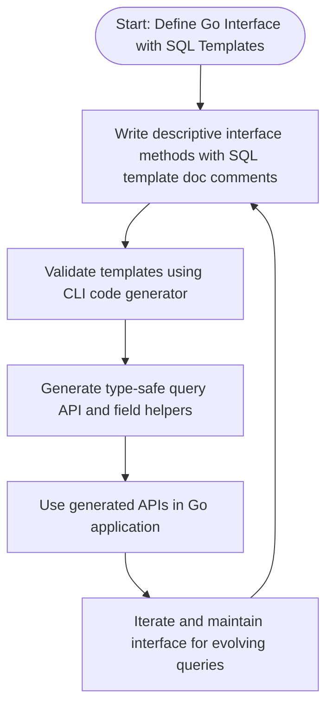

# Best Practices for Interface Design and Query Safety

## Workflow Overview

### Purpose
This guide helps you design robust, safe, and maintainable Go interfaces for GORM CLI query code generation. It focuses on proven interface organization patterns, naming conventions, and strategies to maximize compile-time safety when writing raw SQL templates in interface methods.

### Prerequisites
- Familiarity with Go interfaces and methods.
- Basic knowledge of GORM CLI’s code generation using interfaces annotated with SQL templates.
- A setup project with model structs ready for code generation.

### Expected Outcome
After following this guide, you will have:
- Well-structured, scalable interfaces that produce clear, type-safe query code.
- A strategy for naming and organizing your interfaces for team collaboration.
- Methods that use template DSL effectively to ensure safety and query correctness.

### Time Estimate
30–45 minutes to design or refactor interfaces following the patterns.

### Difficulty Level
Intermediate

---

## Designing Query Interfaces: Step-by-Step Guidance

### 1. Define Clear Interface Responsibilities
- Group related queries logically into interfaces representing a cohesive unit, e.g., `UserQuery`, `OrderQuery`.
- Avoid overly large or catch-all interfaces which are hard to maintain.

<Check>
Keeping interfaces focused enables better readability and easier code generation.
</Check>

### 2. Name Interfaces with Consistent Conventions
- Use clear, descriptive names that start with a meaningful prefix such as `Query` or `Repository`.
- Example: `Query[T any]`, `UserQuery[T any]`, or `OrderQuery[T any]`.

### 3. Embed Generics Explicitly
- Define scope-generics on interfaces for flexibility, e.g., `Query[T any]`.
- This enables the generated type-safe APIs to work with any model struct.

### 4. Write Method Signatures with Intent
- Method names should express query purpose clearly, e.g., `GetByID`, `FilterByNameAndAge`.
- Parameters must clearly correlate with SQL placeholders.
- Include `context.Context` implicitly via the generator if missing — don't require users to add it manually.

### 5. Embed SQL Templates in Doc Comments
- Write raw SQL or templated SQL within method comments to define the query.
- Use GORM CLI’s template DSL directives (`@@table`, `@param`, `{{where}}`, `{{set}}`, etc.) to enable flexibility.
- Example:

```go
// GetByID retrieves a record by its primary key
//
// SELECT * FROM @@table WHERE id=@id
GetByID(id int) (T, error)
```

### 6. Use Template DSL to Maximize Safety
- Leverage `@@table` for automatic table name resolution.
- Use parameter bindings like `@param` to avoid SQL injection.
- Use `{{where}}` blocks for optional filter clauses, avoiding malformed SQL.
- Use `{{set}}` blocks for dynamic update statements.

### 7. Return Appropriate Result Types
- Methods returning data should return the model type and `error`.
- Methods performing writes may return only `error`, or the interface type for chaining.

### 8. Avoid Method Overloading or Ambiguities
- Each method should have distinct parameters and clear purposes to avoid confusion.

### 9. Organize Code Files to Scale
- Separate interface files logically by domain or feature area.
- Consider file-level `genconfig.Config` to override output or inclusion for modular builds.

<Note>
The generator processes all interface files in the input directory, so keep your structure clean.
</Note>

---

## Practical Example

Here is a simplified interface to illustrate best practices:

```go
// Query interface for generic CRUD queries
// Includes basic filters and updates
// The SQL templates use DSL for expressive, safe queries

type Query[T any] interface {
  // GetByID queries by primary key
  // SELECT * FROM @@table WHERE id=@id
  GetByID(id int) (T, error)

  // FilterByNameAndAge queries by name and age
  // where("name=@name AND age=@age")
  FilterByNameAndAge(name string, age int) []T

  // UpdateUser updates user fields dynamically
  // UPDATE @@table
  // {{set}}
  //   {{if user.Name != ""}} name=@user.Name, {{end}}
  //   {{if user.Age > 0}} age=@user.Age {{end}}
  // {{end}}
  // WHERE id=@id
  UpdateUser(user T, id int) error
}
```

### Successful Generation Outcome
- Type-safe generated methods like `Query[User](db).GetByID(ctx, 123)`.
- SQL strings built safely from templates with parameter binding.
- Dynamic queries adapting to input without SQL syntax errors.

---

## Common Pitfalls and How to Avoid Them

<AccordionGroup title="Common Pitfalls">
<Accordion title="Missing context.Context in method parameters">
The generator automatically inserts `ctx context.Context` if missing. You should avoid manually including it to keep interfaces concise.
</Accordion>
<Accordion title="Returning incorrect error types or missing error returns">
Always ensure methods that return results include `error` as a return value following Go idioms. Single return values must be `error` if not returning data.
</Accordion>
<Accordion title="Unsafe SQL concatenation">
Never concatenate user input directly in templates. Use parameter binding (`@param`) and template DSL directives to safely inject variables.
</Accordion>
<Accordion title="Overly broad interfaces">
Interfaces that mix unrelated queries lead to maintenance headaches. Split by feature or aggregate roots to scale.
</Accordion>
<Accordion title="Ignoring `genconfig.Config` filtering">
Properly configure inclusion and exclusion rules in `genconfig.Config` to generate only intended interfaces and structs.
</Accordion>
</AccordionGroup>

---

## Additional Tips and Best Practices

- Use comments on interfaces and methods to document query semantics.
- Include example SQL in method docs as a guide.
- Use consistent naming for parameters matching SQL placeholders to avoid confusion.
- Take advantage of the built-in SQL DSL for complex conditions with `{{if}}`, `{{for}}`.
- Review generated code with `go fmt` and syntax checks to catch issues early.
- Write unit tests targeting generated methods following your usual testing approach.

---

## Troubleshooting Common Issues

<AccordionGroup title="Troubleshooting">
<Accordion title="Generated code compilation errors">
Check for:
- Interface method signatures missing error as last return value.
- Invalid or malformed SQL templates that break code generation.
- Missing or misnamed SQL parameters leading to mismatches.
</Accordion>
<Accordion title="Empty or missing generated files">
- Ensure interfaces are included via `IncludeInterfaces` in `genconfig.Config`.
- Check that input paths correctly point to files containing the interfaces.
- Verify there are no conflicting exclude filters.
</Accordion>
<Accordion title="Incorrect SQL behavior at runtime">
- Review SQL templates for proper use of DSL blocks.
- Make sure parameter names exactly match those used in method signatures.
- Use test interfaces with minimal queries to isolate issues.
</Accordion>
</AccordionGroup>

---

## Next Steps & Related Content

- [Defining Models & Query Interfaces](/getting-started/first-run-usage/defining-models-interfaces) for setup guidance.
- [Generating Code](/getting-started/first-run-usage/generating-code) for CLI usage.
- [Advanced SQL Template DSL](/guides/advanced-patterns/template-dsl) to master SQL templates.
- [Using Model-Driven Field Helpers](/guides/core-getting-started/field-helper-basics) for modeling support.
- [Configuring Code Generation with genconfig](/guides/advanced-patterns/generation-config) for fine-tuning.

---

## Visual Diagram: Interface Design and Generation Workflow



---