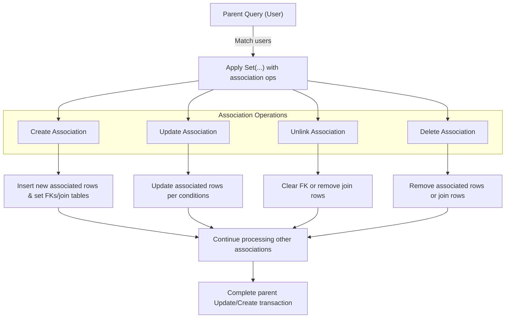

# Working with Associations: Patterns and Pitfalls

Explore how to manage your Go models' relational associations using GORM CLI's generated helpers. This guide walks you through end-to-end workflows for common association types — has-one, has-many, belongs-to, and many-to-many — including creation, updating, unlinking, and deletion operations, all while maintaining full type safety.

---

## 1. Understanding Associations and Their Semantics

GORM CLI generates association helpers as strongly typed fields on your generated models, enabling safe and fluent operations on related data.

### Association Types and Their Behaviors

| Association Type | Description | Unlink Semantics | Delete Semantics |
|------------------|-------------|------------------|------------------|
| **Has One**      | Parent owns one related child record, linked by child's FK | Sets child's FK to NULL | Deletes child row |
| **Has Many**     | Parent owns multiple child records, linked by child's FK | Sets all matching children's FK to NULL | Deletes all matching child rows |
| **Belongs To**   | Parent holds a foreign key pointing to another record | Sets parent's FK to NULL | Deletes the associated record |
| **Many2Many**    | Records linked via join table (no FK in either main table) | Removes join table rows only; both records remain | Removes join table rows only; both records remain |

<Tip>
The `Unlink()` operation clears associations without deleting data, while `Delete()` removes related data records (except many2many which deletes join records).
</Tip>

## 2. Prerequisites

Before working with associations:

- Define your models with proper GORM tags expressing relations (e.g., `gorm:"foreignkey:UserID"`, `many2many`, and polymorphic annotations).
- Generate code using GORM CLI (`gorm gen -i ./path -o ./generated`), ensuring the association fields appear with the appropriate `field.Struct[T]` or `field.Slice[T]` types.

Example model excerpt:

```go
type User struct {
  gorm.Model
  Pets []*Pet
  Account Account
  Company Company
  Languages []Language `gorm:"many2many:UserSpeak"`
}

// Association field for `Pets` will be generated as: `generated.User.Pets` of type `field.Slice[Pet]`
```

## 3. Working with Associations: Step-by-Step

### 3.1 Creating and Linking Associated Records

You can create new parent records and simultaneously create and link associated child records.

<Steps>
<Step title="Create with Has-Many Association">
Use `Create` on a slice association to add one child per matched parent.

```go
gorm.G[User](db).
  Set(
    generated.User.Name.Set("alice"),
    generated.User.Pets.Create(generated.Pet.Name.Set("fido")),
  ).
  Create(ctx)
```

_Outcome:_ Parent (`User`) and one linked child (`Pet`) record created.
</Step>

<Step title="CreateInBatch for Many Records">
Batch create multiple associated records per matched parent.

```go
gorm.G[User](db).
  Where(generated.User.ID.Eq(1)).
  Set(
    generated.User.Pets.CreateInBatch([]models.Pet{{Name: "a"}, {Name: "b"}}),
  ).
  Update(ctx)
```

_Outcome:_ Multiple linked pets created for user ID 1.
</Step>

<Step title="Many2Many Batch Create">
Batch link many-to-many records efficiently.

```go
gorm.G[User](db).
  Where(generated.User.ID.Eq(1)).
  Set(
    generated.User.Languages.CreateInBatch([]models.Language{{Code: "EN"}, {Code: "FR"}}),
  ).
  Update(ctx)
```

_Outcome:_ Languages linked via join table without creating duplicate Language rows.
</Step>
</Steps>

### 3.2 Updating Associated Records

You can filter and update associated records per matched parent.

```go
gorm.G[User](db).
  Where(generated.User.ID.Eq(1)).
  Set(
    generated.User.Pets.Where(generated.Pet.Name.Eq("fido")).Update(
      generated.Pet.Name.Set("rex"),
    ),
  ).
  Update(ctx)
```

_Outcome:_ Pet named "fido" associated with user ID 1 is renamed to "rex".

<Tip>
Filtering on association helpers allows granular control over which related rows to update.
</Tip>

### 3.3 Unlinking Associations

When you want to disassociate related records but keep them in the database:

- For belongs-to associations, the parent's FK becomes NULL.
- For has-one/has-many, the child's FK becomes NULL.
- For many2many, the join table rows are deleted.

```go
gorm.G[User](db).
  Where(generated.User.ID.Eq(1)).
  Set(
    generated.User.Pets.Unlink(),
  ).
  Update(ctx)
```

_Outcome:_ All pets of user ID 1 remain in the database, but no longer associated (FKs cleared).

### 3.4 Deleting Associated Records

Deletes the associated records themselves, respecting association types.

```go
gorm.G[User](db).
  Where(generated.User.ID.Eq(1)).
  Set(
    generated.User.Pets.Where(generated.Pet.Name.Eq("old")).Delete(),
  ).
  Update(ctx)
```

_Outcome:_ Child pet rows matching condition are removed from the database. For many2many, only join rows are deleted.


## 4. Best Practices and Patterns

- **Always prefer type-safe generated helpers** over raw SQL for maintainability and compiler safety.
- **Use `Where` conditions on associations** before unlinking or deleting to avoid unintended data loss.
- **For batch operations, use `CreateInBatch`** for improved performance and cleaner code.
- **Check association direction and FK ownership** to understand unlink/delete effect.
- **Leverage the fluent API chaining**, mixing `Where` with `Set` and `Update` to perform complex relational mutations atomically.

<Warning>
Unlink and Delete operations differ significantly; confirm your intent to discard related rows vs just disassociate.
</Warning>

## 5. Complex Scenarios: Polymorphic Associations and Self-Referencing

GORM CLI supports polymorphic and self-referencing associations with generated helpers.

- Example polymorphic: `Pet.Toy` — use `generated.Pet.Toy.Create(...)`, `Update(...)`, `Unlink()`, and `Delete()` with the same semantics.
- Self-referencing many2many (e.g., friends): manage associations through the generated self-typed helpers, respecting join semantics.


## 6. Troubleshooting Common Issues

<AccordionGroup title="Troubleshooting Association Operations">
<Accordion title="Why does Unlink not delete the child rows?">
Unlink only removes the association link (clears FK or join rows). To remove child rows, use `Delete()`.
</Accordion>
<Accordion title="Batch create inserts duplicates">
Ensure that the records you pass to `CreateInBatch` are new or use matching unique keys to prevent duplicates. Also verify FK constraints and join tables.
</Accordion>
<Accordion title="Association update affects no rows">
Check your `Where` conditions on the association helper carefully. If conditions don’t match any child rows, the update affects zero rows.
</Accordion>
<Accordion title="Foreign key not cleared after Unlink">
Verify that your model’s foreign key field is nullable (`*int`, `sql.NullInt64`, or pointer types) to allow NULL values when unlinking.
</Accordion>
<Accordion title="Polymorphic Unlink/Update errors">
Make sure that polymorphic associations include proper `OwnerType` and `OwnerID` fields set in your models to maintain filter conditions.
</Accordion>
</AccordionGroup>

## 7. Next Steps & Related Documentation

- Dive deeper into **Model Field Helpers: Filters, Updates, and Predicates** to leverage more powerful queries.
- Explore **Interface-Driven Query APIs: From Template to Usage** for crafting custom queries with SQL templates.
- Review **Basic Configuration and Generation Workflow** for customizing generated code output.
- Visit the **Examples/Output/models_relations_test.go** file for end-to-end use case implementations.

---

# Appendix: Code Samples

### Create and Link Associations
```go
// Create new user with one Pet
_, err := gorm.G[User](db).
	Set(
		generated.User.Name.Set("alice"),
		generated.User.Pets.Create(generated.Pet.Name.Set("fido")),
	).
	Create(ctx)
```

### Batch Create Many
```go
_, err := gorm.G[User](db).
	Where(generated.User.ID.Eq(1)).
	Set(
		generated.User.Pets.CreateInBatch([]models.Pet{{Name: "a"}, {Name: "b"}}),
	).
	Update(ctx)
```

### Update Associations with Filter
```go
_, err := gorm.G[User](db).
	Where(generated.User.ID.Eq(1)).
	Set(
		generated.User.Pets.Where(generated.Pet.Name.Eq("fido")).Update(
			generated.Pet.Name.Set("rex"),
		),
	).
	Update(ctx)
```

### Unlink Associations
```go
_, err := gorm.G[User](db).
	Where(generated.User.ID.Eq(1)).
	Set(generated.User.Pets.Unlink()).
	Update(ctx)
```

### Delete Associated Records
```go
_, err := gorm.G[User](db).
	Where(generated.User.ID.Eq(1)).
	Set(generated.User.Pets.Where(generated.Pet.Name.Eq("old")).Delete()).
	Update(ctx)
```


---

For comprehensive examples and tests, see the `examples/output/models_relations_test.go` in the GORM CLI repo.


---

# Diagram: Association Operation Flow



---