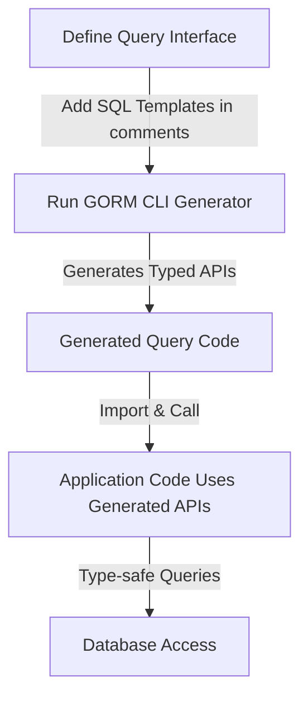

# Interface-Driven Query APIs: From Template to Usage

Welcome to the essential guide for mastering **interface-driven query APIs** with GORM CLI. This documentation walks you through defining Go interfaces adorned with SQL templates, generating concrete type-safe query methods, and leveraging these in your Go application for safe, readable, and maintainable database access. It also covers advanced template features, parameter binding, and extending usability to fit your custom needs.

---

## 1. Understanding the Workflow: From Interface to Query API

### What This Guide Helps You Achieve
You will learn how to write Go interfaces that describe your queries using SQL templates, run GORM CLI to generate the actual implementations, and finally, call these generated methods with confidence in type safety and correctness.

### Prerequisites
- Familiarity with Go programming and basic generics usage.
- Defined GORM models representing your database tables.
- GORM CLI installed (`go install gorm.io/cli/gorm@latest`).
- A Go package where interfaces and models coexist or are organized under the same directory.

### Expected Outcome
By the end of this guide, you will have:
- Defined interfaces that declare database query intentions with embedded SQL templates.
- Generated type-safe query APIs that return your model structs or slices.
- Used these APIs to perform complex queries effortlessly in your Go code.
- Leveraged advanced templating features such as conditional clauses, dynamic column binding, and iteration.

### Time Estimate
This guide requires approximately 20–30 minutes, depending on your familiarity with Go and SQL.

### Difficulty Level
Intermediate — this guide assumes you can write Go interfaces and understand SQL basics.

---

## 2. Defining Your Interface with SQL Templates

Your journey begins by defining interfaces in Go where each method includes an SQL query template in its comment. These templates empower GORM CLI to generate precise, type-safe code.

### Key Concepts
- **SQL Query Templates in Comments:** Each method comment holds the raw SQL or templated SQL directive.
- **Placeholders:** 
  - `@@table` dynamically binds to the model's database table.
  - `@@column` allows dynamic column binding.
  - `@param`, e.g., `@id`, links method parameters into SQL safely.
- **DSL Blocks:**
  - `{{where}} ... {{end}}` for conditional WHERE clauses.
  - `{{set}} ... {{end}}` for UPDATE SET clauses.
  - `{{if}} / {{else}} / {{end}}` for conditional logic.
  - `{{for}} ... {{end}}` for looping over collections.

### Example Interface
```go
package examples

import "gorm.io/cli/gorm/examples/models"
import "time"

type Query[T any] interface {
  // Get user by a unique ID
  // SELECT * FROM @@table WHERE id=@id AND name = "\@name"
  GetByID(id int) (T, error)

  // Select where a dynamic column equals a value
  // SELECT * FROM @@table WHERE @@column=@value
  FilterWithColumn(column string, value string) (T, error)

  // Conditional WHERE clause based on provided fields
  // SELECT * FROM users
  //   {{if user.ID > 0}}
  //       WHERE id=@user.ID
  //   {{else if user.Name != ""}}
  //       WHERE name=@user.Name
  //   {{end}}
  QueryWith(user models.User) (T, error)

  // Update user information conditionally
  // UPDATE @@table
  //  {{set}}
  //    {{if user.Name != ""}} name=@user.Name, {{end}}
  //    {{if user.Age > 0}} age=@user.Age, {{end}}
  //    {{if user.Age >= 18}} is_adult=1 {{else}} is_adult=0 {{end}}
  //  {{end}}
  // WHERE id=@id
  UpdateInfo(user models.User, id int) error

  // Filter with a list of users
  // SELECT * FROM @@table
  // {{where}}
  //   {{for _, user := range users}}
  //     {{if user.Name != "" && user.Age > 0}}
  //       (name = @user.Name AND age=@user.Age AND role LIKE concat("%",@user.Role,"%")) OR
  //     {{end}}
  //   {{end}}
  // {{end}}
  Filter(users []models.User) ([]T, error)

  // Simple filter using where clause
  // where("name=@name AND age=@age")
  FilterByNameAndAge(name string, age int)

  // Filter users created between start and end time
  // SELECT * FROM @@table
  //  {{where}}
  //    {{if !start.IsZero()}}
  //      created_at > @start
  //    {{end}}
  //    {{if !end.IsZero()}}
  //      AND created_at < @end
  //    {{end}}
  //  {{end}}
  FilterWithTime(start, end time.Time) ([]T, error)
}
```

### Tips
- Escape the `@` character inside SQL strings as `\@` to prevent premature parameter binding.
- Use Go’s zero-value checks inside conditions for flexible query construction.

---

## 3. Generating the Query API

With your interface ready, the next step is to run GORM CLI to generate the implementation.

### Step-by-Step

<Steps>
<Step title="Organize Your Code">
Place your query interface and Go models in the same package or directory.
</Step>
<Step title="Run GORM CLI Generation">
Execute the CLI with your input and desired output paths:

```bash
gorm gen -i ./examples -o ./generated
```

`-i` points to your input directory/file, `-o` designates the output directory.
</Step>
<Step title="Confirm Generated Code">
Check the `generated` folder for the created query API code which includes:
- The interface implementations
- Concrete methods reflecting your template queries
</Step>
</Steps>

### Success Criteria
Generated files should: 
- Not report any errors.
- Include method bodies matching your interface methods.
- Compile successfully with your project.

### Best Practice
Integrate the generation command into your build or CI process to keep APIs updated.

---

## 4. Using the Generated Query API

Once generated, you access your queries via typed functions that connect your GORM DB instance with your query definitions.

### Basic Usage Pattern
```go
import (
  "context"
  "gorm.io/gorm"
  "your_project/generated" // adjust to your generated code package
  "your_project/models"
)

func main() {
  db := setupGormDB() // your GORM *gorm.DB instance
  ctx := context.Background()

  // Create query instance
  query := generated.Query[models.User](db)

  // Fetch user by ID
  user, err := query.GetByID(ctx, 123)
  if err != nil {
    panic(err)
  }
  fmt.Printf("User: %+v\n", user)

  // Filter with dynamic column
  userByRole, err := query.FilterWithColumn(ctx, "role", "admin")
  if err != nil {
    panic(err)
  }
  fmt.Printf("User By Role: %+v\n", userByRole)
}
```

### Chaining & Fluent Querying
Some generated methods return query interfaces that allow further chaining, for example:

```go
query.FilterByNameAndAge(ctx, "dan", 30).Where("status = ?", "active").Find(ctx)
```

### Advanced Use with Templates
- Conditional queries let you pass complex parameter structs.
- Template DSL automatically handles empty parameters, letting you avoid verbose query logic in Go.

---

## 5. Deep Dive: Template DSL Features

The SQL template DSL inside comments offers powerful dynamic SQL generation tools.

| Directive | Description | Example |
| --- | --- | --- |
| `@@table` | Model's table name | `SELECT * FROM @@table WHERE id=@id` |
| `@@column` | Dynamic column in WHERE | `WHERE @@column=@value` |
| `@param` | Go method parameter binding | `WHERE name=@user.Name` |
| `{{where}} ... {{end}}` | Wrap conditional WHERE clauses | `{{where}} age > 18 {{end}}` |
| `{{set}} ... {{end}}` | Wrap conditional UPDATE SET clauses | `{{set}} name=@name {{end}}` |
| `{{if}} ... {{else}} ... {{end}}` | Conditionals inside templates | Use for branching SQL snippets |
| `{{for}} ... {{end}}` | Loop over collections | Iteratively bind slices or arrays |

### Example: Dynamic Update
```sql
UPDATE @@table
{{set}}
  {{if user.Name != ""}} name=@user.Name, {{end}}
  {{if user.Email != ""}} email=@user.Email {{end}}
{{end}}
WHERE id=@id
```

### Parameter Binding and Safety
Parameters like `@user.Name` automatically bind safely, preventing SQL injection and ensuring your queries remain secure and stable.

---

## 6. Extending and Customizing

You can extend this system for your own needs:

- Add custom interfaces to generate specific query methods.
- Use Go generics (`Query[T any]`) to reuse interfaces for any model.
- Define your own field helper types to support custom DB types (see also Model Field Helpers documentation).
- Control generation with package-level `genconfig.Config` (e.g., include/exclude interfaces, customize output paths).

---

## 7. Practical Tips & Common Pitfalls

### Tips
- Always include context (`ctx context.Context`) in method signatures for cancellation and deadline propagation.
- Use zero checks (`param != zero value`) inside your templates to prevent empty filters.
- Keep interface methods focused and clear for maintainability.
- Use escaping (`\@`) if you need literal `@` in SQL strings.

### Common Issues
- **Templates don't parse or generate:** Check comment syntax and template directives.
- **Generated code does not compile:** Ensure all model imports and dependencies are correctly set.
- **Runtime query errors:** Confirm parameter types and their expected SQL counterparts.

<AccordionGroup title="Troubleshooting Common Issues">
<Accordion title="Template Parsing Errors">
Verify that your SQL templates in comments follow the syntax exactly. Unmatched directive pairs or missing `{{end}}` can cause failures.
</Accordion>
<Accordion title="Incorrect Parameter Binding">
Make sure all parameters used in the template match method parameters exactly by name and type. Avoid unused or misspelled parameters.
</Accordion>
<Accordion title="Generation Output Missing Methods">
Check your `genconfig.Config` for inclusions/exclusions that might filter out your interfaces or structs unintentionally.
</Accordion>
</AccordionGroup>

---

## 8. Next Steps & Related Documentation

- **Try the quick start workflow** to generate your first APIs: [Quick Start: From Models to Queries](https://gorm.io/cli/guides/getting-started/quickstart-workflow)
- **Explore model field helpers** to integrate updates and filters with field-level safety: [Model Field Helpers](https://gorm.io/cli/guides/query-and-model-helpers/model-driven-field-helpers)
- **Learn to configure generation** with `genconfig.Config` for tailored code output: [Essential Configuration](https://gorm.io/cli/guides/getting-started/generation-config-basics)
- **Deep dive into templating DSL** for complex query scenarios: [SQL Template DSL Tutorial](https://gorm.io/cli/guides/query-and-model-helpers/template-dsl-tutorial)
- Review architecture and core concepts to understand internal mechanisms: [Architecture Overview](https://gorm.io/cli/overview/architecture-concepts/architecture-overview)

---

### Callout
<Tip>
Leverage these interface-driven APIs to shift query logic from raw SQL strings scattered in code to maintainable, reusable, and type-safe query methods increasing your app's robustness and developer productivity.
</Tip>

---

By adopting interface-driven query APIs with templated SQL comments, you unlock safe, fluent, and expressive database querying directly as part of your strongly typed Go codebase.


---

# Appendix: Example Generated Usage Snippet

```go
// Using generated queries
ctx := context.Background()
query := generated.Query[models.User](db)

// Get user by ID
user, err := query.GetByID(ctx, 123)

// Filter user with a dynamic column
u, err := query.FilterWithColumn(ctx, "role", "admin")

// Complex filtered users
users, err := query.FilterWithTime(ctx, now.Add(-24*time.Hour), now)
```

---

# For your convenience, here's a simplified Mermaid diagram of the flow from interface definition to usage:




---

# Further Assistance
If you encounter issues or need help optimizing your queries, consult Troubleshooting guides or reach out to the GORM community.


---

Enjoy the power of safe, expressive database access!