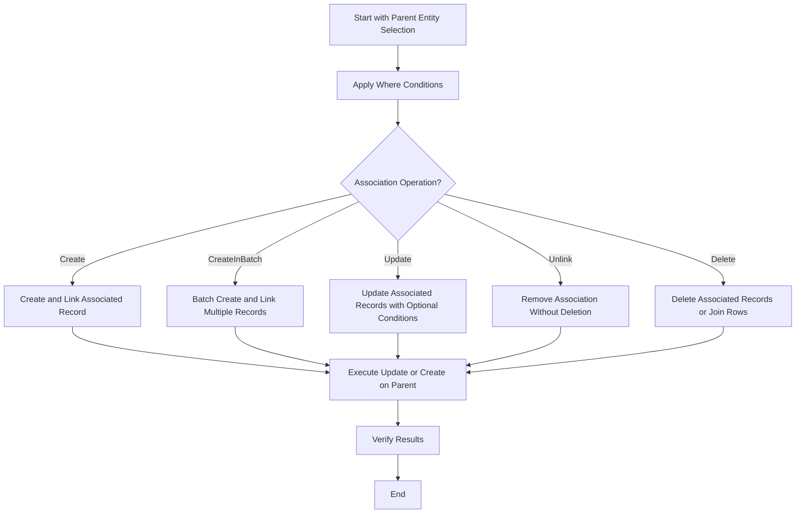

# Associations: Patterns and Best Practices

This guide focuses exclusively on managing one-to-one, one-to-many, and many-to-many relationships using the GORM CLI generated association helpers. You will learn practical and idiomatic techniques to create, update, unlink, and delete related data, along with advanced recommendations for transactional safety and batch operations.

---

## 1. Understanding Association Helpers

The GORM CLI generates association helpers on your models as either `field.Struct[T]` for single associations (e.g., `has one`, `belongs to`) or `field.Slice[T]` for multi-associations (e.g., `has many`, `many2many`). These helpers enable type-safe, fluent operations on associations.

### What You Can Do:
- **Create**: Insert and link related records
- **Update**: Modify fields in related records, optionally with filtering
- **Unlink**: Remove association links without deleting records
- **Delete**: Remove associated records (with semantics varying by association type)
- **Batch Create**: Efficiently create multiple related records

<Tip>
All association operations are composed using `Set(...)` methods combined with `.Update(ctx)` or `.Create(ctx)` calls on the parent entity builder.
</Tip>

---

## 2. One-to-Many and One-to-One Associations

This pattern often involves a parent with one or many child rows. Common examples:
- **User has many Pets** (has-many)
- **User has one Account** (has-one)

### Creating Associated Records

Use the generated association helper's `Create` method inside `Set(...)`:

```go
gorm.G[User](db).
  Where(generated.User.ID.Eq(userID)).
  Set(
    generated.User.Pets.Create(
      generated.Pet.Name.Set("fluffy"),
    ),
  ).
  Update(ctx)
```

*Outcome:* Creates a new pet named "fluffy" linked to the matched user.

### Updating Associated Records

To update child records with conditionals:

```go
gorm.G[User](db).
  Where(generated.User.ID.Eq(userID)).
  Set(
    generated.User.Pets.Where(generated.Pet.Name.Eq("fluffy")).
      Update(generated.Pet.Name.Set("rex")),
  ).
  Update(ctx)
```

*Outcome:* Changes pet named "fluffy" to "rex" for the matched user.

### Unlinking (Detaching) without Deleting

Use `Unlink` to remove the foreign key but leave the child record:

```go
gorm.G[User](db).
  Where(generated.User.ID.Eq(userID)).
  Set(
    generated.User.Pets.Unlink(),
  ).
  Update(ctx)
```

*Effect:* Sets `user_id` foreign keys on pets to NULL.

### Deleting Associated Records

Remove child rows entirely with `Delete()`:

```go
gorm.G[User](db).
  Where(generated.User.ID.Eq(userID)).
  Set(
    generated.User.Pets.Where(generated.Pet.Name.Eq("rex")).Delete(),
  ).
  Update(ctx)
```

*Effect:* Deletes the pet named "rex" linked to the user.

### Batch Create for Has-Many

You can create multiple child records efficiently:

```go
pets := []models.Pet{{Name: "bm1"}, {Name: "bm2"}}
gorm.G[User](db).
  Where(generated.User.ID.Eq(userID)).
  Set(
    generated.User.Pets.CreateInBatch(pets),
  ).
  Update(ctx)
```

*Outcome:* Links both pets to the user in one operation.

---

## 3. Many-to-Many Associations

These involve a join table managing the relationship, e.g., a User speaking many Languages.

### Creating and Linking Records

Create and associate a new many2many record with `Create` or `CreateInBatch`:

```go
// Single
gorm.G[User](db).
  Where(generated.User.ID.Eq(userID)).
  Set(
    generated.User.Languages.Create(
      generated.Language.Code.Set("EN"),
      generated.Language.Name.Set("English"),
    ),
  ).
  Update(ctx)

// Batch
langs := []models.Language{{Code: "FR"}, {Code: "ES"}}
gorm.G[User](db).
  Where(generated.User.ID.Eq(userID)).
  Set(
    generated.User.Languages.CreateInBatch(langs),
  ).
  Update(ctx)
```

### Updating Associated Records

Update target many2many rows with conditions:

```go
gorm.G[User](db).
  Where(generated.User.ID.Eq(userID)).
  Set(
    generated.User.Languages.Where(generated.Language.Code.Eq("EN")).
      Update(generated.Language.Name.Set("English-US")),
  ).
  Update(ctx)
```

### Unlinking & Deleting

- **Unlink** removes join table rows only; associated records remain.

```go
gorm.G[User](db).
  Where(generated.User.ID.Eq(userID)).
  Set(
    generated.User.Languages.Where(generated.Language.Code.Eq("EN")).Unlink(),
  ).
  Update(ctx)
```

- **Delete** removes join rows but keeps associated records.

```go
gorm.G[User](db).
  Where(generated.User.ID.Eq(userID)).
  Set(
    generated.User.Languages.Where(generated.Language.Code.Eq("FR")).Delete(),
  ).
  Update(ctx)
```

---

## 4. Belongs-To Associations

The parent holds the foreign key for the related entity. For example, a User belongs to a Company.

### Updating the Parent Side

You can update the related record via the child with conditions:

```go
gorm.G[User](db).
  Where(generated.User.ID.Eq(userID)).
  Set(
    generated.User.Company.Where(generated.Company.Name.Eq("Acme")).Update(generated.Company.Name.Set("NewCo")),
  ).
  Update(ctx)
```

### Unlinking (Clearing FK)

Unlink sets the foreign key to NULL without deleting the parent record:

```go
gorm.G[User](db).
  Where(generated.User.ID.Eq(userID)).
  Set(generated.User.Company.Unlink()).
  Update(ctx)
```

### Deleting Parent Records

Use `Delete()` with caution, as it removes the parent record:

```go
gorm.G[User](db).
  Where(generated.User.ID.Eq(userID)).
  Set(generated.User.Company.Delete()).
  Update(ctx)
```

---

## 5. Polymorphic Associations

Polymorphic relationships allow a model (e.g., Toy) to be owned by multiple parent types, with a shared foreign key set.

### Typical Workflow

```go
// Seed association: Pet has one Toy (polymorphic)
// Update Toy's name via association
gorm.G[Pet](db).
  Where(generated.Pet.ID.Eq(petID)).
  Set(
    generated.Pet.Toy.Where(generated.Toy.Name.Eq("ball")).Update(generated.Toy.Name.Set("cube")),
  ).
  Update(ctx)

// Unlink toy from pet (sets OwnerID=0, OwnerType="")
gorm.G[Pet](db).
  Where(generated.Pet.ID.Eq(petID)).
  Set(generated.Pet.Toy.Unlink()).
  Update(ctx)

// Delete toy
orm.G[Pet](db).
  Where(generated.Pet.ID.Eq(petID)).
  Set(generated.Pet.Toy.Delete()).
  Update(ctx)
```

---

## 6. Recommended Practice: Transactions

Because association operations can involve multiple database statements, it is best practice to wrap updates involving associations in transactions to ensure atomicity:

```go
tx := db.Begin()
if err := tx.Error; err != nil {
  return err
}

if _, err := gorm.G[User](tx).
  Where(generated.User.ID.Eq(userID)).
  Set(
    generated.User.Pets.Create(generated.Pet.Name.Set("rex")),
  ).
  Update(ctx); err != nil {
  tx.Rollback()
  return err
}

return tx.Commit().Error
```

This prevents partial failures leaving your data in inconsistent states.

---

## 7. Visualizing Typical Association Operation Flow



---

## 8. Troubleshooting and Tips

<AccordionGroup title="Common Issues and Solutions">
<Accordion title="Associated Records Not Created or Linked">
Ensure you use `.Set(...).Update(ctx)` or `.Set(...).Create(ctx)` correctly so that the changes propagate through the generated helpers.
</Accordion>
<Accordion title="Update on Association Not Applied">
Confirm that conditions inside `.Where(...)` match the desired subset; mismatch results in no records updated.
</Accordion>
<Accordion title="Unlinking Does Not Remove Association">
Remember unlink sets FK fields to NULL or removes join rows; verify the database schema supports nullable foreign keys.
</Accordion>
<Accordion title="Delete Removes More Records Than Expected">
Use precise filtering conditions on `Delete()` operations to avoid unintended deletions.
</Accordion>
</AccordionGroup>

---

## 9. Best Practices

- **Use Conditions to Limit Scope:** Always apply `.Where(...)` conditions on association operations to act on specific related records.
- **Prefer Unlink Before Delete for Many2Many:** Unlink removes the join row without deleting the associated record.
- **Batch Create for Efficiency:** Use `CreateInBatch` for inserting multiple related rows in one operation.
- **Wrap Complex Calls in Transactions:** This guards against partial updates or data inconsistency.

---

## 10. Next Steps & Related Guides

- [Your First Code Generation](/guides/getting-started/your-first-generation): Learn how to generate your initial type-safe APIs and helpers.
- [Using the Generated APIs](/guides/getting-started/using-generated-apis): How to integrate generated code effectively.
- [Advanced Field Helpers and Predicate Patterns](/guides/real-world-examples/working-with-field-helpers): Deep dive into building complex queries.
- [SQL Template DSL](/guides/real-world-examples/template-sql-dsl): Master templating for customized queries.

---

This page completes your understanding of advanced, practical usage patterns for association helpers generated by GORM CLI, empowering you to work confidently with relational models in Go projects.
