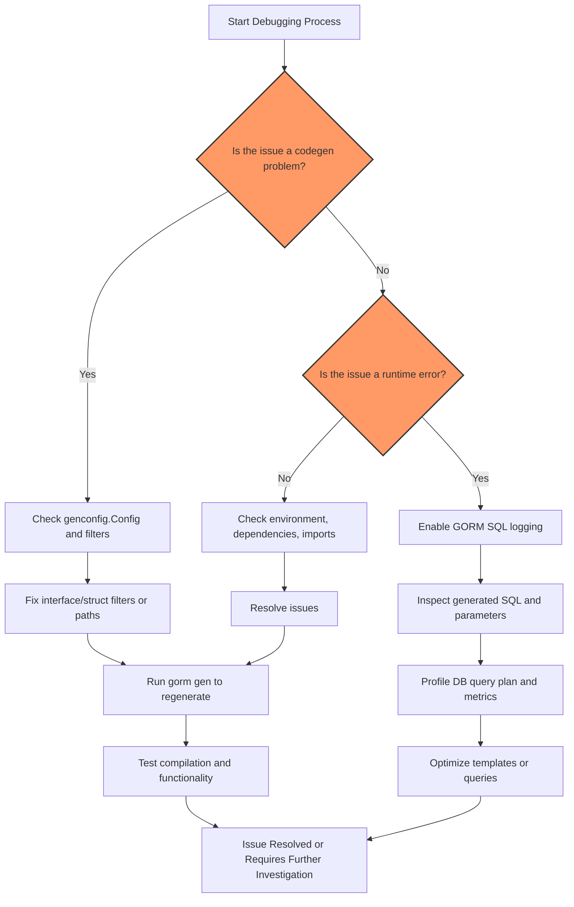

# Debugging, Troubleshooting, and Performance Tips

This guide provides actionable tips and expert advice for resolving common issues encountered when using GORM CLI, understanding diagnostic error messages, profiling generated SQL queries, and optimizing runtime performance. Armed with these insights, you will maintain smooth workflows and maximize the value of GORM CLI’s type-safe query APIs and model-driven field helpers.

---

## 1. Common Code Generation Issues and Their Solutions

### 1.1 Code Does Not Generate or Is Missing Expected Methods

- **Cause:** Interface or struct definitions are filtered out by the configuration.
- **Action:**
  - Verify your `genconfig.Config` includes the relevant interfaces and structs. Example:
    ```go
    var _ = genconfig.Config{
      IncludeInterfaces: []any{"Query*"},
      IncludeStructs: []any{"User"},
    }
    ```
  - Confirm your query interfaces contain properly formatted SQL templates in method comments.
  - Ensure your source package and file are included as input to the `gorm gen` command.

### 1.2 Errors in Parsing SQL Templates

- **Cause:** Syntax errors or unsupported constructs in interface method comments.
- **Action:**
  - Double-check SQL comments for valid syntax using the documented DSL:
    - Use `@@table`, `@@column`, `@param` placeholders.
    - Validate `{{where}}`, `{{set}}`, and control flow directives (`{{if}}`, `{{for}}`).
    
  - Avoid unescaped characters that can break parsing such as unescaped quotes, misplaced braces.

- **Tip:** Use the included `internal/gen/sqlparser_test.go` as a reference for how templates are processed.

### 1.3 Generated Code Fails to Compile

- **Cause:** Missing or incorrect import paths, incomplete interface or struct definitions.
- **Action:**
  - Run `go mod tidy` after generation to fix missing dependencies.
  - Confirm your models and interfaces are complete and exported.
  - Review generated imports and package paths to ensure consistency.

### 1.4 Generated Methods Return Unexpected Results

- **Cause:** SQL template logic does not match intent.
- **Action:**
  - Review method comments carefully—especially conditional clauses.
  - Test SQL logic standalone directly on your database.
  - Validate parameter binding by checking method signatures and usage in generated code.

---

## 2. Understanding Error Messages and Logs

- **Key Locations:**
  - Errors surfaced by `gorm gen` command during generation.
  - Runtime panics or errors from using generated query APIs.

- **Common Message Interpretations:**
  - `Method ...: must return error as last return value` — Fix interface method signature.
  - `Invalid SQL template ...` — Check comment formatting and use of DSL directives.
  - `Missing import` or unresolved types — Verify package paths and imports in source files.

- **Proactive Practices:**
  - Enable verbose logging of `gorm gen` by adding debug prints in your Go code where applicable.
  - Use Go tooling such as `go vet`, `go build` and `golangci-lint` to catch issues early.

---

## 3. Profiling and Inspecting Generated Queries

### 3.1 Extracting Generated SQL

- The generated query APIs provide raw SQL executed via GORM’s `Raw` and `Exec` methods.
- Use GORM’s logger by configuring the `gorm.DB` instance:

```go
db, err := gorm.Open(..., &gorm.Config{
  Logger: logger.Default.LogMode(logger.Info),
})
```

- Inspect logs to see fully substituted SQL statements.

### 3.2 Testing and Profiling Queries

- Write test cases using the generated APIs to validate SQL correctness (see `examples/output/query_test.go`).
- Use database profiling tools such as `EXPLAIN ANALYZE` (Postgres) or `EXPLAIN` (MySQL) on logged SQL statements.
- Identify N+1 queries or costly joins by analyzing query plans.

### 3.3 Runtime Metrics and Slow Query Detection

- Use GORM hooks or middleware to time query execution when using generated APIs.
- Aggregate metrics using tracing systems (e.g., OpenTelemetry) to monitor production databases.

---

## 4. Performance Optimization Tips

### 4.1 Minimize Unnecessary Updates and Creates

- Only invoke update operations when the data has changed.
- Use conditional setters in SQL templates with `{{if}}` to avoid redundant SQL updates.

### 4.2 Batch Operations

- Use `CreateInBatch` association helpers for efficient bulk inserts.
- Batch processing reduces DB roundtrips and improves transaction performance.

### 4.3 Filter Early

- Use generated field helpers and where clauses to push filtering conditions into SQL rather than post-processing in memory.

### 4.4 Avoid Select * When Not Needed

- Customize SQL templates to select only required columns to reduce data transferred.

### 4.5 Leverage Indexes and Database Constraints

- Align schema indexes with fields used in generated query filters.
- Use association helpers to handle foreign keys correctly and maintain referential integrity.

---

## 5. Additional Best Practices

- **Keep Your Interface Methods Focused:** Write clear, singular responsibility SQL templated methods for easier maintenance.
- **Modularize Configuration:** Use per-package `genconfig.Config` to tailor generation for large projects.
- **Regularly Update GORM CLI:** Benefit from fixes and performance improvements.
- **Integrate Generation in CI:** Automatically regenerate code to ensure sync between model/interface changes and generated code.

---

## 6. Troubleshooting Checklist

<AccordionGroup title="Common Troubleshooting Steps">
<Accordion title="Generated Code Missing Methods or Structs">
- Check if you applied include/exclude filters unintentionally.
- Confirm interface and struct names match those in the source.
- Verify correct package paths for input files.
</Accordion>
<Accordion title="SQL Template Parsing Failures">
- Validate comment formatting and special character escaping.
- Simplify template logic and test incrementally.
</Accordion>
<Accordion title="Generated Code Does Not Compile">
- Run `go mod tidy` and check imports.
- Inspect for naming collisions or unexported types.
</Accordion>
<Accordion title="Runtime Query Errors or Empty Results">
- Debug input parameter values.
- Enable SQL logging to verify query correctness.
</Accordion>
<Accordion title="Slow Performance or High Latency">
- Profile generated SQL with DB tools.
- Optimize templates to limit selected data.
- Use batch operations for mass inserts/updates.
</Accordion>
</AccordionGroup>

---

## 7. Next Steps & Related Content

- Continue exploring [Using the Generated Query APIs and Field Helpers](https://docs.gorm.io/guides/core-workflows/using-generated-apis) to improve your query patterns.
- Deepen your understanding of [Template-Based SQL with Interfaces](https://docs.gorm.io/guides/advanced-usage/writing-sql-templates) to write more expressive queries.
- Customize generation via [Generation Configuration](https://docs.gorm.io/guides/advanced-usage/generation-configuration) for tailored workflows.
- Apply [Working with Associations](https://docs.gorm.io/guides/core-workflows/working-with-associations) for advanced data relationships management.

---

<CardGroup cols={2}>
<Card title="GORM CLI GitHub Repository">
[https://github.com/go-gorm/cli](https://github.com/go-gorm/cli)
</Card>
<Card title="Core Concepts and Architecture">
[Architecture and Data Flow](https://docs.gorm.io/overview/system-architecture-core-concepts/architecture-and-dataflow)
</Card>
</CardGroup>

---

<Info>
Having a robust troubleshooting and optimization process ensures you can achieve production-grade, performant, and maintainable codebases using GORM CLI’s powerful generated APIs. Reach out to the community or GORM support forums with detailed logs and reproduction steps if you encounter unresolved issues.
</Info>


---

### Mermaid Diagram: Typical Debugging and Optimization Workflow



---

# Appendix: Useful Command Reference

- **Generate code:**
  ```bash
gorm gen -i ./path/to/your/interfaces -o ./generated
```

- **Run tests on generated code:**
  ```bash
go test ./generated/...
```

- **Enable verbose SQL logging in your app:**
  ```go
import (
  "gorm.io/gorm/logger"
  "gorm.io/gorm"
)

// ...
db, err := gorm.Open(mysql.Open(dsn), &gorm.Config{
  Logger: logger.Default.LogMode(logger.Info),
})
```

- **Clean Go modules:**
  ```bash
go mod tidy
```


---

<Source url="https://github.com/go-gorm/cli" branch="main" paths={[{"path": "examples/query.go", "range": "1-100"},{"path": "internal/gen/sqlparser_test.go", "range": "10-100"}]} />

