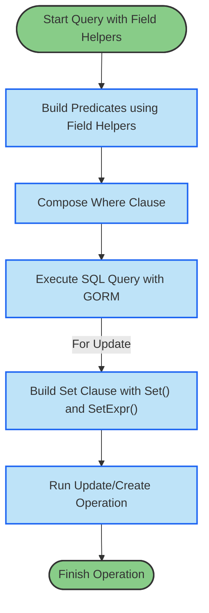

# Advanced Field Helpers and Predicate Patterns

Unlock the full power of GORM CLI’s model-driven field helpers to build expressive, type-safe queries, batch updates, and conditional predicates that simplify your data operations. This guide provides you with practical, step-by-step instructions and real-world examples for mastering complex predicate construction, batch operations, and conditional updates using generated code.

---

## 1. Overview

GORM CLI generates field helpers from your model structs that enable you to build fluent, strongly-typed queries and updates. Beyond basic equality filters, these helpers support advanced predicates, batch operations, conditional logic, and integration with GORM’s `Set()` for updates and creates. This page helps you:

- Understand and write complex predicates using field helpers
- Perform batch and conditional updates with expressive syntax
- Leverage association helpers for related data operations
- Implement safe zero-value and expression-based updates

### Prerequisites

- Have your models generated by GORM CLI into the expected packages
- Basic familiarity with generated field helpers for simple where conditions
- GORM v2 setup with a working database connection

### Expected Outcome

You will be able to write concise, readable, and type-safe queries and mutations with field helpers covering advanced cases, reducing boilerplate and runtime errors.

### Time Estimate

10-15 minutes to complete the examples and integrate patterns

### Difficulty Level

Intermediate – some prior experience with GORM and code generation recommended

---

## 2. Using Field Helpers for Complex Predicates

Field helpers translate your model fields into typed predicates and setters that you can combine safely.

### 2.1 Combine Multiple Predicates

You can use multiple field helpers inside a `Where` or `Where(...).Find()` call to compose AND clauses.

```go
// Find users older than 18 with role 'active'
users, err := gorm.G[models.User](db).
    Where(
        generated.User.Age.Gt(18),
        generated.User.Role.Eq("active"),
    ).
    Find(ctx)
if err != nil {
    // handle error
}
```

### 2.2 Using Common Predicate Methods

The generated helpers support a variety of predicate methods:

- `Eq(value)` for equality
- `Neq(value)` for inequality
- `Gt(value)`, `Gte(value)`, `Lt(value)`, `Lte(value)` for comparisons
- `Like(pattern)` for SQL LIKE queries
- `Between(low, high)` for range checks
- `In(values...)` for SQL IN clauses
- `IsNull()` and `IsNotNull()` for null checks

```go
// Find users with name LIKE '%jinzhu%'
users, err := gorm.G[models.User](db).
    Where(generated.User.Name.Like("%jinzhu%"))
```

### 2.3 Conditional Predicates

You can conditionally include predicates based on runtime logic:

```go
var conds []clause.Expression
if age > 0 {
    conds = append(conds, generated.User.Age.Gte(age))
}
if name != "" {
    conds = append(conds, generated.User.Name.Eq(name))
}
query := gorm.G[models.User](db).Where(conds...)
```

---

## 3. Advanced Update Patterns with `Set()` and Field Helpers

Use the fluent `Set()` method with field helper setters for clearer and safer updates.

### 3.1 Set Fields with Zero and Non-Zero Values

Fields can be set to zero values deliberately without GORM ignoring them.

```go
_, err := gorm.G[models.User](db).
    Where(generated.User.Name.Eq("alice"))
    .Set(
        generated.User.Age.Set(0),           // explicit zero int
        generated.User.IsAdult.Set(false),   // explicit zero bool
        generated.User.Role.Set("")        // explicit zero string
    ).
    Update(ctx)
if err != nil {
    // handle error
}
```

### 3.2 Use SQL Expressions for Updates

Field helpers support `SetExpr()` for expressions in updates.

```go
_, err := gorm.G[models.User](db).
    Where(generated.User.Name.Eq("bob"))
    .Set(
        generated.User.Age.SetExpr(clause.Expr{SQL: "age + ?", Vars: []any{1}}),
    ).
    Update(ctx)
```

### 3.3 Convenience Increment Methods

Use the `Incr(n int)` helper for incrementing numeric fields simply.

```go
_, err := gorm.G[models.User](db).
    Where(generated.User.Name.Eq("bob"))
    .Set(generated.User.Age.Incr(3)).
    Update(ctx)
```

### 3.4 Batch Updates

Apply updates on all records matching a condition using fluent syntax.

```go
rows, err := gorm.G[models.User](db).
    Where(generated.User.Role.Eq("pending"))
    .Set(generated.User.Role.Set("active"))
    .Update(ctx)

// rows contains number of affected rows
```

### 3.5 Combine Multiple Set Assignments

Set multiple fields at once in a single `Set()` call.

```go
_, err := gorm.G[models.User](db).
    Where(generated.User.Name.Eq("cathy"))
    .Set(
        generated.User.Role.Set("")
        generated.User.IsAdult.Set(false),
        generated.User.Score.Set(sql.NullInt64{}),
        generated.User.Age.SetExpr(clause.Expr{SQL: "age + ?", Vars: []any{2}}),
    ).
    Update(ctx)
```

---

## 4. Working with Associations in Field Helpers

Generated association helpers provide powerful methods for linked entity creation and mutation.

### 4.1 Create and Link Associations on Create

Create a new model instance with associated child records simultaneously.

```go
err := gorm.G[models.User](db).
    Set(
        generated.User.Name.Set("alice"),
        generated.User.Pets.Create(generated.Pet.Name.Set("fido")),
    ).
    Create(ctx)
```

### 4.2 Batch Create Associations

Create and link multiple related entities efficiently.

```go
err := gorm.G[models.User](db).
    Set(
        generated.User.Name.Set("polyglot"),
        generated.User.Languages.CreateInBatch([]models.Language{{Code: "EN"}, {Code: "FR"}}),
    ).
    Create(ctx)
```

### 4.3 Update Related Entities Conditionally

Update associated records based on filters.

```go
err := gorm.G[models.User](db).
    Where(generated.User.ID.Eq(1)).
    Set(generated.User.Pets.Where(generated.Pet.Name.Eq("fido")).
        Update(generated.Pet.Name.Set("rex")),
    ).
    Update(ctx)
```

### 4.4 Unlink and Delete Associations

- **Unlink** clears the association FK or join table rows without deleting main entities.
- **Delete** removes association records from the database.

```go
// Unlink all pets from user
err := gorm.G[models.User](db).
    Where(generated.User.ID.Eq(1)).
    Set(generated.User.Pets.Unlink()).
    Update(ctx)

// Delete associated pets named "old"
err = gorm.G[models.User](db).
    Where(generated.User.ID.Eq(1)).
    Set(generated.User.Pets.Where(generated.Pet.Name.Eq("old")).Delete()).
    Update(ctx)
```

### 4.5 Semantics by Association Type

| Association Type | Unlink Behavior                     | Delete Behavior             |
| ---------------- | --------------------------------- | -------------------------- |
| Belongs To       | Sets parent FK to NULL             | Deletes associated rows    |
| Has One / Many   | Sets child FK to NULL              | Deletes child rows         |
| Many2Many        | Removes join table rows only       | Removes join table rows    |

---

## 5. Custom Field Helpers and JSON Operations

GORM CLI supports custom field helpers for special columns, such as JSON.

### 5.1 Declaring JSON Field Helpers

Add a `gen:"json"` tag to your struct and map it via `genconfig.Config` to a JSON helper implementation.

```go
// Model
Profile string `gen:"json"`

// Configuration
FieldNameMap: map[string]any {
    "json": JSON{},
}
```

### 5.2 Using JSON Field Helper Methods

The JSON helper provides database-agnostic JSON query expressions.

```go
// JSON Equal expression
expr := generated.User.Profile.Equal("$.vip", true)
user, err := gorm.G[models.User](db).
    Where(expr).
    Take(ctx)
```

---

## 6. Troubleshooting & Tips

### Common Issues

- **Missing or incorrect bindings:** Ensure generated field helpers and associations exactly match model types.
- **Zero-value updates not applied:** Always use `Set()` with explicit `.Set(value)` or `.SetExpr()` methods.
- **Association operations not linking:** Check foreign key annotations and that associations exist in generated code.

### Best Practices

- Chain predicates with multiple field helper conditions for clarity and type safety.
- Use `Set()` for batch updates and creations instead of manual `Updates()`.
- Leverage `CreateInBatch` for efficient batch association handling.
- Avoid mixing raw SQL strings with generated field helpers to retain safety.

### Performance Considerations

- Combine predicates to minimize query round-trips.
- Use `.Where()` and `.Set()` fluently to batch update efficiently.
- Utilize batch creation methods for large datasets.

### Alternative Approaches

- For highly dynamic queries, combine field helpers with custom SQL templates in interfaces.
- Use custom field helpers to handle specialized types beyond JSON, e.g., encrypted fields.

---

## 7. Next Steps & Resources

- Explore [Your First Code Generation](/guides/getting-started/your-first-generation) to start using generated APIs.
- Learn about [Associations: Patterns and Best Practices](/guides/real-world-examples/associations-in-practice) to deepen association management.
- Review [Mastering the SQL Template DSL](/guides/real-world-examples/template-sql-dsl) for building custom SQL queries.
- Consult [Custom Field Helpers and JSON Mapping](/guides/real-world-examples/json-and-custom-fields) for advanced field types.


---

<AccordionGroup title="Example: Incrementing User Age">  
  <Accordion title="Go Code Example">  
```go  
ctx := context.Background()  
rows, err := gorm.G[models.User](db).  
    Where(generated.User.Name.Eq("bob")).  
    Set(generated.User.Age.Incr(3)).  
    Update(ctx)  
if err != nil {  
    // handle error  
}  
fmt.Printf("Updated %d rows\n", rows)  
```  
  </Accordion>  
  <Accordion title="Explanation">  
    This example increments the age of user named "bob" by 3 using the generated field helper's `Incr` method, which constructs an SQL expression safely.
  </Accordion>
</AccordionGroup>

<AccordionGroup title="Example: Creating a User With Pets">  
  <Accordion title="Go Code Example">  
```go  
err := gorm.G[models.User](db).  
    Set(  
        generated.User.Name.Set("alice"),  
        generated.User.Pets.Create(generated.Pet.Name.Set("fido")),  
    ).  
    Create(ctx)  
if err != nil {  
    // handle error  
}  
```  
  </Accordion>  
  <Accordion title="Explanation">  
    Creates a new user named "alice" and a related pet named "fido" in one operation. The association helper `Pets.Create` links the pet properly.
  </Accordion>
</AccordionGroup>

---

### Diagram: Predicate Evaluation and Update Flow


---

**Note:** Mastery of field helpers unlocks safer and more maintainable code with improved developer ergonomics when dealing with common and advanced database operations.

---

_For comprehensive onboarding, refer to related guides under the Getting Started and Guides tabs._
