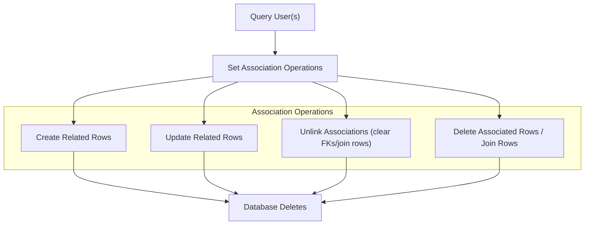

# Working with Associations: Patterns and Pitfalls

Explore expert patterns and common pitfalls when working with GORM CLI's association helpers. This guide clarifies handling CRUD operations, cascading effects, conditional updates, and unlinking strategies for different association types: has one, has many, belongs to, and many-to-many. Following these best practices will ensure type-safe, maintainable, and efficient database interactions.

---

## 1. Understanding Association Types and Helpers

GORM CLI generates model-driven **association helpers** that provide a fluent interface to manipulate related data safely and expressively. These helpers appear as either `field.Struct[T]` for single associations or `field.Slice[T]` for collections. Each association type has specific semantics:

| Association Type | Helper Type     | Behavior Summary                                              |
|------------------|-----------------|---------------------------------------------------------------|
| Has One          | `Struct[T]`     | One related child; supports create, update, unlink, delete    |
| Has Many         | `Slice[T]`      | Multiple children; batch create, update, unlink, delete       |
| Belongs To       | `Struct[T]`     | Parent side; unlink clears FK, deleting affects parent row    |
| Many-to-Many     | `Slice[T]`      | Join table managed; unlink/delete removes join rows only      |


---

## 2. Working with Association Operations

The basic operations supported on associations use the method chaining idiom with `Set(...).Update(ctx)` or `Set(...).Create(ctx)`. These operations cover the full lifecycle of association manipulation:

- **Create:** Insert new related rows and establish links
- **CreateInBatch:** Batch creation linking multiple related rows
- **Update:** Update matched associated rows optionally filtered by conditions
- **Unlink:** Remove association links without deleting data
- **Delete:** Remove associated rows (with variations depending on association type)


### 2.1 Has One and Belongs To

- *Create* inserts a new related record and links it.
- *Update* modifies the related record(s) matching optional conditions.
- *Unlink* sets the foreign key to `NULL` (for example, clears `user_id` in a has-one child).
- *Delete* removes the associated record entirely.

#### Example: Has One Account for User
```go
// Create and associate an Account for a matched User
gorm.G[User](db).
  Where(generated.User.ID.Eq(userID)).
  Set(generated.User.Account.Create(generated.Account.Number.Set("A-001"))).
  Update(ctx)

// Update Account where Number='A-001'
gorm.G[User](db).
  Where(generated.User.ID.Eq(userID)).
  Set(generated.User.Account.Where(generated.Account.Number.Eq("A-001")).Update(
    generated.Account.Number.Set("A-002"),
  )).
  Update(ctx)

// Unlink Account (sets Account.UserID to NULL, leaves Account row intact)
gorm.G[User](db).
  Where(generated.User.ID.Eq(userID)).
  Set(generated.User.Account.Unlink()).
  Update(ctx)

// Delete Account
gorm.G[User](db).
  Where(generated.User.ID.Eq(userID)).
  Set(generated.User.Account.Delete()).
  Update(ctx)
```


### 2.2 Has Many

- *Create* adds a single related row per matched parent.
- *CreateInBatch* inserts multiple related records efficiently.
- *Update* updates matched children with optional filtering conditions.
- *Unlink* clears child foreign keys without deleting child rows.
- *Delete* removes child rows matching conditions.

#### Example: Has Many Pets for User
```go
// Create one Pet named "fido" for matched User(s)
gorm.G[User](db).
  Where(generated.User.ID.Eq(userID)).
  Set(generated.User.Pets.Create(generated.Pet.Name.Set("fido"))).
  Update(ctx)

// Batch link multiple Pets
pets := []models.Pet{{Name: "dog1"}, {Name: "cat1"}}
gorm.G[User](db).
  Where(generated.User.ID.Eq(userID)).
  Set(generated.User.Pets.CreateInBatch(pets)).
  Update(ctx)

// Update pets named "old"
gorm.G[User](db).
  Where(generated.User.ID.Eq(userID)).
  Set(generated.User.Pets.Where(generated.Pet.Name.Eq("old")).Update(
    generated.Pet.Name.Set("new"),
  )).
  Update(ctx)

// Unlink all pets from user (keeps pet rows, sets user_id to NULL)
gorm.G[User](db).
  Where(generated.User.ID.Eq(userID)).
  Set(generated.User.Pets.Unlink()).
  Update(ctx)

// Delete pets named "unwanted"
gorm.G[User](db).
  Where(generated.User.ID.Eq(userID)).
  Set(generated.User.Pets.Where(generated.Pet.Name.Eq("unwanted")).Delete()).
  Update(ctx)
```


### 2.3 Many-to-Many

- *Create* links or creates one join row per matched parent.
- *CreateInBatch* efficiently links multiple related records.
- *Update* modifies target rows in the association.
- *Unlink* deletes join table rows but preserves related entities.
- *Delete* removes join table rows only; associated entities remain.

#### Example: Linking Languages to User
```go
// Create and link a new language for user
gorm.G[User](db).
  Where(generated.User.ID.Eq(userID)).
  Set(generated.User.Languages.Create(
    generated.Language.Code.Set("EN"),
    generated.Language.Name.Set("English"),
  )).
  Update(ctx)

// Batch link multiple languages
gorm.G[User](db).
  Where(generated.User.ID.Eq(userID)).
  Set(generated.User.Languages.CreateInBatch([]models.Language{{Code: "EN"}, {Code: "FR"}})).
  Update(ctx)

// Unlink language "EN"
gorm.G[User](db).
  Where(generated.User.ID.Eq(userID)).
  Set(generated.User.Languages.Where(generated.Language.Code.Eq("EN")).Unlink()).
  Update(ctx)

// Delete join table rows for language "FR" (language row remains)
gorm.G[User](db).
  Where(generated.User.ID.Eq(userID)).
  Set(generated.User.Languages.Where(generated.Language.Code.Eq("FR")).Delete()).
  Update(ctx)
```


---

## 3. Conditional Association Operations

Association operations support **conditional filtering** to target specific child or joined records before applying the operation.

- Use `.Where(...)` with field predicates to scope update, unlink, or delete operations.
- Combine multiple conditions for precise targeting.

#### Example: Update Pet Name where current name is "fido"
```go
gorm.G[User](db).
  Where(generated.User.ID.Eq(userID)).
  Set(generated.User.Pets.Where(generated.Pet.Name.Eq("fido")).Update(
    generated.Pet.Name.Set("rex"),
  )).
  Update(ctx)
```

#### Example: Unlink and Delete with Condition
```go
// Unlink pets named 'old'
gorm.G[User](db).
  Where(generated.User.ID.Eq(userID)).
  Set(generated.User.Pets.Where(generated.Pet.Name.Eq("old")).Unlink()).
  Update(ctx)

// Delete pets named 'old'
gorm.G[User](db).
  Where(generated.User.ID.Eq(userID)).
  Set(generated.User.Pets.Where(generated.Pet.Name.Eq("old")).Delete()).
  Update(ctx)
```


---

## 4. Polymorphic Associations

Polymorphic associations are supported similarly via generated helpers.

- The `Unlink()` operation clears the polymorphic foreign keys.
- `Delete()` deletes associated polymorphic rows.

#### Example: Update and Unlink a Polymorphic Toy associated with a Pet
```go
// Update toy where Name='ball'
gorm.G[Pet](db).
  Where(generated.Pet.ID.Eq(petID)).
  Set(generated.Pet.Toy.Where(generated.Toy.Name.Eq("ball")).Update(generated.Toy.Name.Set("cube"))).
  Update(ctx)

// Unlink toy (clears OwnerID and OwnerType)
gorm.G[Pet](db).
  Where(generated.Pet.ID.Eq(petID)).
  Set(generated.Pet.Toy.Unlink()).
  Update(ctx)

// Delete toy
gorm.G[Pet](db).
  Where(generated.Pet.ID.Eq(petID)).
  Set(generated.Pet.Toy.Delete()).
  Update(ctx)
```


---

## 5. Best Practices and Pitfalls

- **Always use association helpers within `Set(...).Update(ctx)` or `Set(...).Create(ctx)` calls** to ensure operations execute correctly.
- **Unlink vs Delete:** Understand unlink only changes foreign keys or join tables without removing data, while delete removes rows.
- **Batch creates:** Use `CreateInBatch` for efficiency with many related records.
- **Conditions:** Scope updates/unlink/delete carefully to avoid accidental data modifications.
- **Polymorphic caveats:** Unlink clears multiple foreign keys; test to verify correct behavior.
- **Avoid mixing raw SQL with generated helpers** for associations to maintain type safety and consistency.


---

## 6. Troubleshooting Common Issues

<AccordionGroup title="Association Operations Troubleshooting">
<Accordion title="Update not applying to associated rows">
Ensure you use `.Where(...)` conditions on the association helper to target child rows.
Example:
```go
Set(generated.User.Pets.Where(generated.Pet.Name.Eq("old")).Update(...))
```
Without `.Where(...)`, all matched children are affected.
</Accordion>
<Accordion title="Unlink doesn't clear foreign key">
Verify you are calling `Unlink()` on the correct association helper and using `Set(...).Update(ctx)`. Unlink on 'belongs to' sets parent FK to NULL; on 'has many/one' sets child FK to NULL.
</Accordion>
<Accordion title="Batch create inserts no rows">
Confirm you are using `CreateInBatch` with a non-empty slice of structs and pairing it with `Set(...).Update(ctx)` for 'has many' or 'many2many' associations.
</Accordion>
<Accordion title="Polymorphic associations not behaving as expected">
Double-check that your polymorphic foreign keys match generated field names and that you use the unlink/delete semantics correctly, as polymorphic associations require clearing multiple columns.
</Accordion>
</AccordionGroup>


---

## 7. Summary Diagram of Association Operation Flow




---

## 8. Next Steps & Related Content

- Explore [Getting Started: Generate Your First API](/guides/core-workflows/getting-started) to start generating code.
- Learn best practices for writing efficient queries in [Building Query APIs from Interfaces](/guides/core-workflows/query-api-guide).
- Deep dive into [Model-Driven Field Helpers in Action](/guides/core-workflows/field-helper-workflows) for advanced association helper usage.
- Troubleshoot common problems with association operations in [Troubleshooting & Common Issues](/getting-started/first-steps/troubleshooting).

---

## Additional Resources

- [GORM CLI Core Concepts & Terminology](/overview/architecture-concepts/concepts)
- [GORM CLI Feature Overview](/overview/architecture-concepts/feature-highlights)
- [Example Association Tests](https://github.com/go-gorm/cli/blob/main/examples/output/models_relations_test.go)


---

<Tip>
Using generated association helpers guarantees compile-time safety and reduces runtime errors. Leverage conditions (`.Where(...)`) to precisely target related data and avoid unintended updates or deletes.
</Tip>