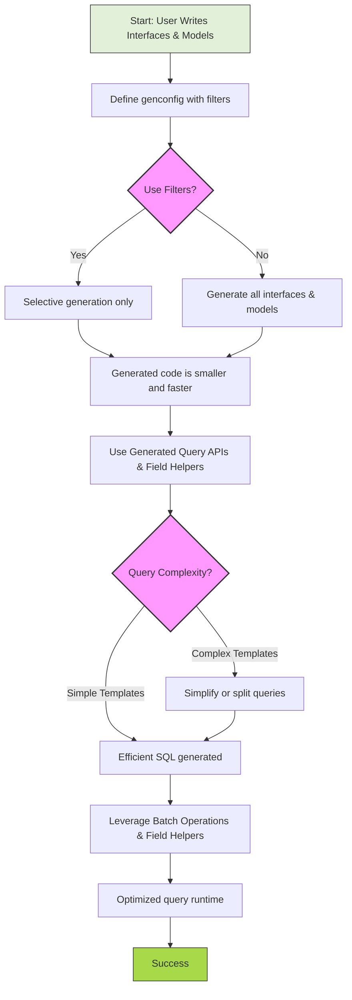

# Performance Considerations & Optimization Tips

Optimize your use of GORM CLI for large-scale projects and demanding workloads with practical strategies focused on generation speed, code size, and query runtime performance. This guide empowers you to make informed choices on configuration and API usage to get the best results with minimal overhead.

---

## 1. Understanding Performance Challenges

Large projects or complex domains often face challenges like:

- **Generation speed delays** when processing many interfaces or deeply nested models
- **Large generated codebases** that affect compile times and binary size
- **Inefficient queries** generated from overly complex templates or unnecessary predicate expansions
- **Run-time overhead** from unoptimized filters or updates using field helpers

This page provides actionable advice to address these challenges while maximizing the benefits of generated type-safe APIs and model helpers.

---

## 2. Optimize Code Generation

### 2.1 Apply Selective Generation with Filters

Use **IncludeInterfaces**, **ExcludeInterfaces**, **IncludeStructs**, and **ExcludeStructs** in your `genconfig.Config` to limit generation to only what you actively use.

```go
var _ = genconfig.Config{
  IncludeInterfaces: []any{"Query*"},        // Only generate for interfaces with prefix "Query"
  ExcludeInterfaces: []any{"*Deprecated*"},  // Exclude deprecated interfaces
  IncludeStructs:    []any{"User", "Account"},
  // Exclude unused or large models
  ExcludeStructs:    []any{"*DTO"},
}
```

This reduces unnecessary processing time and keeps output focused and manageable.

<Tip>
Regularly review which models and interfaces your application relies on and trim your generation config accordingly to avoid bloated generated code.
</Tip>

---

### 2.2 Enable File-Level vs Package-Level Configurations

If you have very large packages, **setting `FileLevel: true`** allows the generator to process files independently, speeding up incremental builds and generation.

```go
var _ = genconfig.Config{
  FileLevel: true,
}
```

This isolates generation and avoids recompiling unrelated interfaces,
beneficial during active development.

---

### 2.3 Map Only Required Field Types

Mapping too many or complex custom fields can slow generation. Map only the necessary types in `FieldTypeMap` and `FieldNameMap`.

```go
var _ = genconfig.Config{
  FieldTypeMap: map[any]any{
    sql.NullTime{}: field.Time{},  // Only map what you use
  },
  FieldNameMap: map[string]any{
    "json": JSON{},               // Custom JSON helper mapping
  },
}
```

Avoid blanket mappings over broad field ranges to maintain fast generation.

---

## 3. Streamline Queries for Runtime Performance

### 3.1 Use Field Helpers for Efficient Predicate Filtering

Leverage the generated field helpers to express conditions precisely instead of verbose manual SQL filters.

```go
// Instead of raw strings, use typed predicates
query := gorm.G[User](db).Where(
  generated.User.Age.Gt(18),
  generated.User.IsAdult.Eq(true),
)
```

This allows GORM to generate optimized SQL and indexes usage, avoiding unnecessary computation.

<Tip>
Use predicates like `.Between()`, `.In()`, and `.IsNull()` from generated helpers to express common query patterns efficiently.
</Tip>

---

### 3.2 Minimize Dynamic Template Logic Complexity

Avoid overly complex conditional logic or iterative filters inside SQL templates, which can generate bulky or costly SQL.

For example, simplify or break down large conditional blocks:

```sql
-- Complex dynamic WHERE with many nested ifs
{{where}}
  {{if cond1}}
    ...
  {{else if cond2}}
    ...
  {{end}}
{{end}}
```

Instead, consider splitting into multiple smaller queries or explicit query methods.

<Tip>
Focus each query interface method on a specific filtering scope; this improves generated SQL clarity and database query plans.
</Tip>

---

### 3.3 Batch Updates and Queries

For updates or inserts involving multiple records, prefer batched methods like `CreateInBatch` or multi-row filters that reduce round trips.

```go
// Batch create languages linked to a user
gorm.G[User](db).
  Where(generated.User.ID.Eq(userID)).
  Set(generated.User.Languages.CreateInBatch([]models.Language{{Code: "EN"}, {Code: "FR"}})).
  Update(ctx)
```

This minimizes locking and transaction time on the database side.

---

## 4. Reduce Generated Code Size

### 4.1 Filter Out Unused Models & Interfaces

Explicitly exclude models or interfaces you don't need to reduce the code size and compile time.

### 4.2 Avoid Generating for Deprecated or Legacy Interfaces

Keep your generation config updated by removing old declarations. Use name-based exclude patterns for cleanup.

### 4.3 Organize Large Projects into Smaller Packages

Splitting your Go project into focused packages allows targeted generation per package, reducing unnecessary bulk.

---

## 5. Advanced Tips

### 5.1 Cache Generated Queries

If your application repeatedly uses the same queries, consider caching query interface instances or prepared statements to reduce overhead in ORM runtime.

### 5.2 Profile Query Execution

Use GORM or database profiler tools to inspect slow queries generated via templates, tuning them by adjusting SQL logic or adding indexes.

---

## 6. Troubleshooting Performance Issues

<AccordionGroup title="Common Performance Problems and Solutions">
<Accordion title="Slow Code Generation">
Repeated full-package generation may be slow.

**Solution:**
- Use include/exclude filters
- Enable `FileLevel: true` in config
- Reduce mapped field types
- Split packages if needed
</Accordion>
<Accordion title="Large Binary or Compile Times">
The generated code may grow large with many models and interfaces.

**Solution:**
- Exclude unused models and interfaces
- Regularly review generation config
- Organize codebase into packages
</Accordion>
<Accordion title="Inefficient Queries at Runtime">
Queries run slowly or generate complex SQL.

**Solution:**
- Simplify SQL templates
- Use generated field helpers for predicates
- Use batch APIs for mass operations
- Profile queries with DB tools
</Accordion>
<Accordion title="Unexpected Query Results or Empty Filters">
Filters applied via generated helpers return no or incorrect results.

**Solution:**
- Check that fields used in filters are mapped correctly
- Verify conditional logic in SQL templates
- Use concrete predicate methods instead of raw strings
</Accordion>
</AccordionGroup>

---

## 7. Summary

Optimizing GORM CLI usage requires:

- Thoughtful application of generation filters and package organization to speed up code generation
- Pragmatic use of field helpers and simplified SQL templates for better database performance
- Regular maintenance of generation configurations to keep code size and runtime costs minimal

By applying these tips, you ensure that GORM CLI scales smoothly with your project and workload demands.

---

## 8. Related Documentation & Next Steps

- [Basic Generator Configuration](/getting-started/troubleshooting-configuration/basic-configuration) — Detailed config examples
- [Using Generated APIs](/guides/getting-started/using-generated-apis) — Best practices for query and association usage
- [Template-Based Query Interfaces](/guides/advanced-generation/template-sql-workflows) — Writing efficient templates
- [Integrating Generated Code](/guides/real-world-patterns/integration-examples) — Project organization tips
- [Troubleshooting Common Issues](/guides/real-world-patterns/troubleshooting-common-issues) — Performance and other debugging

Review these guides to deepen your mastery of scaling GORM CLI efficiently.


---

# Diagram: Generation & Query Optimization Workflow




