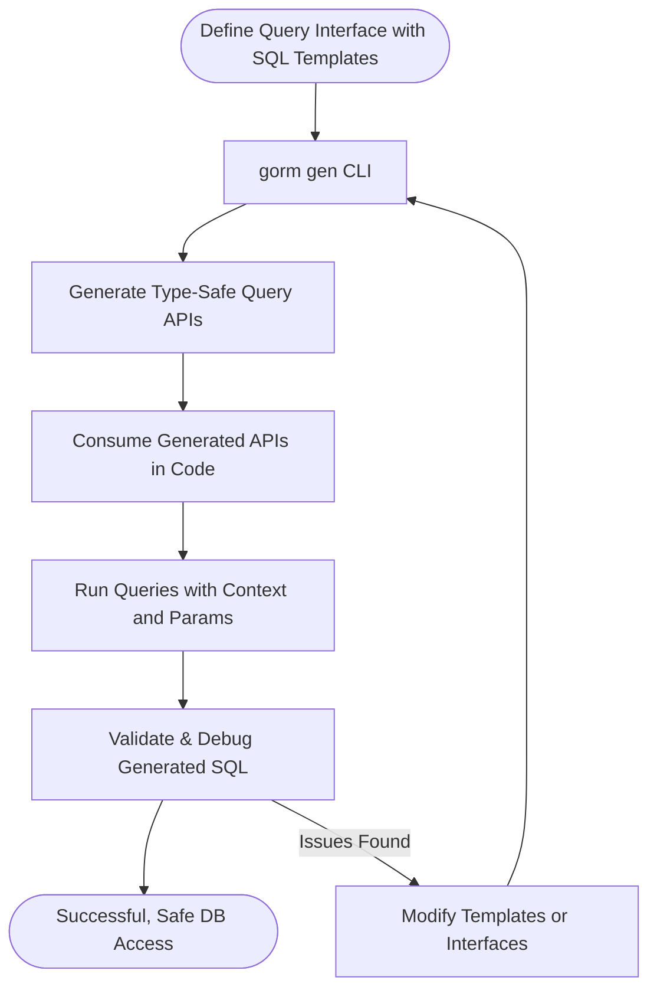

# Building Type-Safe Queries

Learn how to craft expressive, safe query logic with the generated APIs. This guide covers everything from predicate helpers to composing complex conditional and dynamic queries based on real-world user and filter scenarios.

---

## 1. Introduction to Type-Safe Queries

Modern database access requires both expressiveness and safety. GORM CLI empowers you to write SQL-like queries with type safety directly in Go, leveraging generated APIs based on your annotated interfaces.

This page focuses solely on how to build complex, safe queries using the generated interface-driven query APIs, allowing you to avoid raw SQL strings and gain compile-time checks.

### What You Will Learn
- How to use predicate and filter helpers
- Writing dynamic conditional queries
- Managing collections with `for` loops in SQL templates
- Combining multiple conditions safely

---

## 2. Understanding Generated Query Interfaces

When you define Go interfaces with SQL templates in their method comments, GORM CLI generates concrete type-safe APIs that you consume in your code.

### Example Interface Snippet
```go
// Query defines generic query methods for model type T
// with SQL templating for type-safe generation.
type Query[T any] interface {
  // Retrieve an item by its unique ID
  //
  // SELECT * FROM @@table WHERE id=@id AND name = "\@name"
  GetByID(id int) (T, error)

  // Filter by any column and value
  // SELECT * FROM @@table WHERE @@column=@value
  FilterWithColumn(column string, value string) (T, error)

  // Complex conditional query based on user fields
  // SELECT * FROM @@table
  //   {{if user.ID > 0}}
  //       WHERE id=@user.ID
  //   {{else if user.Name != ""}}
  //       WHERE name=@user.Name
  //   {{end}}
  QueryWith(user models.User) (T, error)

  // Other dynamic queries omitted here for brevity...
}
```

This interface is the blueprint for the GORM CLI to generate corresponding methods.


---

## 3. How to Craft Queries Using Generated APIs

### 3.1 Basic Query Execution

You call the generated function with your GORM `*gorm.DB` instance plus optional SQL clauses.

```go
user, err := generated.Query[models.User](db).GetByID(ctx, 123)
if err != nil {
  // handle error
}
```

**Outcome:** Executes `SELECT * FROM users WHERE id=123` safely without manual SQL strings.

### 3.2 Using Predicate Helpers

The generated query APIs allow you to work with predicates and fluent filters built from your models.

Example:
```go
users, err := generated.Query[models.User](db).
    FilterByNameAndAge(ctx, "jinzhu", 25).
    Find(ctx)
```
This generates the SQL:
```sql
SELECT * FROM users WHERE name="jinzhu" AND age=25;
```

### 3.3 Dynamic Conditions Using Templating

Define method comments with SQL template DSL directives such as `{{if}}`, `{{where}}`, and `{{for}}` to guide dynamic filtering.

Example method from interface:
```go
// SELECT * FROM @@table
// {{where}}
//   {{for _, user := range users}}
//     {{if user.Name != "" && user.Age > 0}}
//       (name = @user.Name AND age=@user.Age AND role LIKE concat("%",@user.Role,"%")) OR
//     {{end}}
//   {{end}}
// {{end}}
Filter(users []models.User) ([]T, error)
```

This allows query generation like:
- Filtering by multiple user structs
- Handling optional filtering fields dynamically

### 3.4 Composing Range and Time Queries

Use temporal conditions and `IsZero` checks to build queries with date ranges.

```go
// SELECT * FROM @@table
//  {{where}}
//    {{if !start.IsZero()}}
//      created_at > @start
//    {{end}}
//    {{if !end.IsZero()}}
//      AND created_at < @end
//    {{end}}
//  {{end}}
FilterWithTime(start, end time.Time) ([]T, error)
```

This provides safe filtering between given start and end times.

---

## 4. Step-by-Step Guide to Build and Use Type-Safe Queries

<Steps>
<Step title="Write SQL Template Methods in Query Interfaces">
Define your interface methods in Go with SQL templates inside method comments.
- Use `@@table` to refer to the model’s table name dynamically.
- Use `@param` to bind method parameters safely.
- Use directives like `{{where}}`, `{{if}}`, and `{{for}}` to craft conditional queries.
</Step>
<Step title="Run the GORM CLI Generator">
Invoke the CLI with correct input path where your interface files reside.
```bash
gorm gen -i ./examples -o ./generated
```
- This generates concrete, type-safe code implementing your interfaces.
</Step>
<Step title="Consume Generated Query APIs in Your Code">
Call the generated queries from your application code passing context and parameters.
- Example: `generated.Query[User](db).GetByID(ctx, 5)`
- Supports complex scenarios like filtering slices, time ranges, and dynamic conditions.
</Step>
<Step title="Debug with SQL Output for Verification">
Use GORM’s debug mode or logging to examine the generated SQL and parameters.
- Add `.Debug()` to your DB chain if needed.
- Verify parameters bind correctly without injection risk.
</Step>
</Steps>

---

## 5. Practical Examples

### 5.1 Simple By ID Query
```go
user, err := generated.Query[models.User](db).GetByID(ctx, 10)
if err != nil {
  // handle error
}
fmt.Println(user.Name)
```

### 5.2 Filter with Dynamic Slices
```go
usersToFilter := []models.User{{Name: "Alice", Age: 30}, {Name: "Bob", Age: 25}}
results, err := generated.Query[models.User](db).Filter(ctx, usersToFilter)
if err != nil {
  // handle error
}
for _, user := range results {
  fmt.Println(user.Name)
}
```

### 5.3 Filter Using Time Range
```go
start := time.Date(2023, 1, 1, 0, 0, 0, 0, time.UTC)
end := time.Now()
users, err := generated.Query[models.User](db).FilterWithTime(ctx, start, end)
if err != nil {
  // handle error
}
```

### 5.4 Update with Conditional Sets
```go
err := generated.Query[models.User](db).
    UpdateInfo(ctx, models.User{Name: "newName", Age: 18}, userID)
if err != nil {
  // handle error
}
```

---

## 6. Best Practices & Tips

- **Always include `ctx context.Context`** to support cancellation and tracing.
- Use the SQL Template DSL directives to keep queries clean and maintainable.
- Avoid manual string concatenation—use generated APIs for safety.
- When filtering collections, leverage loops and conditionals in templates for dynamic SQL.
- Validate generated code early by running tests to catch template issues.

---

## 7. Troubleshooting Common Issues

<AccordionGroup title="Troubleshooting">
<Accordion title="Method Does Not Compile After Generation">
- Check that your SQL template syntax is correct.
- Ensure return signatures match expectations: last return value must be error.
- Verify all referenced fields exist and are correctly named.
</Accordion>
<Accordion title="Query Returns Empty Results Unexpectedly">
- Confirm that parameters passed match the field names and expected types.
- Use GORM’s debug logs to inspect generated SQL and bound variables.
</Accordion>
<Accordion title="Dynamic Conditions Not Applied as Expected">
- Verify your `{{if}}` or `{{where}}` directives in the method comments.
- Check that data passed to parameters satisfies conditions to trigger filters.
</Accordion>
</AccordionGroup>

---

## 8. Next Steps

- Proceed to **Creating Field Helpers from Models** to complement your query APIs with typed filter and update helpers.
- Review **Customizing Generation with Config** to tweak generation behavior.
- Explore **SQL Template DSL & Best Practices** for deeper mastery of templated queries.

---

## References

- [GORM CLI Overview & Core Concepts](/overview/intro-value-core-concepts/what-is-gorm-cli)
- [Generating Your First Query API](/guides/getting-started/generating-your-first-query-api)
- [Defining Models & Query Interfaces](/getting-started/initial-usage/defining-models-interfaces)
- [SQL Template DSL & Best Practices](/guides/workflows-real-world-usage/sql-templates-and-dsl-best-practices)

---

For detailed example code illustrating these concepts, see the `examples/query.go` file in the official repository.


---

### Visual Workflow of Building Queries



This flow illustrates the iterative nature of building robust, type-safe queries with GORM CLI.

---

You are now equipped to create expressive, safe, and maintainable database queries using the power of GORM CLI's generated type-safe query APIs. Follow this guide step by step to embed these patterns into your Go projects efficiently.