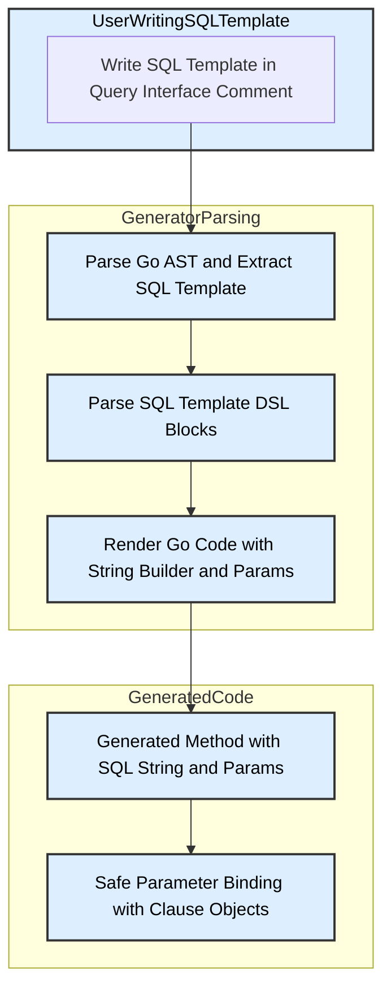

# SQL Template DSL & Best Practices

Unlock the full potential of GORM CLI's SQL template Domain-Specific Language (DSL) in your query interfaces. This guide will take you step-by-step through practical techniques including dynamic column binding, conditional logic, iteration over collections, and safe parameter binding. Alongside clear instructions, you'll find best practices to write maintainable, readable templates and tips on debugging common issues.

---

## 1. Understanding the Workflow

### What This Guide Helps You Accomplish
Use the SQL template DSL in interface method comments to write expressive, dynamic SQL queries that GORM CLI will transform into type-safe, fluent Go code.

### Prerequisites
- Basic familiarity with Go interfaces and methods.
- Understanding of GORM and how Go code interacts with SQL databases.
- Your query interfaces should be declared with SQL templates in comments (see `examples/query.go` for reference).

### Expected Outcome
By following this guide, you will confidently write SQL templates that:
- Use safe parameter binding to protect against SQL injection.
- Dynamically bind columns and tables.
- Express complex logic with conditionals and iterations.
- Are easy to maintain and debug.

### Estimated Time
15-30 minutes, depending on experience with templating concepts.

### Difficulty Level
Intermediate — requires basic Go knowledge and SQL understanding.

---

## 2. Step-by-Step Guide to SQL Template DSL

### Step 1: Use Standard Placeholders

- **`@@table`**: Use this to dynamically resolve the current model's table name.
- **`@@column`**: Use to refer to dynamic column names.
- **`@param`**: Binds a Go method parameter safely as a SQL argument.

**Example:**
```sql
// SELECT * FROM @@table WHERE id=@id AND status=@status
```

*You write this in a comment above your interface method. GORM CLI generates code that safely binds these parameters.*

### Step 2: Apply Conditional Blocks

- **`{{where}}...{{end}}`**: Wrap expressions that produce optional WHERE clause parts.
- **`{{set}}...{{end}}`**: Wrap conditional SET clause fragments used in UPDATE statements.

**Example:**
```sql
// SELECT * FROM @@table
// {{where}}
//   {{if name != ""}} name=@name {{end}}
//   {{if age > 0}} AND age=@age {{end}}
// {{end}}
```

This generates an optional WHERE clause depending on parameter content.

### Step 3: Use `if` Conditions

Inside `{{where}}` or `{{set}}`, include `{{if ...}}...{{end}}` for conditional logic.

**Example:**
```sql
// UPDATE @@table
// {{set}}
//   {{if user.Name != ""}} name=@user.Name, {{end}}
//   {{if user.Age > 0}} age=@user.Age, {{end}}
// {{end}}
// WHERE id=@id
```

This updates only fields with meaningful values.

### Step 4: Iterate Collections with `for` Blocks

Use `{{for ...}}...{{end}}` to iterate over slices or arrays.

**Example:**
```sql
// SELECT * FROM @@table
// {{where}}
//   {{for _, user := range users}}
//     {{if user.Name != "" && user.Age > 0}}
//       (name = @user.Name AND age=@user.Age AND role LIKE concat("%",@user.Role,"%")) OR
//     {{end}}
//   {{end}}
// {{end}}
```

This lets you generate condition groups for multiple users dynamically.

### Step 5: Safely Escape Literal `@` Symbols

Use a backslash `\@` to escape a literal `@` if needed.

**Example:**
```sql
// SELECT * FROM @@table WHERE email LIKE "\@example.com"
```

Generates an SQL query with a literal `@` symbol instead of binding.

---

## 3. Practical Examples

### Example: Get By ID with Dynamic WHERE
```go
// GetByID queries by ID and Name
// SELECT * FROM @@table WHERE id=@id AND name = "@name"
GetByID(id int, name string) (T, error)
```

Generated code:
```go
var sb strings.Builder
params := make([]any, 0, 2)
sb.WriteString("SELECT * FROM ? WHERE id=? AND name = \"@name\"")
params = append(params, clause.Table{Name: clause.CurrentTable}, id)
```

### Example: Conditional UPDATE with `{{set}}`
```go
// UpdateInfo updates fields only if non-empty
// UPDATE @@table
// {{set}}
//   {{if user.Name != ""}} name=@user.Name, {{end}}
//   {{if user.Age > 0}} age=@user.Age, {{end}}
//   {{if user.Age >= 18}} is_adult=1 {{else}} is_adult=0 {{end}}
// {{end}}
// WHERE id=@id
UpdateInfo(user models.User, id int) error
```

Key point: Fields conditionally added prevent overwriting with zero-values.

### Example: Iteration with Complex Filtering
```go
// Filter users by multiple criteria
// SELECT * FROM @@table
// {{where}}
//   {{for _, user := range users}}
//     {{if user.Name != "" && user.Age > 0}}
//       (name = @user.Name AND age=@user.Age AND role LIKE concat("%",@user.Role,"%")) OR
//     {{end}}
//   {{end}}
// {{end}}
Filter(users []models.User) ([]T, error)
```

This builds a complex WHERE with multiple ORed conditions.

---

## 4. Best Practices and Tips

### Write Declarative, Maintainable Templates
- Use **clear comments** that map directly to SQL queries you want.
- Extract common logic into reusable predicates in your Go code.
- Prefer `{{where}}` and `{{set}}` for flexible and concise conditional filters.

### Use Safe Parameter Binding
- Always bind parameters with `@param` placeholders.
- Never concatenate strings directly to avoid SQL injection.

### Debugging Your Templates
- If generated code fails or misbehaves, verify your SQL template syntax:
  - Balanced `{{if}}...{{else}}...{{end}}` blocks.
  - Correct use of placeholders like `@@table`, `@param`.
  - Proper iteration expressions.
- Run tests (e.g., see `internal/gen/sqlparser_test.go`) to compare expected vs generated code.

### Keep SQL Templates Simple
- Avoid deeply nested conditionals if possible.
- Break complex queries into smaller interface methods if necessary.

### Know Your Parameter Scope
- Parameters like `@user.Name` are bound from the method argument or loop variable.
- Use scoped variables carefully within `{{for}}` and `{{if}}` blocks.

---

## 5. Common Issues and Troubleshooting

<AccordionGroup title="Common Troubleshooting Topics">
<Accordion title="Unmatched {{end}} or {{else}} Errors">
Make sure every `{{if}}`, `{{for}}`, and `{{where}}` has a matching `{{end}}`.
Nested blocks must be properly closed and structured.
</Accordion>
<Accordion title="Parameters Not Binding Correctly">
Verify that all params used with `@param` match method parameters or iterable variables exactly.
Misspellings lead to generation errors.
</Accordion>
<Accordion title="Escaping Literal @ Signs Not Working">
Use `\@` to escape literal `@`. Remember double backslashes in raw string literals when composing.
</Accordion>
<Accordion title="Conditional Blocks Produce Empty SQL">
Ensure conditions inside `{{if}}` resolve as expected at runtime.
Add logging or debug your Go arguments if queries are missing clauses unexpectedly.
</Accordion>
</AccordionGroup>

<Tip>
For complex dynamic SQL, use `{{where}}` blocks combined with `{{if}}` and `{{for}}` to keep your templates clean and readable. This reduces boilerplate and improves maintainability.
</Tip>

<Tip>
When updating records, prefer `{{set}}` with conditional `if` expressions to update only changed fields, avoiding unintended data overwrite.
</Tip>

---

## 6. Next Steps & Related Documentation

- Dive deeper into [Building Type-Safe Queries](guides/workflows-real-world-usage/building-type-safe-queries) to see advanced query writing techniques.
- Learn about [Working With Associations](guides/workflows-real-world-usage/working-with-associations) to combine template queries with relation handling.
- Customize generation with [Configuring Generation](guides/workflows-real-world-usage/customizing-generation-with-config) to tailor type mappings and output.
- Explore the official repository for raw examples: [GORM CLI GitHub](https://github.com/go-gorm/cli).

For a holistic understanding, also consider reviewing:
- [Defining Models & Query Interfaces](getting-started/initial-usage/defining-models-interfaces)
- [Generating Your First Query API](guides/getting-started/generating-your-first-query-api)

---

## 7. Technical Reference Diagram



---

This diagram outlines the flow from the user writing SQL template comments, through the generator parsing and rendering, to the final generated code that safely binds parameters.

---

**End of SQL Template DSL & Best Practices Guide**
