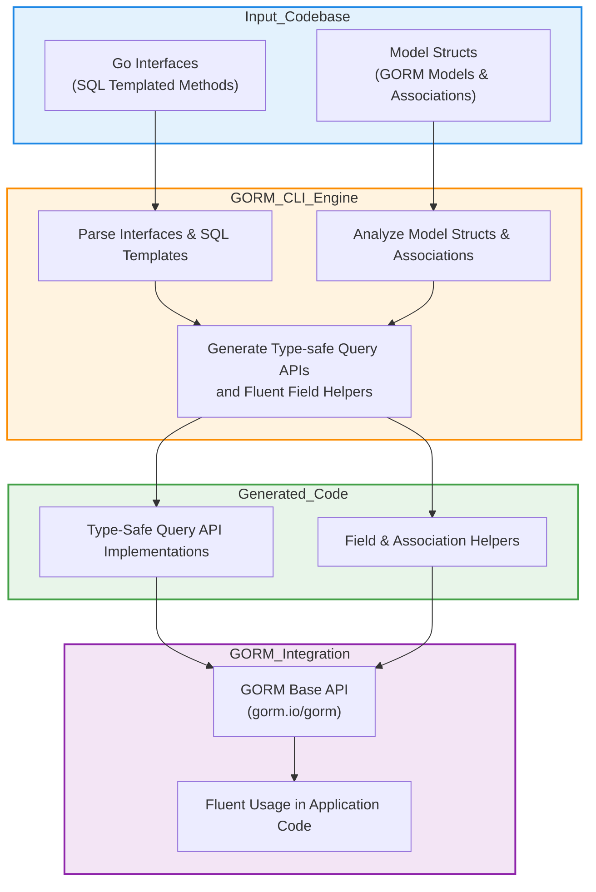

# System Architecture

Explore how GORM CLI seamlessly integrates with your Go codebase to deliver a powerful, type-safe query and helper code generation workflow. This page breaks down the core components and the flow of data through the system, offering a clear visual and conceptual understanding of GORM CLI's role in your application pipeline.

---

## Visualizing GORM CLI in Your Development Workflow

At its heart, **GORM CLI** acts as a bridge between your static Go code definitions and the dynamic, fluent APIs you use daily in your GORM-powered projects. By taking Go interfaces and model structs as input, it generates complementary, type-safe code — empowering you with compile-time checks, code discoverability, and less runtime errors.

This system architecture view illustrates how your code, the generation engine, and the resulting output pieces fit and work together.

---

## Core Components and Their Responsibilities

### 1. Input Layer — Your Codebase

- **Go Interfaces with SQL Templates**: You define interfaces that specify methods annotated with templated SQL statements. These declarations serve as blueprints for generating custom query methods.
- **Model Structs**: Your existing GORM model structs serve to generate field helpers, including predicates and setters for fields and associations.

This input layer is the foundation where you express your domain logic and desired queries declaratively.

### 2. GORM CLI Code Generation Engine

- **Interface Parsing & Template Processing**: The CLI parses your Go interfaces and reads annotations in method comments. It interprets SQL templating directives like `{{where}}`, `@@table`, and parameter bindings.
- **Model Analysis**: It scans your structs to identify basic fields, associations (belongs to, has many, many2many), and generates strongly typed, reusable helpers.
- **Code Synthesis**: Combining these analyses, the engine generates:
  - **Type-safe Query APIs**: Concrete implementations of your interfaces that interact directly with GORM's `*gorm.DB`.
  - **Field and Association Helpers**: Fluent, discoverable helpers for building predicates, updates, and managing relations.

This engine brings your domain definitions to life, guaranteeing consistency and safety.

### 3. Output — Generated Fluent APIs

- **Fluent APIs for Queries**: For each interface, GORM CLI provides implementations with strongly typed method signatures, context-aware parameters, and seamless integration with GORM.
- **Field Helpers**: Generated helpers for fields and relationships on models offer expressive methods to build conditions (`Eq`, `Like`, `Between`) and update statements, making your usage concise.

These outputs fit into your existing application logic, simplifying how you write and maintain data interactions.

### 4. Integration with GORM

GORM CLI's generated code plugs directly into the `gorm.io/gorm` ecosystem:

- Built on generic-aware wrappers (`gorm.G[T](db)`) that let you filter, query, and update entities with type safety.
- Association helpers provide advanced operations like `CreateInBatch`, `Unlink`, or `Delete` with compile-time validation.

The tight coupling means generated code works naturally with your ongoing GORM usage.

---

## Data & Code Flow Diagram

This flowchart captures:
- How your interfaces and model structs feed the code generation engine.
- The transformation pipeline inside GORM CLI.
- The final integration of generated components into GORM's fluent APIs.

---

## Why This Architecture Matters for You

- **Consistency & Type Safety**: Each layer enforces contracts — from templated SQL in your interfaces to typed, validated query methods.
- **Reduced Boilerplate**: Automatically generated helpers eliminate manual binding and error-prone SQL construction.
- **Code Discoverability & Maintenance**: Fluently designed helpers and APIs make your code easier to read and extend.
- **Flexible Integration**: The generated code is idiomatic Go, integrating naturally with your existing GORM work.

By understanding the system architecture, you better grasp how GORM CLI fits into your project lifecycle, how changes in your codebase affect generation, and how to leverage generated artifacts optimally.

---

## Practical Tips & Best Practices

- Keep your interfaces clear and method SQL templates consistent to maximize code generation accuracy.
- Define related model structs in the same packages or directories where you put query interfaces for smooth detection.
- Review generated code regularly during early iterations to understand behavior and optimize interfaces.
- Consider configuring generation via `genconfig.Config` if your project requires filtering or customizing generation outputs.

---

## Next Steps

- Proceed to [Integration with GORM](/overview/integration-and-use/integration-overview) to learn how your generated APIs work seamlessly with GORM.
- Explore [How Code Generation Works](/overview/integration-and-use/generation-workflow) for the detailed lifecycle of code generation.
- Visit [Core Concepts & Terminology](/overview/architecture-and-concepts/core-concepts-glossary) for foundational definitions used across the ecosystem.

---

Understanding the architecture behind GORM CLI equips you with a clear picture of how type-safe, template-driven code generation streamlines your Go data access layer effectively and reliably.

<AccordionGroup title="Troubleshooting Common Setup Issues">
<Accordion title="Generated Code Not Updating">
If you modify your interfaces or models but see no changes in generated files, ensure:
- You run the CLI command with appropriate paths (`-i` and `-o`).
- Your code files compile without errors.
- There are no exclude patterns filtering out your interfaces.

Run the CLI with `gorm gen -v` for verbose output to confirm files scanned.
</Accordion>
<Accordion title="Template Syntax Errors">
Invalid or malformed SQL template comments can cause generation failures.
- Carefully check for matching `{{end}}` in templates.
- Use simple queries initially to isolate issues.
- Refer to [Template DSL documentation](README.md#template-based-queries) for syntax.
</Accordion>
</AccordionGroup>

---

## References
- [Product Overview](https://gorm.io/docs/overview/intro-and-value/product-overview)
- [Value Proposition](https://gorm.io/docs/overview/intro-and-value/value-proposition)
- [Getting Started & Installation](https://gorm.io/docs/getting-started/setup-introduction/prerequisites)
- [Integration with GORM](https://gorm.io/docs/overview/integration-and-use/integration-overview)

---

<Check>
Use this architectural insight to align your queries and models for smooth, maintainable, and safe code generation with GORM CLI.
</Check>
