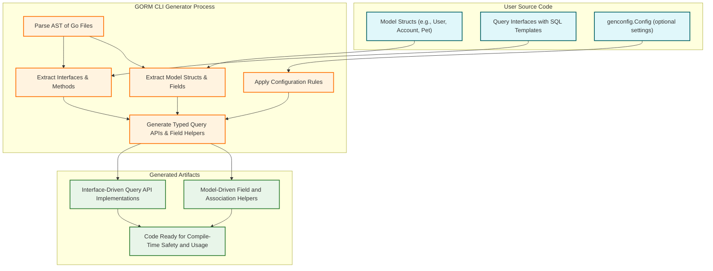

# Architecture Diagram

## Visualizing GORM CLI's Code Generation Workflow

Understanding how GORM CLI transforms your Go model structs and query interfaces into powerful, type-safe APIs is crucial for mastering its productivity benefits. This page presents a clear Mermaid.js diagram that depicts the overall system architecture—showing how your models, interfaces, configuration, and the generator components interact seamlessly to produce generated code ready for use.

### Why This Diagram Matters
This visualization connects conceptual dots, giving you a comprehensive view of how each piece fits together in the code generation workflow. It arms you with a mental map to better understand generation steps, integration points, and how your input data structures translate into generated artifacts.

---

## Components in the Architecture

- **User Models:** Your Go structs annotated with GORM tags and optional generation settings.
- **Query Interfaces:** Interfaces you define describing queries with embedded SQL templates.
- **Generator Configuration:** Optional `genconfig.Config` declarations that customize the generation behavior per package or file.
- **GORM CLI Generator:** The core process that parses, analyzes, and outputs generated code.
- **Generated Code:** The resulting type-safe, interface-driven query APIs and model-derived field helpers.

---

## How It All Works Together

1. **Define Models and Interfaces:** You start with your domain model structs (for example, `User`, `Account`, `Pet`) and the query interfaces with SQL templates describing your database operations.

2. **Apply Optional Configuration:** You can define package-level or file-level `genconfig.Config` to influence code output—such as output path, field mappings, and inclusion filters.

3. **Parsing and Processing:** The GORM CLI generator processes your source files, extracting ASTs, interpreting your interfaces’ SQL comments, configuration, and model structure.

4. **Generation:** It combines all parsed elements to produce:
   - Interface implementations providing fluent, type-safe query methods
   - Field helpers for each struct field and association enabling expressive filters and updates

5. **Output:** Generated code is saved into configured output directories, preserving package structure and ensuring a smooth developer experience integrating the generated APIs.

---

## Detailed Workflow Diagram

---

## Practical Insights

- **Defining Clear Models and Interfaces:** Your Go structs and query interfaces become the authoritative source for generation; well-defined inputs yield precise, maintainable code.

- **Leveraging Configuration:** Use `genconfig.Config` to fine-tune output locations, type mappings (e.g., custom JSON helpers), and inclusion filters for selective generation.

- **Understanding Generation Output:** The generated code is idiomatic Go—integrated tightly with GORM's ORM layer, providing strong typing and expressive APIs.

- **Incremental Generation:** Only files and interfaces that match configured filters are processed and generated, streamlining your workflow.

---

## Next Steps

To deepen your mastery:

- Explore [System Architecture Overview](/overview/architecture-and-concepts/system-architecture) for a stepwise breakdown of the code generation pipeline.
- Review [Core Concepts & Terminology](/overview/architecture-and-concepts/core-concepts-and-terminology) to understand key terms and components.
- Learn [Generating Type-Safe Query APIs](/guides/core-workflows/generating-type-safe-queries) to see how generated APIs empower your development.
- Dive into [Using Field Helpers and Building Filters](/guides/core-workflows/field-helpers-and-filters) for advanced usage.

---

## Troubleshooting Tips

<Accordion title="Common Issues and Solutions">

### Generate Command Does Not Output Files
1. Verify your `genconfig.Config` includes the correct `OutPath`.
2. Check inclusion filters—if interfaces or structs don't match patterns, they won't generate.
3. Review any error logs during generation for parsing errors.

### Unexpected Field Types
- Ensure custom field mappings in `FieldTypeMap` and `FieldNameMap` are correctly declared.
- Confirm your model tags (e.g., `gen:"json"`) are properly applied.

### Missing Methods in Generated APIs
- Check your interface methods contain properly formatted SQL templates in comments.
- Confirm that all return types end with `error` as required.

</Accordion>

---

By mastering this architectural overview, you'll gain clarity and confidence in how GORM CLI powers your type-safe database access layer with an elegant generation process.

---

[Explore the full navigation map](../../) for related architecture, concepts, and practical guides to leverage GORM CLI to its fullest potential.

---

## References
- [System Architecture Overview](/overview/architecture-and-concepts/system-architecture)
- [Core Concepts & Terminology](/overview/architecture-and-concepts/core-concepts-and-terminology)
- [Feature Overview](/overview/architecture-and-concepts/feature-glance)
- [Integration & Dependencies](/overview/architecture-and-concepts/integrations-and-dependencies)
- [Generating Type-Safe Query APIs](/guides/core-workflows/generating-type-safe-queries)
- [Using Field Helpers and Building Filters](/guides/core-workflows/field-helpers-and-filters)

---