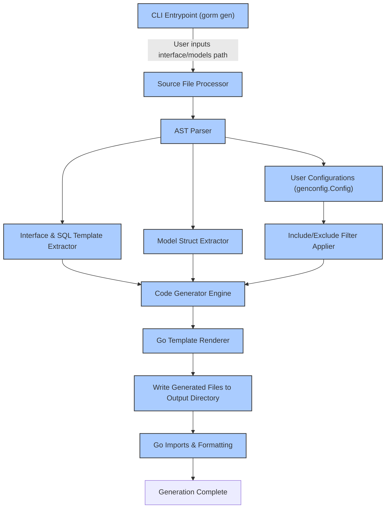

# Architecture Overview

Explore how the core components of GORM CLI — the CLI entrypoint, the generator engine, template system, and user configurations — collaborate seamlessly to convert your Go code into powerful, type-safe GORM APIs. This page breaks down the architecture into user-focused perspectives, illustrating the flow from your source interfaces and models to the final generated code that enhances your development experience.

---

## Understanding the GORM CLI Architecture

At the heart of GORM CLI is a clean, modular architecture designed to make the process of generating type-safe query APIs intuitive, flexible, and efficient. Whether you write Go interfaces with embedded SQL templates or define structured models, GORM CLI leverages multiple tightly integrated components to transform your code into fluent, compile-time safe helpers.

### Core Components

- **CLI Entrypoint**: The command-line interface initiates the generation workflow, accepting user-supplied paths for interfaces and output directories.
- **Generator Engine**: Parses your Go code, reads embedded SQL templates and model structures, applies configuration filters, and orchestrates the code generation.
- **Template System**: Uses Go's text/template engine to render the generated Go source files with the proper structure, method signatures, and helper implementations.
- **User Configuration**: Customizes generation behavior such as output path, included/excluded interfaces and structs, and custom field mappings through `genconfig.Config` declarations.

### Workflow Overview

When you invoke the CLI `gen` command with your input Go files, the generator engine processes these files with the following steps:

1. **Parsing Source Files:** Recursively walks input directories or reads single files, using Go's parser to build abstract syntax trees (ASTs).
2. **Extracting Metadata:** Collects interfaces with SQL template annotations, structs representing your models, and any user-supplied generation configs.
3. **Applying Configurations:** Filters and adjusts which interfaces and structs to include/exclude based on your custom rules.
4. **Generating Code:** Renders the final Go source files implementing type-safe query APIs and model-driven field helpers.
5. **Output and Formatting:** Writes generated files to the designated output directory and applies code formatting for consistency.

This flow ensures your code stays DRY, safe, and expressive without manually writing boilerplate.

---

## Detailed Component Roles

### 1. CLI Entrypoint

- Presented as the `gorm` root command with the subcommand `gen`.
- Handles input flags such as `-i` for input path and `-o` for output directory.
- Validates inputs, kicks off the generation process, and surfaces errors gracefully.

### 2. Generator Engine

- Centralized in the `gen.Generator` struct.
- Reads and processes Go source files, using AST traversal to find interfaces and structs.
- Detects SQL templates embedded in interface method comments to construct method implementations.
- Applies user configuration to filter relevant interfaces and structs.
- Determines appropriate Go type mappings and generates association helpers.

### 3. Template System

- Harnesses Go templating in `internal/gen/template.go` to define the structure of generated files.
- Produces:
  - Interface implementations with fluent, type-safe query methods.
  - Struct variables exposing field helpers for filters, updates, and associations.
- Ensures generated code complies with Go idioms and GORM integration.

### 4. User Configuration

- Uses `genconfig.Config` to customize aspects such as output location, included interfaces/structs, and field helper mappings.
- Configurations are declared as Go variables within the input packages, automatically picked up by the engine.
- Supports advanced customizations like mapping JSON fields to custom helpers or excluding deprecated types.

---

## Architecture Flow Diagram



This flow visualizes the transformation from your input source code and config to beautifully generated, ready-to-use GORM helper code.

---

## Real-World Example: From Source to Helpers

Imagine you have a directory of Go files defining:

- **Query interfaces** with embedded SQL for custom queries.
- **Model structs** representing your database schema.
- An optional **generation config** mapping special fields or excluding deprecated interfaces.

Running:

```bash
gorm gen -i ./examples -o ./generated
```

The CLI initiates parsing of `./examples`, extracting methods and structs, honoring your config, then producing Go files in `./generated`:

- Concrete implementations for each query interface method — returning type-safe query builder instances or raw data.
- Strongly typed field helpers for struct fields and associations, supporting filters, updates, and joins.

This automation slashes boilerplate, reduces runtime errors, and enables fluid ORM usage.

---

## Practical Tips & Best Practices

- Structure your interfaces with clear SQL template comments to maximize generated method quality.
- Use package-level `genconfig.Config` variables to tailor output paths and filter irrelevant code from generation.
- Organize related interfaces and models in the same package or directory to simplify input paths.
- Leverage custom field mappings (e.g., JSON helpers) for seamless integration of special data types.
- Keep your Go code idiomatic; the generator respects standard naming and type conventions.

---

## Troubleshooting & Common Pitfalls

<AccordionGroup title="Troubleshooting Common Issues with Architecture and Generation Workflow">
<Accordion title="Generated Files Missing or Empty">
Ensure your input path (`-i`) points correctly to the directory or file containing interfaces/models. Check package-level `genconfig.Config` settings for overly restrictive Include/Exclude filters.
</Accordion>
<Accordion title="Generation Errors About Method Return Types">
Verify your interface methods conform to expected return patterns: must return either `(error)` or `(dataType, error)`. Embedded SQL annotations must be valid per the template DSL.
</Accordion>
<Accordion title="Output Directory Not Respected">
Check your `OutPath` in any `genconfig.Config` variables — if none specified, default output is `./g`. Also confirm you have write permissions to the output folder.
</Accordion>
</AccordionGroup>

---

## Next Steps

- Explore the [Core Concepts & Terminology](overview/architecture-and-concepts/core-concepts-terminology) page for detailed component definitions.
- Follow the [Quickstart: Your First Workflow](overview/architecture-and-concepts/quickstart-workflow) to get hands-on with code generation.
- Dive into [Feature Highlights](overview/introduction-and-value/feature-highlights) to understand what capabilities your generated code unlocks.


---

This architecture overview equips you to leverage GORM CLI confidently, positioning you for effective use of its powerful code generation abilities.


---

_Source: This documentation is based on the core architecture as implemented in the [GORM CLI repository](https://github.com/go-gorm/cli/tree/main) under command `gen` and package `internal/gen`._

---

[Back to Overview & Concepts](../architecture-and-concepts/architecture-overview)

---

