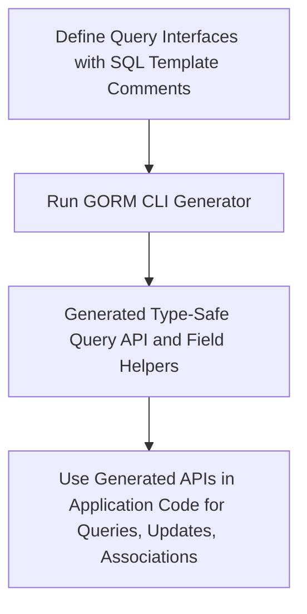

# Core Concepts & Terminology

Welcome to the foundational guide that unlocks the essential concepts behind GORM CLI. This page will familiarize you with pivotal building blocks such as query interfaces, SQL templates, field helpers, associations, and generator configuration. Understanding these concepts is critical to mastering the powerful, type-safe, and flexible APIs generated by GORM CLI.

---

## Understanding GORM CLI’s Core Concepts

### Query Interfaces

At the heart of GORM CLI lies the **query interface** — a user-defined Go interface whose methods are annotated with SQL templates using comments. Each method represents a distinct database query or operation.

- **What you achieve:** Define how you want to query or update your database using expressive, type-checked Go code without writing boilerplate SQL call code manually.
- **Example:**

  ```go
  type Query[T any] interface {
    // SELECT * FROM @@table WHERE id=@id
    GetByID(id int) (T, error)

    // UPDATE @@table
    // {{set}}
    //   {{if user.Name != ""}} name=@user.Name, {{end}}
    //   {{if user.Age > 0}} age=@user.Age, {{end}}
    // {{end}}
    // WHERE id=@id
    UpdateUser(user User, id int) error
  }
  ```

- **You write:** Interfaces with SQL templates.
- **GORM CLI generates:** Type-safe, fluent Go API implementations.

### SQL Templates & the Template DSL

GORM CLI uses a concise, expressive templating DSL embedded in your interface method comments. This DSL enables dynamic SQL composition, conditional clauses, parameter binding, and iteration.

#### Key Template Constructs

| Directive    | Purpose                              | Example                                 |
| ------------ | ------------------------------------- | --------------------------------------- |
| `@@table`    | Model's table name resolution          | `SELECT * FROM @@table WHERE id=@id`    |
| `@@column`   | Dynamic column binding                  | `WHERE @@column=@value`                  |
| `@param`     | Bind Go method parameters to SQL params| `WHERE name=@user.Name`                  |
| `{{where}}`  | Conditionally generate WHERE clause    | `{{where}} age > 18 {{end}}`             |
| `{{set}}`    | Conditionally generate UPDATE SET clause| `{{set}} name=@name {{end}}`             |
| `{{if}}`     | Conditional SQL fragment inclusion      | `{{if age > 0}} AND age=@age {{end}}`    |
| `{{for}}`    | Iterate collections in SQL generation   | `{{for _, tag := range tags}}...{{end}}` |

#### Why Template DSL Matters

- **Dynamic and safe SQL:** Compose queries dynamically based on function parameters.
- **Compile-time safety:** Method parameters are strongly typed, catching errors early.
- **No repetitive SQL:** Move from raw query strings scattered through code to centralized, maintainable interfaces.

### Field Helpers

GORM CLI generates **field helpers** from your model structs. These helpers give you a rich, fluent API to construct filters, setters, and conditions directly on fields with type safety.

- Based on Go field types (ints, strings, bools, time.Time, sql.Null* etc.) or custom mappings via configuration.
- Includes support for JSON, slice, struct, and association types.

#### Example Usage

```go
// Generated field helpers let you write expressive queries and updates
generated.User.Name.Eq("alice")            // name = 'alice'
generated.User.Age.Between(18, 35)           // age BETWEEN 18 AND 35
generated.User.Score.IsNull()                 // score IS NULL
```

These helpers drastically simplify query building and provide autocompletion in IDEs.

### Associations and Operations

Beyond individual fields, GORM CLI models relationships with **association helpers** based on your GORM model struct tags:

- **Associations supported:** `has one`, `has many`, `belongs to`, `many2many`, including polymorphic ones.
- **Operations available:**
  - `Create`: Insert and link associated rows.
  - `CreateInBatch`: Batch create/link many associated rows.
  - `Update`: Update associated rows with optional conditions.
  - `Unlink`: Remove links without deleting rows.
  - `Delete`: Delete associated rows or join records.

#### Working with Associations Example

```go
gorm.G[User](db).
  Set(
    generated.User.Name.Set("alice"),
    generated.User.Pets.Create(generated.Pet.Name.Set("fido")),
  ).
  Create(ctx)

gorm.G[User](db).
  Where(generated.User.ID.Eq(1)).
  Set(generated.User.Pets.Where(generated.Pet.Name.Eq("fido")).Update(
    generated.Pet.Name.Set("rex"),
  )).
  Update(ctx)
```

- Associations maintain integrity by automatically handling foreign keys or join tables according to their types.

### Generator Configuration

GORM CLI's code generator behavior can be customized by declaring a package-level `genconfig.Config`.

#### Key Configuration Areas

- `OutPath`: Specify output directory for generated code.
- `IncludeInterfaces` / `ExcludeInterfaces`: Control which interfaces are processed.
- `IncludeStructs` / `ExcludeStructs`: Filter which structs generate field helpers.
- `FieldTypeMap`: Map Go types to specific field helper types.
- `FieldNameMap`: Map struct tag names (e.g., `gen:"json"`) to custom helpers.
- `FileLevel`: Choose if config applies per-file or across the package.

#### Example Configuration

```go
var _ = genconfig.Config{
  OutPath: "examples/output",
  FieldTypeMap: map[any]any{
    sql.NullTime{}: field.Time{},
  },
  FieldNameMap: map[string]any{
    "json": JSON{},
  },
  IncludeInterfaces: []any{"Query*"},
  IncludeStructs: []any{"User", "Account*"},
}
```

This flexibility enables tailoring generated code to complex project requirements and database nuances.

## Key Terms Defined

- **Type-safe API:** The generated Go code enforces static typing, preventing runtime query construction errors.
- **Fluent interface:** Method chaining allows expressive, readable query building.
- **Association operations:** Actions like Create, Update, Unlink, Delete performed on related entities maintaining referential integrity.
- **Generate-time configuration:** Configurations applied during code generation affect how interfaces and structs are processed and what helpers are produced.

---

## High-Level Workflow Recap



This flow centers your development on declaring intent via interfaces and models, leaving the generator to produce robust, maintainable code.

---

## Tips for Success

- Start by modeling your database with well-defined Go structs and GORM tags.
- Write query interfaces reflecting common CRUD and custom queries using the SQL template DSL.
- Use configuration to handle special types or customize output as your project scales.
- Leverage generated field helpers and association operations for concise and reliable data access.
- Always test generated code to ensure it meets expectations and integrates correctly.

## Troubleshooting Common Pitfalls

<AccordionGroup title="Troubleshooting Common Issues">
<Accordion title="Missing Generated Methods or Fields">
Ensure your package-level `genconfig.Config` includes the required interfaces and structs via the `IncludeInterfaces` and `IncludeStructs` fields.

If a struct or interface is excluded, no code will be generated for it.
</Accordion>
<Accordion title="SQL Template Syntax Errors">
Verify that SQL templates in interface method comments are syntactically correct and follow the DSL conventions. Improper use of `{{if}}`, `{{where}}`, or parameter names can cause generation failures.
</Accordion>
<Accordion title="Incorrect Association Behavior">
Confirm your model structs correctly use GORM tags for relationships. Polymorphic or many2many associations require accurate struct field tags to generate appropriate helpers.
</Accordion>
</AccordionGroup>

---

By mastering the concepts on this page, you're poised to fully exploit GORM CLI’s power—writing cleaner, safer, and more maintainable database code with confidence and efficiency.

---

For a deeper dive:
- Explore the [System Architecture Overview](/overview/architecture-and-concepts/system-architecture) to understand the code generation pipeline.
- Try the [Generating Type-Safe Query APIs](/guides/core-workflows/generating-type-safe-queries) guide for practical hands-on experience.
- Check the [Field Helper & Association Helper Concepts](/concepts/features-integration/field-helper-concepts) for more on field and association operations.

