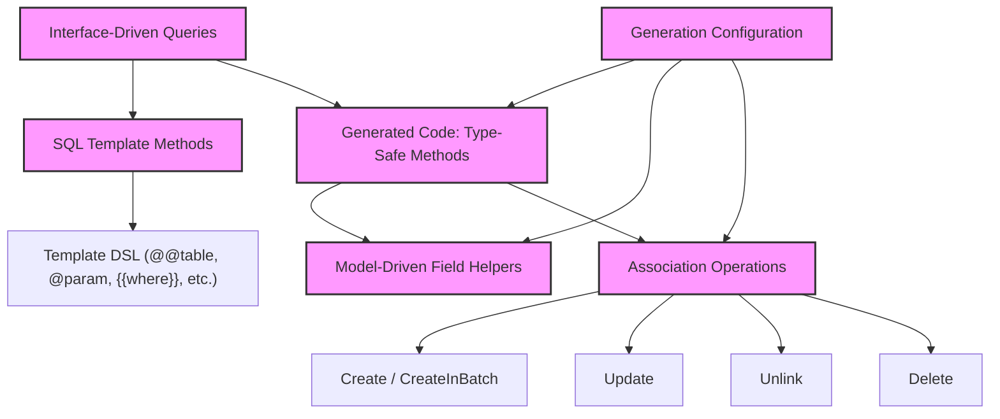

# Core Concepts & Terminology

Welcome to the foundational glossary of GORM CLI. This page demystifies the essential terms and concepts that empower you to harness the tool’s powerful code generation capabilities effectively. Understanding these core ideas will unlock your ability to write type-safe query APIs, leverage model-driven helpers, and manage complex association operations with confidence.

---

## Interface-Driven Queries

At the heart of GORM CLI lies the idea of **interface-driven queries**. You define Go interfaces describing your data access methods with SQL templates embedded in method comments. GORM CLI automatically generates **type-safe implementations** of these interfaces, ensuring compile-time safety and seamless integration with your models.

- **What It Is:** A pattern where Go interfaces serve as blueprints for SQL-based queries.
- **Why It Matters:** It eliminates runtime errors by verifying SQL-to-Go type matches before compilation.
- **Usage:** Write methods with documentation comments containing SQL templates using GORM CLI's specialized template directives.

Example method from a query interface:

```go
// SELECT * FROM @@table WHERE id=@id
GetByID(id int) (T, error)
```

This defines a method querying a record by ID; generated code will be safe and idiomatic.

---

## SQL Template Methods

GORM CLI enables embedding dynamic SQL templates in your interface methods using a DSL built upon Go’s `text/template` syntax enhanced with domain-specific directives:

| Directive   | Purpose                        | Description                                                         |
| ----------- | ------------------------------ | ------------------------------------------------------------------- |
| `@@table`   | Models table name binding       | Resolved into the actual database table name for your model         |
| `@@column`  | Dynamic column specification    | Allows runtime substitution of a column name                        |
| `@param`    | Maps Go method parameters       | Safely injects parameters by name into SQL                         |
| `{{where}}` | Conditional WHERE clause        | Dynamically includes filters based on parameter presence            |
| `{{set}}`   | Conditional SET (UPDATE) clause | Adds update columns conditionally based on input values            |
| `{{if}}`    | Conditional SQL fragment        | Allows conditional inclusion based on arbitrary logic               |
| `{{for}}`   | Iteration over collections      | Generates repetitive SQL snippets (e.g., multiple filters)          |

Through these template methods, you get precise control over your query’s composition, binding to parameters automatically for type safety and SQL injection safety.

---

## Field Helpers

Field helpers are **model-driven, type-safe abstractions** automatically generated from your Go struct fields. They provide expressive predicates and setters for all basic field types (strings, ints, bools, times, slices, etc.) and help build fluent query expressions.

- **Automatic Generation:** From your struct fields, GORM CLI creates dedicated strongly typed variables.
- **Capabilities:**
  - Equality and comparison predicates (e.g., `.Eq(value)`, `.Gt(value)`)
  - Pattern and set membership predicates (e.g., `.Like(pattern)`, `.In(values...)`)
  - Update setters supporting expressions and direct values (e.g., `.Set(value)`, `.Incr(amount)`)

**Example:**

```go
// Model
type User struct {
  Name string
  Age  int
}

// Generated field helpers usage
query.Where(generated.User.Name.Eq("alice"))
query.Set(generated.User.Age.Incr(1))
```

This allows you to build intuitive, composable queries and updates that are checked at compile time.

---

## Association Operations

GORM CLI provides a robust system to manage model relationships through generated **association helpers** that understand and enforce relational semantics. These helpers are available on generated models as typed references, typically of type `field.Struct[T]` for single objects or `field.Slice[T]` for collections.

### Supported Association Operations:

- **Create:** Creates and links a related record for matched parents.
- **CreateInBatch:** Batch creates multiple related records and links them.
- **Update:** Updates associated records with optional filtering.
- **Unlink:** Removes links between parent and child without deleting data (e.g., nullifies foreign keys or deletes join table rows).
- **Delete:** Deletes associated records or join rows depending on association type.

### Association Types and Semantics

| Association Type          | Unlink Behavior                         | Delete Behavior                    |
| ------------------------ | ------------------------------------- | -------------------------------- |
| Belongs To               | Sets parent foreign key to NULL       | Deletes associated row            |
| Has One / Has Many       | Sets child foreign key(s) to NULL     | Deletes child rows                |
| Many to Many (Join Table) | Removes join rows only (no FK change) | Deletes join rows only            |


**Example:**
```go
// Create new user and pet together
gorm.G[User](db).
  Set(
    generated.User.Name.Set("alice"),
    generated.User.Pets.Create(generated.Pet.Name.Set("fido")),
  ).
  Create(ctx)

// Unlink pets from a user
gorm.G[User](db).
  Where(generated.User.ID.Eq(1)).
  Set(generated.User.Pets.Unlink()).
  Update(ctx)
```

These operations help keep your object graph consistent and relational integrity safe with minimal manual SQL.

---

## Configuration Strategies

GORM CLI supports powerful configuration to customize code generation behavior across your project. Configuration is provided by declaring package-level `genconfig.Config` variables which the generator picks up automatically.

### Key Configurable Aspects:

- **Output path (`OutPath`):** Where generated files will be placed, overriding CLI defaults.
- **File level generation (`FileLevel`):** Whether config applies per file instead of the entire package.
- **Field type mapping (`FieldTypeMap`):** Map specific Go types to custom field helper implementations (e.g., mapping `sql.NullTime` to a `field.Time` helper).
- **Field name mapping (`FieldNameMap`):** Use struct tag-driven names (`gen:"json"` etc.) to map fields to specific helpers.
- **Inclusion and exclusion filters:** Restrict generation to specific interfaces or structs using patterns or explicit types.

**Example config snippet:**

```go
var _ = genconfig.Config{
  OutPath: "examples/output",
  FieldTypeMap: map[any]any{
    sql.NullTime{}: field.Time{},
  },
  FieldNameMap: map[string]any{
    "json": JSON{},
  },
  IncludeInterfaces: []any{"Query*"},
  ExcludeStructs: []any{"*DTO"},
}
```

This allows you to finely tune the generation to your project's conventions and database peculiarities.

---

## Practical Tips

- **Start by defining clear Go interfaces** with embedded SQL templates for your queries; this defines your API surface with exact types.
- **Model your structs carefully** and leverage struct tags (`gen:"customtag"`) to map fields to specialized helpers.
- **Use association helpers** to manage related entities correctly without writing manual SQL, respecting relational data integrity.
- **Configure the generator** to align with your directory structure, naming conventions, and custom field types to avoid surprises.
- **Leverage template directives** to dynamically build complex queries that adapt to the presence of input parameters.

---

## Troubleshooting Common Challenges

<AccordionGroup title="Common Issues and Solutions">
<Accordion title="Interface Methods Without Return Errors">
GORM CLI enforces that all interface methods which execute SQL must return results with an error as the last return value.

- **Problem:** A method has no return value or returns a type without an accompanying error.
- **Solution:** Add `error` as the last return value; if only one return value, it must be an `error` type.
</Accordion>
<Accordion title="Incorrect SQL Template Placeholders">
Ensure you use template placeholders correctly in comments; for example, `@param` binds Go method parameters safely.

- **Problem:** Template fails or generates invalid SQL.
- **Solution:** Check parameter names in method signatures exactly match placeholders; use `{{where}}` and `{{set}}` for conditional blocks.
</Accordion>
<Accordion title="Field Type Mapping Not Applied">
Custom mappings may not be applied if config is not detected or incorrectly specified.

- **Problem:** Specialized field helpers not generated.
- **Solution:** Declare `genconfig.Config` in the same package with correct `FieldTypeMap` and `FieldNameMap` settings.
</Accordion>
</AccordionGroup>

---

## Summary

Understanding these core concepts equips you to fully utilize GORM CLI’s powerful, type-safe code generation capabilities. From writing interface-driven SQL templates to managing associations and configuring generation behavior, mastering this terminology accelerates your Go database application development with confidence.

For further learning, explore related documentation pages:

- [Product Overview](/overview/intro-and-value/product-overview) for a high-level introduction
- [Value Proposition](/overview/intro-and-value/value-proposition) to understand why GORM CLI matters
- [System Architecture](/overview/architecture-and-concepts/architecture-diagram) for a visual guide on components
- [Generation Config](/concepts/configuration-and-extensibility/generation-config) for detailed config setups

Keep this glossary handy as a reference as you build with GORM CLI.


---

## Mermaid Diagram: Core Concepts Relationship


