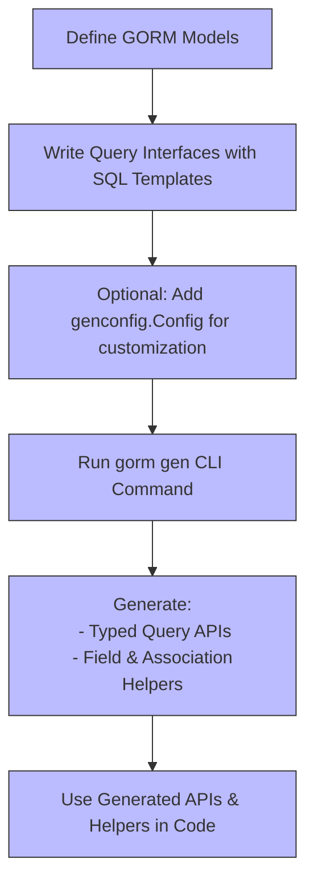

# Feature Overview

Get a concise, high-level glance at the core capabilities that GORM CLI brings to your GORM projects. This page highlights the key features you unlock when you harness the power of type-safe query API generation, model-driven field helpers, and flexible, configurable output. These elements combine to provide a developer experience focused on productivity, safety, and expressiveness.

---

## What You Gain with GORM CLI

GORM CLI automates the creation of two tightly integrated pieces of code that transform how you work with GORM:

- **Type-safe Query APIs:** Define simple Go interfaces annotated with SQL templates, and get generated methods that are fully type-checked at compile time.
- **Model-driven Field Helpers:** Automatically produce fluent, strongly typed field helpers and association helpers to build filters, updates, and complex queries with confidence.
- **Configurable Generation:** Customize code output paths, include/exclude specific interfaces or structs, and map custom field types to helpers through straightforward configuration.

Together, these features eliminate boilerplate code, reduce runtime errors, and empower you to write database interactions that are easy to read, maintain, and evolve.

---

## Core Features & Capabilities

### 1. Type-Safe Query API Generation

Write Go interfaces where methods are enriched with embedded SQL templates in their comments. GORM CLI generates concrete implementations that:

- Map method parameters cleanly to SQL query parameters.
- Bind query results automatically to your model types.
- Include compile-time validation for guaranteed correctness.

For example:

```go
// UserQuery interface with SQL template annotations
 type UserQuery[T any] interface {
    // SELECT * FROM @@table WHERE id=@id
    GetByID(id int) (T, error)

    // SELECT * FROM @@table WHERE name=@name AND age=@age
    FilterByNameAndAge(name string, age int) (T, error)
}
```

Calling these generated methods offers you an expressive, type-safe query interface backed by raw SQL flexibility.

---

### 2. Model-Driven Field Helpers

From your GORM model structs, GORM CLI generates a set of field helpers that dramatically simplify common database operations:

- **Basic Fields:** Helpers for primitive fields enable easy construction of predicates like `Eq`, `Like`, `Between`, and support update expressions.

- **Associations:** Generate helpers for `has one`, `has many`, `belongs to`, and `many2many` relations that support creating, updating, unlinking, and deleting associated records with compile-time safety.

For instance, to increment a user's age or update a pet's name:

```go
// Increment age
gorm.G[User](db).
  Where(generated.User.Name.Eq("alice")).
  Set(generated.User.Age.Incr(1)).
  Update(ctx)

// Update an associated pet's name
gorm.G[User](db).
  Where(generated.User.ID.Eq(1)).
  Set(
    generated.User.Pets.Where(generated.Pet.Name.Eq("fido")).Update(generated.Pet.Name.Set("rex")),
  ).
  Update(ctx)
```

This approach leads to code that is both fluent and safer, reflecting your database relationships directly in code.

---

### 3. Flexible, Template-Based SQL Queries

GORM CLI's template DSL empowers you to embed dynamic SQL logic in your interfaces, with features like:

- `@@table` and `@@column` placeholders resolving to model table and column names.
- `@param` bindings securely mapping Go parameters to SQL parameters.
- Conditionals (`{{if}}`, `{{else}}`), looping (`{{for}}`), and block directives (`{{where}}`, `{{set}}`) for complex query construction.

Example of a conditional update query template:

```sql
UPDATE @@table
{{set}}
  {{if user.Name != ""}} name=@user.Name, {{end}}
  {{if user.Age > 0}} age=@user.Age, {{end}}
  {{if user.Age >= 18}} is_adult=1 {{else}} is_adult=0 {{end}}
{{end}}
WHERE id=@id
```

This feature unlocks powerful, reusable query definitions that adapt to your input parameters while preserving type safety.

---

### 4. Configurable Code Generation

You control where and how code is generated by declaring configuration variables (`genconfig.Config`) in your Go packages:

- **Output Path:** Define the target directory for generated files per package.

- **Field Mapping:** Customize how Go field types or struct tags map to specific field helpers, including support for custom helpers like JSON.

- **Interface & Struct Inclusion/Exclusion:** Use whitelists or blacklists with shell-style pattern matching to precisely select what gets generated.

Example excerpt of a configuration:

```go
var _ = genconfig.Config{
  OutPath: "examples/output",
  FieldNameMap: map[string]any{
    "json": JSON{}, // Use custom JSON helper
  },
  IncludeInterfaces: []any{"Query*"},
}
```

This modular, declarative configuration enables fine-grained control over your generation workflow aligned with project needs.

---

## Real-World Developer Impact

- Minimize boilerplate and repetitive query logic.
- Enhance correctness with strong static typing and compiler checks.
- Write expressive, readable database query code that closely models your domain.
- Seamlessly handle complex associations and conditional queries.
- Customize generation for your project’s specific conventions and needs.

---

## Practical Example Flow

1. **Define Your Models**: Use standard GORM models with necessary fields and associations.

2. **Write Query Interfaces**: Add Go interfaces in your package outlining queries, embedding SQL templates in comments.

3. **Configure Generation (optional)**: Declare package-level config for customized output and helper mappings.

4. **Run Code Generation**: Use `gorm gen -i ./path/to/interfaces -o ./gen_out` to generate typed query APIs and field helpers.

5. **Use Generated Code**: Compose queries with fluent, strongly typed helpers for filtering, updating, and associating data.

---

## Tips & Best Practices

- Use interfaces to group query methods by logical domain for clarity.
- Leverage the DSL conditionals to keep SQL concise and adaptable.
- Regularly run code generation as part of your build pipeline to keep generated code in sync.
- Apply custom field mappings for specialized types like JSON or time values.
- Review generated code initially to understand the helper structures generated for your models.

---

## Summary Diagram



---

## Next Steps

Explore related documentation to deepen your mastery over GORM CLI:

- [Core Concepts & Terminology](/overview/architecture-and-concepts/core-concepts-and-terminology) — Understand the foundational ideas behind query interfaces, templates, and helpers.
- [Generating Type-Safe Query APIs](/guides/core-workflows/generating-type-safe-queries) — Learn how to define interfaces and trigger code gen.
- [Using Field Helpers and Building Filters](/guides/core-workflows/field-helpers-and-filters) — See how to harness generated helpers for powerful, declarative queries.

---

Harness GORM CLI’s feature set to write safer, cleaner, and more efficient database code that scales with your application’s complexity and growth.