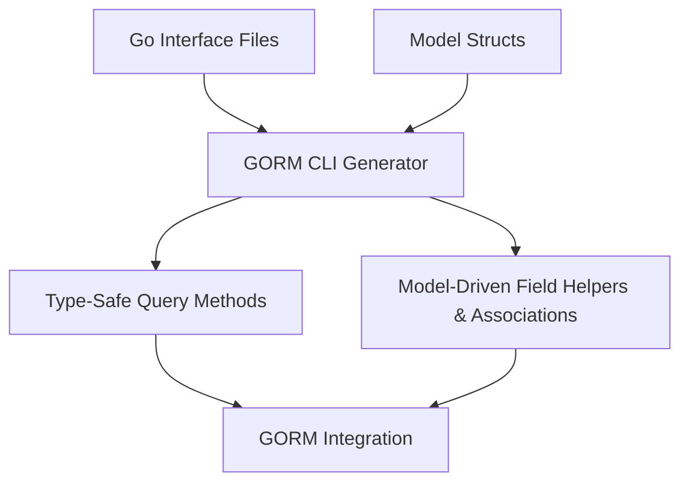

# Feature Highlights

Discover why GORM CLI stands out as a powerful code generator designed to elevate your GORM projects with type safety, clarity, and productivity. This page provides a crisp yet thorough overview of GORM CLI's core capabilities, demonstrating how each feature drives better development workflows and higher code quality.

---

## Type-Safe Query Method Generation

Streamline your database interactions with auto-generated, type-safe query APIs derived directly from your Go interfaces. By annotating interface methods with SQL templates, GORM CLI produces concrete implementations that guarantee compile-time validation.

- **What it solves:** Eliminates runtime SQL errors caused by mismatched parameters or return types.
- **How it helps you:** Write expressive SQL in comments, leverage autocomplete and IDE safety, and focus on business logic instead of manual query construction.

### Example
```go
// Define your query interface with SQL templates in method comments
// SELECT * FROM @@table WHERE id=@id
GetByID(id int) (T, error)
```

The generator uses this to build a strongly typed method `GetByID` with correct parameter binding and expected result type.

---

## Model-Driven Field and Association Helpers

GORM CLI enhances your model structs with generated field helpers that simplify building queries, updates, and association operations.

- **Field Helpers:** Typed predicates and setters tailored to your model's fields, supporting predicates like `Eq`, `Like`, `Between`, and update operations such as `Set` and `Incr`.
- **Association Helpers:** Fluent API to handle `has one`, `has many`, `belongs to`, and `many2many` relationships — including creating, linking, updating, unlinking, and deleting associations with type safety.

### Practical Usage
```go
gorm.G[User](db).
  Where(generated.User.Name.Eq("alice")).
  Set(
    generated.User.Age.Incr(1),
    generated.User.Pets.Create(generated.Pet.Name.Set("fido")),
  ).
  Update(ctx)
```

This snippet shows an update of a user’s age and adding a new pet in a single, safe call.

---

## Flexible Configuration with `genconfig.Config`

Customize code generation behavior to fit your project structure and coding style without sacrificing safety.

- **Output Path:** Define where generated files are placed.
- **Include/Exclude Filters:** Whitelist or blacklist interfaces and structs based on pattern matching or explicit listing.
- **Field Mapping:** Override default field helper types by mapping Go types or struct tags to custom helpers.
- **File-Level Control:** Limit generation scope to individual files when needed.

### Configuration Example
```go
var _ = genconfig.Config{
  OutPath: "generated",
  IncludeInterfaces: []any{"Query*"},
  FieldNameMap: map[string]any{
    "json": JSON{},
  },
}
```

This sets a custom output directory, whitelists query interfaces starting with `Query`, and maps fields tagged `json` to use a JSON-specific helper.

---

## Template-Based SQL DSL

Use a powerful, expressive domain-specific language within your interface method comments to write dynamic and safe SQL queries.

- **Directives and Placeholders:** Use `@@table` for automatic table names, `@param` for safe binding, and `{{where}}`/`{{set}}` blocks for flexible conditions.
- **Conditionals and Loops:** Embed Go-like `{{if}}`, `{{else}}`, and `{{for}}` directives to build complex queries dynamically.

### Example
```sql
-- SELECT all users with dynamic filters
SELECT * FROM @@table
{{where}}
  {{if user.Name != ""}} name=@user.Name {{end}}
  {{if user.Age > 0}} AND age > @user.Age {{end}}
{{end}}
```

Generates SQL query tailored to the provided user filters with parameters bound securely.

---

## Real-World Benefits & Efficiency Gains

By combining these features, GORM CLI empowers you to:

- Reduce bugs through compile-time type safety.
- Save hours on writing and maintaining boilerplate data access code.
- Improve developer productivity with discoverable, fluent APIs.
- Maintain clean, readable, and scalable code that integrates seamlessly with GORM.

----

## Next Steps
- Explore detailed usage in the [Type-Safe Queries with Interfaces](../guides/core-workflows/type-safe-queries) guide.
- Learn to leverage model-driven helpers in [Working with Model-Driven Field Helpers](../guides/core-workflows/model-field-helpers).
- Customize generation with [Customizing Code Generation with Config](../guides/advanced-usage/customizing-generation).

For more architectural insight, visit the [System Architecture](../overview/architecture-and-concepts/architecture-diagram) page.

---

## Code Generation Workflow Diagram


This workflow highlights how your source code inputs transform into powerful, type-safe APIs that plug seamlessly into your existing GORM codebase.

---