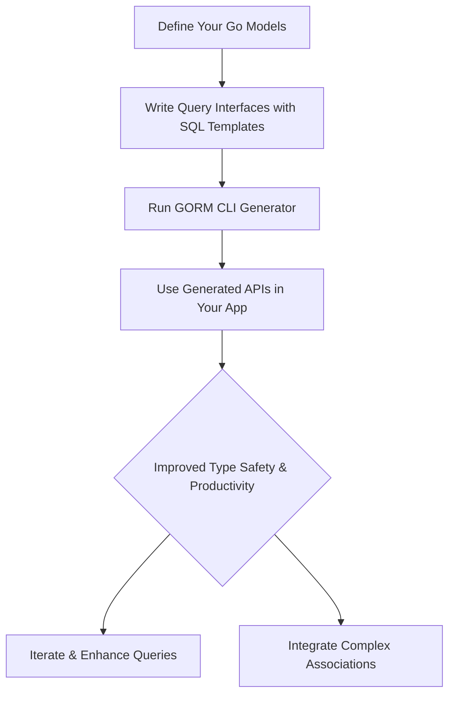

# Quickstart: Your First Workflow

Embark on a seamless developer journey with GORM CLI that transforms your Go models and interfaces into powerful, type-safe database APIs. This guide walks you through the core workflow steps — defining your data models, crafting query interfaces with embedded SQL templates, running the code generator, and, finally, leveraging the rich, generated APIs to perform queries and updates effortlessly.

---

## Why This Workflow Matters

Every Go developer working with databases strives for code that is both safe and expressive. GORM CLI’s first workflow shows you how to achieve exactly that without friction:

- **Model your types** clearly and idiomatically in Go.
- **Define interfaces** that include SQL templates, giving you full control with type safety.
- **Run the CLI generator** to produce concrete implementations and field helpers.
- **Consume the generated APIs** to write clean, compile-time checked database queries and updates.

By following this workflow, your code becomes more maintainable, easier to understand, and less prone to runtime errors.

---

## Step 1: Define Your Models

Start with your Go structs that reflect the shape of your database tables. These models form the basis for field helper generation and mapping.

```go
package models

type User struct {
    ID        uint   // Primary key
    Name      string // User's name
    Age       int    // User's age
    Email     string // Optional email field
    CreatedAt time.Time
}
```

Keep your models focused and idiomatic. The CLI will interpret basic field types (`int`, `string`, `time.Time`, etc.) and generate fluent helper methods to simplify query construction.

---

## Step 2: Write Query Interfaces with Embedded SQL Templates

Define Go interfaces that declare your desired query methods. Document each method with SQL templates using GORM CLI’s DSL for flexible, readable query definitions.

Example interface `Query`:

```go
package examples

import "gorm.io/cli/gorm/examples/models"

type Query[T any] interface {
	// GetByID fetches a record by its ID
	// SELECT * FROM @@table WHERE id=@id
	GetByID(id int) (T, error)

	// FilterWithColumn queries by a dynamic column name
	// SELECT * FROM @@table WHERE @@column=@value
	FilterWithColumn(column string, value string) (T, error)

	// QueryWith accepts a User struct and uses conditional SQL
	// SELECT * FROM @@table
	// {{where}}
	//   {{if user.ID > 0}} WHERE id=@user.ID {{else if user.Name != ""}} WHERE name=@user.Name {{end}}
	// {{end}}
	QueryWith(user models.User) (T, error)

	// UpdateInfo updates selected fields conditionally
	// UPDATE @@table
	// {{set}}
	//   {{if user.Name != ""}} name=@user.Name, {{end}}
	//   {{if user.Age > 0}} age=@user.Age, {{end}}
	//   {{if user.Age >= 18}} is_adult=1 {{else}} is_adult=0 {{end}}
	// {{end}}
	// WHERE id=@id
	UpdateInfo(user models.User, id int) error
}
```

The DSL supports placeholders like:

- `@@table`: resolved to the model’s table name
- `@@column`: dynamic column binding
- `@param`: binds Go function parameters
- `{{where}}` / `{{set}}` / `{{if}}` / `{{for}}`: conditional and iterative SQL generation

This approach marries full SQL flexibility with type safety and autocomplete support.

---

## Step 3: Run the GORM CLI Generator

With your models and interfaces ready, execute the CLI tool to generate concrete implementations plus field helpers.

```bash
gorm gen -i ./examples -o ./generated
```

- `-i` points to your interface source directory
- `-o` sets the output directory where generated code will live

Behind the scenes, the generator parses your Go files, validates SQL templates, maps types, and emits Go code that seamlessly integrates with GORM.

---

## Step 4: Use the Generated APIs

Now you can write idiomatic, type-safe database code using the generated interfaces:

```go
package main

import (
	"context"
	"fmt"

	"gorm.io/driver/sqlite"
	"gorm.io/gorm"
	"your_project/generated"
	"your_project/examples/models"
)

func main() {
	db, _ := gorm.Open(sqlite.Open("test.db"), &gorm.Config{})
	ctx := context.Background()

	query := generated.Query[models.User](db)

	// Fetch user by ID with type safety
	user, err := query.GetByID(ctx, 123)
	if err != nil {
		fmt.Println("Error fetching user:", err)
		return
	}
	fmt.Println("User:", user)

	// Filter by dynamic column
	result, err := query.FilterWithColumn(ctx, "name", "alice")
	// Use generated result

	// Update user fields conditionally
	err = query.UpdateInfo(ctx, models.User{Name: "Alice", Age: 30}, 123)
	if err != nil {
		fmt.Println("Update error:", err)
	}
}
```

These APIs provide clear method signatures, automatic context injection, and compile-time checking — eliminating common query mistakes early.

---

## Practical Tips & Best Practices

- **Leverage the template DSL fully:** Use `{{if ...}}` clauses to skip optional parameters cleanly.
- **Map custom types with `genconfig.Config`:** For example, map `sql.NullTime` or JSON helper types to get richer methods.
- **Keep interfaces focused:** Smaller, purpose-specific interfaces make generated code easier to maintain.
- **Version control generated code:** Commit generated files or consider regenerating on demand to keep your codebase consistent.


---

## Troubleshooting Common Issues

<AccordionGroup title="Troubleshooting Tips"> 
<Accordion title="Generated Code Not Found">
Verify that the output directory in your CLI command matches your import path. Run `gorm gen` after every interface change.
</Accordion>
<Accordion title="SQL Template Parsing Errors">
Check your method comments for syntax errors in the SQL DSL. Use simple SQL first, then add conditionals gradually.
</Accordion>
<Accordion title="Context Parameter Missing in Methods">
The generator automatically inserts `ctx context.Context` if missing, ensuring compatibility with GORM conventions.
</Accordion>
</AccordionGroup>

---

## Workflow Summary



---

## Next Steps

Ready to dive deeper?

- Explore detailed [SQL Template DSL](../advanced-patterns-customization/sql-template-dsl) to write sophisticated queries.
- Customize generation using [genconfig.Config](../advanced-patterns-customization/configuring-codegen) for fine control.
- Learn how to handle associations in [Working With Associations](../advanced-patterns-customization/working-with-associations).
- Start with [Installation & Prerequisites](../../getting_started/installation_prerequisites/installing_cli) if you have not yet installed the CLI.

Harness the power of GORM CLI with confidence — streamline your Go data layer with clarity and type safety today.

---

For a broader understanding of GORM CLI, revisit the [What is GORM CLI?](../introduction-and-value/what-is-gorm-cli) and [Feature Highlights](../introduction-and-value/feature-highlights) pages.


---