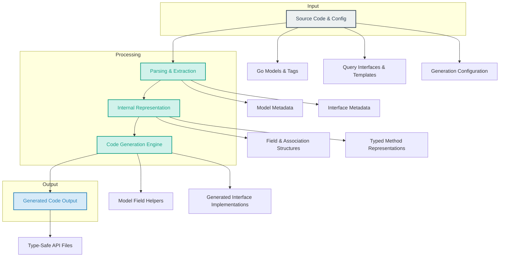

# System Architecture Overview

## Unlocking Safer Code Generation with GORM CLI

GORM CLI revolutionizes your Go projects with GORM by automating the generation of type-safe, interface-driven query APIs and model-driven helpers. This page unravels how the CLI orchestrates parsing your models, interfaces, and templates, transforming source code and configurations into robust, compile-time safe API code.

Explore a clear, visual explanation of the generator's architecture and workflow, designed to empower you to harness its capabilities with confidence.

---

## Understanding the GORM CLI Architecture

At its core, GORM CLI functions as a sophisticated code generator pipeline. It seamlessly integrates multiple inputs from your project — namely Go model structs, user-defined query interfaces with templated SQL comments, and generation configuration — to produce strongly typed, fluent database access code.

### The Core Problem It Solves

Manually writing database queries is error-prone and repetitive, especially with complex relationships and dynamic filtering. GORM CLI eliminates boilerplate by:

- Parsing your data model definitions to generate field helpers that know your schema
- Parsing interfaces decorated with SQL templates to generate type-safe query methods
- Applying configuration rules to include/exclude or customize generation

This orchestration produces safer, easier-to-navigate APIs that let you focus on business logic, not query syntax.

### What Makes This Architecture Stand Out

- **Bidirectional Input**: It consumes both your Go code models and interface specifications, combining structure with behavior.
- **Configurable Generation**: Custom config allows precise control over what gets generated and how.
- **Template-Driven SQL Binding**: SQL templates provide flexible, yet type-checked query methods.
- **Association Awareness**: Generates helpers for relationships (has one/many, belongs to, many-to-many) with operations like create, update, unlink, and delete.

This architecture supports evolving codebases smoothly and mitigates runtime errors by enforcing correctness at compile-time.

---

## How It Works: Step-by-Step Flow

### 1. Source Code & Configuration Input

- **Model Structs**: Your Go structs annotated with GORM tags define database tables and fields.
- **Query Interfaces**: Interfaces written with annotated SQL templates specify the desired queries and mutations.
- **Config Files**: Package-level `genconfig.Config` structs customize generation scope, type mappings, and more.

### 2. Parsing & Extraction

The CLI scans the codebase and config entries:

- Extracts the model fields and associations
- Reads interface methods and parses templated SQL comments
- Applies inclusion/exclusion rules to drop or limit interfaces and structs

### 3. Internal Representation Creation

The extracted info is converted into intermediate structures:

- Model metadata encompassing fields, tags, types, and associations
- Interface metadata capturing methods, parameters, result types, and embedded templates

### 4. Code Generation Engine

Using the internal representation, the generator builds:

- **Field Helpers**: Typed variables and methods to build filters, ordering, and updates with compile-time validation
- **Interface Implementations**: Concrete, safe implementations of your query interfaces that bind your SQL templates with Go code

The generation harnesses Go generics for flexibility and strong typing.

### 5. Output Delivery

The generated files are placed in configured output directories, ready to be imported into your applications.

You get discoverable, fluent APIs with zero runtime surprises.


---

## Visualizing the Architecture



This diagram illustrates the journey from your project source files through parsing, intermediate data modeling, generation, and final code output.


---

## Practical Example from Real Context

Consider the example model `User` which has complex fields and relationships:

- Simple fields: `Name string`, `Age int`
- Polymorphic associations: `Toys []Toy `gorm:"polymorphic:Owner"``
- Many-to-many relations: `Languages []Language `gorm:"many2many:UserSpeak"``

The GORM CLI takes this struct definition and produces:

- Field helpers like `generated.User.Name.Eq("Alice")` for type-safe filtering
- Association helpers enabling chained operations, such as:

```go
gorm.G[User](db).
  Set(
    generated.User.Name.Set("alice"),
    generated.User.Pets.Create(generated.Pet.Name.Set("fido")),
  ).
  Create(ctx)
```

These generated helpers enforce correctness and offer a fluent experience that avoids tedious manual SQL construction.


---

## Tips to Maximize Value

- **Configure Wisely:** Use `genconfig.Config` to exclude irrelevant structs or interfaces for faster, cleaner code generation.
- **Leverage Templates:** Write expressive SQL in interface method comments to define your queries declaratively.
- **Harness Associations:** Use association helpers to manage complex relational data with compile-time checks.
- **Review Generated Code:** Familiarize yourself with the generated output to discover powerful helpers tailored to your models.


---

## Troubleshooting & Common Pitfalls

<AccordionGroup title="Common Issues and Their Solutions">
<Accordion title="Configuration Exclusion Not Working">
If structs or interfaces you intended to exclude are still generating code, verify that your patterns exactly match the type names or interface names and that the config file is properly placed in the package.
</Accordion>
<Accordion title="Template Syntax Errors">
Ensure your SQL templates follow the supported DSL syntax. Incomplete or malformed templates will cause generation errors. Run the CLI with verbose logs to inspect parsing problems.
</Accordion>
<Accordion title="Missing Associations in Generated API">
Check that your model tags correctly specify associations (e.g., `gorm:"polymorphic:Owner"`) and that your config doesn't exclude relevant structs/interfaces inadvertently.
</Accordion>
<Accordion title="Unexpected Generated Types">
Double-check your `FieldTypeMap` and `FieldNameMap` in config to verify that custom type mappings don't interfere unexpectedly with default behavior.
</Accordion>
</AccordionGroup>

---

## Next Steps

- Dive into the [Generating Type-Safe Query APIs](/guides/core-workflows/generating-type-safe-queries) documentation to learn how to write your interfaces and templates.
- Explore [Using Field Helpers and Building Filters](/guides/core-workflows/field-helpers-and-filters) for mastering model-driven query construction.
- Review the [System Overview & Generation Workflow](/concepts/architecture-dataflow/system-overview) for more technical insights on data flow.

Leverage this architectural understanding as your foundation to wield GORM CLI as a powerful productivity and safety tool in your Go projects.

---

*This page fits into the broader documentation by laying bare the internal process behind code generation, complementing pages focused on usage, configuration, and API mechanics.*


---

<Check>
You have now a clear picture of how GORM CLI transforms your models and interface definitions into robust, type-safe APIs through an orchestrated pipeline. Understanding this system architecture enhances your ability to customize, debug, and optimize your code generation experience.
</Check>
